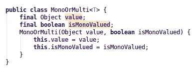
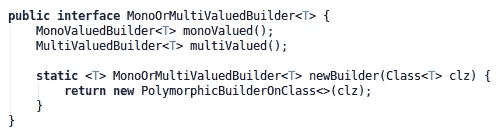
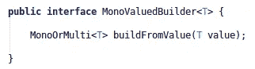
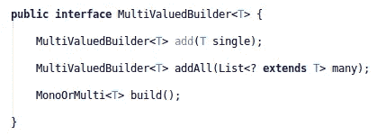
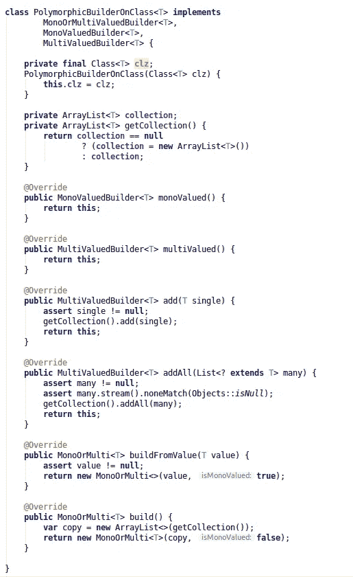
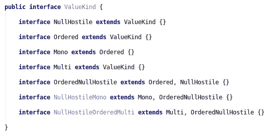
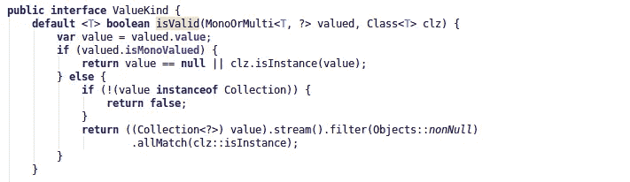
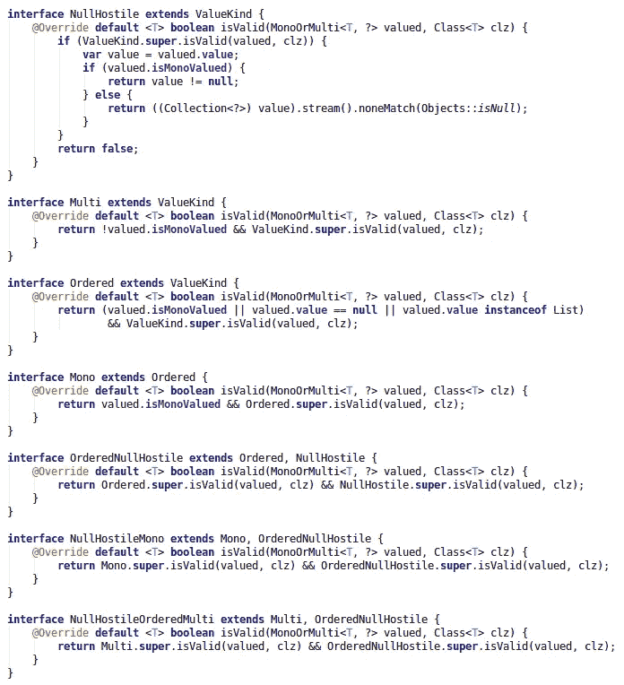
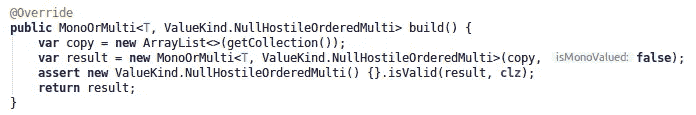
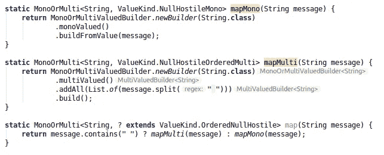

# 契约、断言、幻影类型

> 原文：<https://medium.com/javarevisited/contract-assertions-phantom-types-76d80f8a884e?source=collection_archive---------1----------------------->

在本文中，我们将研究一个简单的契约式设计案例，使用幻影类型设计模式进行编译时交叉检查。


如何使用虚拟类型来证明合同。

# 用例:单值还是多值

我们将要处理的用例是数据类型的表示

```
MonoOrMulti<T> =:= T | List<T>
```

当你进入 Java 的世界时，你很快就会面临联合类型的问题。在 [Java](/javarevisited/10-free-courses-to-learn-java-in-2019-22d1f33a3915) 中，类型的联合确实是不可能实现的。未来的语言升级将引入密封类的概念，然而这个概念更像是一个通过限制来联合的概念。在本文中，我们将研究一种更加灵活的方法。

# 问题解决

## 在 Java 类型系统中表示联合

我们首先创建一个类型来处理我们的联合。我们首先将这个类设计得非常弱，因为我们希望它尽可能通用。



如果有意义的话，我们希望下面的合同成立:

```
assert (!isMonoValued && value instance List<@NonNull T> &&
          value.stream.noneMatch(Objects::isNull))
    || (isMonoValued && value instanceof T)
```

因此，要么该值是非空的`T`类型的对象(单值情况)，要么该值是`T`的非空的`List`，我们要求它也是非空的，具有非空元素。

这里我们需要明确一点:我们并不期望 IO 操作直接创造`MonoOrMulti`价值:开发者将承担这个责任。换句话说，开发人员应该保证构造函数在其契约范围内被调用。

## 通过构建器绑定创建

为了强制正确创建我们的`MonoOrMulti`值，我们可以做的第一件事是，在不改变其构造函数的情况下，强制该类的用户使用间接方式创建它，作为[工厂](http://javarevisited.blogspot.sg/2011/12/factory-design-pattern-java-example.html#axzz51cvxH5kW)或[构建器](http://javarevisited.blogspot.sg/2012/06/builder-design-pattern-in-java-example.html)。

在工厂和建筑商之间，我们选择了建筑商，因为它允许灵活性；我们确实可以从顶级构建者开始



它为单个值提供对特定构建器的访问:



另一个用于特定多值:



尽管我们在类型层次上划分构建器，但是我们可以提供一个独特的实现来集中关注点，对于第一个草图:


这个多态构建器强制执行下面的两个路径，这里写在[字符串](https://www.java67.com/2018/06/top-35-java-string-interview-questions.html)类型类上:

```
newBuilder(String.class)
   .monoValued()
   .buildFromValue("Hello world");newBuilder(String.class)
   .multiValued()
   .addAll(List.of("Hello", "world"))
   .build();
```

上述方法使得各种创造性的可能性结合起来成为可能。构建器代码中的 asserts 语句清楚地表明，我们的 union 类型契约已经完成:我们有一个类型为`T`的单值元素，或者这样的有序集合。

## 坚持强制执行

到目前为止，我们的建造者不是空敌对的，这是我们想要的。在 Java 中，`[null](https://javarevisited.blogspot.com/2014/12/9-things-about-null-in-java.html#axzz6fLto55st)`是类型系统的一部分，我们不能避免使用类型，也不能像以前那样调整构造路径。

然而，有一种惯用的 Java 方式可以表明我们是空敌对的。`assert`关键字可用于在合同级别上实施这种行为。修改很简单:



[Java 断言](https://javarevisited.blogspot.com/2012/01/what-is-assertion-in-java-java.html)是契约声明的完美用例:如果违反了契约，就会抛出`AssertionError`(Java 故障系统中的一个严重错误)。由于按合同设计是开发人员的业务，出于 IO 考虑，开发人员应该注意避免它们。

这也清楚地表明，我们是在契约级编码:抛出(未检查的)异常将会以某种方式隐藏这种非常特殊和准确的语义。

assert 的问题是一个严重的问题，它在生产中是关闭的。这意味着我们不应该依赖他们。嗯，这不会是一个非常严重的业务实际上，因为我们(应该)相信我们的开发人员的团队！

有一个最大的问题`assert`没有处理:他们带来了完全不属于类型系统的合同信息。在我们的例子中，这一点非常清楚:一旦创建，用户就有了一个`MonoOrMulti<T>`实例，而没有任何关于它是表示单值还是多值的进一步信息。这正是我们要用幻影类型解决的问题。

## 作为编译时断言的幻象类型

我们不会删除任何资产。相反，我们将把它们添加到类型系统中。怎么会？

我们将介绍一种幻影类型。作为一个比文字更好解释的例子，让我们直接用代码:



并且对于 or `MonoOrMulti`结构类:


我们引入了一个绑定到`ValueKind`的虚拟类型参数；我们感兴趣的类型是`NullHostileMono`和`NullHostileOrderedMulti`，因为它们是我们所关心的问题。

为了强调我们的模式实际上非常灵活和高效，我们特意在`ValueKind`层次上描绘了一个非常复杂的类型系统。这是由于 Java 中接口和类继承的不同。如果我们想在*类层次*上编码二分法，我们需要子类`MonoOrMulti<T>`，这在契约方面是昂贵的:我们需要在每个开发步骤中保持子类和父类之间的契约一致。

第二， [Java](/javarevisited/top-5-java-online-courses-for-beginners-best-of-lot-1e1e240a758) 中的类继承层次受到单亲原则的约束:一个类不能有两个父类。

这对于保持内部状态一致是非常有用的，但是在我们所关心的问题中，这是一个很大的问题，因为我们想从一个菱形图类型的系统中获益。

我们的构建器也需要重构，以考虑新的约束。这里我们只重复接口:实现更新是微不足道的。对于单声道生成器，我们将`buildFromValue`方法更新为

```
MonoOrMulti<T, ValueKind.NullHostileMono> buildFromValue(T value);
```

对于 multi builder，我们只需要将`build`方法重新定义为

```
MonoOrMulti<T, ValueKind.NullHostileOrderedMulti> build();
```

当用户现在沿着道路行驶时

```
newBuilder(String.class)
   .monoValued()
   .buildFromValue("Hello world");
```

他将获得一个编译时级别的信息，表明所获得的实例属于类型`NullHostileMono`。同样，沿着这条路

```
newBuilder(String.class)
   .multiValued()
   .addAll(List.of("Hello", "world"))
   .build();
```

产生一个`NullHostileOrderedMulti`元素，同样:这个信息以一种非常灵活的方式属于类型系统。

*幻影类型信息在这里不是取代断言保证的契约，而是在编译时反映出来*，这是断言在 Java 中做不到的。

## 绑定契约和虚拟类型

不知何故，我们目前的设置有点缺陷。事实上，我们在`ValueKind`标记和合约之间没有如此强的耦合。构建器中的断言要求我们保持最新，它们没有形成可重用的特性集。

我们可以更进一步，通过绑定契约和虚拟类型。我们首先开始在`ValueKind`型磁体上定义一个默认方法，其目的是断言默认契约是否有效。



接下来，`ValueKind`的每个子元素都将覆盖这个默认实现，并重用它来定义自己的契约:



那些合同现在可能被用于[建造商](https://www.java67.com/2014/05/difference-between-stringbuilder-and-StringBuffer-java.html)本身。我们重用幻影类型本身提供的共享契约，而不是在每个方法中重新发明全部。我们只举一个例子来说明这个想法:



# 联合评估法

作为最后一部分，我们提供了一个可能实现的具体示例。假设我们想要提供该方法的一个实现

```
message -> message if message does not contain " ",
           [word for words in message] otherwise
```

我们对代数数据类型的了解告诉我们，这是一个指数映射`String -> String | List<String>`，因此可以通过两个映射`String -> String`和`String -> List<String>`来表示，以及区分情况的方法。

使用我们的设置，它可以实现为



正如您所看到的，`MonoOrMulti`实例是有序的并且不能包含空值，这些信息仍然存在于类型系统中，即使我们已经丢失了它的一部分(单值或多值)。

我们仍然可以恢复全部信息，因为我们还有合同。然而，这需要人工干预:


从这个断言中，我们知道结果的值是一个`List<String>`，因此我们可以继续一个强制转换操作，计算管道继续运行！

这篇课文就到这里，已经够长了。我希望你喜欢它，最重要的是，我希望它能给你灵感，或者相反，让你现在的习惯更经得起批评！