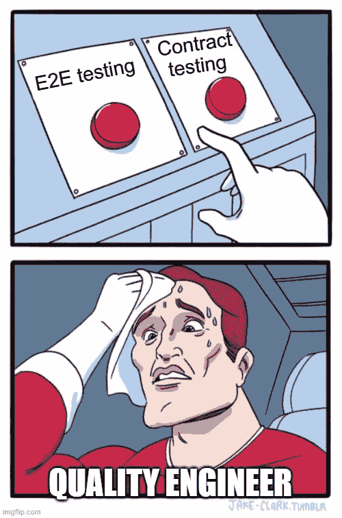
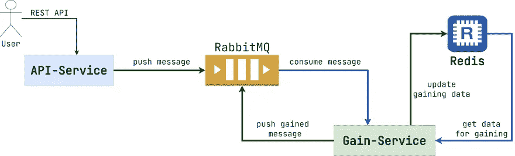
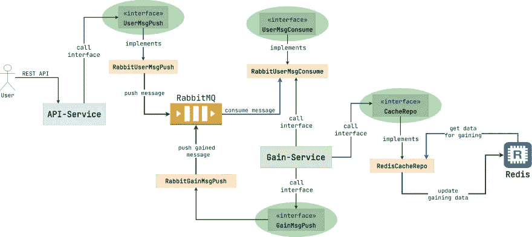
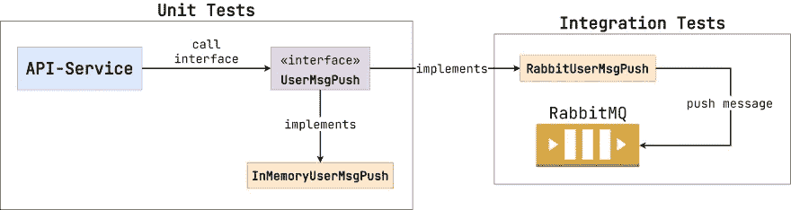

# 合同集成测试

> 原文：<https://medium.com/javarevisited/contract-integration-testing-23537b33729?source=collection_archive---------1----------------------->

最近我写了一篇关于在 CI 环境中使用 Testcontainers 用法实现 [E2E 测试的文章。今天我想补充一个小细节。我们将讨论契约，以及为什么为它们编写集成测试很重要。代码示例是用 Java 编写的，但是您可以将建议的解决方案应用于任何编程语言。](https://dev.to/kirekov/e2e-testing-in-ci-environment-with-testcontainers-1403)

Meme 文章封面

> *如果你还没有看过我写的关于 E2E 考试* *的* [*的文章，我强烈建议你先看完再继续。在这篇文章中，将会有许多基于前一个项目的经验的建议和讨论。*](https://dev.to/kirekov/e2e-testing-in-ci-environment-with-testcontainers-1403)

# E2E 测试陷阱

你看，E2E 测试是令人难以置信的。这是软件项目中最高的质量保证标准。同时，您应该考虑几个细微差别:

1.  E2E 测试很难。编写有意义且可维护的 E2E 测试需要大量的技能。
2.  自动运行 E2E 测试也不是那么简单。虽然我在前一篇文章中提出了解决方案，但它不能被称为微不足道。
3.  微服务越多，编写新的 E2E 测试就越难。
4.  每次软件产品随着新的微服务增长，你必须相应地更新环境(例如 [Testcontainers 配置](https://www.testcontainers.org/))以确保测试仍然有效。
5.  如果产品包含太多的微服务，为整个系统编写一个可靠的 E2E 测试几乎是不可能的。

正如你所看到的，E2E 测试一直工作到软件项目变得庞大和复杂。那么，我们该怎么办？

# 合同集成测试

首先，再看一下上一篇文章中的系统图。

系统结构

整个业务场景可以用以下步骤来描述:

1.  用户通过 [REST API](/javarevisited/10-best-java-web-services-rest-soap-and-api-courses-for-beginners-724a8f51298d) 向`API-Service`发送消息。
2.  然后`API-Service`将消息传输到 RabbitMQ 集群。
3.  `Gain-Service`消费消息，用来自缓存的附加信息丰富它(即 [Redis](https://javarevisited.blogspot.com/2022/03/spring-boot-redis-example-in-java.html) )，最后将结果消息再次推送到 RabbitMQ。

我们这里有什么合同？看看下面的模式。

合同图表

我用淡绿色椭圆形突出显示了这些合同:

1.  `RabbitUserMsgPush` -将用户的消息从`API-Service`推送到 RabbitMQ。
2.  `RabbitUserMsgConsume`——将用户的消息从 RabbitMQ 拉至`Gain-Service`。
3.  `RedisCacheRepo` -从`Gain-Service`视角读取和更新 Redis 数据。
4.  `RabbitGainMsgPush` -将获得的消息从`Gain-Service`推送到 RabbitMQ

我们为什么需要合同？尽管额外的层增加了额外的复杂性，契约也帮助我们摆脱了`API-Service`和`Gain-Service`中的集成测试。看看下面的例子。

分离单元和集成测试

正如我们已经讨论过的，`UserMsgPush`是契约。有两种实现:`RabbitUserMsgPush`和`InMemoryUserMsgPush`。现在里斯科夫替代原则开始发挥作用。如果简化定义，用一个接口实现替换另一个接口实现不会破坏软件的正确性。在这种情况下，我们不必让 RabbitMQ 参与测试`API-Service`！因为`InMemoryUserMsgPush`就足够了。所以，这就是好处:

1.  我们只能用单元测试来覆盖`API-Service`。
2.  集成测试只封装在`RabbitUserMsgPush`场景中。
3.  我们可以用另一个实现替换`UserMsgPush`的一个实现，而不需要接触`RabbitUserMsgPush`中的测试。

似乎合同测试是银弹。首先，我们减少了集成测试的数量，简化了服务中的质量场景。其次，我们完全摆脱了 E2E 测试，它很难编写、执行和维护。不幸的是，契约测试也有缺点。

# 合同的缺点

## 不必要的代码复杂性

微服务通常没有太多代码。他们通常只提供一个操作。例如，`API-Service`通过 [REST API](/javarevisited/top-10-rest-interview-questions-for-java-and-spring-developers-1611e3b78029) 接受一条消息，并将其推送到 RabbitMQ。就是这样。因此，额外的层、接口和抽象可能看起来像噪音。如果我可以直接进行操作，为什么我必须使用 facade 来操作呢？

虽然抽象是有用的，但是它们的丰富会使代码比它应该的更复杂。

## 缺乏本地实验

集成测试的主要优点是它允许我们在提交拉请求之前执行本地实验。例如，假设您需要调整服务所依赖的外部设施的一些属性。这些可以是:

1.  减小数据库连接池的大小。
2.  在[中改变连载策略卡夫卡制作人](https://javarevisited.blogspot.com/2018/04/top-5-apache-kafka-course-to-learn.html)。
3.  重整 SQL 语句以提高效率。

如果在您正在处理的服务中有集成测试，您可以只调整所需的设置并在本地运行测试来验证行为。但是如果服务依赖于合同，这个任务就变得有趣了。您有几种方法:

1.  以这样一种方式更改协定，即将更新的属性作为参数传递。因此，您在检查场景有效性的契约中添加了额外的集成测试。但是在这种情况下，契约暴露了太多关于其实现的细节。这打破了抽象的整个概念，使得用一个实现替换另一个实现更加困难。
2.  将所需属性的更改封装为合同中的集成场景。在这里，您不会将实现细节泄露给契约的用户，但是您也使您的测试变得更加复杂。因为您必须验证可能的属性值的不同组合。
3.  将所需的集成测试直接添加到服务代码库中。所以，你不会把合同搞得太复杂，对吧？的确，但是现在服务直接依赖于特定的契约实现。我们引入了从服务中完全移除集成测试的合同。又来了。

# 向后兼容性

正如我在[的上一篇文章](https://dev.to/kirekov/e2e-testing-in-ci-environment-with-testcontainers-1403)中所写的，E2E 测试的主要优点是它们检查向后兼容性问题。遗憾的是，合同没有提供这种功能。

比如看下面的`RabbitUserMsgPush`契约实现。

犹太人买卖合同

在这种情况下，传递的有效负载被序列化为 JSON。假设我们决定应用二进制协议(例如 Protobuf)。看看下面改装过的`RabbitUserMsgPush`。

拉比合同

这很方便。因为我们可以在根本不修改业务逻辑的情况下更改契约的实现。不会出错的，不是吗？每个合同都定义了生产者和消费者。如果我们在消费者的合同之前更新生产者的合同会怎么样？这意味着消费者将无法反序列化消息并会失败。

如您所见，我们不能在分布式环境中轻易打破向后兼容性。我们可能不知道其他客户仍在使用的以前的合同版本。E2E 测试跟踪这些违规行为。但是由于契约的实现隔离，后一种方法不能提供这样的好处。

看看下面应用这些变化的正确方法。

拉比们推动不同的合同

首先，我们使用不同的序列化策略将有效负载推入两个队列。消费者不会被卡住，因为它会继续读取之前的队列，直到它的合同被更新。其次，我们应用[责任链设计模式](https://en.wikipedia.org/wiki/Chain-of-responsibility_pattern)来区分不同的序列化策略。在这种情况下，我们可以分别测试它们。

> *为了方便，我创造了* `*NoOpUserMsgPush*` *。这是最后一个不工作的链元素。因此，我们不必检查* `*next*` *元素是否出现在每个实现中。*

在契约中保持向后兼容是可能的，但是需要额外的努力。您还可以将描述特定操作调用数量的[计数器指标](https://prometheus.io/docs/concepts/metric_types/#counter)(即推送 JSON 和 Protobuf 消息)显示到 [Grafana](https://grafana.com/) 中。这将有助于您注意到何时所有消费者都得到更新，生产者可以安全地消除冗余功能。

## 微服务的单一语言

合同只不过是一段普通的代码。所以，你不能在用 Golang 创建的微服务中应用用 Java 写的契约。如果您需要为系统的不同部分使用不同的技术和语言，那么实现静态类型的契约可能会成为一个挑战。市场上有一些解决方案。例如， [OpenAPI](https://swagger.io/specification/) 和 [AsyncAPI](https://www.asyncapi.com/) 规范可以根据提供的配置生成代码片段。无论如何，这些方法都有局限性。

# 结论

合同是强大的。在某些情况下，它们可以使你的代码更容易测试。另一方面，它们也带来了应该考虑的可维护性案例。要不要用合同，由你自己决定。但在我看来，它们不能完全取代 E2E 测试。

这就是我想告诉你的关于合同集成测试的全部内容。如果您有任何问题或建议，请在下面留下您的评论。感谢阅读！