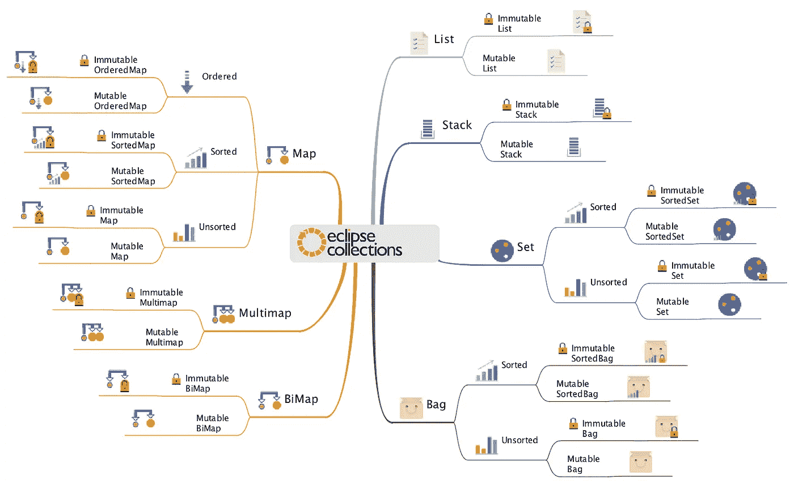

# Eclipse 集合中的转换器方法

> 原文：<https://medium.com/javarevisited/converter-methods-in-eclipse-collections-6b9bfc0f2490?source=collection_archive---------1----------------------->

从一种集合类型转换到另一种集合类型



由 [Kenji Hiranabe](https://twitter.com/hiranabe) 在 [Astah UML](https://astah.net/products/astah-uml/) 中创建的思维导图图像。在他的允许下包括在这里。

# 从一种类型转换到另一种类型

在 [Eclipse 集合](https://github.com/eclipse/eclipse-collections)中有许多不同的集合类型。集合类型有`Mutable`和`Immutable`两种。有`Object`和原始收藏类型。有`List`、`Set`、`Bag`、`Stack`、`Map`、`BiMap`、`Multimap`等类型。对于所有的 Eclipse 集合类型和 API，您可以做很多事情。但是如何从一种类型转换成另一种类型呢？

> 要将一个集合转换为另一种类型，请查找带有前缀`to`的方法

以`to`开头的方法会将集合的内容复制到特定的类型，并且会有线性的时间开销。

# 转换器方法对称性

我将展示在代码中使用 Eclipse 集合从一种类型转换到另一种类型的许多途径。为了这个特殊的目的，我做了一个代码形。

[](https://github.com/eclipse/eclipse-collections-kata/tree/master/converter-method-kata) [## eclipse/eclipse-集合-kata

### Converter Method Kata 是一个基本的代码 Kata，带有一组练习，开发人员可以完成这些练习来熟悉…

github.com](https://github.com/eclipse/eclipse-collections-kata/tree/master/converter-method-kata) 

我将使用 Eclipse 集合中可用的三种不同的 API 来演示转换器方法— `RichIterable`、`IntIterable`(适用于所有原始可迭代对象)和`Collectors2`。

这些 API 之间有很好的对称性，但是在实现 kata 的过程中，我发现缺少了一些东西，所以我在 Eclipse 集合 GitHub repo 中为缺少的 API 打开了新的问题。

# 丰富的转换器方法

以下方法在`[RichIterable](https://www.eclipse.org/collections/javadoc/10.4.0/org/eclipse/collections/api/RichIterable.html)`(及其子类型)中可用，可用于从一种集合类型转换到另一种集合类型。

**方法:**`[toList](https://www.eclipse.org/collections/javadoc/10.4.0/org/eclipse/collections/api/RichIterable.html#toList())``[toSet](https://www.eclipse.org/collections/javadoc/10.4.0/org/eclipse/collections/api/RichIterable.html#toSet())``[toBag](https://www.eclipse.org/collections/javadoc/10.4.0/org/eclipse/collections/api/RichIterable.html#toBag())``[toStack](https://www.eclipse.org/collections/javadoc/10.4.0/org/eclipse/collections/api/ordered/OrderedIterable.html#toStack())``[toMap](https://www.eclipse.org/collections/javadoc/10.4.0/org/eclipse/collections/api/RichIterable.html#toMap(org.eclipse.collections.api.block.function.Function,org.eclipse.collections.api.block.function.Function))``toSortedList``toSortedListBy``toSortedSet``toSortedSetBy``toSortedBag``toSortedBagBy``toSortedMap``toSortedMapBy``toArray``toString`

## 1.RichIterable: `[toList](https://www.eclipse.org/collections/javadoc/10.4.0/org/eclipse/collections/api/RichIterable.html#toList())`

```
@Test
public void toList()
{
    Interval interval = Interval.oneTo(5);
    // Convert interval to a MutableList<Integer>
    MutableList<Integer> list = interval.toList();
    Assert.assertEquals(Lists.mutable.with(1, 2, 3, 4, 5), list);
}
```

## 2.RichIterable: `[toSet](https://www.eclipse.org/collections/javadoc/10.4.0/org/eclipse/collections/api/RichIterable.html#toSet())`

```
@Test
public void toSet()
{
    MutableList<Integer> list = Lists.mutable.with(1, 2, 2, 3, 3);
    // Convert list to a MutableSet<Integer>
    MutableSet<Integer> set = list.toSet();
    Assert.assertEquals(Sets.mutable.with(1, 2, 3), set);
}
```

## 3.RichIterable: `[toBag](https://www.eclipse.org/collections/javadoc/10.4.0/org/eclipse/collections/api/RichIterable.html#toBag())`

```
@Test
public void toBag()
{
    MutableList<Integer> list = Lists.mutable.with(1, 2, 2, 3, 3);
    // Convert list to a MutableBag<Integer>
    MutableBag<Integer> bag = list.toBag();
    Assert.assertEquals(Bags.mutable.with(1, 2, 2, 3, 3), bag);
}
```

## 4.可订购:`[toStack](https://www.eclipse.org/collections/javadoc/10.4.0/org/eclipse/collections/api/ordered/OrderedIterable.html#toStack())`

```
@Test
public void toStack()
{
    MutableList<Integer> list = Lists.mutable.with(1, 2, 3);
    // Convert list to a MutableStack<Integer>
    MutableStack<Integer> stack = list.toStack();
    Assert.assertEquals(Stacks.mutable.with(1, 2, 3), stack);
    // Pop 3 elements off the stack
    Assert.assertEquals(list.toReversed(), stack.pop(3));
}
```

## 5.RichIterable: `[toMap](https://www.eclipse.org/collections/javadoc/10.4.0/org/eclipse/collections/api/RichIterable.html#toMap(org.eclipse.collections.api.block.function.Function,org.eclipse.collections.api.block.function.Function))`

```
@Test
public void toMap()
{
    MutableList<Integer> list = Lists.mutable.with(1, 2, 3);
    // Convert list to a MutableMap<String, Integer> where the keys 
    // are the String value of the element, and the values are 
    // the Integer value
    MutableMap<String, Integer> map = 
            list.toMap(String::valueOf, i -> i);
    Assert.assertEquals(
            Maps.mutable.with("1", 1, "2", 2, "3", 3), map);
}
```

## 6.RichIterable: `[toSortedList](https://www.eclipse.org/collections/javadoc/10.4.0/org/eclipse/collections/api/RichIterable.html#toSortedList())`

```
@Test
public void toSortedList()
{
    MutableList<Integer> list = Lists.mutable.with(5, 3, 1, 4, 2);
    // Convert list to a sorted MutableList<Integer>
    MutableList<Integer> forward = 
            list.toSortedList();
    // Convert list to a MutableList<Integer> sorted in reverse
    MutableList<Integer> reverse = 
            list.toSortedList(Comparator.reverseOrder());
    Assert.assertEquals(Lists.mutable.with(1, 2, 3, 4, 5), forward);
    Assert.assertEquals(Lists.mutable.with(5, 4, 3, 2, 1), reverse);
}
```

## 7.`[toSortedListBy](https://www.eclipse.org/collections/javadoc/10.4.0/org/eclipse/collections/api/RichIterable.html#toSortedListBy(org.eclipse.collections.api.block.function.Function))`

```
@Test
public void toSortedListByLastName()
{
    // Convert this.people to a MutableList<Person> sorted by 
    // lastName
    MutableList<Person> sorted = 
            this.people.toSortedListBy(Person::getLastName);
    Assert.assertEquals(
            Lists.mutable.with(TED_FIELDS, SALLY_GOLD, MARY_SMITH), 
            sorted);
}
```

## 8.RichIterable: `[toSortedSet](https://www.eclipse.org/collections/javadoc/10.4.0/org/eclipse/collections/api/RichIterable.html#toSortedSet())`

```
@Test
public void toSortedSet()
{
    MutableList<Integer> list = Lists.mutable.with(5, 3, 1, 4, 2);
    // Convert list to a sorted MutableSortedSet<Integer>
    MutableSortedSet<Integer> forward = 
            list.toSortedSet();
    // Convert list to a MutableSortedSet<Integer> sorted in reverse
    MutableSortedSet<Integer> reverse = 
            list.toSortedSet(Comparator.reverseOrder());
    Assert.assertEquals(
            SortedSets.mutable.with(1, 2, 3, 4, 5), forward);
    Assert.assertEquals(
            SortedSets.mutable.with(5, 4, 3, 2, 1), reverse);
}
```

## 9.`[toSortedSetBy](https://www.eclipse.org/collections/javadoc/10.4.0/org/eclipse/collections/api/RichIterable.html#toSortedSetBy(org.eclipse.collections.api.block.function.Function))`

```
@Test
public void toSortedSetByFirstName()
{
    // Convert this.people to a MutableSortedSet<Person> sorted by 
    // firstName
    MutableSortedSet<Person> sorted = 
            this.people.toSortedSetBy(Person::getFirstName);
    Assert.assertEquals(SortedSets.mutable.with(
            Comparator.comparing(Person::getFirstName),
            MARY_SMITH, SALLY_GOLD, TED_FIELDS), sorted);
}
```

## 10.RichIterable: `[toSortedBag](https://www.eclipse.org/collections/javadoc/10.4.0/org/eclipse/collections/api/RichIterable.html#toSortedBag())`

```
@Test
public void toSortedBag()
{
    MutableList<Integer> list = Lists.mutable.with(5, 3, 1, 4, 2);
    // Convert list to a sorted MutableSortedBag<Integer>
    MutableSortedBag<Integer> forward = list.toSortedBag();
    // Convert list to a MutableSortedBag<Integer> sorted in reverse
    MutableSortedBag<Integer> reverse = 
            list.toSortedBag(Comparator.reverseOrder());
    Assert.assertEquals(
            SortedBags.mutable.with(1, 2, 3, 4, 5), forward);
    Assert.assertEquals(
            SortedBags.mutable.with(5, 4, 3, 2, 1), reverse);
}
```

## 11.RichIterable: `[toSortedBagBy](https://www.eclipse.org/collections/javadoc/10.4.0/org/eclipse/collections/api/RichIterable.html#toSortedBagBy(org.eclipse.collections.api.block.function.Function))`

```
@Test
public void toSortedBagByAge()
{
    // Convert this.people to a MutableSortedBag<Person> sorted by 
    // age
    MutableSortedBag<Person> sorted = 
            this.people.toSortedBagBy(Person::getAge);
    Assert.assertEquals(SortedBags.mutable.with(
            Comparator.comparing(Person::getAge),
            MARY_SMITH, TED_FIELDS, SALLY_GOLD), sorted);
}
```

## 12.RichIterable: `[toSortedMap](https://www.eclipse.org/collections/javadoc/10.4.0/org/eclipse/collections/api/RichIterable.html#toSortedMap(java.util.Comparator,org.eclipse.collections.api.block.function.Function,org.eclipse.collections.api.block.function.Function))`

```
@Test
public void toSortedMap()
{
    MutableList<Integer> list = Lists.mutable.with(3, 1, 2);
    // Convert list to a MutableSortedMap<String, Integer> where 
    // the keys are the String value of the Integer and the values
    // are the Integer values
    MutableSortedMap<String, Integer> map = 
            list.toSortedMap(String::valueOf, i -> i);
    Assert.assertEquals(
            SortedMaps.mutable.with("1", 1, "2", 2, "3", 3), map);
}
```

## 13.RichIterable: `[toSortedMapBy](https://www.eclipse.org/collections/javadoc/10.4.0/org/eclipse/collections/api/RichIterable.html#toSortedMapBy(org.eclipse.collections.api.block.function.Function,org.eclipse.collections.api.block.function.Function,org.eclipse.collections.api.block.function.Function))`

```
@Test
public void toSortedMapByLastName()
{
    // Convert this.people to MutableSortedMap<String, Person> 
    // where the keys are the last name of the person
    // and the values are the person, and the keys are sorted on 
    // their uppercase String value
    MutableSortedMap<String, Person> map = 
            this.people.toSortedMapBy(
                    String::toUpperCase, 
                    Person::getLastName, 
                    person -> person);
    Assert.assertEquals(
            SortedMaps.mutable.with(
                    "FIELDS", TED_FIELDS, 
                    "GOLD", SALLY_GOLD, 
                    "SMITH", MARY_SMITH), map);
}
```

## 14.RichIterable: `toArray`

```
@Test
public void toArray()
{
    MutableList<Integer> list = Lists.mutable.with(1, 2, 3);
    // Convert the list to an Integer array
    Integer[] array = list.toArray(new Integer[3]);
    Assert.assertArrayEquals(new Integer[]{1, 2, 3}, array);
}
```

## 15.RichIterable: `toString`

```
@Test
public void toStringTest()
{
    MutableList<Integer> list = Lists.mutable.with(1, 2, 3);
    // Convert the list to a String
    String toString = list.toString();
    // Convert the list to a String with "[", "," "]" as 
    // separators using makeString
    String makeString = list.makeString("[", ", ", "]");
    Assert.assertEquals("[1, 2, 3]", toString);
    Assert.assertEquals("[1, 2, 3]", makeString);
}
```

# 原始可迭代转换器方法

以下方法在`[IntIterable](https://www.eclipse.org/collections/javadoc/10.4.0/org/eclipse/collections/api/IntIterable.html)`和`PrimitiveIterable`的其他子类型上可用。这些方法可用于将一种基本集合类型转换为另一种类型。

**方法:**`[toList](https://www.eclipse.org/collections/javadoc/10.4.0/org/eclipse/collections/api/IntIterable.html#toList())``[toSet](https://www.eclipse.org/collections/javadoc/10.4.0/org/eclipse/collections/api/IntIterable.html#toSet())``[toBag](https://www.eclipse.org/collections/javadoc/10.4.0/org/eclipse/collections/api/IntIterable.html#toBag())``[toSortedList](https://www.eclipse.org/collections/javadoc/10.4.0/org/eclipse/collections/api/IntIterable.html#toSortedList())``[toArray](https://www.eclipse.org/collections/javadoc/10.4.0/org/eclipse/collections/api/IntIterable.html#toArray())``toString`

## 1.不可改变:`toList`

```
@Test
public void toList()
{
    IntInterval interval = IntInterval.oneTo(5);
    // Convert interval to a MutableIntList
    MutableIntList list = interval.toList();
    // Convert list to an ImmutableIntList
    ImmutableIntList immutableIntList = list.toImmutable();
    Assert.assertEquals(IntLists.mutable.with(1, 2, 3, 4, 5), list);
    Assert.assertEquals(list, immutableIntList);
}
```

## 2.不可改变:`toSet`

```
@Test
public void toSet()
{
    MutableIntList list = IntLists.mutable.with(1, 2, 2, 3, 3);
    // Convert list to a MutableIntSet
    MutableIntSet set = list.toSet();
    // Convert set to an ImmutableIntSet
    ImmutableIntSet immutableIntSet = set.toImmutable();
    Assert.assertEquals(IntSets.mutable.with(1, 2, 3), set);
    Assert.assertEquals(set, immutableIntSet);
}
```

## 3.不可改变:`toBag`

```
@Test
public void toBag()
{
    MutableIntList list = IntLists.mutable.with(1, 2, 2, 3, 3);
    // Convert list to a MutableIntBag
    MutableIntBag bag = list.toBag();
    // Convert bag to an ImmutableIntBag
    ImmutableIntBag immutableIntBag = bag.toImmutable();
    Assert.assertEquals(IntBags.mutable.with(1, 2, 2, 3, 3), bag);
    Assert.assertEquals(bag, immutableIntBag);
}
```

## 4.不可改变:`toSortedList`

```
@Test
public void toSortedList()
{
    MutableIntList list = IntLists.mutable.with(5, 3, 1, 4, 2);
    // Convert list to a sorted MutableIntList
    MutableIntList sorted = list.toSortedList();
    Assert.assertEquals(
            IntLists.mutable.with(1, 2, 3, 4, 5), sorted);
    // Sort the sorted list in reverse order
    MutableIntList forward = sorted.sortThis();
    MutableIntList reversed = sorted.sortThisBy(i -> -i);
    Assert.assertEquals(
            IntLists.mutable.with(5, 4, 3, 2, 1), reversed);
}
```

## 5.不可改变:`toArray`

```
@Test
public void toArray()
{
    MutableIntList list = IntLists.mutable.with(1, 2, 3);
    int[] array = list.toArray(new int[3]);
    Assert.assertArrayEquals(new int[]{1, 2, 3}, array);
}
```

## 6.不可改变:`toString`

```
@Test
public void toStringTest()
{
    MutableIntList list = IntLists.mutable.with(1, 2, 3);
    String toString = list.toString();
    String makeString = list.makeString("[", ", ", "]");
    Assert.assertEquals("[1, 2, 3]", toString);
    Assert.assertEquals("[1, 2, 3]", makeString);
}
```

# 收集器 2 转换器方法

以下方法在`[Collectors2](https://www.eclipse.org/collections/javadoc/10.4.0/org/eclipse/collections/impl/collector/Collectors2.html)`中可用，可用于从 Java 流转换到 Eclipse 集合类型。

**方法:**`[toList](https://www.eclipse.org/collections/javadoc/10.4.0/org/eclipse/collections/impl/collector/Collectors2.html#toList())``[toSet](https://www.eclipse.org/collections/javadoc/10.4.0/org/eclipse/collections/impl/collector/Collectors2.html#toSet())``[toBag](https://www.eclipse.org/collections/javadoc/10.4.0/org/eclipse/collections/impl/collector/Collectors2.html#toBag())``[toStack](https://www.eclipse.org/collections/javadoc/10.4.0/org/eclipse/collections/impl/collector/Collectors2.html#toStack())``[toMap](https://www.eclipse.org/collections/javadoc/10.4.0/org/eclipse/collections/impl/collector/Collectors2.html#toMap(org.eclipse.collections.api.block.function.Function,org.eclipse.collections.api.block.function.Function))``toSortedList``toSortedListBy``toSortedSet``toSortedSetBy``toSortedBag``toSortedBagBy``makeString`

## 1.收藏者 2: `toList`

```
@Test
public void toList()
{
    Stream<Integer> interval = IntStream.rangeClosed(1, 5).boxed();
    // Convert interval to a MutableList<Integer> using Collectors2
    MutableList<Integer> list = 
            interval.collect(Collectors2.toList());
    Assert.assertEquals(Lists.mutable.with(1, 2, 3, 4, 5), list);
}
```

## 2.收集者 2: `toSet`

```
@Test
public void toSet()
{
    List<Integer> list = List.of(1, 2, 2, 3, 3);
    // Convert list to a MutableSet<Integer> using Collectors2
    MutableSet<Integer> set = 
            list.stream().collect(Collectors2.toSet());
    Assert.assertEquals(Sets.mutable.with(1, 2, 3), set);
}
```

## 3.收藏者 2: `toBag`

```
@Test
public void toBag()
{
    List<Integer> list = List.of(1, 2, 2, 3, 3);
    // Convert list to a MutableBag<Integer> using Collectors2
    MutableBag<Integer> bag = 
            list.stream().collect(Collectors2.toBag());
    Assert.assertEquals(Bags.mutable.with(1, 2, 2, 3, 3), bag);
}
```

## 4.收藏者 2: `toStack`

```
@Test
public void toStack()
{
    List<Integer> list = List.of(1, 2, 3);
    // Convert list to a MutableStack<Integer> using Collectors2
    MutableStack<Integer> stack = 
            list.stream().collect(Collectors2.toStack());
    Assert.assertEquals(Stacks.mutable.with(1, 2, 3), stack);
}
```

## 5.收藏者 2: `toMap`

```
@Test
public void toMap()
{
    List<Integer> list = List.of(1, 2, 3);
    // Convert list to a MutableMap<String, Integer> where the keys
    // are the String value of the element, and the values are 
    // the Integer value using Collectors2
    MutableMap<String, Integer> map =    
            list.stream().collect(
                    Collectors2.toMap(String::valueOf, i -> i));
    Assert.assertEquals(
            Maps.mutable.with("1", 1, "2", 2, "3", 3), map);
}
```

## 6.收藏者 2: `toSortedList`

```
@Test
public void toSortedList()
{
    List<Integer> list = List.of(5, 3, 1, 4, 2);
    // Convert list to a sorted MutableList<Integer> using 
    // Collectors2
    MutableList<Integer> forward = 
            list.stream().collect(Collectors2.toSortedList());
    // Convert list to a MutableList<Integer> sorted in reverse 
    // order using Collectors2
    MutableList<Integer> reverse = 
        list.stream().collect(
            Collectors2.toSortedList(Comparator.reverseOrder()));
    Assert.assertEquals(Lists.mutable.with(1, 2, 3, 4, 5), forward);
    Assert.assertEquals(Lists.mutable.with(5, 4, 3, 2, 1), reverse);
}
```

## 7.收藏者 2: `toSortedListBy`

```
@Test
public void toSortedListByLastName()
{
    // Convert this.people to a MutableList<Person> sorted by last 
    // name using Collectors2
    MutableList<Person> sorted = 
            this.people.stream().collect(
                Collectors2.toSortedListBy(Person::getLastName));
    Assert.assertEquals(
            Lists.mutable.with(TED_FIELDS, SALLY_GOLD, MARY_SMITH), 
            sorted);
}
```

## 8.收藏者 2: `toSortedSet`

```
@Test
public void toSortedSet()
{
    List<Integer> list = List.of(5, 3, 1, 4, 2);
    // Convert list to a sorted MutableSortedSet<Integer> using 
    // Collectors2
    MutableSortedSet<Integer> forward = 
            list.stream().collect(Collectors2.toSortedSet());
    // Convert list to a MutableSortedSet<Integer> sorted in 
    // reverse order using Collectors2
    MutableSortedSet<Integer> reverse = 
            list.stream().collect(
                    Collectors2.toSortedSet(
                         Comparator.reverseOrder()));
    Assert.assertEquals(
            SortedSets.mutable.with(1, 2, 3, 4, 5), forward);
    Assert.assertEquals(
            SortedSets.mutable.with(5, 4, 3, 2, 1), reverse);
}
```

## 9.收藏者 2: `toSortedSetBy`

```
@Test
public void toSortedSetByFirstName()
{
    // Convert this.people to a MutableSortedSet<Person> sorted by 
    // firstName using Collectors2
    MutableSortedSet<Person> sorted = 
            this.people.stream().collect(
                    Collectors2.toSortedSetBy(
                        Person::getFirstName));
    Assert.assertEquals(SortedSets.mutable.with(
            Comparator.comparing(Person::getFirstName),
            MARY_SMITH, SALLY_GOLD, TED_FIELDS), sorted);
}
```

## 10.收藏者 2: `toSortedBag`

```
@Test
public void toSortedBag()
{
    List<Integer> list = List.of(5, 3, 1, 4, 2);
    // Convert list to a sorted MutableSortedBag<Integer> 
    // using Collectors2
    MutableSortedBag<Integer> forward = 
            list.stream().collect(Collectors2.toSortedBag());
    // Convert list to a MutableSortedBag<Integer> sorted in 
    // reverse order using Collectors2
    MutableSortedBag<Integer> reverse = 
            list.stream().collect(
                    Collectors2.toSortedBag(
                            Comparator.reverseOrder()));
    Assert.assertEquals(
            SortedBags.mutable.with(1, 2, 3, 4, 5), forward);
    Assert.assertEquals(
            SortedBags.mutable.with(5, 4, 3, 2, 1), reverse);
}
```

## 11.收藏者 2: `toSortedBagBy`

```
@Test
public void toSortedBagByAge()
{
    // Convert this.people to a MutableSortedBag<Person> sorted by 
    // age using Collectors2
    MutableSortedBag<Person> sorted = 
            this.people.stream().collect(
                    Collectors2.toSortedBagBy(Person::getAge));
    Assert.assertEquals(SortedBags.mutable.with(
            Comparator.comparing(Person::getAge),
            MARY_SMITH, TED_FIELDS, SALLY_GOLD), sorted);
}
```

## 12.收藏者 2: `makeString`

```
@Test
public void toStringTest()
{
    List<Integer> list = List.of(1, 2, 3);
    // Convert the list to a String
    String toString = list.toString();
    // Convert the list to a String with "[", "," "]" as separators 
    // using makeString on Collectors2
    String makeString = 
            list.stream().collect(
                    Collectors2.makeString("[", ", ", "]"));
    Assert.assertEquals("[1, 2, 3]", toString);
    Assert.assertEquals("[1, 2, 3]", makeString);
}
```

# 还有更多…

我介绍了 Eclipse 集合中许多可用的转换器方法。在这个过程中，我发现了一些目前缺失的。还有一些方法可用，如`toImmutable`、`toReversed`、`Collectors2`有等价的不可变的`Collector`实现来匹配我在示例中使用的可变实现。另一种可以用来将一个集合转换成另一个集合类型的方法叫做`into`。

```
<R extends Collection<T>> R into(R target);
```

这个方法在`RichIterable`可用，只要它扩展`java.util.Collection`，它将接受你给它的任何目标`Collection`。作为参数传入的集合是您将得到的集合，其中添加了源集合的所有元素。这将为您提供从一种集合类型转换到另一种集合类型所需的灵活性。

*我是*[*Eclipse Collections*](https://github.com/eclipse/eclipse-collections)*OSS 项目在*[*Eclipse Foundation*](https://projects.eclipse.org/projects/technology.collections)*的项目负责人。* [*月食收藏*](https://github.com/eclipse/eclipse-collections) *为* [*投稿*](https://github.com/eclipse/eclipse-collections/blob/master/CONTRIBUTING.md) *。如果你喜欢这个库，你可以在 GitHub 上让我们知道。*