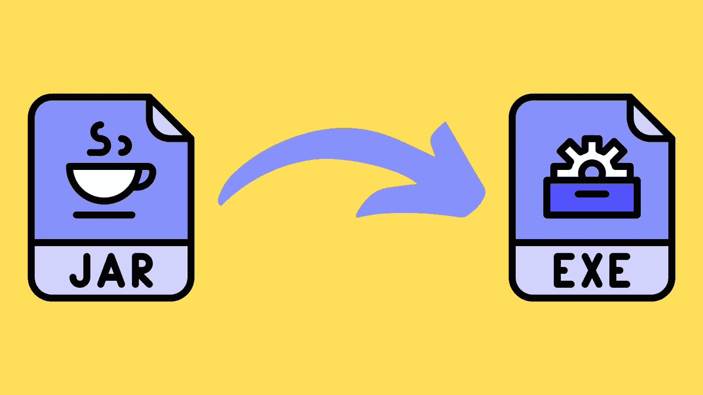

# 将 JAR 转换为 Windows 可执行文件(。EXE)放在 Maven 项目中

> 原文：<https://medium.com/javarevisited/converting-jar-to-executable-exe-in-a-maven-project-using-launch4j-plugin-7f2da1413086?source=collection_archive---------0----------------------->

## 使用嵌入式 Java 运行时环境(JRE)将作为 JAR 分发的 Java 应用程序包装在本机 Windows 可执行文件中

[](https://javarevisited.blogspot.com/2012/03/how-to-create-and-execute-jar-file-in.html)

用 JRE 在 maven 项目中执行 jar。图片来源: [EXE 图标](https://www.flaticon.com/free-icon/exe_2305870?term=exe&related_id=2306085&origin=tag) | [JAR 图标](https://www.flaticon.com/free-icon/jar_2305884?term=jar%20extension&page=1&position=22&page=1&position=22&related_id=2305884&origin=search)

如何向 Windows 客户分发基于 Java 的桌面应用程序？由应用程序构建创建的`[jar](https://javarevisited.blogspot.com/2012/10/5-ways-to-add-multiple-jar-to-classpath-java.html)`,然后需要在客户端工作站上安装 Java 运行时环境(JRE ),或者作为带有 JRE 包的 Windows 可执行文件(`exe`),消除客户安装执行基于 Java 的应用程序所需的 [JRE](https://javarevisited.blogspot.com/2011/12/jre-jvm-jdk-jit-in-java-programming.html) 的需求。

使用 Launch4J 和 [Maven](/javarevisited/6-best-maven-courses-for-beginners-in-2020-23ea3cba89) ，您可以准确地做到这一点:从 JAR 创建一个 Windows 可执行文件，并用 [JRE](http://www.java67.com/2013/02/difference-between-jdk-and-jre-in-java.html) 将它打包成一个最终的 zip 文件，您可以将它提供给客户端。消费者只需简单地解压文件并双击可执行文件来运行应用程序。

# 发射 4J

Launch4j 将 jar 封装在本机 Windows 可执行文件中，允许它们像任何其他 Windows 应用程序一样执行。

使用 Launch4J，您可以打包一个 JRE，让它在计算机上查找已经安装的 JRE，或者您也可以选择提供一个直接的 URL 来下载 JRE。

本文中概述的方法需要一个基于 Maven 的项目，该项目将把您的应用程序编译成一个`jar`，并使用 Launch4j 的 [Maven 插件](https://javarevisited.blogspot.com/2016/08/top-10-maven-plugins-every-java-developer-know.html#axzz5YVjCcR8u)将它包装成一个`exe`，然后将其与 Java 运行时环境捆绑在一起。

# Launch4J 的 Maven 插件

Launch4j 的 Maven 插件生成一个可执行文件，作为 Maven 构建过程的一部分。它支持 Maven `2.0.4`及以上版本。

通过在项目的`pom.xml`文件中包含以下插件，您可以定义 Launch4j 运行时配置。默认情况下，Launch4j 插件被绑定到包阶段，但是它是在应用程序的 [JAR 被创建](https://javarevisited.blogspot.com/2012/03/how-to-create-and-execute-jar-file-in.html#axzz6sZlXGk9y)之后运行的。

使用 launch4J 插件将 jar 转换为 exe

当可执行文件启动时，它将在相对于可执行文件指定的目录中寻找 JRE，我们将把它和下面部分的`exe`一起打包在一个 zip 文件中。

如果您的应用程序需要管理员权限，请在上面插件中配置的清单文件(`src/main/resources/<project-artifact-id>.manifest.xml`)中包含以下内容。

用于执行的 manifest.xml。具有管理员角色的 exe

# 用 JRE 打包可执行文件

在创建可执行文件之后，您希望 [Maven](https://javarevisited.blogspot.com/2021/05/why-java-developer-should-learn-maven-or-gradle.html) 将所有东西捆绑在一起。这是使用`pom.xml`中的组装插件完成的。

创建 exe 和 jre 压缩文件的汇编插件

以下是创建包含可执行文件和一个 [JRE](http://www.java67.com/2013/02/difference-between-jdk-and-jre-in-java.html) 的 zip 文件的基本汇编规范(`src/main/resources/assembly.xml`)。

包括 exe 和 jre 文件和文件夹的程序集规范

该示例在构建应用程序的机器上绑定了由`[JAVA_HOME](https://javarevisited.blogspot.com/2012/02/how-to-set-javahome-environment-in.html#axzz5YQtfRK2a)` [环境变量](https://javarevisited.blogspot.com/2012/02/how-to-set-javahome-environment-in.html#axzz5YQtfRK2a)指定的 JRE。

或者，一个更好的选择是从您组织的中央 maven artifactory 下载 JRE，并在随后由汇编插件选择的地方将其解包。

不要使用系统 jre，而是从可信任的工厂获取 jre

最后，执行 maven 命令将所有的东西组合在一起。

```
mvn clean package
```

将在`target`文件夹中创建一个 zip 文件，其结构如下

```
<artifactId-version>.zip
|- lib
|  |- jre
|- <artifactId-version>.exe
```

我的 [GitHub 库](https://github.com/nitishborade/explorations/tree/master/jar-to-exe)有一个示例 maven 项目，它将一个`jar`格式的 Java 应用程序转换成一个`exe`并将其打包到 JRE 中。

# 参考

[Launch4J 首页](http://launch4j.sourceforge.net/)
[Launch4J Maven 插件在 GitHub 上](https://github.com/lukaszlenart/launch4j-maven-plugin)
[Launch4J Maven 插件配置为需要管理员角色](https://stackoverflow.com/questions/38750826/launch4j-maven-plugin-configure-exe-to-require-administrator-role)
[launch 4j Maven 插件的另一个例子](https://github.com/NetHome/ProtocolAnalyzer/blob/master/pom.xml#L239)
[Launch4J 插件用于 Gradle 项目](https://github.com/TheBoegl/gradle-launch4j)

图片归属于 icon xar 创建的
[Jar 图标— Flaticon](https://www.flaticon.com/free-icon/jar_2305884?term=jar%20extension&page=1&position=22&page=1&position=22&related_id=2305884&origin=search) [Exe 图标 icon xar—flat icon](https://www.flaticon.com/free-icon/exe_2305870?term=exe&related_id=2306085&origin=tag)