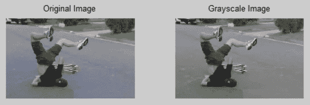

# 用 Java 将 RGB 图像转换成灰度图像

> 原文：<https://medium.com/javarevisited/converting-rgb-image-to-the-grayscale-image-in-java-9e1edc5bd6e7?source=collection_archive---------0----------------------->

题目！转换。我们花了很多时间寻找新事物。但与此同时，我们正花费大量时间寻找我们发现的事物之间的联系！

不是吗？

我们的目标

在深入探讨这个话题之前，让我们先看看基本的定义。