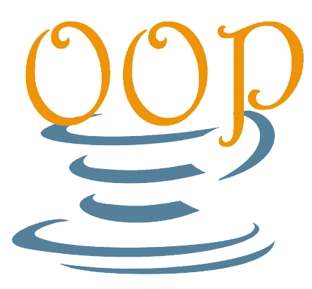
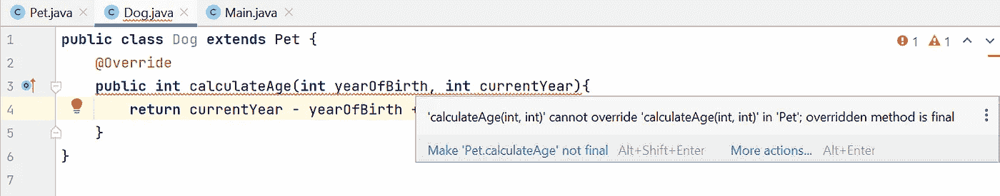

# 面向对象编程的核心概念-2

> 原文：<https://medium.com/javarevisited/core-concepts-of-object-oriented-programming-2-956cc0c275ee?source=collection_archive---------3----------------------->



> 在本文中，我将讨论面向对象编程的重要概念，这些概念对于创建可扩展的项目非常重要。这是文章的第二部分。你可以通过[**这个环节**](/geekculture/core-concepts-of-object-oriented-programming-1-49397c7e0cbe) 找到第一部分。如果你不熟悉面向对象编程，首先你可以看一下 [***这篇文章***](https://azizkale.medium.com/basic-concepts-of-oop-77cdaecda561) 中主题的一些基本概念。

在本文中，我将继续谈论**面向对象编程**的核心概念。

我将像以前一样使用 JAVA 作为编程语言，IntelliJ IDEA 作为 IDE。

要描述的概念如下:

*   [可比接口](#edc9)
*   [最终方法](#389c)
*   [静态](#b31c)
*   [抽象类和方法](#8be8)

## 可比接口

它是一个自动生成的接口，所以你不需要创建它，并提供你比较两个对象。它包括一个名为“ **compareTo** ”的方法。该方法将一个对象作为输入参数，该对象的类型与其实现的类相同，并返回一个整数**。**

***compareTo* 的主要目的是根据您指定的标准，将同一类别的两个对象进行比较。**

**当我们开始排序或搜索这种类型的对象时，这将非常方便。**

**让我们通过一个例子来更好地理解它:**

**我们有一个关于雇员的简单类，我用它的类型实现了 comparable 接口。并且我指定了 [*比较* 方法](https://javarevisited.blogspot.com/2011/11/how-to-override-compareto-method-in.html)及其参数。**

**现在让我们修改这个方法:**

**我想根据员工的*工资*对他们进行排序。如果工资相等，员工将根据他们的*姓名*进行比较。**

**在**主**类中，我添加了如下代码:**

**输出是:**

```
**name**: Joe **salary**: 1900
**name**: Kevin **salary**: 2000
**name**: Sara **salary**: 2000
**name**: Michael **salary**: 4000
```

## **最终方法**

**有时您希望保护父类中的方法不被重写。所以没人能在子类中改变(覆盖)你的方法。为此，您应该在父类中的方法开头使用[关键字“**final**”](https://javarevisited.blogspot.com/2013/12/when-to-make-method-final-in-java.html)。**

**下面是一个例子:**

**在*宠物*类中，我有一个计算年龄的方法。**

**现在我创建了另一个名为 *Dog* 的类，它继承了 *Pet* 类。然后在 *Dog* 类中，我试图覆盖从父类继承的方法:**

**[](https://javarevisited.blogspot.com/2018/03/finally-java-10-has-var-to-declare-local-variables.html#axzz6qnblZnVj)

图片-1** 

**正如你在上面看到的，我得到了一个错误。并且上面写着:“*calculatage(int，int)‘不能覆盖‘Pet’中的‘calculatage(int，int)’;被覆盖的方法是最终的*”。这意味着该方法受到保护，不会被更改，因为它是一个**最终方法**。**

**你也可以使用最后的**关键字**来描述字段。但是，与 final 方法不同，final 字段与继承无关。字段开头的 final 关键字表示该字段是*常量*，换句话说，不能更改。**

**例如，它可以用于数学常数。**

```
**public** **class** **myMathClass**{
   **public** **final** **double** PI = 3.14;
}
```

## **静态**

**[**静态**关键字](https://www.java67.com/2012/11/10-points-about-static-in-java.html)一般用于内存管理。例如，在一个类中有一个变量。无论您创建了多少个该类的实例，变量都依赖于您创建的单个对象。所以每次都会重新创建变量。**

**我们来举个例子；**

```
**public class** MyClass {
    **public int** variable1;
    **public static int** variable2;

    MyClass(){
        variable1++;
        variable2++;
    }
}
```

**在主 c 类中，我得到了它的 5 个实例:**

```
**public class** Main {
    **public static void** main(String[] args){
        **for**(int i=1; i <= 5; i++){
            MyClass myclass = new MyClass();
            System.*out*.println("variable-1: " + myclass.variable1 + ",variable-2: " + MyClass.*variable2*);
        }
    }
}
```

**通常，这两个变量都是从头开始创建的，并且必须为“1”。但是，输出是:**

```
variable-1: 1,variable-2: 1
variable-1: 1,variable-2: 2
variable-1: 1,variable-2: 3
variable-1: 1,variable-2: 4
variable-1: 1,variable-2: 5
```

**因为变量 1 属于对象，而变量 2 属于类。因此**变量 2** 被保存在内存中，并且每个*实例*都会不断增加。**

**注意，我们通过类名到达**变量 2** ，而通过对象名到达另一个变量。**

**你也可以[使方法**静态**](https://javarevisited.blogspot.com/2013/07/when-to-make-method-static-in-java.html)。所以方法可以属于类而不是对象。要调用静态方法，您不需要创建对象或访问对象的任何字段。静态方法获取自己的输入参数，并仅基于这些输入返回结果。**

```
**public static int** add(**int** var1, **int** var2){
    **return** var1 + var2;
}
```

**您可以使用类名直接访问该方法:**

```
**MyClass**.*add*(4,5);
```

## ****抽象类和方法****

**我们已经在另一篇[文章](/geekculture/core-concepts-of-object-oriented-programming-1-49397c7e0cbe)中介绍了“**继承**的概念。首先我们创建了一个名为**父类**或**超类**的类。然后我们创建了子类或子类来扩展父类。但是我们使用父类只是为了能够用子类扩展它。所以我们不实例化它或者我们不需要从它本身创建对象。**

**在这种情况下，最好使用**抽象类**。抽象类定义了每个子类的行为，但是我们不能直接实例化抽象类本身。**

**抽象类也允许创建**抽象方法**，这些方法必须在扩展抽象类的子类中实现。抽象类中的抽象方法只有头，没有实现。我们在子类中指定它们的身体。**

**让我们看看这个例子:**

**抽象父类**

**和儿童类；**

**正如您在示例中看到的，我们通过在抽象类 **MyAbstractClass** 前面添加关键字“ **abstract** ”来创建抽象类**my abstract class**。在这个类中，我们创建了抽象方法 **myMethod** 。**

**我们用 **MyChildClass** 扩展了 MyAbstractClass，然后重写了子类中的方法。**