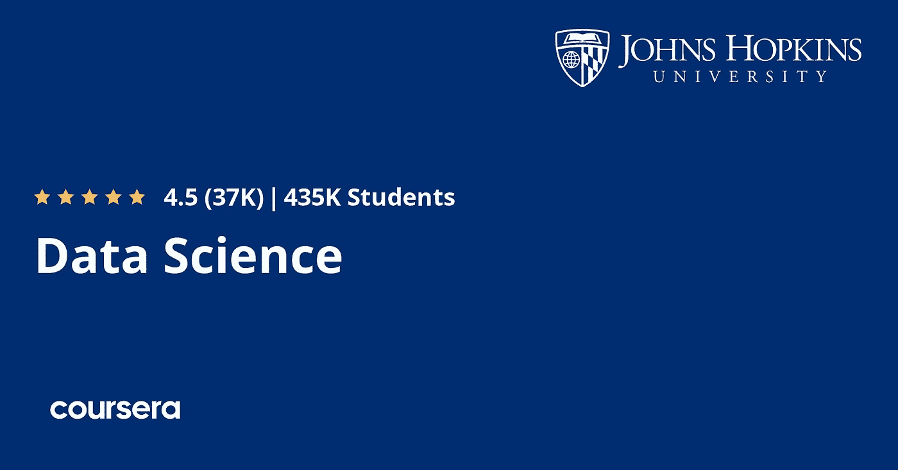

# Coursera 和约翰霍普金斯数据科学专业值得吗？[2023 年回顾]

> 原文：<https://medium.com/javarevisited/coursera-and-johns-hopkins-data-science-specialization-review-7ed48d18cc16?source=collection_archive---------1----------------------->

## 我对约翰霍普金斯大学 Coursera 最受欢迎的数据科学专业的评论。初学者学习数据科学 Coursera 值得吗？

大家好，如果你想成为一名数据科学家，并且正在寻找最好的 Coursera 专业，或者正在考虑加入 Coursera 中约翰·霍普斯金大学的数据科学专业，但不确定是否值得你花费时间和金钱，那么你来对地方了。

前面我已经分享过数据科学最好的 [Coursera 课程](/javarevisited/my-favorite-data-science-and-machine-learning-courses-from-coursera-udemy-and-pluralsight-eafc73acc73f)、[云计算](/javarevisited/10-best-aws-google-cloud-and-azure-courses-and-certification-from-coursera-to-join-in-2021-5c5e2029a8e7)、[机器学习](/javarevisited/10-best-coursera-certifications-courses-for-machine-learning-and-artificial-intelligence-256d9a125822)、 [Python 编程](/javarevisited/10-best-python-certification-courses-from-coursera-4576890eb6b3)、[软件开发](/javarevisited/10-best-software-development-courses-certifications-from-coursera-4ccc59aae201)，还有今天；我将回顾 Coursera 上最受欢迎的数据科学专业之一，约翰·霍普斯金大学的*数据科学专业。*

虽然 Coursera 拥有许多高质量的数据科学认证，但这可能是其中最受欢迎的，因为它是由美国约翰霍普金斯大学提供的。

如今，数据是这个时代的燃料，公司总是在开发能够从这些数据中提取洞察力的工具，以做出正确的决策，了解市场以及用户的需求，学习如何使用这些数据并加以利用并不是一件很难理解的事情。

许多教师已经创建了在线课程，教你如何使用数据来深入了解所谓的数据科学。我一直在许多在线平台上搜索，直到我在约翰·霍普斯金大学开设的 Coursera 上看到这个 [**数据科学专业**](https://coursera.pxf.io/c/3294490/1164545/14726?u=https%3A%2F%2Fwww.coursera.org%2Fspecializations%2Fjhu-data-science) 。

 [## 数据科学

### 约翰·霍普金斯大学的使命是教育学生，培养他们终身学习的能力

coursera.pxf.io](https://coursera.pxf.io/c/3294490/1164545/14726?u=https%3A%2F%2Fwww.coursera.org%2Fspecializations%2Fjhu-data-science) 

在本文中，您将了解到您将从这一数据科学专业中学习到什么、讲师的声誉以及人们的评价，以便您能够做出正确的决定，选择这门课程或寻找另一门满足您需求的课程。

关于[这门课程](https://coursera.pxf.io/c/3294490/1164545/14726?u=https%3A%2F%2Fwww.coursera.org%2Fspecializations%2Fjhu-data-science)的好处是，它是一个专业化，这意味着你将获得 Coursera 证书，添加到你的简历和 LinkedIn 个人资料中，以展示你已经完成了 Coursera 的这个专业化，并拥有相关的[数据科学技能](/javarevisited/my-favorite-data-science-and-machine-learning-courses-from-coursera-udemy-and-pluralsight-eafc73acc73f)。

这将真正提升你在招聘人员搜索中的形象，更喜欢有证书等证据的候选人。

# 我对约翰·霍普金斯大学认证的 Coursera 上的数据科学专业化的评论

现在，让我们来看看约翰霍普金斯大学在 Coursera 上开设的数据科学专业是否是[在 2023 年](/javarevisited/my-favorite-johns-hopkins-courses-to-learn-data-science-statistics-and-machine-learning-ed4b1f1f714a)学习数据科学的正确课程。我们将回顾本课程的重要参数，如讲师、课程内容以及已经学习过本课程的其他人对本专业的看法。

## 1.导师的声誉

三位导师创建了这门课程，让我们从杰夫·莱克开始，他是约翰·霍普斯金大学生物统计学专业的助理教授，拥有该领域的博士学位。

 [## Jeff Leek 博士，讲师| Coursera

### 杰夫·利克是约翰·霍普金斯大学彭博公共卫生学院的生物统计学助理教授

coursera.pxf.io](https://coursera.pxf.io/c/3294490/1164545/14726?u=https%3A%2F%2Fwww.coursera.org%2Finstructor%2F~694443) 

另一位导师叫 [**Roger D. Peng**](https://coursera.pxf.io/c/3294490/1164545/14726?u=https%3A%2F%2Fwww.coursera.org%2Finstructor%2Frdpeng) 拥有加州大学统计学博士学位，在约翰·霍普斯金大学担任教授。最后一位讲师 [Brian Caffo](https://coursera.pxf.io/c/3294490/1164545/14726?u=https%3A%2F%2Fwww.coursera.org%2Finstructor%2F~688901) ，是[约翰·霍普斯金大学](https://www.jhu.edu/)的教授，也是弗罗里达大学生物统计学博士。

 [## Brian Caffo 博士，讲师| Coursera

### 布莱恩·卡弗博士是约翰·霍普金斯大学彭博学院生物统计系的教授

coursera.pxf.io](https://coursera.pxf.io/c/3294490/1164545/14726?u=https%3A%2F%2Fwww.coursera.org%2Finstructor%2F~688901) 

## 2.专业化的内容和结构

这个数据科学专业主要专注于使用 [R 编程语言](/javarevisited/10-best-r-programming-courses-for-data-science-and-statistics-8f84ebec4974)来分析和可视化数据，并创建机器学习模型。让我们开始探索本课程的内容:

## 2.1.[数据科学家的工具箱](https://coursera.pxf.io/c/3294490/1164545/14726?u=https%3A%2F%2Fwww.coursera.org%2Flearn%2Fdata-scientists-tools)

每个行业都有自己的工具，数据科学也不例外。如果您拥有提取数据、清理数据、规范化数据和转换数据的工具，那将是最好的。如果你也有可视化和处理数据的工具就更好了，这也是本课程的帮助所在。

由于你是数据科学领域的新手，你将介绍这个行业以及一些有助于你掌握数据科学的工具和平台。超过 65 万人已经在 Coursera 上加入了这个令人惊叹的数据科学课程。

 [## 数据科学家的工具箱

### 在本课程中，您将了解数据科学家工具箱中的主要工具和思想。课程…

coursera.pxf.io](https://coursera.pxf.io/c/3294490/1164545/14726?u=https%3A%2F%2Fwww.coursera.org%2Flearn%2Fdata-scientists-tools) 

## 2.2. [R 编程](https://coursera.pxf.io/c/3294490/1164545/14726?u=https%3A%2F%2Fwww.coursera.org%2Flearn%2Fr-programming)

第二个重点是使用 R 编程语言编程，因为它是本课程中分析和可视化以及安装统计编程环境和软件包的主要工具。

如果你想掌握 R 语言，你也可以看看我列出的[最佳 R 编程课程](https://javarevisited.blogspot.com/2020/07/top-5-courses-to-learn-r-programming-in.html) s，包括 Udemy、Pluralsight、Coursera 学习 R 编程的最佳课程。

 [## r 编程

### 在本课程中，你将学习如何用 R 编程，以及如何使用 R 进行有效的数据分析。您将学习如何…

coursera.pxf.io](https://coursera.pxf.io/c/3294490/1164545/14726?u=https%3A%2F%2Fwww.coursera.org%2Flearn%2Fr-programming) 

## 2.3.[获取和清理数据](https://coursera.pxf.io/c/3294490/1164545/14726?u=https%3A%2F%2Fwww.coursera.org%2Flearn%2Fdata-cleaning)

在从事数据科学家的工作之前，您需要首先获取和收集数据，因此本课程将向您介绍从数据库和 web 等获取数据的各种方法。

 [## 获取和清理数据

### 在处理数据之前，你必须先获得一些数据。本课程将涵盖获取数据的基本方法…

coursera.pxf.io](https://coursera.pxf.io/c/3294490/1164545/14726?u=https%3A%2F%2Fwww.coursera.org%2Flearn%2Fdata-cleaning) 

## 2.4.[探索性数据分析](https://coursera.pxf.io/c/3294490/1164545/14726?u=https%3A%2F%2Fwww.coursera.org%2Flearn%2Fexploratory-data-analysis)

收集完数据后，您需要对其进行处理和可视化，这是本课程的全部内容。您将学习用 R 语言编写的统计和可视化软件包。

 [## 探索性数据分析

### 本课程涵盖了汇总数据的基本探索技巧。这些技术通常应用于…

coursera.pxf.io](https://coursera.pxf.io/c/3294490/1164545/14726?u=https%3A%2F%2Fwww.coursera.org%2Flearn%2Fexploratory-data-analysis) 

## 2.5.[可再生研究](https://coursera.pxf.io/c/3294490/1164545/14726?u=https%3A%2F%2Fwww.coursera.org%2Flearn%2Freproducible-research)

本课程的重点是在可视化和分析过程之后报告和深入了解您的数据，以及其他一些东西，以使分析过程更加有效和高效。

 [## 可重复的研究

### 本课程侧重于以可再现的方式报告现代数据分析背后的概念和工具…

coursera.pxf.io](https://coursera.pxf.io/c/3294490/1164545/14726?u=https%3A%2F%2Fwww.coursera.org%2Flearn%2Freproducible-research) 

## 2.6.[统计推断](https://coursera.pxf.io/c/3294490/1164545/14726?u=https%3A%2F%2Fwww.coursera.org%2Flearn%2Fstatistical-inference)

本课程将向您介绍统计和推断统计，它得出总体的结论和一些理论，如贝叶斯和可能性。

 [## 统计推断

### 统计推断是从数据中得出关于总体或科学真理的结论的过程。有…

coursera.pxf.io](https://coursera.pxf.io/c/3294490/1164545/14726?u=https%3A%2F%2Fwww.coursera.org%2Flearn%2Fstatistical-inference) 

## 2.7.[回归模型](https://coursera.pxf.io/c/3294490/1164545/14726?u=https%3A%2F%2Fwww.coursera.org%2Flearn%2Fregression-models)

本课程面向统计分析和回归模型，如线性和回归模型，因此介绍了[机器学习](https://www.java67.com/2019/01/5-free-courses-to-learn-machine-and-deep-learning-in-2019.html)和[回归分析](https://www.java67.com/2020/07/top-5-machine-learning-algorithms-for-beginners.html) s。

 [## 回归模型

### 线性模型，顾名思义，使用线性假设将结果与一组感兴趣的预测因素联系起来…

coursera.pxf.io](https://coursera.pxf.io/c/3294490/1164545/14726?u=https%3A%2F%2Fwww.coursera.org%2Flearn%2Fregression-models) 

## 2.8.[实用机器学习](https://coursera.pxf.io/c/3294490/1164545/14726?u=https%3A%2F%2Fwww.coursera.org%2Flearn%2Fpractical-machine-learning)

这里，到了有趣的部分，您将把*机器学习算法*应用到您的数据和预测函数以及 ML 概念，如训练过度拟合等等。

 [## 实用机器学习

### 数据科学家和数据分析师执行的最常见的任务之一是预测和机器学习。这个…

coursera.pxf.io](https://coursera.pxf.io/c/3294490/1164545/14726?u=https%3A%2F%2Fwww.coursera.org%2Flearn%2Fpractical-machine-learning) 

## 2.9.[开发数据产品](https://coursera.pxf.io/c/3294490/1164545/14726?u=https%3A%2F%2Fwww.coursera.org%2Flearn%2Fdata-products)

本课程是关于使用 [R 语言](/javarevisited/10-best-r-programming-courses-for-data-science-and-statistics-8f84ebec4974)和一些软件包如 shiny 和传单创建数据产品的，你将学习使用 Plotly 库的一些可视化。[数据可视化](/javarevisited/8-best-data-visualization-tools-and-libraries-data-analysts-and-scientists-can-learn-d2734371df16)是一项关键技能，这也是你将在本课程中学到的。

你从数据分析中收集的所有信息都是无用的，除非你能找到一些见解，这就是这些图表和其他视觉元素的帮助之处。我强烈建议所有渴望成为数据科学家的人学习数据可视化。

 [## 开发数据产品

### 数据产品是统计分析的产出。数据产品自动化复杂的分析任务或…

coursera.pxf.io](https://coursera.pxf.io/c/3294490/1164545/14726?u=https%3A%2F%2Fwww.coursera.org%2Flearn%2Fdata-products) 

## 2.10.[数据科学顶点](https://coursera.pxf.io/c/3294490/1164545/14726?u=https%3A%2F%2Fwww.coursera.org%2Flearn%2Fdata-science-project)

在最后一门课程中，您将完成一个顶点项目，在该项目中，您将使用在过去课程中学到的知识开发一个数据产品，并分析您的数据和做出预测，等等。

这是一个应用你在本课程中学到的知识的绝佳机会，对于获得你想要的证书也很重要。

除非你完成了这个项目和所有的评估，否则你不会获得认证，但是不要担心，在网上、论坛上和 YouTube 上有很多帮助来完成这个项目。

 [## 数据科学顶点

### 顶点工程课程将允许学生创建一个可用的/公共的数据产品，可以用来展示你的…

coursera.pxf.io](https://coursera.pxf.io/c/3294490/1164545/14726?u=https%3A%2F%2Fwww.coursera.org%2Flearn%2Fdata-science-project) 

## 3.《人民评论》

在提交评级的约 78k 人中，专业化获得了 4.5 星(满分 5 星)，这似乎相当不错，意味着内容本身以及视频和测验也很好。它也有超过 430，000 的注册人数，并且忘记提到该课程有多种语言版本，如中文、阿拉伯语、西班牙语、俄语等等。

统计数据显示，43%的学习者在数据科学领域开始了新的职业生涯。大约 19%的人在完成这一专业后获得了晋升。

这里是加入本课程的链接—[**Johns Hopkins**的数据科学专业。](https://coursera.pxf.io/c/3294490/1164545/14726?u=https%3A%2F%2Fwww.coursera.org%2Fspecializations%2Fjhu-data-science)

这就是约翰·霍普金斯大学的**数据科学专业的全部内容。如今，数据科学是一个高需求行业，几乎所有公司都必须雇用一名员工，利用他们的数据做出正确的决策，改善他们的服务，并在市场上与他人竞争。**

你可能喜欢的其他 **Coursera 和编程文章**

*   [开始职业生涯的 10 大 Coursera 认证](/javarevisited/top-10-coursera-certificates-to-start-your-career-in-cloud-data-science-ai-mainframe-and-it-558690c83587)
*   [面向所有人的 Python——Coursera 评论](https://javarevisited.blogspot.com/2020/09/python-for-everybody-course-from-coursera-review.html)
*   [谷歌 IT 支持专业认证——Coursera 评审](https://javarevisited.blogspot.com/2020/09/google-it-support-professional-certification-coursera-review.html)
*   [Python 应用数据科学— Coursera 评论](https://www.java67.com/2020/10/applied-data-science-with-python-coursera-review.html)
*   [2023 年学习人工智能的 7 门最佳课程](/javarevisited/7-best-courses-to-learn-artificial-intelligence-in-2020-26d59d62f6fe)
*   [Udemy vs. Pluralsight？哪个学习平台比较好？](https://javarevisited.blogspot.com/2019/10/udemy-vs-pluralsight-review-which-is-better-to-learn-code.html)
*   Coursera Plus Review——在 Coursera 上学习的更好方式
*   [学习 Web 开发的十大课程](https://javarevisited.blogspot.com/2020/08/top-10-coursera-certifications-to-learn-web-development.html)
*   向顶尖科技公司学习的 18 门 Coursera 课程
*   [5 个最佳 Coursera 程序员职业证书](https://javarevisited.blogspot.com/2019/10/top-5-coursera-professional-certificates-for-programmers-IT-professionals.html)
*   [2023 年学习 Python 可以做的 8 个项目](/javarevisited/8-projects-you-can-buil-to-learn-python-in-2020-251dd5350d56)
*   [你可以在 Coursera Online 上获得 5 个数据科学学位](https://www.java67.com/2020/06/top-5-data-science-degree-you-can-earn-online-coursera-edx.html)
*   【Coursera 的 10 项数据科学和机器学习认证
*   [2023 年加入的 15 门免费 Coursera 课程和认证](/javarevisited/top-15-free-coursera-courses-and-certifications-for-it-professionals-384207d56f45)

感谢阅读这篇文章。如果你喜欢约翰霍普金斯大学在 Coursera 上的这篇*关于数据科学专业化的综述，请分享给你的朋友和同事。如果您有任何问题或反馈，请留言。*

**P. S.** —如果你正在寻找使用 Python 学习数据科学的最佳 Udemy 在线课程，你也可以查看 [**由 365 Careers 及其团队**编写的《数据科学教程 2023:完整的数据科学训练营****](https://click.linksynergy.com/deeplink?id=JVFxdTr9V80&mid=39197&murl=https%3A%2F%2Fwww.udemy.com%2Fcourse%2Fthe-data-science-course-complete-data-science-bootcamp%2F) 。他们在 Udemy 上有最好的数据科学在线课程。

 [## 数据科学培训课程:数据科学家训练营

### 数据科学家是本世纪最适合蓬勃发展的职业之一。它是数字化的，面向编程的，并且…

udemy.com](https://click.linksynergy.com/deeplink?id=JVFxdTr9V80&mid=39197&murl=https%3A%2F%2Fwww.udemy.com%2Fcourse%2Fthe-data-science-course-complete-data-science-bootcamp%2F)