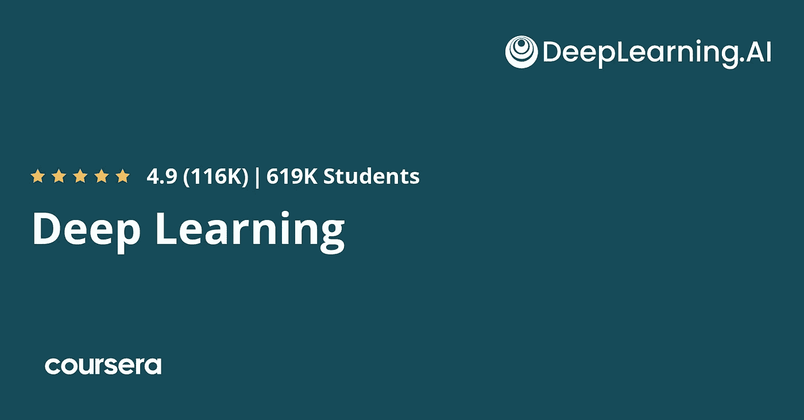
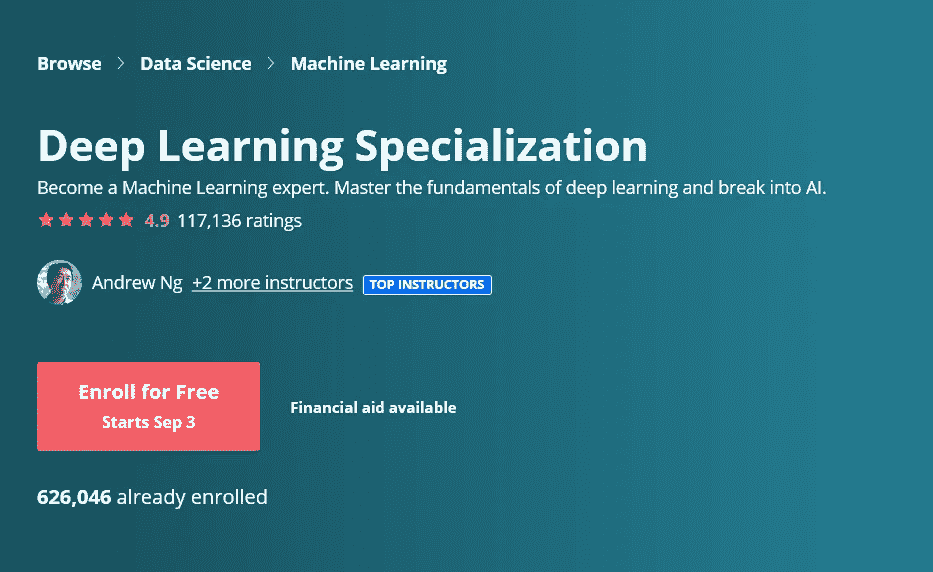

# 吴恩达的 Coursera 深度学习专业化值得吗？回顾

> 原文：<https://medium.com/javarevisited/coursera-deep-learning-specialization-by-andrew-ng-review-is-it-worth-it-in-2021-e3d11d7687d1?source=collection_archive---------1----------------------->

## 自推出以来，Coursera 的深度学习专业已经成为世界上最受欢迎的深度学习项目之一，注册学习者超过 50 万。这是一门全面而有趣的课程，适合初学者和专家。

image_credit — Coursera

大家好，如果你正在网上寻找最好的深度学习课程，或者想加入 Coursera 上吴恩达和他的 DeepLEarning.ai 团队的*深度学习专业化，但想知道它是否值得你的时间和金钱，那么你来对地方了。*

前面我已经分享过数据科学 [**最佳 Coursera 课程**](https://javarevisited.blogspot.com/2020/08/top-10-coursera-certifications-to-learn-Data-Science-Visualization-and-Data-Analysis.html)[机器学习](https://javarevisited.blogspot.com/2020/08/top-10-coursera-courses-and-certification-for-artificial-intelligence-and-machine-learning.html)[Python 编程](https://javarevisited.blogspot.com/2020/02/10-best-coursera-courses--for-python.html)。今天，我将回顾 Coursera 上，或者我应该说是互联网上最受欢迎的深度学习专业化之一。

Coursera 上的 [**深度学习专业化**](https://coursera.pxf.io/c/3294490/1164545/14726?u=https%3A%2F%2Fwww.coursera.org%2Fspecializations%2Fdeep-learning) 由吴恩达和他的团队提供，由 deeplearning.ai 提供。虽然网上有许多深度学习课程，但这是关于深度学习的最详细、最全面、最有吸引力的课程。

自 2017 年推出以来，Coursera 的深度学习专业化一直是世界上最受欢迎的深度学习项目之一，注册学习者超过 50 万。

它适合初学者和专家，尤其是那些想让自己的机器学习技能更上一层楼的人。

如今，人工智能在我们的生活中无处不在，从谷歌搜索或 YouTube 上的视频推荐，到你所在城市的自动驾驶汽车和智能摄像头。

公司现在竞相涉足这一行业，并将人工智能添加到他们的产品中，以获得更好的性能和用户体验，无论是实体还是在线。

如果你是一名软件工程师或 python 用户，并且你也想涉足这个行业并进入人工智能领域，我会向你推荐在 Coursera 上参加一个名为 [**深度学习专业化**](https://coursera.pxf.io/c/3294490/1164545/14726?u=https%3A%2F%2Fwww.coursera.org%2Fspecializations%2Fdeep-learning) 的大规模在线课程，其中包含五个小课程，作为初学者教你这项技术的基础。

 [## 深度学习

### 从 deeplearning.ai 学习深度学习，如果你想打入人工智能(ai)，这个专精…

coursera.pxf.io](https://coursera.pxf.io/c/3294490/1164545/14726?u=https%3A%2F%2Fwww.coursera.org%2Fspecializations%2Fdeep-learning) 

本文将从多个方面向您展示深度学习专业化审查，如讲师的声誉和专业化内部涵盖的主题以及人们在完成计划后的审查。

# 我对 Coursera 上吴恩达和 DeepLearning.ai 的深度学习专业化的评论

现在，让我们开始找出吴恩达在 Coursera 上的深度学习专业化是否是学习深度学习的正确课程。我们将回顾本课程的重要参数，如讲师、课程内容以及已经学习过本课程的其他人对本专业的看法。

## 1.教练

特殊化导师名叫吴恩达，他是这个在线平台[**Coursera**](https://coursera.pxf.io/c/3294490/1164545/14726?u=https%3A%2F%2Fwww.coursera.org%2F)**的联合创始人，也是一名商人和投资人。1997 年，他在卡内基梅隆大学获得了计算机科学和统计学学士学位，并于次年获得了麻省理工学院的硕士学位。**

**[**吴恩达**](https://coursera.pxf.io/c/3294490/1164545/14726?u=https%3A%2F%2Fwww.coursera.org%2Finstructor%2Fandrewng) 曾在斯坦福大学担任教授，并在谷歌等许多其他职位任职，他在 2012 年与同行杰夫·迪恩一起发明了谷歌大脑，并在人工智能领域创造了许多课程，如斯坦福大学提供的经典和最受欢迎的 [**机器学习课程**](https://coursera.pxf.io/c/3294490/1164545/14726?u=https%3A%2F%2Fwww.coursera.org%2Flearn%2Fmachine-learning) 和这种深度学习专业化。**

****

# **2.认证结构、内容和大纲**

**这个专业将让你深入人工智能行业，你不仅会掌握这门科学背后的理论，还会应用到现实世界的项目中，所以让我们看看这门课程提供了什么:**

## **2.1 [神经网络和深度学习](https://coursera.pxf.io/c/3294490/1164545/14726?u=https%3A%2F%2Fwww.coursera.org%2Flearn%2Fneural-networks-deep-learning)**

**第一门课程将教你深度学习背后的理论，并在现实世界中应用这项技术，比如创建和训练一个简单的 [**神经网络**](/javarevisited/top-5-advanced-deep-learning-and-neural-network-courses-to-learn-in-2020-a273f5eddca5) ，了解深度学习的关键参数。**

**超过 100 万人加入了这一令人敬畏的课程，这是质量的证明。这简直是深入学习神经网络的绝佳课程。**

** [## 神经网络和深度学习

### 在深度学习专业化的第一门课程中，你将学习神经网络的基本概念和…

coursera.pxf.io](https://coursera.pxf.io/c/3294490/1164545/14726?u=https%3A%2F%2Fwww.coursera.org%2Flearn%2Fneural-networks-deep-learning)** 

## **2.2 [改进深度神经网络](https://coursera.pxf.io/c/3294490/1164545/14726?u=https%3A%2F%2Fwww.coursera.org%2Flearn%2Fdeep-neural-network)**

**在了解深度学习的基础以及如何创建一个简单的神经网络之后，您现在可以看到如何通过应用许多算法和策略来优化您的模型的性能，例如使用 [**TensorFlow**](https://becominghuman.ai/top-10-courses-to-learn-tensorflow-for-machine-learning-in-2020-39a31e7cd84b) 的下降正则化和梯度下降。**

**超过 412，000 人注册了这门课程，在近 60，000 名候选人中，它的平均评分为 4.9 分，令人难以置信；这太神奇了。我看过很多课程，但从没见过这样的。**

** [## 改进深度神经网络:超参数调整、正则化和优化

### 在深度学习专业化的第二个课程中，您将打开深度学习黑盒来了解…

coursera.pxf.io](https://coursera.pxf.io/c/3294490/1164545/14726?u=https%3A%2F%2Fwww.coursera.org%2Flearn%2Fdeep-neural-network)** 

## **2.3 [构建机器学习项目](https://coursera.pxf.io/c/3294490/1164545/14726?u=https%3A%2F%2Fwww.coursera.org%2Flearn%2Fmachine-learning-projects)**

**创建一些机器学习或深度学习模型并不能让你成为一个团队领导者来创建一个成功的 AI 产品，因此本课程将教授如何成为一名领导者并诊断机器学习错误，了解复杂的 ML 设置等等。**

**谈到社会证明，超过 34 万名学生加入了这门课程，47 万名候选人对这门课程的平均评分为 4.8，这也是一个惊人的数字。**

** [## 构建机器学习项目

### 在深度学习专业化的第三个课程中，您将学习如何建立一个成功的机器学习…

coursera.pxf.io](https://coursera.pxf.io/c/3294490/1164545/14726?u=https%3A%2F%2Fwww.coursera.org%2Flearn%2Fmachine-learning-projects)** 

## **2.4 [卷积神经网络](https://coursera.pxf.io/c/3294490/1164545/14726?u=https%3A%2F%2Fwww.coursera.org%2Flearn%2Fconvolutional-neural-networks)**

**现在你明白了如何设计和建立一个简单的神经网络并优化它。你将创建一个卷积神经网络，并开始实施计算机视觉来识别人脸和自动驾驶汽车，并使用风格转移来生成艺术和许多其他东西。**

**超过 376，000 名学生参加了这一课程，这也是罕见的脚，它有超过 39，000 名参与者的平均评分为 4.9。就评分而言，这可能是关于卷积神经网络的最佳课程。**

** [## 卷积神经网络

### 在深度学习专业化的第四门课程中，你将了解计算机视觉是如何进化的，以及…

coursera.pxf.io](https://coursera.pxf.io/c/3294490/1164545/14726?u=https%3A%2F%2Fwww.coursera.org%2Flearn%2Fconvolutional-neural-networks)** 

## **2.5 [序列模型](https://coursera.pxf.io/c/3294490/1164545/14726?u=https%3A%2F%2Fwww.coursera.org%2Flearn%2Fnlp-sequence-models)**

**最后也是最复杂的科目是学习序列模型，这是 [**自然语言处理**](https://www.java67.com/2020/07/top-5-courses-to-learn-natural-language-processing-NLP.html) 并使用许多算法如递归神经网络和 LSTM 使机器理解和学习人类语言。**

**说到社会证明，这门课也有惊人的收视率和评论。超过 302 人加入了这门课程，26K 名参与者对它的平均评分为 4.2 分，这是非常出色的。**

** [## 序列模型

### 深度学习专业化是一个基础计划，将帮助您了解能力、挑战…

coursera.pxf.io](https://coursera.pxf.io/c/3294490/1164545/14726?u=https%3A%2F%2Fwww.coursera.org%2Flearn%2Fnlp-sequence-models)** 

## **3.人员评论**

**对于本课程的人员评估，我想告诉您它真的很值得，因为大约有 25 万人对该专业进行了评级，并且有超过 61.9 万名学生注册了该计划。**

**统计数据显示，参加该计划的用户中有 41%在该行业开始了新的职业生涯，而 14%的用户在工作中获得了晋升。**

**如果你看到人们的评论，他们中的一些人喜欢这门课程，因为它向他们深入展示了深度学习和人工智能如何通过简单的测验一步一步地工作，视频在制作中也很好。**

**他们中的一些人不喜欢用户体验，可能是因为本课程中实施的数学很难，或者他们不喜欢视频制作和简单明了的测验，但 4.8 星足以说服人们报名参加本课程，并在该领域开始新的职业生涯。**

**这里是加入本课程的链接— [**吴恩达**的深度学习专业化。](https://coursera.pxf.io/c/3294490/1164545/14726?u=https%3A%2F%2Fwww.coursera.org%2Fspecializations%2Fdeep-learning)**

****

**以上就是吴恩达在 Coursera 上关于**深度学习专业化的全部内容。**人工智能广泛存在于我们日常生活中使用的几乎每一种产品或服务中，我们无法想象这个新时代在没有这项技术的情况下会得到越来越多的发展，所以如果你打算在这个行业发展，或者只是为了娱乐和教育目的，学习这个领域是完美的。**

**简而言之，Coursera 的深度学习专业化是全面的，有吸引力的，信息丰富的，最新的，这使它真正值得。如果你真的想让你的深度学习技能更上一层楼，或者只是想要一个结构良好的深度学习课程，那么吴恩达的深度学习专业值得一试。**

**你可能喜欢的其他 **Coursera 和编程文章****

*   **[开始职业生涯的 10 大 Coursera 认证](/javarevisited/top-10-coursera-certificates-to-start-your-career-in-cloud-data-science-ai-mainframe-and-it-558690c83587)**
*   **[面向所有人的 Python——Coursera 评论](https://javarevisited.blogspot.com/2020/09/python-for-everybody-course-from-coursera-review.html)**
*   **[谷歌 IT 支持专业认证——Coursera 评审](https://javarevisited.blogspot.com/2020/09/google-it-support-professional-certification-coursera-review.html)**
*   **[Python 应用数据科学— Coursera 评论](https://www.java67.com/2020/10/applied-data-science-with-python-coursera-review.html)**
*   **[学习人工智能的 7 门最佳课程](/javarevisited/7-best-courses-to-learn-artificial-intelligence-in-2020-26d59d62f6fe)**
*   **[Udemy vs. Pluralsight？哪个学习平台比较好？](https://javarevisited.blogspot.com/2019/10/udemy-vs-pluralsight-review-which-is-better-to-learn-code.html)**
*   **[Udemy vs . CocdeCademy vs . one month？](https://javarevisited.blogspot.com/2019/09/codecademy-vs-udemy-vs-onemonth-which-is-better-for-learning-code.html#axzz6VYKcmyZz)**
*   **Udemy vs. Educative vs. Codecademy？新手用哪个比较好**
*   **[约翰·霍普金斯 Coursera 评论的数据科学专业化](https://www.java67.com/2020/10/data-science-specialization-by-johns-hopkins-coursera-review.html)**
*   **[程序员十大课程](https://javarevisited.blogspot.com/2020/08/top-10-coursera-courses-specilizations-and-certifications.html)**
*   **[面向程序员和开发者的 Coursera 十大项目](https://javarevisited.blogspot.com/2020/08/top-10-coursera-projects-to-learn-essential-programming-skills.html)**
*   **[学习云计算的 10 门最佳 Coursera 课程](https://javarevisited.blogspot.com/2020/08/top-10-coursera-certifications-to-learn-cloud-computing-aws.html#axzz6WK1yC5WW)**
*   **[Coursera Plus Review——在 Coursera 上学习的更好方式](https://javarevisited.blogspot.com/2020/08/coursera-plus-better-way-to-take-coursera-courses-specilizations-certification.html)**
*   **[学习 Web 开发的十大 Coursera 课程](https://javarevisited.blogspot.com/2020/08/top-10-coursera-certifications-to-learn-web-development.html)**
*   **[学习数据科学的十大 Coursera 课程](https://javarevisited.blogspot.com/2020/08/top-10-coursera-certifications-to-learn-Data-Science-Visualization-and-Data-Analysis.html)**
*   **[5 个最佳 Coursera 程序员职业证书](https://javarevisited.blogspot.com/2019/10/top-5-coursera-professional-certificates-for-programmers-IT-professionals.html)**
*   **[学习 Python 可以做的 8 个项目](/javarevisited/8-projects-you-can-buil-to-learn-python-in-2020-251dd5350d56)**
*   **[你可以在 Coursera Online 上获得 5 个数据科学学位](https://www.java67.com/2020/06/top-5-data-science-degree-you-can-earn-online-coursera-edx.html)**
*   **Coursera 的 10 项数据科学和机器学习认证**

**感谢阅读这篇文章。如果你喜欢 Coursera 上吴恩达关于*深度学习专业化的这篇评论，请分享给你的朋友和同事。如果您有任何问题或反馈，请留言。***

****p . s .**——而且，如果你正在寻找用 Python 学习数据科学的最佳 Udemy 在线课程，你也可以在 Udemy 上查看基里尔·叶列缅科和他的 SuperDataScience 团队的 [**深度学习 A-Z:动手操作人工神经网络**](https://click.linksynergy.com/deeplink?id=JVFxdTr9V80&mid=39197&murl=https%3A%2F%2Fwww.udemy.com%2Fcourse%2Fdeeplearning%2F) 。他们在 Udemy 上有最好的深度学习在线课程。**

** [## 要学习的 5 大深度学习和神经网络课程

### 大家好，如果你想学习深度学习和神经网络，并寻找最好的在线课程，那么你有…

medium.com](/javarevisited/top-5-advanced-deep-learning-and-neural-network-courses-to-learn-in-2020-a273f5eddca5)**