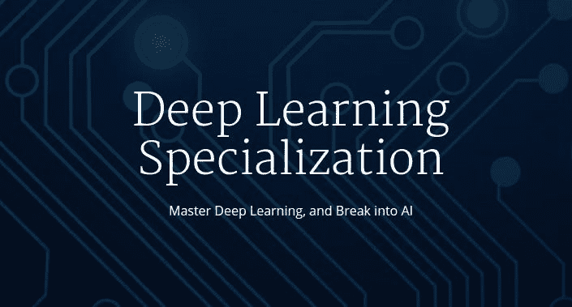
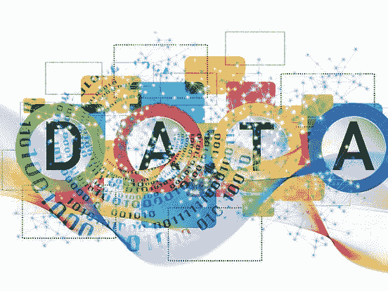

# 点评— Coursera 还是 Udemy？2023 年程序员和 IT 专业哪个好？

> 原文：<https://medium.com/javarevisited/coursera-or-udemy-which-one-is-better-for-programmers-and-it-professionals-ad4c89625fc2?source=collection_archive---------0----------------------->

## 我对 Udemy 和 Coursera 的评论是从程序员和软件工程师的角度学习热门技术技能。

谈到在线学习，没有比今天更好的时机了，因为你可以访问许多平台，如 Coursera、Udemy、Pluralsight、Educative、LinkedIn Learning、CodeCademy 等等。

其中， **Coursera** 和 **Udemy** 可能是最受欢迎的，因为越来越多的人开始使用它们。一个一直萦绕在我心头的问题是*的 Coursera vs. Udemy？*

哪家比较适合在线学习，哪家的课程一般比较好？之前我已经回答过类似于[**plural sight vs . CodeCademy**](/javarevisited/pluralsight-or-udemy-d9a94d2e8ee)和[**Udemy vs . CodeCademy**](https://javarevisited.blogspot.com/2019/09/codecademy-vs-udemy-vs-onemonth-which-is-better-for-learning-code.html)的问题，但从未解释过 Udemy vs Coursera，这是我的许多读者已经问了一段时间的问题。所以，我决定写这篇博文来阐述我的观点。

老实说，这是一个开放式的问题，没有具体的答案，因为这两个平台都很棒，为在线学习者提供了一些最美丽的资源。

尽管如此，我还是会根据他们独特的特点和他们为程序员和开发人员提供的最佳课程来回答这个问题。

</javarevisited/10-best-coursera-certifications-and-courses-for-beginners-b13e930f2830>  

# 2023 年 Coursera vs Udemy 回顾？程序员哪个好？

在 Udemy 和 Coursera 之间，如果你知道的话，Udemy 是一个在线课程市场，个人，通常是专家，创建他们的课程并上传到 Udemy。伟大的课程往往会上升到顶端，获得更多的曝光，而一些更好的课程也因为缺乏曝光而死亡。除了最少 30 分钟的内容外，Udemy 没有特别的结构。

Udemy 也有免费的<https://click.linksynergy.com/deeplink?id=JVFxdTr9V80&mid=39197&murl=https%3A%2F%2Fwww.udemy.com%2Fcourses%2Ffree%2F>**和 [**付费的**课程](https://click.linksynergy.com/fs-bin/click?id=JVFxdTr9V80&offerid=323058.9410&type=3&subid=0)，其中免费课程是出于营销目的，当讲师达到其营销目标时，它会将免费课程转换为付费课程。**

**这其实是一个很好的策略，对学生和导师都有好处。学生可以免费学习这门课程，而教师可以得到他们的评论和社会证明。一些但不是所有的 Udemy 课程还提供结业证书，你可以在简历中展示或者添加到你的 LinkedIn 个人资料中。

Udemy 最赞的是它的 [**闪购**](https://click.linksynergy.com/fs-bin/click?id=JVFxdTr9V80&offerid=323058.9410&type=3&subid=0) ，每个月都有。如果你幸运的话，你可以得到一些价值 200 美元的 bootcamp 风格的课程，像柯尔特钢铁公司的 Web 开发者 Bootcamp 和 T21 的 iOS 开发者 Bootcamp，这太棒了。**

**这些课程的价值远远超过 10 美元，以如此低的价格获得这些课程让它变得非常非常实惠。**

**<https://click.linksynergy.com/fs-bin/click?id=JVFxdTr9V80&subid=0&offerid=323058.1&type=10&tmpid=14538&RD_PARM1=https%3A%2F%2Fwww.udemy.com%2Fthe-web-developer-bootcamp%2F>  <https://click.linksynergy.com/deeplink?id=JVFxdTr9V80&mid=39197&murl=https%3A%2F%2Fwww.udemy.com%2Fcourse%2Fios-13-app-development-bootcamp%2F>  

另一方面， [**Coursera**](https://coursera.pxf.io/c/3294490/1164545/14726?u=https%3A%2F%2Fwww.coursera.org%2F) 提供来自一流大学的**课程**比如斯坦福大学、香港大学的吴恩达的机器学习，以及像 IBM、[谷歌](https://javarevisited.blogspot.com/2019/07/top-5-google-cloud-platform-gcp-courses-certifications-online.html)、[微软 Azure](https://javarevisited.blogspot.com/2019/07/top-5-courses-to-crack-azure-architecture-technologies-certification-az-300-exam.html) 、 [AWS](https://javarevisited.blogspot.com/2019/05/top-5-courses-to-crack-aws-solutions-architect-associate-certification-exam-SAA-C01.html#axzz5rHwAwycj) 等大型科技机构。

课程也有 [**专业认证**](https://coursera.pxf.io/c/3294490/1164545/14726?u=https%3A%2F%2Fwww.coursera.org%2Fprofessional-certificates) 和 [**专业化**](https://coursera.pxf.io/c/3294490/1164545/14726?u=https%3A%2F%2Fwww.coursera.org%2Fspecializations%2Fblockchain) ，无非就是一捆相关的课程来制定一个特定的策略。虽然课程是免费审核的，但你需要付费才能获得 Coursera 的证书。

证书可以通过注册 [**专业**](https://javarevisited.blogspot.com/2020/08/top-10-coursera-courses-specilizations-and-certifications.html) 来获得，花费大约`39$ per month`左右，对于大多数希望在线学习的人来说也是非常实惠的。

它拥有一些世界上最好的机器学习专业，如 deeplearning.ai 提供的 [**深度学习专业**](https://coursera.pxf.io/c/3294490/1164545/14726?u=https%3A%2F%2Fwww.coursera.org%2Fspecializations%2Fdeep-learning) ，该专业由 Coursera 创始人之一、机器学习先驱吴恩达指导。

如果你想进入机器学习和数据科学的世界，没有比 Coursera 更好的地方了。超过 50 万人选择了这个专业。

Coursera 的另一个好处是，他们拥有专业证书，这有利于在 IT、云计算和其他高科技领域开始职业生涯。

你可以在 2023 年加入的一些著名的专业认证是由谷歌和脸书提供的，如下所示:

1.  [**Google IT 自动化与 Python by Google**](https://coursera.pxf.io/c/3294490/1164545/14726?u=https%3A%2F%2Fwww.coursera.org%2Fprofessional-certificates%2Fgoogle-it-automation)

<https://coursera.pxf.io/c/3294490/1164545/14726?u=https%3A%2F%2Fwww.coursera.org%2Fprofessional-certificates%2Fgoogle-it-automation>  

**2。** [**谷歌数据分析专业证书**](https://coursera.pxf.io/c/3294490/1164545/14726?u=https%3A%2F%2Fwww.coursera.org%2Fprofessional-certificates%2Fgoogle-data-analytics)

<https://coursera.pxf.io/c/3294490/1164545/14726?u=https%3A%2F%2Fwww.coursera.org%2Fprofessional-certificates%2Fgoogle-data-analytics>  

**3。** [**脸书脸书社交媒体营销**](https://coursera.pxf.io/c/3294490/1164545/14726?u=https%3A%2F%2Fwww.coursera.org%2Fprofessional-certificates%2Ffacebook-social-media-marketing)

<https://coursera.pxf.io/c/3294490/1164545/14726?u=https%3A%2F%2Fwww.coursera.org%2Fprofessional-certificates%2Ffacebook-social-media-marketing>  

**4。** [**谷歌 IT 由谷歌支持**](https://coursera.pxf.io/c/3294490/1164545/14726?u=https%3A%2F%2Fwww.coursera.org%2Fprofessional-certificates%2Fgoogle-it-support)

<https://coursera.pxf.io/c/3294490/1164545/14726?u=https%3A%2F%2Fwww.coursera.org%2Fprofessional-certificates%2Fgoogle-it-support>  

**5。** [**IBM 数据科学由 IBM**](https://coursera.pxf.io/c/3294490/1164545/14726?u=https%3A%2F%2Fwww.coursera.org%2Fprofessional-certificates%2Fibm-data-science)

<https://coursera.pxf.io/c/3294490/1164545/14726?u=https%3A%2F%2Fwww.coursera.org%2Fprofessional-certificates%2Fibm-data-science>  

**6。** [**云工程用谷歌云从谷歌云**](https://coursera.pxf.io/c/3294490/1164545/14726?u=https%3A%2F%2Fwww.coursera.org%2Fprofessional-certificates%2Fcloud-engineering-gcp)

<https://coursera.pxf.io/c/3294490/1164545/14726?u=https%3A%2F%2Fwww.coursera.org%2Fprofessional-certificates%2Fcloud-engineering-gcp>  

Coursera 还提供像 [**Coursera Plus**](https://coursera.pxf.io/c/3294490/1164545/14726?u=https%3A%2F%2Fwww.coursera.org%2Fcourseraplus) 这样的东西，让你在一次订阅中就可以获得 3000 多门最好的 Coursera 课程和专业。这一年大约花费 300 美元，但是完全值得你的时间和金钱。

<https://coursera.pxf.io/c/3294490/1164545/14726?u=https%3A%2F%2Fwww.coursera.org%2Fcourseraplus>  

Coursera 也有在线学位，他们最近推出了指导性项目，可以用来快速学习新技能。例如，你可以参加这个 [**Python 数据结构项目**](https://coursera.pxf.io/c/3294490/1164545/14726?u=https%3A%2F%2Fwww.coursera.org%2Fprojects%2Fpython-data-structures) ，你可以在 2 小时内学会像字典这样的基本数据结构。

关于 [**引导项目**](https://coursera.pxf.io/c/3294490/1164545/14726?u=https%3A%2F%2Fwww.coursera.org%2Fcourses%3Fquery%3Dguided%2520projects) 最好的事情是你不需要下载或者设置任何东西。你的工作空间是一个云桌面，就在你的浏览器中，你的讲师将在分屏视频中向你解释该做什么。这可能是继课堂和个人培训之后的第二好选择。

另一方面， **Coursera 不像 Udemy** 那样经营 flash 销售，也不像 [Udemy](/javarevisited/my-favorite-udemy-online-courses-for-programmers-and-software-engineers-f9d941dd0035) 那样有超过 80，000 门课程可以学习几乎任何东西，但就质量而言 [Coursera 的大多数课程](/javarevisited/18-coursera-courses-you-can-join-in-2020-to-learn-from-the-worlds-top-tech-companies-google-74af46967d1e?source=social.linkedin)都非常好。

你不能对 Udemy 说些什么，因为任何人都可以在那里创建课程，而且大多数课程都没有合适的结构，但是如果你比较一下[顶级质量的 Udemy 课程](https://javarevisited.blogspot.com/2019/08/top-10-udemy-courses-and-certifications-for-programmers.html)和[顶级 Coursera 专业化](https://javarevisited.blogspot.com/2020/02/10-best-coursera-courses--for-python.html)，它们是完美的。他们不仅结构良好，而且授课风格也不拘泥于学术，而是带有一种非正式的个人风格。这就像在线课程的 YouTube，你可以搜索和学习任何你想学的东西。

你也有很多选择。如果你没有联系到老师，你也可以选择一个；Coursera 没有那么多选择。

## 结论

所以，你看，[**Coursera**](https://coursera.pxf.io/c/3294490/1164545/14726?u=https%3A%2F%2Fwww.coursera.org%2F)**和 [**Udemy**](https://click.linksynergy.com/fs-bin/click?id=JVFxdTr9V80&offerid=323058.9410&type=3&subid=0) 都有强弱之分。虽然 Udemy 的课程更多，但 Coursera 的课程往往结构良好，尤其是机器学习的课程。**

**Coursera 还允许你向世界顶级大学学习，他们的证书通常更有价值，因为它们是由顶级大学和 Coursera 一起提供的。

说到学习，如果你更喜欢个人，**不拘一格的风格**，那么我建议你去 **Udemy** ，但是如果你要找的是**结构严谨且学术，**喜欢的课程，那么[**Coursera**](https://coursera.pxf.io/c/3294490/1164545/14726?u=https%3A%2F%2Fwww.coursera.org%2F)**是更好的选择。

还是那句话，这些只是观察，不同的课程和导师会有很大的不同，所以预习一下你想加入的课程总是好的。如果你能在没有太多转发和打断的情况下完成预习，那么这是一门优质课程的良好指标。****

> ****如果你正在寻找 Udemy 和 Coursera 的替代品，那么你也可以看看像 [Pluralsight](https://pluralsight.pxf.io/c/1193463/424552/7490?u=https%3A%2F%2Fwww.pluralsight.com%2Flearn) 、 [Educative](https://www.educative.io/subscription?affiliate_id=5073518643380224) 、 [LinkedIn Learning](http://linkedin-learning.pxf.io/c/1193463/449670/8005) 、 [CodeCademy](https://bit.ly/codecademyhome) 这样的网站，它们为程序员和开发人员提供了许多高质量的技术相关课程。****

****您可能希望探究的其他**编程文章******

*   ****[2023 年 Java 开发者路线图](https://javarevisited.blogspot.com/2019/10/the-java-developer-roadmap.html#123)****
*   ****[开始你 IT 职业生涯的五大 Coursera 证书](https://javarevisited.blogspot.com/2019/10/top-5-coursera-professional-certificates-for-programmers-IT-professionals.html)****
*   ****[2023 年 Java 和 Web 开发人员应该学会的 10 件事](http://javarevisited.blogspot.sg/2017/12/10-things-java-programmers-should-learn.html#axzz53ENLS1RB)****
*   ****[十大 Coursera 程序员专业认证](/javarevisited/top-10-coursera-certificates-to-start-your-career-in-cloud-data-science-ai-mainframe-and-it-558690c83587)****
*   ****[Udemy vs plural sight——学编码哪个好？](https://javarevisited.blogspot.com/2019/10/udemy-vs-pluralsight-review-which-is-better-to-learn-code.html)****
*   ****[2023 年 Java 开发者应该学习的 5 个框架](http://javarevisited.blogspot.sg/2018/04/top-5-java-frameworks-to-learn-in-2018_27.html)****
*   ****[成为更好的 Java 开发人员的 10 个技巧](https://javarevisited.blogspot.com/2018/05/10-tips-to-become-better-java-developer.html)****
*   ****[2023 年网络开发者路线图](https://hackernoon.com/the-2019-web-developer-roadmap-ab89ac3c380e)****
*   ****[如何破解 Spring 5.0 开发者认证](https://javarevisited.blogspot.com/2018/08/how-to-crack-spring-core-professional-certification-exam-java-latest.html)。****
*   ****[我最喜欢的学习网页开发的课程](/better-programming/my-5-favorite-courses-to-learn-web-development-in-2019-a5e74167f8b2)****
*   ****[如何通过 Java 认证？](https://medium.freecodecamp.org/how-to-pass-oracles-java-certifications-a-practical-guide-for-developers-e9b607ba6173)****
*   ****[学习数据结构和算法的 10 门课程](https://hackernoon.com/10-data-structure-algorithms-and-programming-courses-to-crack-any-coding-interview-e1c50b30b927)****
*   ****[你可以构建 8 个 Python 项目，成为 Python 程序员](/javarevisited/8-projects-you-can-buil-to-learn-python-in-2020-251dd5350d56)****
*   ****[2023 年每个 Java 程序员都应该读的 10 本书](http://www.java67.com/2018/02/10-books-java-developers-should-read-in.html)****
*   ****[Java 开发人员在日常工作中使用的 10 种工具](http://javarevisited.blogspot.sg/2017/03/10-tools-used-by-java-programming-Developers.html#axzz55lrMRnNC)****

****感谢您阅读本文。如果你喜欢这篇文章，那么请分享给你的朋友和同事。如果您有任何问题或反馈，请留言。****

******附言——**如果你在没有工程师或计算机科学学位的情况下开始进入 IT 世界，我建议你查看一些 Coursera 专业证书，以开始你的 IT 职业生涯，比如谷歌 IT 支持专业证书<https://coursera.pxf.io/c/3294490/1164545/14726?u=https%3A%2F%2Fwww.coursera.org%2Fprofessional-certificates%2Fgoogle-it-support>**，正是谷歌提供的。******

******<https://coursera.pxf.io/c/3294490/1164545/14726?u=https%3A%2F%2Fwww.coursera.org%2Fprofessional-certificates%2Fgoogle-it-support> ********