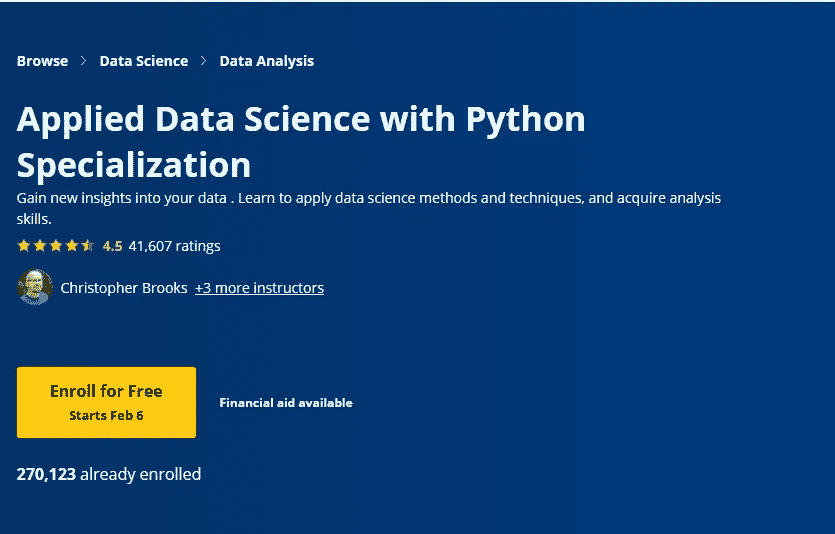

# Coursera 的应用数据科学与 Python 专门化复习？真的值得吗？

> 原文：<https://medium.com/javarevisited/courseras-applied-data-science-with-python-specialization-by-university-of-michigan-review-is-39d9c4f8e1cd?source=collection_archive---------0----------------------->

## 审查 Coursera 的应用数据科学与 Python 认证，找出它是否值得你

你好，如果你正在考虑加入 Coursera 的热门应用数据科学和 Python 专业化，但又在考虑这是否值得你花费时间和金钱，那么你来对地方了。在这篇文章中，我们将深入了解这个令人敬畏的课程，并找到更多关于它的信息。

之前我已经分享过 [**最佳数据科学 Coursera &认证**](/javarevisited/my-favorite-data-science-and-machine-learning-courses-from-coursera-udemy-and-pluralsight-eafc73acc73f) ，今天我就来回顾一下 Coursera 上最热门的数据科学专业之一。

如果你一直在网上学习，那么你可能知道 [Coursera](https://click.linksynergy.com/deeplink?id=JVFxdTr9V80&mid=40328&murl=https%3A%2F%2Fwww.coursera.org%2F) 是一个巨大的平台，提供许多不同行业的课程，从网络开发和物联网到商业和自我发展。

Coursera 课程和认证的最大好处是，所有这些课程都是由密歇根大学等主要大学和 IBM 等一些公司开设的，这意味着当你注册他们的一些课程时，你会得到很好的帮助。

该平台包含所谓的专业化，这是一个庞大的计划，包含某个行业的许多小课程，其中一些专业随着成千上万的注册人数和高评分而迅速传播，Python 专业化的 [**应用数据科学**](https://coursera.pxf.io/c/3294490/1164545/14726?u=https%3A%2F%2Fwww.coursera.org%2Fspecializations%2Fdata-science-python) **n** 就是其中之一。

在今天的文章中，您将探索什么是这个专业，在哪里学习它很重要，谁是这个庞大计划的导师，以及是否值得注册和支付这个数据科学专业。

而且，如果你正在寻找最好的 Udemy 在线课程来学习使用 Python 的数据科学，那么你也可以查看由 365 Careers 和他的团队**提供的 [**数据科学课程 2023:完整数据科学训练营**](https://click.linksynergy.com/deeplink?id=JVFxdTr9V80&mid=39197&murl=https%3A%2F%2Fwww.udemy.com%2Fcourse%2Fthe-data-science-course-complete-data-science-bootcamp%2F) 。他们在 Udemy 上有最好的数据科学在线课程。**

 [## 数据科学培训课程:数据科学家训练营

### 数据科学家是本世纪最适合蓬勃发展的职业之一。它是数字化的，面向编程的，并且…

udemy.com](https://click.linksynergy.com/deeplink?id=JVFxdTr9V80&mid=39197&murl=https%3A%2F%2Fwww.udemy.com%2Fcourse%2Fthe-data-science-course-complete-data-science-bootcamp%2F) 

# Coursera 的 Python 专精的应用数据科学值得吗？

现在，让我们来看看密歇根大学 Coursera 上的数据科学与 Python 专业化是否是学习数据科学与 Python 的正确课程。我们将回顾本课程的重要参数，如讲师、课程内容以及已经学习过本课程的其他人对本专业的看法。

## 1.导师的声誉

这门课有四位讲师，让我们从第一位开始，他叫克里斯托弗·布鲁克斯，是密歇根大学的助理教授，第二位是凯文·科林，也是密歇根大学的副教授。

 [## 凯文·柯林斯-汤普森，讲师| Coursera

### Kevyn Collins-Thompson 是麻省理工学院信息学院信息和计算机科学副教授。

coursera.pxf.io](https://coursera.pxf.io/c/3294490/1164545/14726?u=https%3A%2F%2Fwww.coursera.org%2Finstructor%2Fkevyn-ct) 

另外两位导师也是密歇根大学的助理教授 [**丹尼尔·罗梅罗**](https://coursera.pxf.io/c/3294490/1164545/14726?u=https%3A%2F%2Fwww.coursera.org%2Finstructor%2Fdaniel-r) 和他的研究在社会和信息网络相关的理论分析师和另一位 Vinod Vydiswaran 在自然语言处理和数据挖掘方面。

 [## 丹尼尔·罗梅罗，讲师| Coursera

### 丹尼尔·罗梅罗是密歇根大学信息学院的助理教授。他的主要研究…

coursera.pxf.io](https://coursera.pxf.io/c/3294490/1164545/14726?u=https%3A%2F%2Fwww.coursera.org%2Finstructor%2Fdaniel-r) 

## 2.专业化内容

该专业包含五门课程，重点是学习 python，然后使用这种编程语言以及一些机器学习算法应用数据科学技术。因此，让我们开始探索本课程为学习者提供了什么:

## 2.1.[Python 中的数据科学简介](https://coursera.pxf.io/c/3294490/1164545/14726?u=https%3A%2F%2Fwww.coursera.org%2Flearn%2Fpython-data-analysis)

由于本课程使用 python 应用数据科学，因此首先探索这种语言是有意义的，本课程主要是学习 [python 基础](https://javarevisited.blogspot.com/2020/02/10-best-coursera-courses--for-python.html)，如 lambda 函数读取文件和 CSV 数据操作，以及一些库，如用于数学计算的 NumPy 和用于导入 CSV 文件和读取数据的 pandas。

 [## Python 中的数据科学简介

### 本课程将向学习者介绍 python 编程环境的基础知识，包括基本的…

coursera.pxf.io](https://coursera.pxf.io/c/3294490/1164545/14726?u=https%3A%2F%2Fwww.coursera.org%2Flearn%2Fpython-data-analysis) 

## 2.2.[应用 Python 进行绘图、制图&数据表示](https://coursera.pxf.io/c/3294490/1164545/14726?u=https%3A%2F%2Fwww.coursera.org%2Flearn%2Fpython-plotting%3Fspecialization%3Ddata-science-python)

在学习了 python 的基础知识以及如何处理数据之后，是时候开始制作一些[可视化](/javarevisited/7-best-online-courses-to-learn-d3-js-for-data-visualization-in-2020-1a8c79add4e4?source=---------16------------------)并从您的数据中获取洞察力了，本课程的内容是，您将使用 matplotlib 和 seaborn 等库来制作绘图和图表，以及一些关于何时使用不同类型的可视化图形等的术语。

 [## Python 中的应用绘图、图表和数据表示

### 本课程将向学习者介绍信息可视化的基础知识，重点是报告和图表…

coursera.pxf.io](https://coursera.pxf.io/c/3294490/1164545/14726?u=https%3A%2F%2Fwww.coursera.org%2Flearn%2Fpython-plotting%3Fspecialization%3Ddata-science-python) 

## 2.3.[在 Python 中应用机器学习](https://coursera.pxf.io/c/3294490/1164545/14726?u=https%3A%2F%2Fwww.coursera.org%2Flearn%2Fpython-machine-learning%3Fspecialization%3Ddata-science-python)

本课程是关于机器学习，特别是使用 Scikit-Learn 库的监督学习技术。您将使用 Scikit-Learn 库和分类模型从这项技术的基础开始，然后转向监督学习和一些术语，如[逻辑回归](https://www.java67.com/2020/07/top-5-machine-learning-algorithms-for-beginners.html)和支持向量机，以及评估您的 ML 模型等等。

 [## Python 中的应用机器学习

### 这门课程将向学习者介绍应用机器学习，更多地侧重于技术和方法，而不是…

coursera.pxf.io](https://coursera.pxf.io/c/3294490/1164545/14726?u=https%3A%2F%2Fwww.coursera.org%2Flearn%2Fpython-machine-learning%3Fspecialization%3Ddata-science-python) 

## 2.4.[在 Python 中应用文本挖掘](https://coursera.pxf.io/c/3294490/1164545/14726?u=https%3A%2F%2Fwww.coursera.org%2Flearn%2Fpython-text-mining%3Fspecialization%3Ddata-science-python)

这门课程是为那些想知道像 Siri 或谷歌助手这样的机器如何理解人类语言并以适当的答案回复它们的人开设的。

您将学习文本挖掘和自然语言处理的基础知识，并为此目的利用 NLTK 库以及文本分类和主题建模。

 [## Python 中的应用文本挖掘

### 本课程将向学习者介绍文本挖掘和文本操作的基础知识。本课程以一个…

coursera.pxf.io](https://coursera.pxf.io/c/3294490/1164545/14726?u=https%3A%2F%2Fwww.coursera.org%2Flearn%2Fpython-text-mining%3Fspecialization%3Ddata-science-python) 

## 2.5.[Python 中的应用社交网络分析](https://coursera.pxf.io/c/3294490/1164545/14726?u=https%3A%2F%2Fwww.coursera.org%2Flearn%2Fpython-social-network-analysis%3Fspecialization%3Ddata-science-python)

本课程将介绍如何使用 NetworkX 库学习社会网络分析。您将从学习不同类型的网络开始，然后根据许多因素(如距离和可达性)分析它们的连通性，并深入研究测量某个网络中某个节点的重要性和网络演变。

 [## Python 中的应用社会网络分析

### 本课程将通过使用 NetworkX 库的教程向学习者介绍网络分析。课程…

coursera.pxf.io](https://coursera.pxf.io/c/3294490/1164545/14726?u=https%3A%2F%2Fwww.coursera.org%2Flearn%2Fpython-social-network-analysis%3Fspecialization%3Ddata-science-python) 

## 3.人物评论

该课程已有超过 20 万人注册，评分为 4.5 分(满分为 5 分)，这被认为是一个很高的评分，该课程有很棒的视频制作以及许多测验，以测试您在整个专业化过程中的知识，使用的语言是 python，这对从未编写过代码的人来说非常友好。

如果你在 Reddit 或 Quora 这样的评论网站上做更多的研究，你会发现大多数人都推荐参加这个专业，而不是互联网上的其他课程，因为它是作为初学者开始的，目的是提高数据科学的水平。

这里是加入本课程的链接— [**应用数据科学与 Python 专业化**](https://coursera.pxf.io/c/3294490/1164545/14726?u=https%3A%2F%2Fwww.coursera.org%2Fspecializations%2Fdata-science-python)

顺便说一下，当谈到参加这个课程时，你有两个选择，你可以单独参加这个课程，每个月花费大约 39 美元进行专业化，你也可以参加 [**Coursera Plu**](https://coursera.pxf.io/c/3294490/1164545/14726?u=https%3A%2F%2Fwww.coursera.org%2Fcourseraplus) s，每年花费 399 美元，这是 Coursera 的一个订阅计划，让你无限制地访问他们最受欢迎的课程、专业化、专业证书和指导项目。

 [## Coursera Plus |无限制访问 7，000 多门在线课程

### 用 Coursera Plus 投资你的职业目标。无限制访问 90%以上的课程、项目…

coursera.pxf.io](https://coursera.pxf.io/c/3294490/1164545/14726?u=https%3A%2F%2Fwww.coursera.org%2Fcourseraplus) 

这就是 Coursera 上关于**应用数据科学和 Python 专门化的全部内容。总的来说，这是学习数据科学并成为数据科学家的一个很好的在线课程和专业。**

考虑到这个程序涵盖的细节和它提供的用 python 来教你应用数据科学的结构，它是完全值得的。它结构良好，内容全面，与时俱进，而且非常实用。

如今，数据科学非常普及，谷歌网飞等大多数知名公司都在利用这项技术来分析用户的行为和兴趣，以便为客户提供最令人兴奋的体验，并更多地了解市场。

你可能喜欢的其他 **Coursera 和编程文章**

*   [2023 年程序员 10 大课程课程](https://javarevisited.blogspot.com/2020/08/top-10-coursera-courses-specilizations-and-certifications.html)
*   [面向程序员和开发人员的 Coursera 十大项目](https://javarevisited.blogspot.com/2020/08/top-10-coursera-projects-to-learn-essential-programming-skills.html)
*   [开始职业生涯的十大 Coursera 认证](/javarevisited/top-10-coursera-certificates-to-start-your-career-in-cloud-data-science-ai-mainframe-and-it-558690c83587)
*   [2023 年学习人工智能的 7 门最佳课程](/javarevisited/7-best-courses-to-learn-artificial-intelligence-in-2020-26d59d62f6fe)
*   [Udemy vs 复数视线？哪个学习平台比较好？](https://javarevisited.blogspot.com/2019/10/udemy-vs-pluralsight-review-which-is-better-to-learn-code.html)
*   [学习云计算的 10 门最佳 Coursera 课程](https://javarevisited.blogspot.com/2020/08/top-10-coursera-certifications-to-learn-cloud-computing-aws.html#axzz6WK1yC5WW)
*   [Coursera Plus Review——在 Coursera 上学习的更好方式](https://javarevisited.blogspot.com/2020/08/coursera-plus-better-way-to-take-coursera-courses-specilizations-certification.html)
*   [学习 Web 开发的十大 Coursera 课程](https://javarevisited.blogspot.com/2020/08/top-10-coursera-certifications-to-learn-web-development.html)
*   [学习数据科学的十大 Coursera 课程](https://javarevisited.blogspot.com/2020/08/top-10-coursera-certifications-to-learn-Data-Science-Visualization-and-Data-Analysis.html)
*   [向谷歌和 IBM 学习的 18 门 Coursera 课程](/javarevisited/18-coursera-courses-you-can-join-in-2020-to-learn-from-the-worlds-top-tech-companies-google-74af46967d1e?source=collection_home---4------0-----------------------)
*   [Youtube 上的最佳 Coursera 认证](https://www.youtube.com/watch?v=6NKULJuitcU)
*   [你可以在 Coursera 上在线申请的前 5 个计算机科学学位](https://javarevisited.blogspot.com/2020/04/is-it-possible-to-get-master-of-computer-science-degree-online-coursera.html)
*   [Udemy vs Coursera？学理工和编程哪个好](https://javarevisited.blogspot.com/2020/01/coursera-vs-udemy-which-is-better-for-programming-tech.html)
*   [Coursera 证书对工作和事业有帮助吗](https://javarevisited.blogspot.com/2020/02/does-udemy-coursera-edx-educative-or.html)？
*   [Udemy vs CodeCademy vs one month？](https://javarevisited.blogspot.com/2019/09/codecademy-vs-udemy-vs-onemonth-which-is-better-for-learning-code.html#axzz6VYKcmyZz)
*   Udemy vs Educative vs Codecademy？新手用哪个好
*   学习 Python 的 10 个 Coursera 专业化认证
*   [5 个最佳 Coursera 程序员职业证书](https://javarevisited.blogspot.com/2019/10/top-5-coursera-professional-certificates-for-programmers-IT-professionals.html)
*   [2023 年学习 Python 可以做的 8 个项目](/javarevisited/8-projects-you-can-buil-to-learn-python-in-2020-251dd5350d56)
*   [你可以在 Coursera Online 上获得 5 个数据科学学位](https://www.java67.com/2020/06/top-5-data-science-degree-you-can-earn-online-coursera-edx.html)
*   【Coursera 的 10 项数据科学和机器学习认证

感谢阅读这篇文章。如果你喜欢这篇关于 Coursera 应用数据科学与 Python 专业化的评论，那么请与你的朋友和同事分享。如果您有任何问题或反馈，请留言。

**P. S.** —如果你正在寻找最好的 Udemy 在线课程来学习使用 Python 的数据科学，那么你也可以查看[**2023 年数据科学课程:365 Careers 及其团队**的完整数据科学训练营**。他们在 Udemy 上有最好的数据科学在线课程。**](https://click.linksynergy.com/deeplink?id=JVFxdTr9V80&mid=39197&murl=https%3A%2F%2Fwww.udemy.com%2Fcourse%2Fthe-data-science-course-complete-data-science-bootcamp%2F)

 [## 数据科学培训课程:数据科学家训练营

### 数据科学家是本世纪最适合蓬勃发展的职业之一。它是数字化的，面向编程的，并且…

udemy.com](https://click.linksynergy.com/deeplink?id=JVFxdTr9V80&mid=39197&murl=https%3A%2F%2Fwww.udemy.com%2Fcourse%2Fthe-data-science-course-complete-data-science-bootcamp%2F)