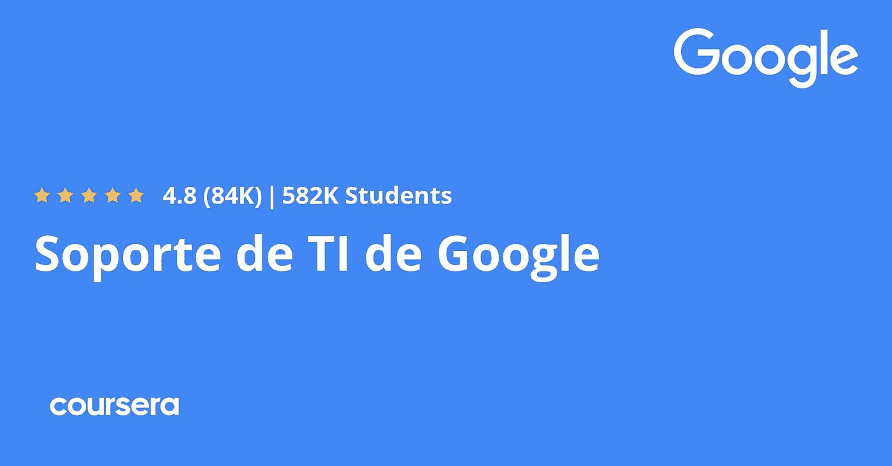
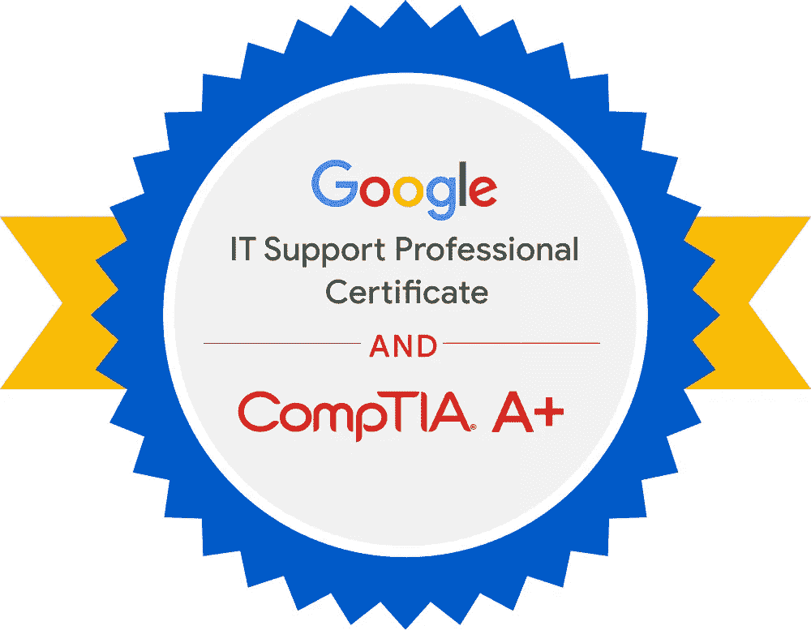
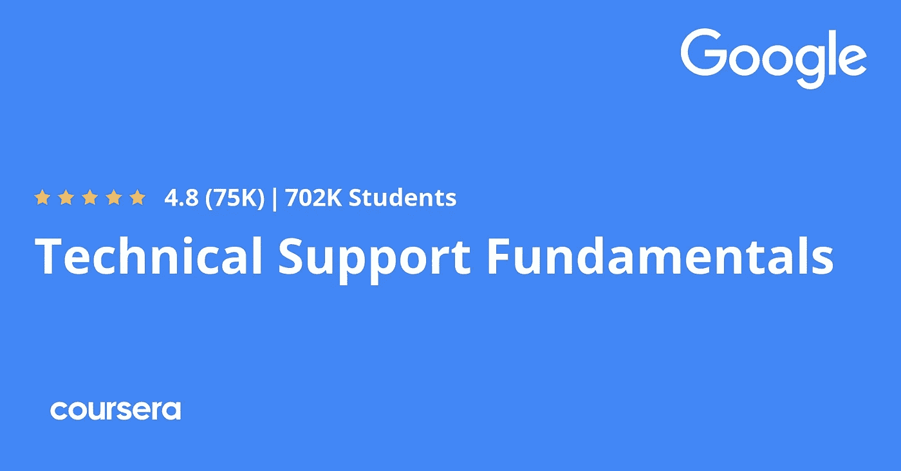
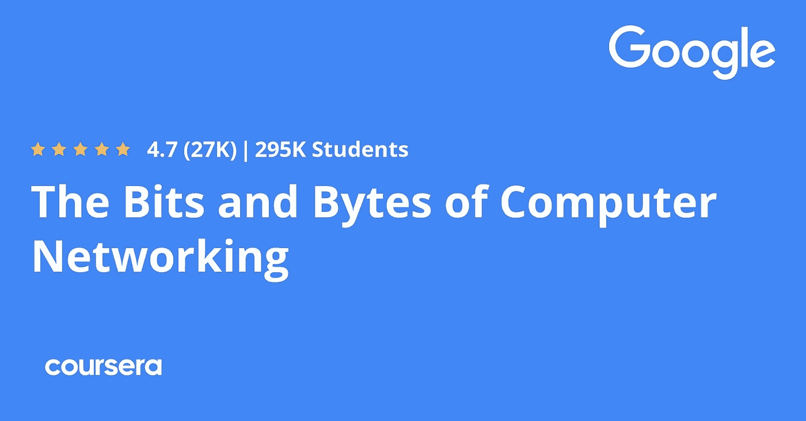
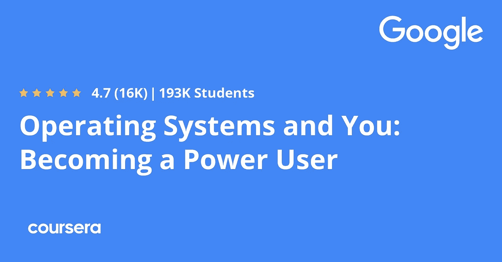
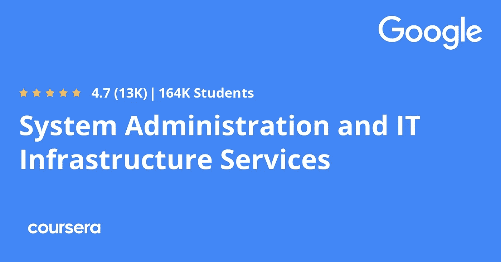
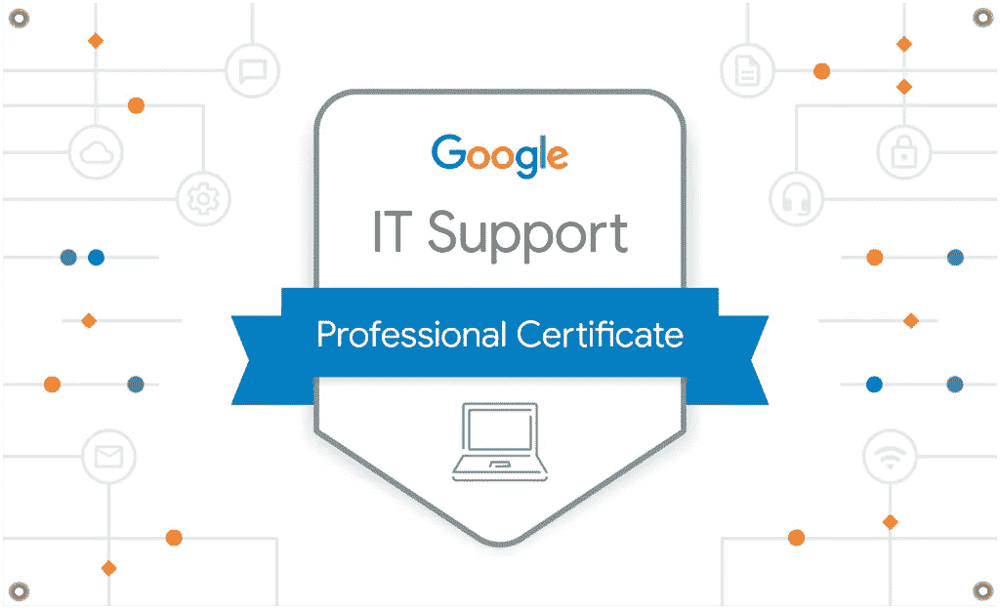

# 回顾— Coursera 的 2023 年 Google IT Support 专业认证，该不该考？

> 原文：<https://medium.com/javarevisited/courseras-google-it-support-professional-certification-review-fef6892497c2?source=collection_archive---------1----------------------->

## 想从 IT 支持开始你的职业生涯，请加入 Coursera 上 Google 的这个很棒的 IT 认证项目，如果你有疑问，请阅读这篇评论。

你好，伙计们，如果你正在寻找一个有成本效益的和公认的 IT 培训计划来开始你的职业生涯，那么你来对地方了。在本文中，我们将回顾 Coursera 的 [**谷歌 IT 支持专业证书**](https://coursera.pxf.io/c/3294490/1164545/14726?u=https%3A%2F%2Fwww.coursera.org%2Fprofessional-certificates%2Fgoogle-it-support) ，它可以用来启动您的 IT 支持职业生涯。

如果你正试图进入 IT 行业的初级阶段，可能是因为你需要成为一名程序员、网络开发人员，甚至是思科认证人员，所以你必须学习信息技术的基础知识，或者可能只是为了好玩，学习事物的运作方式，并更多地了解这个令人惊叹的行业。

在互联网上，许多大师已经创建了他们的在线课程来教你 IT 基础知识，但如果我告诉你，你可以参加一个由谷歌创建并由一个大平台提供的课程，名为 [**Coursera**](https://coursera.pxf.io/c/3294490/1164545/14726?u=https%3A%2F%2Fwww.coursera.org%2Fcourseraplus) 和这个名为 [*谷歌 IT 支持专业证书*](https://coursera.pxf.io/c/3294490/1164545/14726?u=https%3A%2F%2Fwww.coursera.org%2Fprofessional-certificates%2Fgoogle-it-support) 的计划，以学习 IT 行业，内容对初学者友好。

在今天的文章中，你将探索这个证书是怎么回事，他们教你什么，以及是否值得你花时间参加这个课程，并支付获得证书，等等。我还从 Coursera 了解到，他们已经将印度学习者的这一热门认证的价格降至每月 15 美元。这意味着谷歌 IT 认证现在只需每月 15 美元或约 1100 印度卢比，低于每月 49 美元或约 3600 印度卢比。

这些 [**谷歌专业证书项目**](https://coursera.pxf.io/c/3294490/1164545/14726?u=https%3A%2F%2Fwww.coursera.org%2Fprofessional-certificates%2Fgoogle-it-support) 提供世界级的培训，帮助个人学习所需的工作技能，这些技能可以启动或推进他们在 IT 领域的职业生涯，如果你在印度，不要错过以较低的价格获得一些所需技能的机会。

<https://coursera.pxf.io/c/3294490/1164545/14726?u=https%3A%2F%2Fwww.coursera.org%2Fprofessional-certificates%2Fgoogle-it-support>  

# 2023 年该不该加入 Coursera 上的 Google IT 支持专业证书？这值得吗？

让我们深入探究 Coursera 上这个最受欢迎的[谷歌认证，看看你是否可以加入这个项目，开始你的 IT 支持职业生涯。](https://javarevisited.blogspot.com/2019/10/top-5-coursera-professional-certificates-for-programmers-IT-professionals.html)

## 1.这是谷歌上的

这项专业认证由一个名为“与谷歌一起成长”的团队提供，该团队被认为是 2017 年与许多组织和其他公司约 7000 名合作伙伴合作推出的一项举措，旨在为全球所有人提供在线课程。

与谷歌一起成长仅在 Coursera (被称为谷歌职业认证)上就创建了大约 14 门课程，他们的课程在 IT、 [**云计算**](https://coursera.pxf.io/c/3294490/1164545/14726?u=https%3A%2F%2Fwww.coursera.org%2Fprofessional-certificates%2Fcloud-engineering-gcp) 、以及 [**安全**](https://coursera.pxf.io/c/3294490/1164545/14726?u=https%3A%2F%2Fwww.coursera.org%2Fprofessional-certificates%2Fgoogle-cloud-security) 和编程(如[**【Python**](https://coursera.pxf.io/c/3294490/1164545/14726?u=https%3A%2F%2Fwww.coursera.org%2Fprofessional-certificates%2Fgoogle-it-automation)**上获得了超过 60 万的注册，并使这一举措成为世界上最成功的让在线学习变得可及的举措之一**

****

## **2.课程内容和结构**

**本课程认证包含 5 个小课程，旨在为您进入 IT 行业做准备，并教会您许多东西，如 Linux 和 windows 等操作系统以及网络、安全和文件系统等。因此，让我们看看您将在每门课程中学到什么:**

## **2.1.技术支持基础**

**第一门课程旨在教学生计算机如何在硬件和软件中工作，如操作系统和互联网，并理解计算机中的许多术语，如二进制系统如何工作，语言指令如何在计算机中读取等等，因此这门课程对你在下一门课程中的理解有很大影响。**

****这里是免费参加本课程的链接** — [技术支持基础知识](https://coursera.pxf.io/c/3294490/1164545/14726?u=https%3A%2F%2Fwww.coursera.org%2Flearn%2Ftechnical-support-fundamentals%3Fspecialization%3Dgoogle-it-support)**

****

## **2.2.计算机网络的点点滴滴**

**本课程旨在教授您 TCP/IP 等网络服务通信，以及互联网和协议(如 DNS、云计算和应用程序)的工作原理，让您了解一些用于网络故障排除的强大工具以及更多与网络相关的主题。**

****这里是免费加入本课程的链接** — [计算机网络的比特和字节](https://coursera.pxf.io/c/3294490/1164545/14726?u=https%3A%2F%2Fwww.coursera.org%2Flearn%2Fcomputer-networking%3Fspecialization%3Dgoogle-it-support)**

****

## **2.3.操作系统和你:成为超级用户**

**在学习了计算机硬件和软件以及网络的基础知识后，您将深入使用实际的操作系统，如 Linux 和 windows，并了解如何使用图形界面和命令提示符在它们的文件系统中导航，您还将学习管理用户组和权限等。**

****这里是免费参加本课程的链接** — [操作系统和你:成为超级用户](https://coursera.pxf.io/c/3294490/1164545/14726?u=https%3A%2F%2Fwww.coursera.org%2Flearn%2Fos-power-user%3Fspecialization%3Dgoogle-it-support)**

****

## **2.4.系统管理和 IT 基础设施服务**

**本课程将向您介绍云计算以及如何成为一名系统管理员，您将学习负责保持组织服务(如网飞和 Dropbox)正常运行的云基础架构，以及备份数据和恢复您的 IT 基础架构等许多主题。**

****这是免费参加本课程的链接** — [系统管理和 IT 基础设施服务](https://coursera.pxf.io/c/3294490/1164545/14726?u=https%3A%2F%2Fwww.coursera.org%2Flearn%2Fsystem-administration-it-infrastructure-services%3Fspecialization%3Dgoogle-it-support)**

****

## **2.5.IT 安全:防御数字黑魔法**

**之前的课程已经介绍了如何使用和维护云计算，但有一点非常重要，每个系统管理员都应该知道，那就是如何保护您的云。本课程主要是通过了解一些安全概念，如加密，然后学习使用工具来保护您的数据和身份验证等。**

****这里是加入这个令人敬畏的课程的链接**——[IT 安全:防御数字黑魔法](https://coursera.pxf.io/c/3294490/1164545/14726?u=https%3A%2F%2Fwww.coursera.org%2Flearn%2Fit-security)**

****

## **3.人民评论**

**最大的就业市场 indeed.com[对 182 名参加并完成该课程的人进行的一项研究表明，40%的人在完成该认证后找到了工作，93%的人推荐朋友或家人参加该课程，如果他们想在该行业开始新的职业生涯。](https://www.indeed.com/certifications/view/google-it-support-professional-certificate-6SYBL7NF#:~:text=41%25%20said%20earning%20their%20Google,Google%20IT%20support%20professional%20certificate)**

**本课程包含许多实验室来训练和测试您的技能，这使得整个课程值得参加，并花时间通过实践课程学习 IT 行业，尤其是如果您计划获得 CompTIA A+等更高的认证。

现在一切都在向数字化转变，比如将人工智能引入组织服务，或者使用聊天机器人来回答人们的问题，因此了解世界上 IT 领域的工作方式是一个不错的选择，我建议为了 IT 职业或教育目的而学习这门课程。**

****这里是加入这个热门专业证书的链接—** [谷歌 IT 支持专业证书](https://coursera.pxf.io/c/3294490/1164545/14726?u=https%3A%2F%2Fwww.coursera.org%2Fprofessional-certificates%2Fgoogle-it-support)**

****

**顺便说一句，如果你计划参加多个 Coursera 课程或专业，那么考虑参加 [**Coursera Plus**](https://coursera.pxf.io/c/3294490/1164545/14726?u=https%3A%2F%2Fwww.coursera.org%2Fcourseraplus) 订阅，它可以让你无限制地访问他们最受欢迎的课程、专业、专业证书和指导项目。它每年花费大约 399 美元，但它完全值得你的钱，因为你可以获得无限的证书。**

**<https://coursera.pxf.io/c/3294490/1164545/14726?u=https%3A%2F%2Fwww.coursera.org%2Fcourseraplus>  

你可能喜欢的其他 **Coursera 和编程文章**

*   [学习云计算的 10 门最佳 Coursera 课程](https://javarevisited.blogspot.com/2020/08/top-10-coursera-certifications-to-learn-cloud-computing-aws.html#axzz6WK1yC5WW)
*   [Coursera Plus Review——在 Coursera 上学习的更好方式](https://javarevisited.blogspot.com/2020/08/coursera-plus-better-way-to-take-coursera-courses-specilizations-certification.html)
*   [学习 Web 开发的十大 Coursera 课程](https://javarevisited.blogspot.com/2020/08/top-10-coursera-certifications-to-learn-web-development.html)
*   [2023 年程序员十大课程课程](https://javarevisited.blogspot.com/2020/08/top-10-coursera-courses-specilizations-and-certifications.html)
*   [Udemy vs Coursera？学理工和编程哪个好](https://javarevisited.blogspot.com/2020/01/coursera-vs-udemy-which-is-better-for-programming-tech.html)
*   Coursera 证书对工作和事业有帮助吗
*   [学习 Python 的 10 个 Coursera 专业和认证](https://javarevisited.blogspot.com/2020/02/10-best-coursera-courses--for-python.html)
*   [5 个最佳 Coursera 程序员职业证书](https://javarevisited.blogspot.com/2019/10/top-5-coursera-professional-certificates-for-programmers-IT-professionals.html)
*   [2023 年学习 Python 可以做的 8 个项目](/javarevisited/8-projects-you-can-buil-to-learn-python-in-2020-251dd5350d56)
*   [学习数据科学的十大 Coursera 课程](https://javarevisited.blogspot.com/2020/08/top-10-coursera-certifications-to-learn-Data-Science-Visualization-and-Data-Analysis.html)
*   [向谷歌和 IBM 等科技公司学习的 18 门 Coursera 课程](/javarevisited/18-coursera-courses-you-can-join-in-2020-to-learn-from-the-worlds-top-tech-companies-google-74af46967d1e?source=collection_home---4------0-----------------------)
*   [面向程序员和开发者的 Coursera 十大项目](https://javarevisited.blogspot.com/2020/08/top-10-coursera-projects-to-learn-essential-programming-skills.html)
*   你可以在 Coursera 上在线申请的前 5 个计算机科学学位
*   [开始职业生涯的十大 Coursera 认证](/javarevisited/top-10-coursera-certificates-to-start-your-career-in-cloud-data-science-ai-mainframe-and-it-558690c83587)
*   [2023 年学习人工智能的 7 门最佳课程](/javarevisited/7-best-courses-to-learn-artificial-intelligence-in-2020-26d59d62f6fe)
*   [Udemy vs 复数视线？哪个学习平台比较好？](https://javarevisited.blogspot.com/2019/10/udemy-vs-pluralsight-review-which-is-better-to-learn-code.html)
*   [Java 上的最佳 Coursera 认证访问了 Youtube 频道](https://www.youtube.com/watch?v=6NKULJuitcU)
*   [Udemy vs CocdeCademy vs one month？](https://javarevisited.blogspot.com/2019/09/codecademy-vs-udemy-vs-onemonth-which-is-better-for-learning-code.html#axzz6VYKcmyZz)
*   Udemy vs Educative vs Codecademy？新手用哪个比较好
*   [你可以在 Coursera Online 上获得 5 个数据科学学位](https://www.java67.com/2020/06/top-5-data-science-degree-you-can-earn-online-coursera-edx.html)
*   [Coursera 的 10 项数据科学和机器学习认证](/javarevisited/top-10-machine-learning-and-data-science-certifications-and-training-courses-for-beginners-and-a6308497b764)

感谢阅读这篇文章。如果你喜欢这个*谷歌 IT 支持专业证书审查*并发现这个信息有用，那么请与你的朋友和同事分享。如果您有任何问题或反馈，请留言。

如果你正在寻找 2023 年最好的 Udemy 课程，那么你也可以看看我列出的 [**程序员和软件开发人员最佳 Udemy 课程**](https://javarevisited.blogspot.com/2019/08/top-10-udemy-courses-and-certifications-for-programmers.html) 。包含了最好的 Udemy 课程，学习 Java、Python、Git，以及其他软件开发所需的必备技能。

</javarevisited/my-favorite-udemy-online-courses-for-programmers-and-software-engineers-f9d941dd0035> **