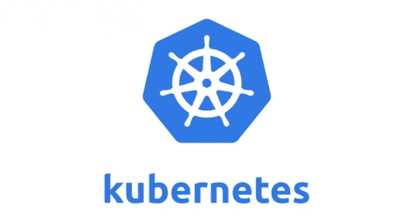

# 创建一个本地 Kubernetes 集群(K8s#3)

> 原文：<https://medium.com/javarevisited/create-a-local-kubernetes-cluster-k8s-3-a28f802c193b?source=collection_archive---------1----------------------->

## 如何启动并运行本地 Kubernetes 集群

大家好！通过这篇文章，我们将深入了解 Kubernetes 系列的。在之前的文章中，我已经与[分享了 Kubernetes](/javarevisited/a-brief-introduction-to-kubernetes-k8s-1-db12d38b9554) 的简要介绍，并向[展示了 Kubernetes](/javarevisited/docker-steps-for-kubernetes-k8s-2-a1ed00acdeba) 最常用的 Docker 部件。