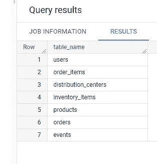
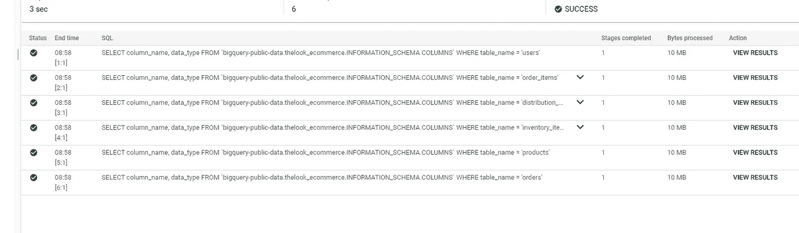
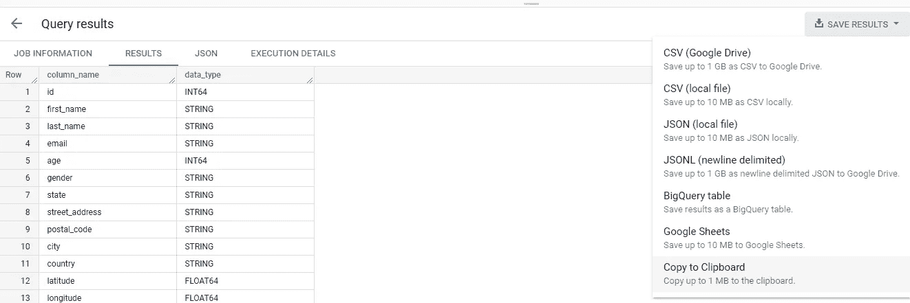
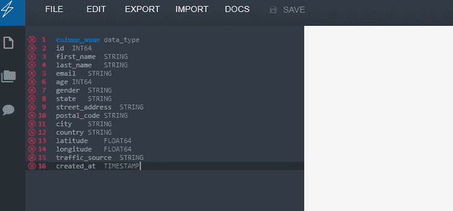
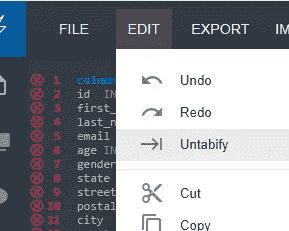
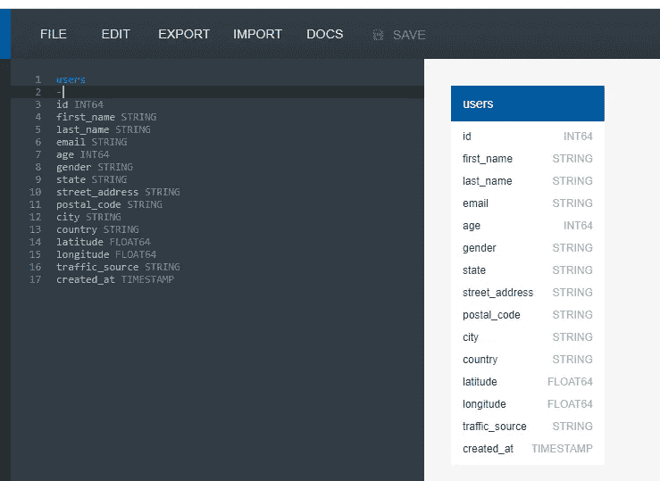
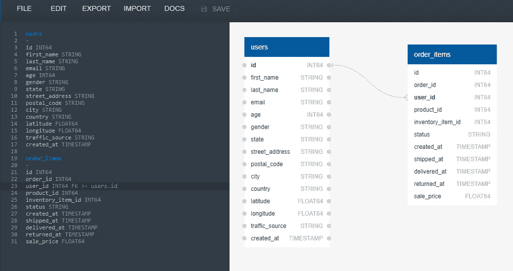
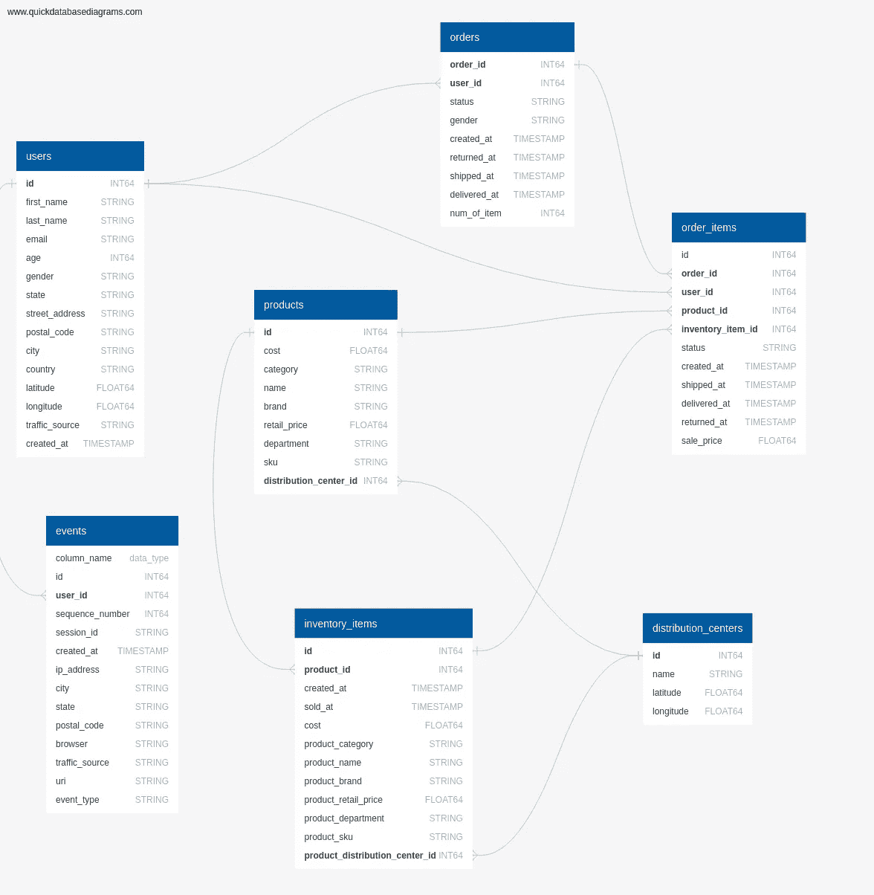

# 从大型查询数据集表创建 ERD(黑客)

> 原文：<https://medium.com/javarevisited/create-an-erd-from-big-query-dataset-tables-hack-24e4b6c10eea?source=collection_archive---------1----------------------->

对于许多人来说，通过图片和/或图表直观地学习很容易理解事物。

> 观察一个系统或数据库的架构图可以帮助我们快速定位我们在“大图”中的位置。

最近，我开始学习大查询，我查询的数据在云市场上是公开的。因为这是我不熟悉的数据库，所以我必须使用元数据来理解列、表和关系的名称。

我花了很长时间来编写查询，因为我不知道数据在哪里，而且由于无法看到全局，我无法发现如果我走不同的路径，我想要访问的内容是否会更容易访问。所以我决定生成一个 ERD(实体关系图)。

在与 GUI 斗争了大约 30 分钟，并在网上搜索如何从大型查询数据集生成 ERD 之后，我得出的结论是该功能还不被支持。我需要找到一种替代的方式来自己建造 ERD。

我想可能会使用 [DBeaver](https://dbeaver.io/) (SQL 客户端)，但是要这样做，我必须创建表，然后将它们提取为 ERD，或者使用它们的 GUI 从头开始手动创建 ERD。我的第二个想法是 [Umlet](https://www.umlet.com/) 这是一个伟大的工具，我用了很多次，但语法有点复杂。我不想打字时间太长。

正当我失去希望的时候，我遇到了[快手 DBD](https://www.quickdatabasediagrams.com/) 。我点击“试用应用”按钮，不到 60 秒，我就看到这可能是我完成这项任务的首选工具。绘制表和关系的语法非常简单，所以我回到 big query 来提取元数据，令我惊讶的是，我必须做的修改非常少。这是我一步一步做的。

**1-获取数据集中所有表的名称**

从我的数据集中获取所有表名的查询

所有表名

**2-每个表中每个列的列名和数据类型** 对于这一步，我设计了几个查询并一起执行。

列名和数据类型

包含列名和数据类型的所有 6 个查询的结果

**3-将结果复制到剪贴板，并将其导入 QuickDBD** 对于这一步，我只需 *Ctrl +单击侧面的每个“查看结果”链接上的*，然后在每个选项卡中，我将复制到剪贴板，关闭选项卡，然后我将带着数据转到 QDBD。

最后一个选项“复制到剪贴板”是我所需要的

有了这个表格的数据，我就可以转到 [QDBD](https://www.quickdatabasediagrams.com/) 并点击页面顶部的“试用应用”按钮。

将您带到演示应用程序的按钮

一旦在应用程序，我会粘贴在左边的编辑区的数据。

粘贴剪贴板会显示一些错误

要修复这些错误，只需很少的努力。需要做的是:

-删除第一行并键入表名
- untabify。

要解开，我需要去*编辑- >解开*

编辑->取消绑定

完成这两个步骤后，表格会显示在右侧。

注意，表名本身和列之间需要一点破折号。

**4-人际关系** 做好人际关系并不难。我只是使用了从外键到所需 Id 的拖动功能，但我也可以在旁边的编辑器上简单地键入它。

当鼠标悬停在一列上时，会出现可点击和拖动的灰色小圆圈，这使得将 FK 与 Id 联系起来变得很容易。

注意，如果我们喜欢手动输入，编辑器端的语法也非常简单。*用户标识 INT64 FK > -用户标识*

**5-导出为图像** 最后一步是将 ERD 导出为图像。保存选项是可用的，但需要注册。

将 ERD 导出为 PNG 图像

这是最后的结果

我希望你觉得这很有趣，如果是这样，请留下一些掌声，并跟随 Javing。最近我也有了一个 Youtube 频道。我需要做很多改进，实际上对视频进行编辑，因为音频和图像都不是很好，希望我会随着时间的推移而改善。这个视频解释了同样的事情，但不幸的是，由于屏幕亮度的问题，不可能看到数据库表。

关于亮度的问题，我真的很抱歉。我对 Youtube 有点生疏。