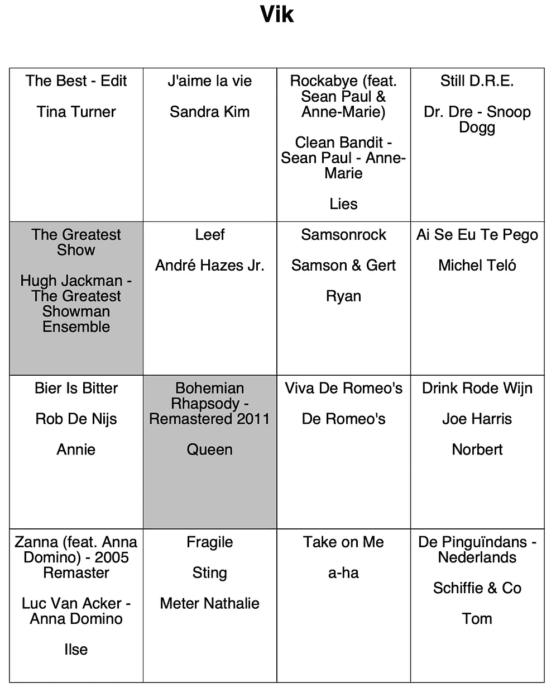
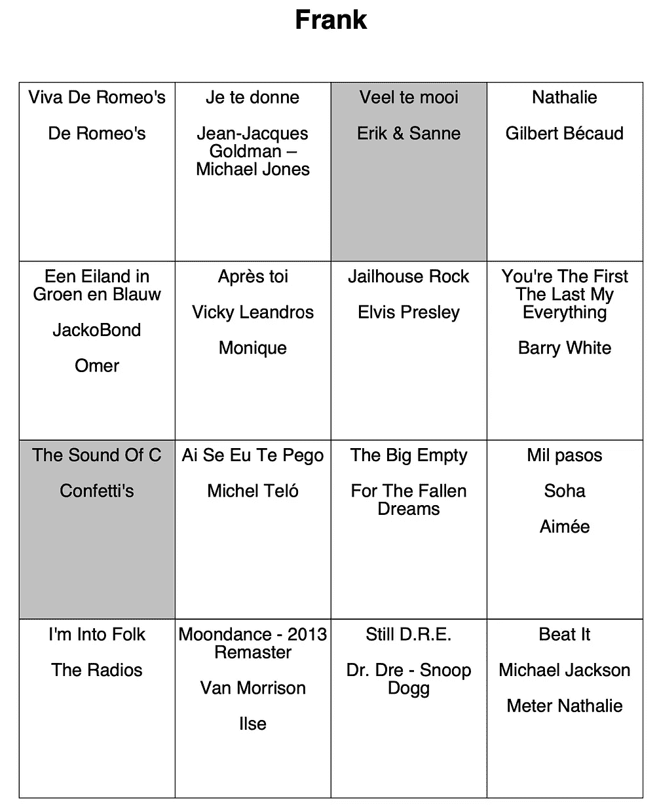
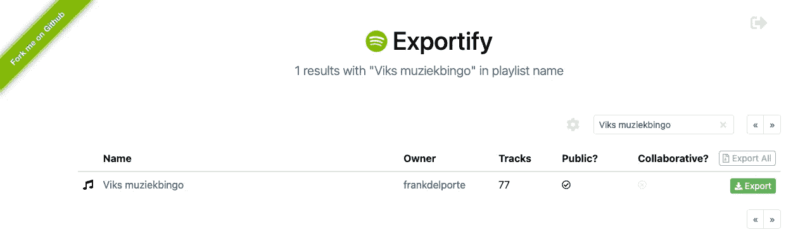

# 用 iText 创建音乐宾果卡

> 原文：<https://medium.com/javarevisited/create-music-bingo-cards-with-itext-37394e4453e4?source=collection_archive---------3----------------------->

自从我上次不得不在程序中创建文档已经有一段时间了，现在我已经“在我的雷达上”尝试了一段时间。这个周末我们举行了一次聚会，想组织一次音乐宾果游戏。为此，我们需要为每个人打印出一组随机选择的歌曲。一个小的 Java 项目似乎是最好的解决方案，否则，这将是一个无聊的、手工的、重复的任务。这不正是我们大部分发展的目标吗？**“把无聊的东西自动化！”**

# 关于 iText

iText 是一个用于在 Java 和。NET，最初由 Bruno Lowagie 编写。这个项目的历史和[由此发展而来的公司](https://itextpdf.com/en)，在《企业家》这本书中有描述。这本书解释了当你创办一家公司来产生进一步发展和维护你的技术所必需的资源时，你可以期待什么。

iText 可以在开源(AGPL)和商业许可下获得。由于布鲁诺是比利时人，而且该公司在比利时仍有一个坚实的基础，我不得不承认这里也涉及到一些爱国主义。

# 项目的目标

我们请我们的客人给我们他们最喜欢的两首歌。我们添加了一些额外的“派对歌曲”，最终在 Spotify 的播放列表中列出了 70 多首歌曲。每个播放器得到一个 16 首歌曲的打印输出，当然，这个值可以在代码中配置。

每份打印出来的文件都有玩家的名字，并包含玩家选择的歌曲。卡片上写满了其他随机的歌曲，所以每个玩家都有不同的卡片。

[](https://javarevisited.blogspot.com/2020/04/how-to-create-pdf-file-in-java-itext.html)[](https://www.java67.com/2018/04/10-tools-java-developers-should-learn.html)

宾果卡示例

游戏的第一个目标是有一条完整的水平线，在我们有了三个赢家之后，我们转而拥有一张完整的宾果卡。一些歌曲只播放了 10-15 秒，其他的需要更多的时间，因为有些舞蹈和歌唱需要参与。最后一部分，我想向我们的邻居道歉…

# 从 Spotify 导出

播放列表不能从 Spotify 本身导出。有一个“Spotify Web API”可以用于此(见[Spotify 开发者文档](https://developer.spotify.com/documentation/web-api/libraries/))。我在这里走了一条捷径，使用了 [Exportify](https://github.com/watsonbox/exportify) ，它实际上是建立在 API 之上的。它向您显示您所有的播放列表，并且只需点击一个按钮就可以将其导出到 [CSV](https://www.java67.com/2019/05/how-to-read-csv-file-in-java-using-jackson-library.html) 。

[](https://javarevisited.blogspot.com/2015/06/2-ways-to-parse-csv-files-in-java-example.html)

导出的文件包含很多信息，但我们只需要三列 Bingo 卡，所以在电子表格编辑器中打开文件，删除不需要的列，并添加一列带有选择歌曲的人的名字的列，这样您最终会得到:

*   歌曲名称
*   艺术家
*   选择歌曲的人的姓名(可以为空)

例如:

```
The Greatest Show,Hugh Jackman - The Greatest Showman Ensemble,Vik
Rode rozen in de sneeuw,Marva,Omer 
Macarena,Los Del Rio,
```

# 源代码

最后一个项目是一个非常简单的 Java Maven 程序。这些资源可以在 [Github](https://github.com/FDelporte/SpotifyBingoCardGenerator) 上找到。

# 数据模型

由于这个项目是基于 Java 17 的，我们可以对导入的歌曲使用[记录](https://www.java67.com/2021/08/how-to-use-record-in-java-example.html)

```
public record ImportedSong (String title, String artist, String selectedBy) {}
```

以及为每人生成的带有歌曲列表的宾果卡

```
import java.util.List;public record BingoCard(String forName, List<ImportedSong> songs) {}
```

# 读取 CSV 文件

使用文件阅读器从 CSV 文件中逐行读取歌曲列表

```
public static List<ImportedSong> loadFromFile(String fileName) {
   List<ImportedSong> list = new ArrayList<>();

   ClassLoader classLoader = SongLoader.class.getClassLoader();
   URL resource = classLoader.getResource(fileName);
   if (resource == null) {
      throw new IllegalArgumentException("File " + fileName 
         + " not found!");
   }

   try {
      File f = new File(resource.getFile());
      try (BufferedReader b = new BufferedReader(new FileReader(f,
         StandardCharsets.*UTF_8*))) {
         String line;
         while ((line = b.readLine()) != null) {
            var song = *processLine*(line);
            if (song != null) {
               list.add(song);
               *logger*.info("Added {}", song);
            }
         }
      }
   } catch (Exception ex) {
      *logger*.error("Error while importing song list: {}", 
         ex.getMessage());
   }
   return list;
}private static ImportedSong processLine(String data) {
   if (data == null || data.isEmpty()) {
      *logger*.warn("Data is empty");
      return null;
   }
   String[] csvLine = data.split(",");
   return new ImportedSong(csvLine[0], csvLine[1], 
      csvLine.length >= 3 ? csvLine[2] : "");
}
```

# 为每个用户随机生成一张卡片

这些卡片是由

*   获取玩家姓名列表(不同于 [CSV](https://www.java67.com/2019/05/how-to-read-csv-file-in-java-using-jackson-library.html) 第 3 列的值)
*   为每个人生成 16 首歌曲的列表
*   首先，人们选择的那些
*   添加一首不在列表中的歌曲，直到达到 16 首
*   [用`Collections.shuffle(songsForPerson);`随机化](https://javarevisited.blogspot.com/2021/05/3-examples-to-generate-random-alphanumeric-string-in-java0.html)列表的顺序

# 创建 PDF

最后一步，为每个用户生成一个 PDF 页面。通过使用 iText 和我在 Lars Vogel 的这篇文章中找到的示例代码，这是一个非常快速简单的步骤。

依赖项被添加到 pom.xml 文件中

```
<dependency>
    <groupId>com.itextpdf</groupId>
    <artifactId>itextpdf</artifactId>
    <version>${itext.version}</version>
</dependency>
```

实际的代码非常容易阅读和理解:

```
public static void createPdfWithBingoCards(List<BingoCard> cards) {
    try {
        var desktop = System.*getProperty*("user.home") + "/Desktop";
        var pdfFile = Paths.*get*(desktop, "bingo_" + 
            System.*currentTimeMillis*() + ".pdf").toFile();
        Document document = new Document();
        PdfWriter.*getInstance*(document, 
            new FileOutputStream(pdfFile));
        document.open();
        for (BingoCard card : cards) {
            *addBingoCard*(document, card);
        }
        document.close();
    } catch (Exception e) {
        e.printStackTrace();
    }
}

private static void addBingoCard(Document document, BingoCard bingoCard) throws DocumentException {
    // Start a new page
    document.newPage();

    Paragraph paragraph = new Paragraph();
    paragraph.setAlignment(Element.*ALIGN_CENTER*);

    // We add one empty line
    *addEmptyLine*(paragraph, 1);

    // Name of the person for this card
    var personName =new Paragraph(bingoCard.forName(), *FONT_TITLE*);
    personName.setAlignment(Element.*ALIGN_CENTER*);
    paragraph.add(personName);

    // We add two empty lines
    *addEmptyLine*(paragraph, 2);

    // Add a table with the songs
    PdfPTable table = new PdfPTable(*NUMBER_OF_COLUMNS*);

    for (ImportedSong song : bingoCard.songs()) {
        PdfPCell tableCell = new PdfPCell(new Phrase(song.title()
                + System.*lineSeparator*()
                + System.*lineSeparator*()
                + song.artist()
                + System.*lineSeparator*()
                + System.*lineSeparator*()
                + (song.selectedBy().equals(bingoCard.forName()) ?
                     "" : song.selectedBy()), *FONT_SMALL*));
        tableCell.setHorizontalAlignment(Element.*ALIGN_CENTER*);
        tableCell.setVerticalAlignment(Element.*ALIGN_TOP*);
        tableCell.setMinimumHeight(120);
        if (song.selectedBy().equals(bingoCard.forName())) {
            tableCell.setBackgroundColor(BaseColor.*LIGHT_GRAY*);
        }
        table.addCell(tableCell);
    }

    paragraph.add(table);

    // Add paragraph to document
    document.add(paragraph);
}

private static void addEmptyLine(Paragraph paragraph, int number) {
    for (int i = 0; i < number; i++) {
        paragraph.add(new Paragraph(" "));
    }
}
```

# 结论

这是生产就绪代码吗？不，当然不是，没有单元测试；-)

但它证明 iText 非常容易理解，开源版本允许你快速创建一个自定义布局的 PDF。使用`PdfPTable`方法，您可以创建一个非常基本的网格布局，其中包含您想要包含在文档中的任何文本信息。

*原载于*[*https://web techie . be*](https://webtechie.be/post/2022-05-30-pdf-bingo-card-with-itext/)*。*