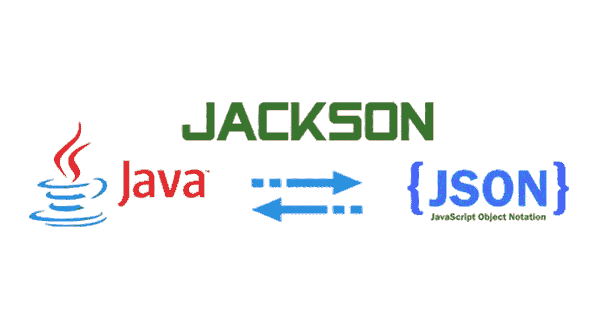
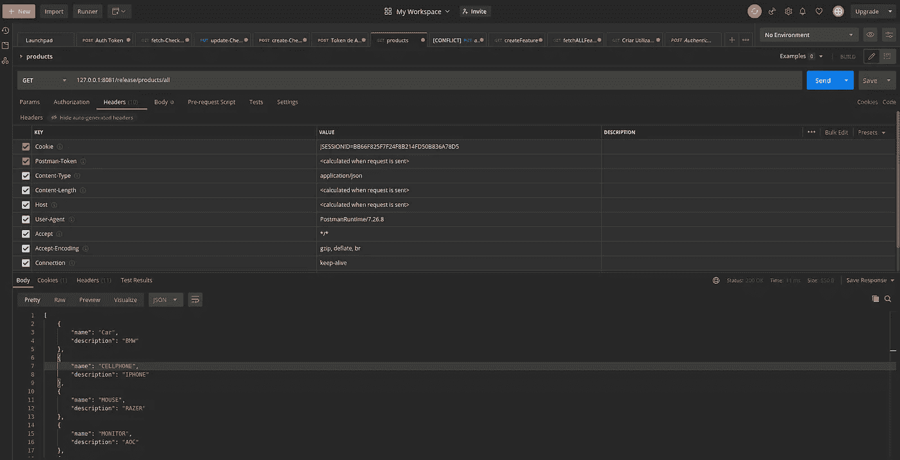

# 使用 Jackson ObjectMapper 创建 springboot CRUD api

> 原文：<https://medium.com/javarevisited/creating-a-springboot-crud-api-using-the-jackson-objectmapper-a3457ec158ef?source=collection_archive---------1----------------------->

# **概述**

本指南旨在让读者了解如何在基本 POJOs(普通旧 Java 对象)中读写 JSON，以及执行转换的其他功能。

要了解更多关于对象映射器的知识，这里的[是一个很好的起点。](https://www.baeldung.com/jackson)

我们将使用这个简单的 crud [项目](https://github.com/lifanica/objectmapper-crud-example)作为本教程的基础。这是一个 CRUD API，你可以在其中管理存储在 MySql 数据库中的产品；

在以后的帖子中，我们将使用这个项目作为添加新功能的基础。

在本教程中，我们将涵盖以下**主题:**

1-构建我们的产品类和属性，并使用 JPA 存储库实现；

2-使用 ObjectMapper 将 [**序列化**](https://javarevisited.blogspot.com/2014/12/how-to-read-write-json-string-to-file.html) **和** [**反序列化 JSON 数据**](https://javarevisited.blogspot.com/2018/02/how-to-parse-json-with-date-field-in-java-jackson-example.html#axzz5Xl8EXHhY) **】为我们的*产品*类创建 **CRUD** (创建、读取、更新、删除)端点，并使用相应的**控制器(在项目中称为资源)**和**服务；****

3-创建一个定制服务来处理应用程序中的请求和响应；

4-为 3 号中的客户服务创建一个自定义(DTO)注释，以应用于注释的类；

# **入门**

我们首先需要用 [Spring Initializr](https://start.spring.io/) 创建一个新项目。

确保选择:

*   **JDK 8+；**
*   [**Maven**](/javarevisited/6-best-maven-courses-for-beginners-in-2020-23ea3cba89) **作为你的构建工具**

在您的首选 IDE 上，将以下依赖项添加到 POM.xml 中

d

**1-创建我们的 productity 和 ProductDTO 类**:

DTO(数据传输对象)通常是 POCO(普通旧 CLR 对象)类的实例，用作封装数据并将其从应用程序的一层传递到另一层的容器。

在我们的例子中，我们将使用 DTO，因为我们不想在发出请求时使用来自 **ProductEntity** 的所有属性。

让我们使用类级注释[**@ JasonIgnoreProperties**](http://javarevisited.blogspot.sg/2018/01/how-to-ignore-unknown-properties-parsing-json-java-jackson.html#axzz56KqU1RoL)，它将忽略我们在 POJO(Plain Old Java Object)中没有定义的每一个属性，当我们只是在 JSON 中寻找几个属性并且不想编写 while 映射时，这非常有用。

因为我们不想在请求中定义所有的实体属性(只有名称和描述),所以让我们创建 DTO:

让我们用我们的自定义@DTO 注释来注释我们的类，这样我们将创建的 requestHandle 服务就可以在我们[消费](https://javarevisited.blogspot.com/2017/02/how-to-consume-json-from-restful-web-services-Spring-RESTTemplate-Example.html)(desearalize)或[生成](https://www.java67.com/2017/05/how-to-convert-java-object-to-json-using-Gson-example-tutorial.html) (serealize)数据时应用。

2-创建 **CRUD 操作**

现在让我们创建一个接口，它将拥有所有未来实体的默认 crud 实现。让我们扩展 [JpaRepository](https://javarevisited.blogspot.com/2021/08/top-5-spring-data-jpa-courses-for-java.html) 以受益于框架中已经实现的大多数方法:

现在让我们定义我们的 API 端点:

注意，在 create 方法中，我们接收 ProductEntity 作为我们的 RequestBody(JSON ),并让 Jackson。ObjectMapper 将其反序列化到我们的 POJO 中。

现在我们使用 [JpaRepository](https://www.java67.com/2021/01/spring-data-jpa-interview-questions-answers-java.html) 进行 crud 实现:

**3-创建一个定制服务来处理我们的应用程序中的请求和响应**

让我们创建自己的服务来处理[传入/传出的 JSON 数据](http://javarevisited.blogspot.sg/2013/04/convert-json-array-to-string-array-list-java-from.html#axzz4j841d8w3):

现在让我们制作一个拦截器，并为每个请求添加验证。

**4-创建自定义注释**

现在让我们创建我们的自定义注释，这样服务就可以应用到带注释的类:

这个注释将确保所提供的对象会得到我们在 DTOHandler.java 和 ResponseDTO.java 类中定义的处理。

**让我们用** [**邮差**](/javarevisited/7-best-courses-to-learn-postman-tool-for-web-service-and-api-testing-f225c138fa5a?source=---------13------------------) 来测试我们的 API

**5。结论**

在本教程中，我们采用了一种快速的方法来构建一个具有 CRUD 操作的 [spring boot API](/javarevisited/top-5-books-and-courses-to-learn-restful-web-services-in-java-using-spring-mvc-and-spring-boot-79ec4b351d12?source=---------17------------------) ，使用 ObjectMapper 将 JSON 反序列化和序列化为 POJOs，反之亦然。

# 源代码

关于这个[回购](https://github.com/lifanica/objectmapper-crud-example)的完整项目。

**感谢阅读！希望这对你有所帮助！！请随意留下任何评论。**