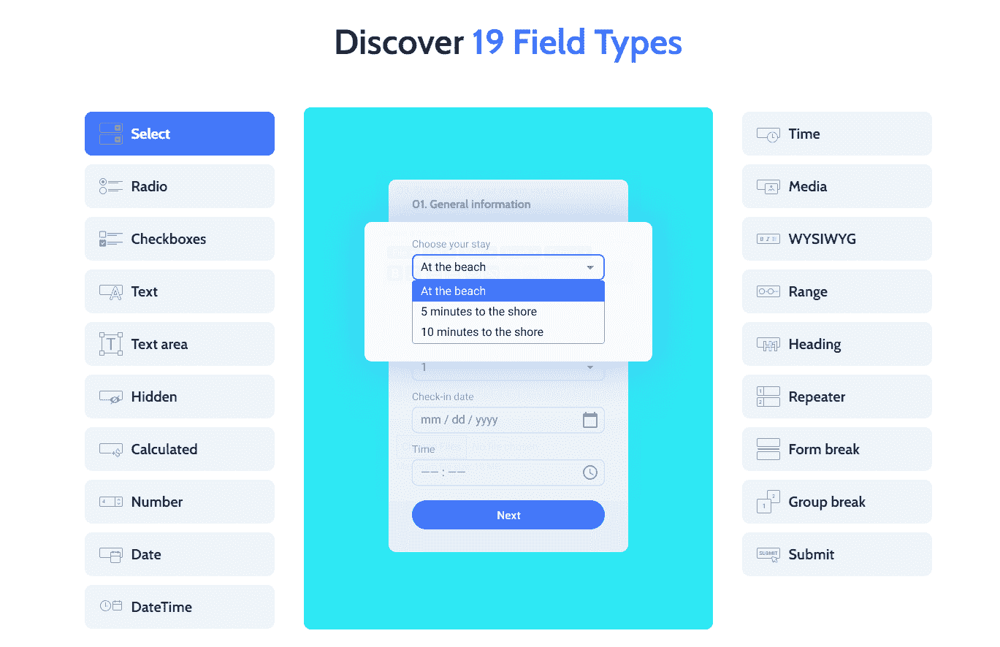

# Crocoblock 发布了一个免费的 WordPress 插件，允许开发者在 Gutenberg 构建表单

> 原文：<https://medium.com/javarevisited/crocoblock-released-a-free-wordpress-plugin-allowing-developers-to-build-forms-in-gutenberg-cdda9737cd1b?source=collection_archive---------1----------------------->

2021 年 1 月。Crocoblock 刚刚发布了其 [**JetFormBuilder**](https://wordpress.org/plugins/jetformbuilder/#description) ，这是一个免费插件，允许网站开发者在 WP 块编辑器中创建表单。JetFormBuilder 并不是第一个表单生成器，它让 WordPress 社区大吃一惊。

安德鲁·舍甫琴科， [**Crocoblock**](https://crocoblock.com/?ref=2817) 的首席技术官，分享了这个插件诞生的故事:

> *“我们[团队]希望摆脱拖放式表单构建器的标准用户界面，使用新的块编辑器的功能。展望未来，对于任何使用块编辑器的用户来说，使用我们的表单生成器都一样容易——这一切都是因为熟悉的界面。”*

从那以后，JetFormBuilder 一直在稳定地获得越来越多的关注。不仅仅是因为它方便的用户界面，而是因为它的功能性。Paul Charlton， [WPTuts](https://www.youtube.com/c/WPTuts/featured) 的创造者，在他的[第一印象视频](https://youtu.be/GTWeLrZspoA)中将该插件称为“游戏规则改变者”，并表示 JetFormBuilder 可以凭借其“*动态数据技能、用作前端内容工具的能力、新用户注册工具、WooCommerce 产品编辑器*……”Paul 总结说，没有多少插件免费提供这么多功能。

但是“那么多”到底是多少呢？

只看一眼 JetFormBuilder 就足以有个大概的概念。该插件包含 **18+字段块**，并允许其用户配置提交后操作、添加隐藏字段、调整条件逻辑、使用表单中断块创建多步表单，以及设置表单块的样式。

然而，Andrew Shevchenko 坚持认为 JetFormBuilder 的优点比人们一开始看到的要多:

> "*与其他表单构建器相比，最大的优势是可以在表单中使用一些标准的 WP 编辑器块，这允许网站开发人员创建更复杂和不寻常的表单布局。*

原来可以混合 Gutenberg 块和 JetFormBuilder 块来实现独特的表单布局。此外，一个人可以

> “给这些块添加交互性，例如，根据表单域中的值使它们出现或消失，”Andrew 总结道。

Alex Ivanenko 是 Crocoblock 的开发人员，也是 JetFormBuilder 的贡献者。在他看来，JetFormBuilder 的好处之一是它使用了

> WordPress 核心的原生功能是构建一个表单，而不是用它自己的布局构建器来加载网站。”Alex 还提到他们的“*表单构建器独立于放置表单的构建器。*

这意味着用户可以在 Gutenberg 中构建表单布局，使用 [**JetStyleManager 插件**](https://crocoblock.com/plugins/jetstylemanager/?ref=2817) 设置样式，然后使用 shortcodes 在任何页面生成器中显示创建的表单。

很难相信这样的宝石是免费的，但事实的确如此。事实上，的确如此。

2021 年 6 月，Crocoblock 团队将 JetFormBuilder 移至一个 [**独立网站**](https://jetformbuilder.com/) 并推出其 PRO 版本。一旦插件的特性集变得响亮而简单，免费版和专业版之间的差异就变得非常明显。正如 [**定价页面**](https://jetformbuilder.com/pricing/) 所说，JetFormBuilder 有 11 个付费插件，这些插件要么在内部用于增强表单的工作，要么在外部用于与第三方软件集成。最重要的是，我们上面描述的基本表单功能对免费和付费会员都是完全可用的。

问题是:付钱疼吗？

与保罗·查尔顿相似，来自[网站 4 初学者](https://www.youtube.com/c/Websites4Beginners/featured)的 JT 确信免费版的 JetFormBuilder 本身就很不错。

> JT 在他的 [JetFormBuilder 概述](https://youtu.be/15T5TSEki2A)中说:“*如果你看看免费版和专业版之间的区别，我想在很多很多情况下……你会比以往任何时候都更满意一个免费版。*

听起来那些不需要电子邮件营销和自动化等高级功能的人可以使用免费版本，就这样。另一方面，实际使用集成的第三方服务的网站开发者可能会考虑支付一些费用。原因如下。Alex Ivanenko 认为 JetFormBuilder 是一个插件

> *有自己的生态系统，目前由 11 个附加组件*组成。

“目前”是这里的关键词。JetFormBuilder 是一个复杂的架构，将会在水平和垂直方向上扩展。

> “我们的首要任务是将[JetFormBuilder]与目前只有 JetEngine 表单支持的第三方插件集成，即 JetAppointment、JetBooking、JetEngine 和 Crocoblock DevTools 的一些免费插件，”Andrew 和 Alex 解释道。"*完成后，我们将开始开发新的附加组件并改进已发布的组件。*

毫无疑问，JetFormBuilder 是一个有前途的项目，许多人将会关注它的进一步发展。