# Crocoblock 评论——croco block 值得吗？

> 原文：<https://medium.com/javarevisited/crocoblock-review-is-crocoblock-worth-it-e339db0dff4?source=collection_archive---------3----------------------->

## CrocoBlock 好吗？值得你付出的代价吗？

网页设计不是一门手艺而是一门艺术。每个艺术家都需要最好的工具。就网页设计而言，这意味着你需要插件来构建成熟的、生动的、可用的网站。

特定的任务需要特定的插件。并且 [WordPress](/javarevisited/5-best-wordpress-courses-for-beginners-and-experienced-website-developers-b45f7976ee40) 提出了 58000 多个+ [插件](https://wordpress.org/plugins/)。你可以下载或购买几乎所有需要的插件。但是这里的**问题**不在于财富的选择，而在于:

*   *使用插件的安全性:*插件可以隐藏代码/链接，从而降低你的网站在谷歌搜索结果中的排名；
*   *相互兼容:*所有使用的插件不应该相互冲突，主题、模板、WordPress 本身、Elementor
*   插件会使站点*过于权重*，从而影响谷歌搜索的结果。

> 确保你的插件没有这些问题的最好方法之一是研究插件开发者。使用由一个在 WordPress 社区有稳固存在的团队开发的插件是可以的，这个团队有一个著名的 WordPress 网站，多年的经验和社会证明。

但实际上，这样的开发者很少。只有 [WordPress](https://javarevisited.blogspot.com/2020/08/top-5-courses-to-learn-wordpress-in.html) 、Elementor 和 Crocoblock 符合这些要求。我想描述一下 Crocoblock 的插件集，因为 Crocoblock 提供了一种集成的方法。

# Crocoblock 提出了什么建议？

Crocoblock 设想了一种全面的产品方法，并提出了免费和高级产品、365/24/7 [支持](https://crocoblock.com/help-center/)和免费[教程](https://crocoblock.com/knowledge-base/?ref=2817)。

*[Kava](https://crocoblock.com/kava/?ref=2817) 主题， [WP 查询生成器](https://crocoblock.com/freemium/tools/wp-query-generator/?ref=2817)，插件( [JetStyleManager](https://wordpress.org/plugins/jet-style-manager/?ref=2817) 用于原生 WordPress 编辑器 Gutenberg，[JetGridBuilder](https://wordpress.org/plugins/jetgridbuilder/)—element or 和 Gutenberg 的网格构建器， [JetFormBuilder](https://wordpress.org/plugins/jetformbuilder/) —动态块表单构建器， [JetWooCommerce 小部件](https://wordpress.org/plugins/jetwoo-widgets-for-elementor/)， [Jet Content 小部件](https://wordpress.org/plugins/jetwidgets-for-elementor/)， [JetSticky 小部件](https://wordpress.org/plugins/jetsticky-for-elementor/)， [ADA 定制器和安装器用于访问](https://en-ca.wordpress.org/plugins/ada-customizer-and-installer-for-accessibe/)*

****保费:****

**20+* *12+* [*动态模板*](https://crocoblock.com/dynamic-templates/?ref=2817) ， *8+* [*设计模板*](https://crocoblock.com/design-templates/?ref=2817) ， *50+* [*弹出窗口*](https://crocoblock.com/interactive-popup-library/?ref=2817) 。*

*这意味着所有插件不仅关注动态窗口小部件，而且每个插件在构建现代网站的分类法、CPT 和关系的典型方法中相互补充。*

# *详细介绍 JetPlugins WordPress 插件*

*目前，Gutenberg 和 Elementor 有 20 个插件，涵盖了所有网页设计的品味和目的。Crocoblock 提供了详细的描述、现场演示和教程。*

# *[JetElements](https://crocoblock.com/plugins/jetelements/?ref=2817)*

*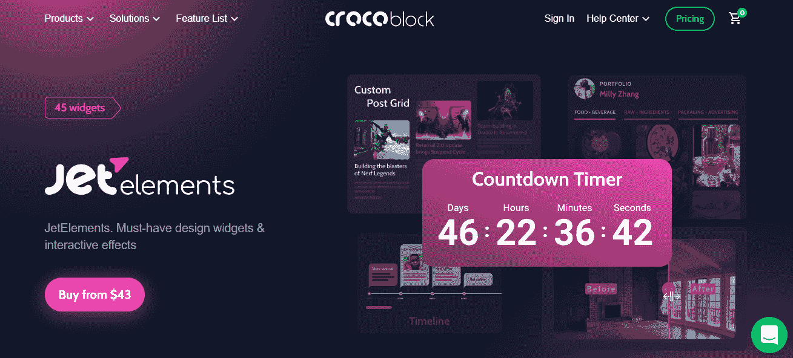*

*Elementor 的 JetElements 侧重于小部件和视觉效果。使用这个插件，您可以*

*   **构建内容部分&通过添加倒计时器、推荐、团队成员、价格表、价格列表和滑块使其流行*；*
*   **显示帖子、图片&视频*，添加作品集图库、高级旋转木马、帖子网格、横幅图片布局和徽标展示；*
*   **应用动态小部件*，特别是章节视差、垂直滚动、创意标题、互动翻转框、比较滑块；*
*   **嵌入第三方内容* : YouTube、Vimeo、AudioPlayer、Weather、GoogleMaps、Instagram、LottieFiles*
*   **通过饼图&条形图、响应式表格、垂直&水平时间线、进度条&圆形进度展示复杂的数字数据*；*
*   **添加 WooCommerce 徽章*:最近浏览、最畅销、最近销售、最高评价。*

# *[JetTricks](https://crocoblock.com/plugins/jettricks/?ref=2817)*

**

*元素或的此插件:*

*   *增加了以下 *tricky widgets* :工具提示、热点 widget、粘性栏、截面粒子、阅读更多展开 widget、展开 widget、卫星 widget、视差滚动效果；*
*   *使用*不同的效果*来强调您的内容:热点、动画视图更多中断、卫星效果、内容的视差效果。*

# *喷气发动机*

*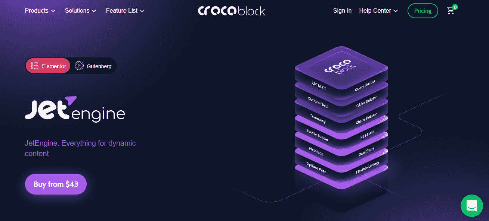*

*Elementor 和 Gutenberg 的 JetEngine 是动态架构中最强大的插件之一。我认为这是 Crocoblock 的骄傲，因为它可以做很多事情:*

*   **创建动态内容*:自定义帖子类型、自定义内容类型、分类、自定义字段、自定义字段、选项页面；*
*   **开发列表项*:动态图片、词条、链接、字段、商店、metas*
*   **探索*列表网格布局:网格、注射、滑块、地图、日历、转盘；*
*   **探索动态特性*(动态函数、标签、短码、条件逻辑、宏)；*
*   *创建*数据存储、术语表和动态可见性*；*
*   **创建用户、术语和帖子关系:*分层帖子关系，通过表单与项目的关系，添加和显示关系的自定义元字段，按相关项目过滤帖子，在查询构建器中按动态宏对项目排序，直接在后期编辑区域添加和编辑相关项目；*
*   **构建查询*针对以下类型的数据:CPT & CCT items、terms、users、comments、SQL 表、REST API、WooCommerce 产品；*
*   **构建表格和图表*:显示 CPT & CCT 项目、术语、用户&评论，展示 WooCommerce 产品，实现海量表格的水平滚动，从仪表板预览表格，输出 SQL 表格数据& REST API 内容，为完成的表格添加智能过滤器；*
*   **可视化动态内容*:通过自定义 JSON 代码嵌入 Google 图表；显示 CCT 项目、术语、用户、注释、SQL 表中的数据。输出排序后的数据& REST API 内容；从仪表板预览图表；添加图表图例&堆叠图表元素；向完成的图表添加智能筛选器；*
*   *构建*动态用户的 profile* 并应用 profile 菜单 widget，提供前端帖子提交，为站点内容设置可见性条件并指定其可见性；*
*   *使用 RESTful API 增强对大数据的控制。*

# *[JetSmatrFilters](https://crocoblock.com/plugins/jetsmartfilters/?ref=2817)*

*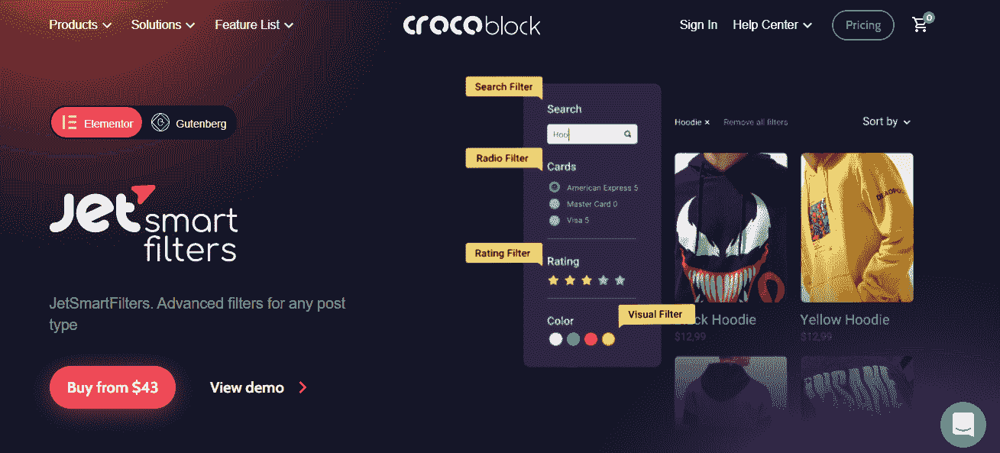*

*这个 Elementor 和 Gutenberg 的插件可以对任何文章类型应用 15 个过滤部件。此插件:*

*   *使用索引器灵活显示过滤结果；*
*   *通过调整过滤逻辑和动态过滤来开发分面搜索系统；*
*   *提供筛选层次结构；*
*   *应用 15 种过滤器类型:排序，评级，视觉过滤，视觉过滤，搜索，单选，日期范围，检查范围，选择，复选框，日期待定，按字母顺序。*
*   *提供与 ElementorPRO、ACF、JetEngine 和 JetWooBuilder 的无缝集成。*

# *[JetWooBuilder](https://crocoblock.com/plugins/jetwoobuilder/?ref=2817)*

**

*这是一个顶级的专注于 WooCommerce 的插件，有 60 多个小部件，你可以应用到任何 WooCommerce 特定的页面:*

*   **自定义模板、布局切换器、商店特定页面*(购物车、结账页面、成功、账户页面)、轮播类型和类别网格；*
*   **定制模板*用于单个产品页面、商店页面模板、购物车页面、结帐页面、成功页面和帐户页面；*
*   *JetWooBuilder & JetEngine 的查询生成器功能(按畅销、最高评级、最多观看、日期、价格范围、库存状态、字母顺序排序)；*
*   **60+ widgets* (全球、单品 widgets、档案卡 widgets、类别卡 widgets、商店页面、购物车页面、结账页面、感谢页面、我的账户页面)。*

# *[JetAppointment](https://crocoblock.com/plugins/jetappointment/?ref=2817)*

*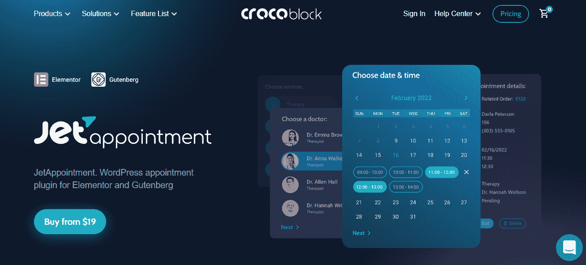*

*JetAppointment 是一个用于 Elementor 和 Gutenberg 的 WordPress 约会插件，它:*

*   **创建并配置一个功能预约网站*，包括单个定制表单、单个页面和弹出表单；*
*   **调整*调度、服务提供商、缓冲时间、支付、容量和价格的设置；*
*   **配置表格*并通过手动时间输入，指定每时间单位的价格，应用多个服务&提供者，循环选项，过滤器和搜索；*
*   **提供与 WooCommerce 支付系统、Zapier 和 Integromat 等电子邮件服务、谷歌日历等的集成*。*

# *[飞机订票](https://crocoblock.com/plugins/jetbooking/?ref=2817)*

**

*JetBooking 是 Elementor 的一个预订插件。它创建了预订和租赁网站，提供日常服务:*

*   **构建单一表单*包括自动价格计算、第三方服务、添加额外的客户选项、提交后通知和 WooCommerce 集成；*
*   *建立*目录，价格*(季节性/每周/每天，定价价格，基于停留时间的价格)，过滤器/搜索(包括属性类型数量)，分页，组合元字段以添加各种内容类型*
*   **管理单位*。*

# *[jetproductgalley](https://crocoblock.com/plugins/jetproductgallery/?ref=2817)*

**

*JetProductGallery 是一个顶级的 WooCommerce gallery 插件。它主要针对电子商店，因为它:*

*   *创建*产品帖子*向网站添加任何内容，包括特色视频和文件上传；*
*   *创建*目录*，带有产品图像缩放、分页、动态图库标签、产品灯箱控件、自定义样式、在弹出窗口中显示产品视频以及高级选项；*
*   *通过设计具有不同布局、产品图库滑块、图库网格和任何锚点导航的通用图库模板，将*华丽图库视图*应用于单个&目录页面。*

# *[JetCompare &愿望清单](https://crocoblock.com/plugins/jetcomparewishlist/?ref=2817)*

**

*Elementor 的 JetCompare&Wishlist 是在线商店的必备插件，因为它:*

*   **通过任何数据比较产品*，设计产品的结构和外观，添加比较和愿望列表按钮，并显示比较和愿望列表计数；*
*   **提供了六个愿望列表小部件*:愿望列表小部件、愿望列表计数按钮、愿望列表按钮、比较小部件、比较计数按钮小部件和比较按钮。*

# *[喷射弹出](https://crocoblock.com/plugins/jetpopup/?ref=2817)*

**

*JetPopup 是 Elementor 的一个时尚弹出生成器；它:*

*   *构建*通信弹出窗口*(订阅、折扣、是/否、倒计时、联系我们、信息卡、GDPR、cookie 政策；*
*   **指定弹出外观*(在打开时，当用户试图退出时，在滚动时，附加到小工具，在非活动时间，或在当前时间)；*
*   *页面和模板的*包含&排除条件*；*
*   *提供*不同方式的弹出窗口出现在页面上*；*
*   **弹出窗口的动画效果*(淡入、放大、缩小、上移、弹入、弹出、向上滑动、向下滑动、向左滑动、向右滑动、水平翻转、垂直翻转、旋转)。*

# *[JetReviews](https://crocoblock.com/plugins/jetreviews/?ref=2817)*

*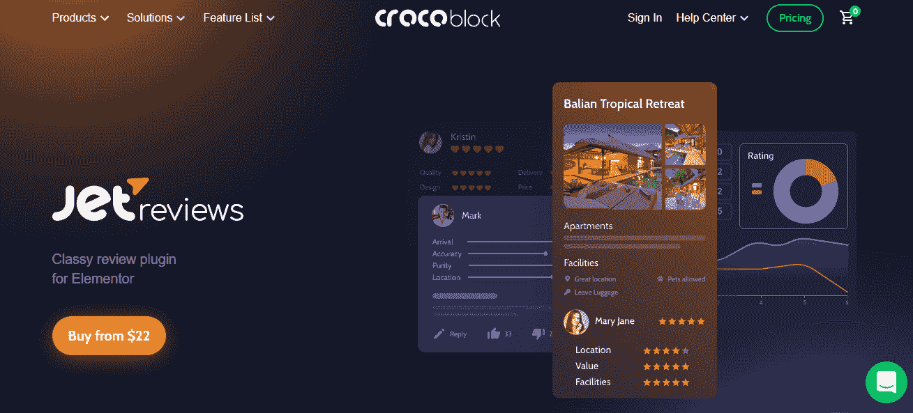*

*JetReviews 是 Elementor 的经典评论插件，它:*

*   *为每个产品/服务创建一个*评级系统*，使平均统计数据可见，建立多个评级尺度和简化投票，并提出一些列表布局；*
*   *创建 f *功能性综合审查，并进行作者验证*(客人、客户和商店经理)，提供具有必填字段和 reCAPTCHA v3 的审查透明度，构建查询，*构建数据呈现*；*
*   *为任何 CPT 类型创建*不同的评审类型*，并显示 WooCommerce 项目的动态费率；*
*   *有两个 JetReviews *小部件* : **静态评论**和**评论列表**。*

# *[JetMenu](https://crocoblock.com/plugins/jetmenu/?ref=2817)*

*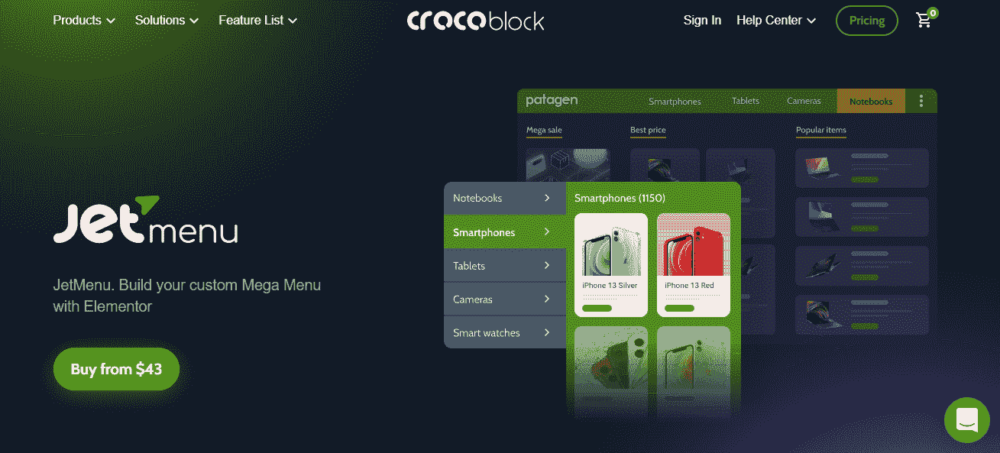*

*JetMenu 使用 Elementor 和以下组件构建了一个自定义的大型菜单:*

*   *将*不同的内容*添加到 Elementor 自定义菜单:商店、多媒体、联系人、博客、动态内容和模板；*
*   *构建速度最优的水平、垂直和汉堡菜单布局*用于多个菜单(用于移动、桌面和平板电脑)，卷起菜单并使用断点、动画和菜单定位来设计它们；**
*   *为菜单添加*样式选项(用于手机、桌面和平板电脑):图标、徽章、版式和间距。**

# *[喷气滑车](https://crocoblock.com/plugins/jetblocks/?ref=2817)*

*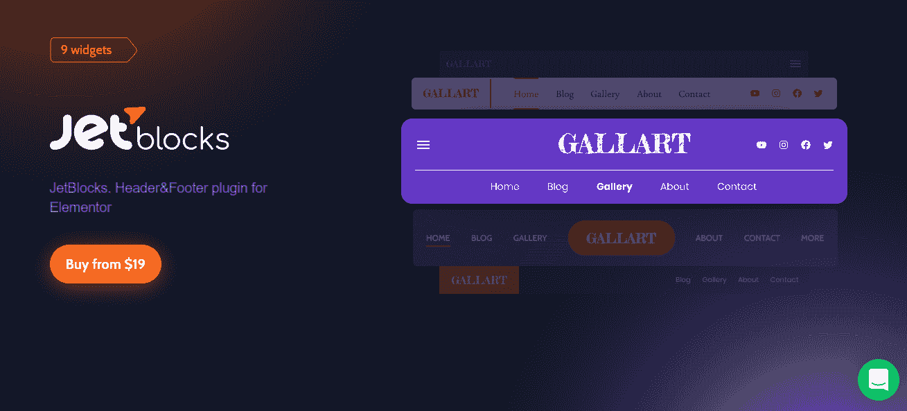*

*JetBlocks 是 Elementor 的一个页眉和页脚插件；它使用以下内容构建页眉/页脚:*

*   *一套*高功能 widgets* :购物车图标 widget、注册表单 widget、授权链接 widget、汉堡面板、登录 widget、搜索 widget、导航菜单 widget、面包屑、更改站点 logo*
*   **导航元素*和粘滞部分效果。*

# *[JetSearch](https://crocoblock.com/plugins/jetsearch/?ref=2817)*

*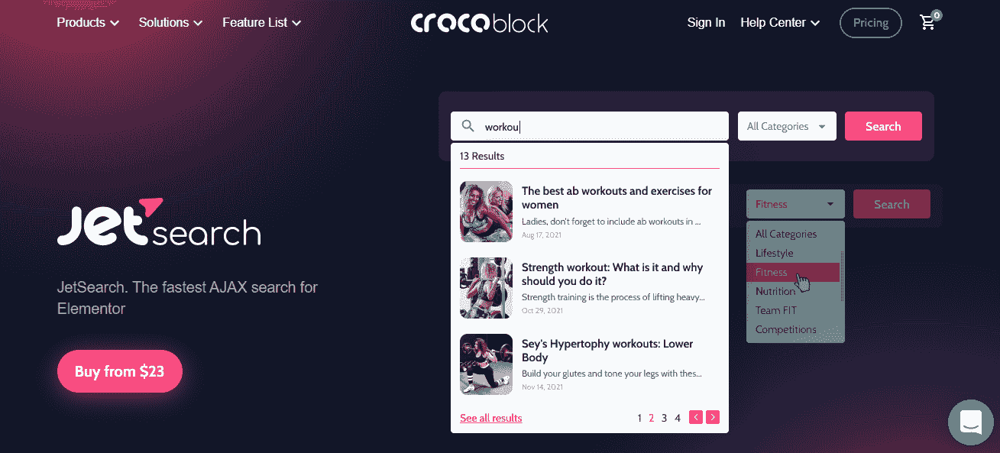*

*显示高级风格化设置的 JetSearch masters 搜索结果:*

*   **展示帖子缩略图*，确定文本内容长度，使用分页显示结果；*
*   **缩小搜索结果的范围*,因为可以在任何自定义的帖子类型、分类、默认标签和类别中进行搜索；*
*   **按相关性排列结果*，定制结果预览。*

# *[JetBlog](https://crocoblock.com/plugins/jetblog/?ref=2817)*

*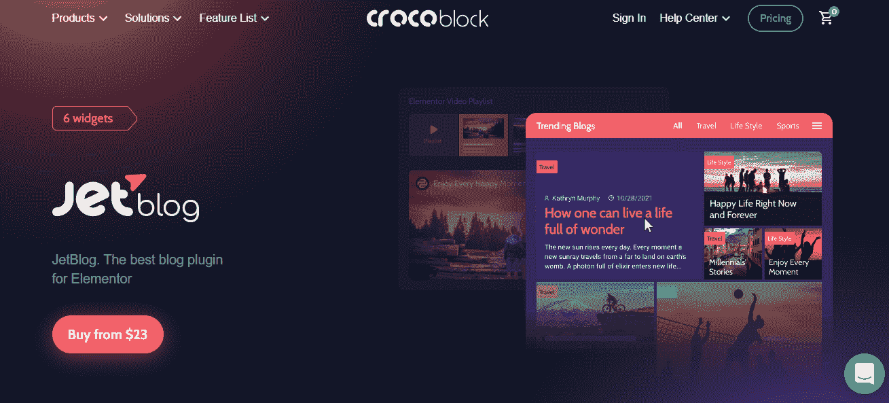*

*JetBlog masters 自定义帖子基于模板和/或使用小部件进行自定义，并且:*

*   **支持自定义 WP 查询*，支持自定义帖子类型，为内容添加视觉效果，非常适合帖子存档模板；*
*   **应用小部件*创建引人入胜的博客页面:用于 YouTube、Vimeo 和其他的视频播放列表、文章分页、文章导航、用于新闻和其他内容的元素或滚动条、元素或文章标题、智能文章列表；*
*   **显示展示*最新新闻的内容，提出九个帖子标题布局，将帖子标题变成幻灯片，并添加视频播放列表。*

# *[JetTabs](https://crocoblock.com/plugins/jettabs/?ref=2817)*

*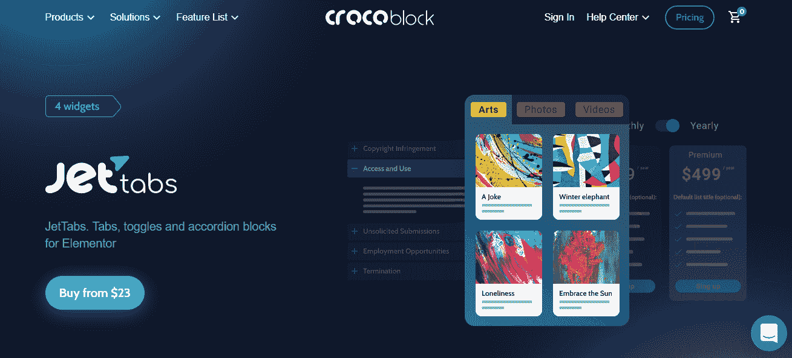*

*JetTabs for Elementor masters 定位时尚的动态可定制标签，包括模板和四个小部件(切换器、标签小部件、折叠小部件、用于动态内容的经典折叠部件):*

*   *提出*垂直和水平标签布局*，在标签中添加任何模板，并处理动态内容；*
*   *将所有类型的内容放入*折叠块*；*
*   **在一些选项之间切换*；*
*   *将*内容添加到垂直/水平标签*中。*

# *[jethemecore](https://crocoblock.com/plugins/jetthemecore/?ref=2817)*

**

*JetThemeCore 是一个用于 Elementor 和 Gutenberg 的 WordPress 主题生成器。它掌握定制和时尚的主题，通过预制的内容块、庞大的模板库和完全可编辑的页眉/页脚提供简单的模块化结构:*

*   *建立和管理*网站结构*，即页眉&页脚、单页、存档、错误 404 页面、搜索结果页面、WooCommerce 模板、单个帖子页面、自定义帖子类型页面；*
*   **给不同的网站部件分配条件*:给页面应用一个/一些模板；*
*   **应用高级条件类型*:高级 URL 参数条件，选择输出模板的设备，将模板展示给指定用户；*
*   *与流行主题完全兼容。*

# *[JetFormBuilder](https://crocoblock.com/plugins/jetformbuilder/?ref=2817)*

**

*JetFormbuilder 是一个为 Gutenberg 开发的动态 WordPress 表单生成器。它*

*   *构建*时尚的表单*，包含 18 个以上时尚的字段块、多列布局、自定义 HTML 添加、内嵌字段编辑和自由样式插件；*
*   *应用 *19 种字段类型*:选择、单选、复选框、文本、文本区域、隐藏、计算、数字、日期、日期时间、时间、媒体、所见即所得、范围、标题、重复、分组符、换行符、提交、颜色选择器；*
*   *应用*智能特性*:条件逻辑、动态值、计算内容/隐藏字段、repeater*
*   *创建带有分页符、步骤指示器和 AJAX 重载的*多步表单*；*
*   *通过必填字段、reCAPTCHA v3 和错误消息启用表单*验证*；*
*   *设置*表单提交后的动作*:前端提交帖子、用户注册、重定向到页面、存储表单记录；*
*   *探索无缝的第三方集成:订阅邮件列表、接受付款、捐赠和第三方网络挂钩。*

# *[JetGridBuilder](https://crocoblock.com/plugins/jetgridbuilder/?ref=2817)*

*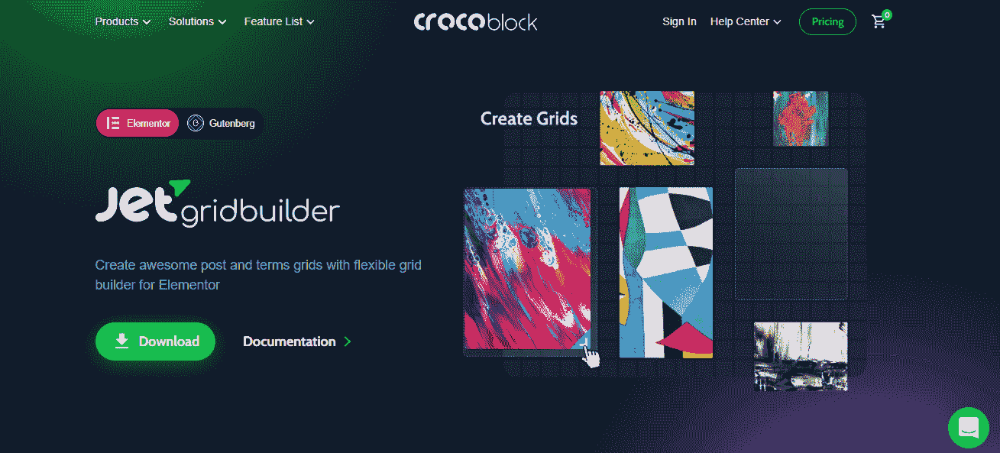*

*JetGridBuilder 是一个免费插件**,用于构建灵活、时尚的网格:***

*   *使用*自定义列数*，可移动/可调整大小的块，卡片之间的间隙，自动对齐，以及可适应的缩略图:*
*   **在 CPT、帖子、页面、产品、条款上动态显示内容*。*

# *JetStyleManager*

*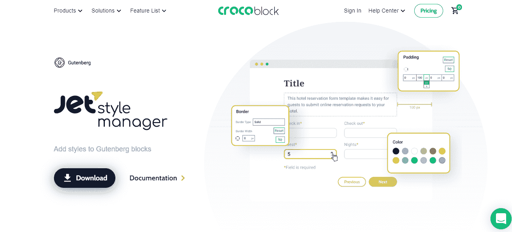*

*JetStyleManager 是一个**免费的**Gutenberg 插件，可以用 10 多种不同类型的控件来设计和可视化渲染任何 Gutenberg 块。它:*

*   *使用多个样式参数来优化任何给定元素的外观。*
*   *为每个古腾堡街区单独开发一个独特的设计。*

# *交叉定价*

*价格问题往往是选择插件时的决定性因素。总的来说， [Crocoblock 的定价](https://crocoblock.com/pricing/?ref=2817)和产品政策的特点是:*

*   *a holistic approach to both products and price 一 the client can buy both a separate product and all plugins together at a special price;*
*   *大量的额外奖励(例如，免费卡瓦主题)。*

*插件的价格从 15 美元到 43 美元不等。*

*有几种价格方案。一个站点的全包费用为每年 199 美元，无限站点的全包费用为每年 399 美元；终身无限制网站 999 美元。*

# *结论*

*综上所述，我想具体说明 JetPlugins 的利弊。*

***优点:**创新全面的插件集，预先设计的模板，卡瓦主题，365/24/7 支持，免费教程，免费主题卡瓦。*

***缺点:**有用户说有些插件在工作中有问题，插件主要集中在 Elementor 上，有些插件只与 JetEngine 结合工作，有时很难改变模板的设计，*

*Crocoblock 为许多页面构建者提供了一个非常好的选择，它的工具箱完全适合任何项目。每个插件都有完整的解释和支持。插件是 JetPlugins 的另一个吸引人的特性，这样你就可以专业地建立你的网站。*

# *常见问题解答*

***#1。有没有可能不用 Elementor 就能使用 JetPlugins？***

*是的，古腾堡编辑器有几个 [JetPlugins，比如 JetFormBuilder 表单插件、JetEngine 动态内容插件、JetStyleManager 样式插件、JetBooking & JetAppointment 插件、JetSearch 插件等等。](https://crocoblock.com/jetplugins-for-gutenberg/?ref=2817)*

***#2。JetPlugins 有什么技术要求？***

*技术要求如下:PHP 7.2+，WP 内存限制 256MB+，TLS 协议版本:1.0，1.1，1.2，或 1.3，MySQL 5.6 以上，服务器上有 SSL 证书。*

***#3。什么是动态模板？***

*动态模板是 Crocobock 的创新。它们是用于特定目的的现成网站。所有表单、字段、关系和分类都是预先配置的。*

***#4。但是，总的来说，有许多优秀的开发人员。JetPlugins 的特点是什么？***

*它是动态内容，插件的一种常见方法，以及主题、插件和动态模板的相互兼容性。*