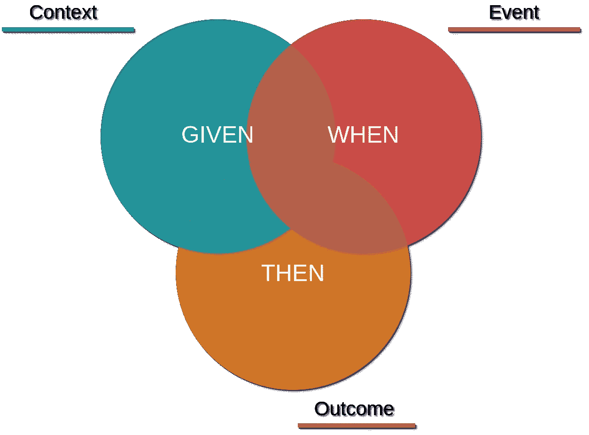

# cucumber & test container:BDD 的完美匹配

> 原文：<https://medium.com/javarevisited/cucumber-testcontainer-a-bdd-perfect-match-956cf62cdf47?source=collection_archive---------1----------------------->

在一些项目中，对自动化和强大的测试层的需求被认为对项目的良好结果并不真正有用…


幸运的是，在许多项目中，测试阶段是非常重要的，并对源代码的总体质量产生了积极的影响。我们有如此多的框架、库和方法可以使用。在本文中，我们将看到两个工具的使用，即 **Cucumber** 和 **Testcontainer** ，如何帮助我们为测试创建一个完美的环境。

# 行为驱动设计

不同类型的测试可以在我们的软件上执行，显然，每一种都可以用不同的技术和工具来实现


一个著名的方法是 **TDD** (测试驱动设计)，它可以通过为我们的软件定义一个测试用例，然后实现满足它的软件来总结(非常简单)。测试流程如下

*   测试定义
*   测试实现
*   测试执行:第一次执行会失败，因为我们的软件不能满足它
*   软件实现
*   测试执行没有问题

测试开发的另一个好方法是 **BDD** (行为驱动设计)。在这种情况下，我们必须使用一种简单的领域特定语言来定义我们软件的期望行为。

为了定义一个测试场景，我们可以使用一个简单的基于关键字**的语言**



下面是一个简单的场景

这种语言语法( [**Gherkin**](https://cucumber.io/docs/gherkin/) )帮助我们定义可以描述我们系统行为的场景。测试框架，如 **Cucumber** ，阅读这个特性的描述并尝试执行它。

# 黄瓜:设置

黄瓜是一个测试框架，可用于最重要的编程语言。使用它，我们可以将用 Gherkin 编写的特性描述映射到一些测试代码实现。

本文将在一个以 **JUnit 5** 为主要测试引擎的 **Spring Boot** 项目中使用 **Cucumber-JVM** 。我们首先看到的是要添加到 pom.xml 中的依赖项

示例项目将提供简单的 **REST** 端点来管理与博客引擎相关的两个资源:作者和文章。让我们使用小黄瓜语言定义一些我们的 API 将满足的场景。

第一特征文件中关于作者资源的一些场景

还有一些与员额资源有关

现在我们必须开始告诉我们的项目它必须使用 Cucumber，场景定义将在 **src/test/resources/bdd** 文件夹下提供

**@IncludeEngines** 注释是为我们的测试指定 cumber 引擎，必须使用 **@SelectClasspathResource** 来添加我们的特征文件。

在其他设置中，使用 **@ConfigurationParameter，**我们要求 Cucumber 生成一个 HTML 测试执行报告。

如果我们现在开始构建，没有任何源代码定义，我们应该会收到这样的错误

我们可以从实现测试用例开始，但是在做之前，我们先来看看 [**放心**](https://rest-assured.io/) ，一个强大的库，可以成为我们测试用例实现的瑞士军刀。

# 放心

如果你必须使用一些 Java 库来开发所有的测试用例，比如**Spring rest template**/**WebClient**或者其他什么，你可能会创建很多样板代码。 [**放心**](https://rest-assured.io/) 提供了流畅的语法来开发强大而简单的测试代码实现。

要添加库，您必须导入这些依赖项

假设您有一个“colors”REST 端点，提供一个颜色列表，如下所示

```
["red", "green", "blue"]
```

使用放心，您可以编写一个简单的测试用例，如下所示

或者如果你想提交一些东西，在一个类似于我们的测试项目的场景中，你可以写这个测试用例

它的 fluent API 可以用来开发类似这样的快速测试用例，或者像在我们的项目中一样，将这些方法绑定到我们的测试场景。

# Cucumber:测试实现

我们可以从一些常见的步骤开始我们的测试用例实现

这个类在包中，Cucumber 将扫描它来查找步骤实现，就像之前在我们的设置中定义的那样。正如你所看到的， **@Then** 注释被绑定到一些场景中描述的 **Then** 关键字。

除此之外，我们创建了一个实用程序类， **CucumberContextHolder** ，它可以用来保存一些测试上下文信息。现在我们用它来保持来自放心电话的响应。

在这些步骤中，我们只是检查 HTTP 状态代码。现在，我们进一步讨论该场景中定义的其他操作

```
Scenario: 001 - Save author OK Given a username 'federico'
   And an email 'federico.paparoni@xyz.mail'
   And a bio 'Federico Paparoni wants to write something about Cucumber & Testcontainer'
   When I submit this information to save a new user
   Then I receive a correct response
```

这是实现

在这些步骤中，我们创建一个作者(给定步骤)，然后使用 REST Assured (When step)将其发送到 REST 端点。

使用同样的方法，我们可以实现所有的步骤，还可以尝试构建我们系统中没有的东西。例如这一步

```
Given a system without the author with username 'goofy'
```

需要一个已经保存在我们博客引擎中的作者。所以我们可以假设我们的数据库已经有了这个作者，或者我们可以在给定步骤的设置过程中保存它。我更喜欢后一种选择，所以我用那种方式实现了这个条件

Gherkin 语法提供了很多特性，比如在场景中插入值列表的选项([数据表](https://github.com/cucumber/cucumber-jvm/tree/main/datatable))。如果你重复这些步骤

```
Feature: My feature Scenario: 001
      Given a username 'federico'
      And an email 'federico.paparoni@xyz.mail'
      And a bio 'Federico Paparoni wants to write something about Cucumber & Testcontainer'...
... Scenario: 002
      Given a username 'federico'
      And an email 'federico.paparoni@xyz.mail'
      And a bio 'Federico Paparoni wants to write something about Cucumber & Testcontainer'...
... Scenario: 003
      Given a username 'federico'
      And an email 'federico.paparoni@xyz.mail'
      And a bio 'Federico Paparoni wants to write something about Cucumber & Testcontainer'...
...
```

你可以使用**背景**关键字

```
Feature: PostsBackground: Author already saved
   Given an author with username 'federico' already saved
   And a post by author with username 'federico' already saved...
...
```

如前所述，这些步骤将映射到 Java 方法，但是 Cucumber 将为单个特性的每个场景重复这些步骤

# 测试容器

一旦你用 Cucumber 创建了测试，你就可以使用像 **H2** 这样的数据库，但是你不会意识到比 Hello World 更复杂的东西。在一个实际的项目中，您可能会使用一些特定的数据库特性(关系型或非关系型)，所以您的测试用例在现实环境中不会工作。

[**Testcontainer**](https://www.testcontainers.org/) 为我们提供了一种在测试中使用容器的简单方法，因此我们可以与数据库、浏览器、队列消息系统或任何可以放在容器中的东西集成。

在本文中，我们将使用 Testcontainer 启动一个由这个 **Dockerfile** 定义的 **PostgreSQL** 数据库

我们还编写了一些脚本来为我们的博客引擎软件创建一些表格。要开始构建，您可以启动以下命令

```
docker build -t bddfun-database .
```

现在我们可以将 Testcontainer 添加到我们的项目中

要启动 Testcontainer，我们可以使用三种不同的方法。最简单的方法是使用一个特定的 **JDBC URL** ，这将在 JDBC **驱动管理器**中触发一种魔法，不需要太多的努力，我们将有一个 PostgreSQL 的运行实例

```
spring.datasource:
  url: jdbc:tc:postgresql:14.3:////<DatabaseName>
  driver-class-name: org.testcontainers.jdbc.ContainerDatabaseDriver
```

这个实例将是一个普通的实例，所以我们必须在我们的代码库中管理脚本并启动它们。另一种方法是 **@Testcontainers** 和 **@Container** 注释

**@DynamicPropertySource** 将在我们的上下文中动态保存数据库属性，我们将有一个不同的 PostgreSQL，它将从我们的 **bddfun-database** 容器开始，为每个测试运行。

对于每一个测试来说，拥有一个全新的数据库是很有帮助的，但是对于一个有很多测试用例的项目来说，这会大大延长构建时间。

本文选择的最后一个选项将为我们的测试提供一个完整的容器启动/停止控制

使用这种方法，我们还将**@ Cucumber context configuration**应用于该类，因此 Cucumber 知道这将是我们测试使用的上下文。我们的项目使用 Spring Boot，所以我们也添加了 **@SpringBootTest** 注释。

这个配置为我们提供了自定义数据库的一个实例，由带有 **@BeforeAll** 和 **@AfterAll** Cucumber 注释的方法管理(类似于 JUnit)。

现在运行构建，如果我们还记得开发我们博客软件的 REST 端点(！！！)，我们应该有下面的报告(**cucumber-reports.html**)生成在**目标**文件夹下


# 奖励曲目:莫奇托

我们的系统可能会比使用数据库的简单 Spring Boot 应用程序更复杂，所以我们必须假设我们的测试用例应该提供一种简单的方法来模拟外部系统。

如果我们有一个外部系统的容器，我们可以使用 Testcontainer，但是有时这种方法会导致在我们的构建中运行很多容器(很多容器，很多内存，巨大的构建时间..).

[**Mockito**](https://site.mockito.org/) 是一个测试框架，可以集成到黄瓜和 Spring Boot 的测试场景中。如果我们想要模仿一个服务，我们可以使用@MockBean 注释

```
@MockBean
private MyRemoteService myRemoteService;
```

这个 mock 必须放在我们放置@CucumberContextConfiguration 的同一个类中，这样 Cucumber 就会知道我们在为这个服务使用一个 mock。

在稍后的测试中，我们可以模拟服务

# 示例项目

本文的源代码可以在这个 [Github 资源库](https://github.com/fpaparoni/bddfun)中找到

[](https://github.com/fpaparoni/bddfun) [## GitHub - fpaparoni/bddfun

### 此时您不能执行该操作。您已使用另一个标签页或窗口登录。您已在另一个选项卡中注销，或者…

github.com](https://github.com/fpaparoni/bddfun)