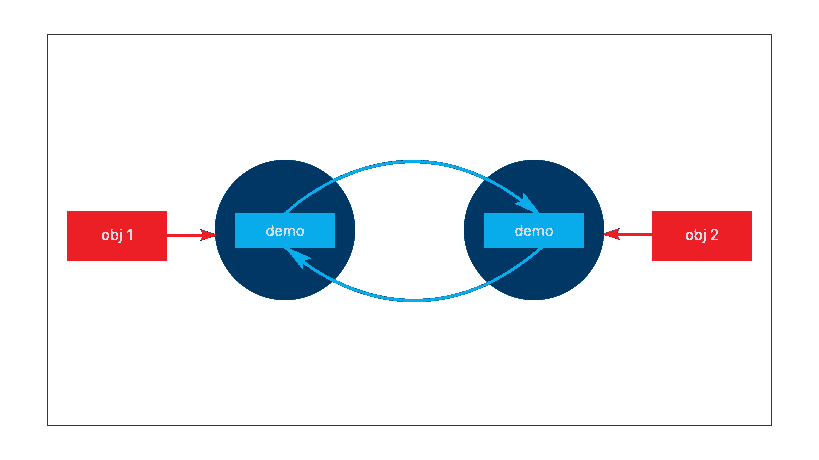
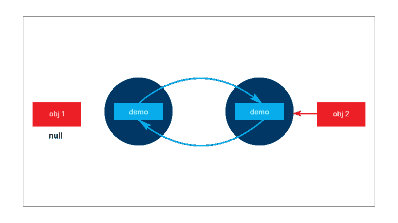
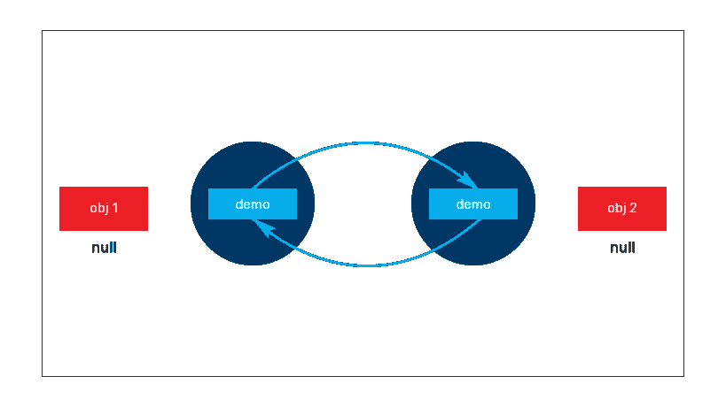

# 孤岛的奇特案例

> 原文：<https://medium.com/javarevisited/curious-case-of-island-of-isolation-6243f3a6698d?source=collection_archive---------1----------------------->


孤岛

垃圾收集器是 JAVA 世界中的主要原语之一。从内存中清除未使用/不可访问对象的工具。如果一个对象没有引用，那么它就有资格进行[垃圾收集](https://javarevisited.blogspot.com/2011/04/garbage-collection-in-java.html#axzz4zt6jlTWS)。与这种说法相反，有一种情况是，即使对象持有引用，它们也可以被垃圾收集。这样的场景被称为**孤岛。**

通俗地说，孤岛是一种场景，其中一些对象持有彼此的引用，但由于这些对象没有外部的[强引用](https://javarevisited.blogspot.com/2014/03/difference-between-weakreference-vs-softreference-phantom-strong-reference-java.html)，所以它们都不能通过活动的应用程序访问。

> 术语“孤岛”的出现是因为对象被隔离以仅保存内部引用。

让我们通过深入一个例子来更好地了解情况。

```
class  Demo{

    String objName;
    Demo demo;

    public Demo(String objName){
        this.objName=objName;
    }

    public static void main(String... args){

        Demo obj1 = new Demo("Object 1");
        Demo obj2 = new Demo("Object 2");

        // Object obj1 gets a copy of obj2
        obj1.demo = obj2;

        // Object obj2 gets a copy of obj1
        obj2.demo= obj1;

        /* Both the objects holds the internal references of each 
           other at this point*/

        // Make the Objects GC eligible by Nullifying the references
        obj1 = null;

        /* Change the name of the object obj1 via obj2, So that it 
           is easy to identify when finalize method is invoked*/
        obj2.demo.objName = "Object 1 referenced via Object 2";

        obj2 = null;

       // Request GC to garbage collect the objects
        System.*gc*();
    }

    @Override
    /* Overriding finalize method to check which object is garbage  
       collected */
    protected void finalize() throws Throwable
    {
        System.*out*.println(this.objName + " garbage collected  
                           successfully");
    }
}
```

为了演示，我们有一个`Demo` 类。正如您所观察到的，Demo 类有两个实例变量，一个保存对象的名称，另一个保存`Demo` 类实例。创建了两个新的 Demo 实例，每个实例都分配有另一个 Demo 类实例的副本。即 obj1 维护 obj2 的内部参考，`obj2` 维护`obj1`的内部参考。我们还覆盖了 finalize 方法，这样就很容易找到垃圾回收对象的名称。

[](https://javarevisited.blogspot.com/2019/04/top-5-courses-to-learn-jvm-internals.html#axzz5rs7Y34VR)

接下来 Obj1 被取消，如果你想知道 obj1 是否有资格进行垃圾收集，请重新评估它，因为 obj2 持有 obj1 的内部引用，obj1 仍然可以通过 obj2 访问。

[](https://javarevisited.blogspot.com/2018/07/top-5-java-performance-tuning-books-for.html#axzz5QyVrOCeJ)

最后，obj2 也被取消了，因为不再有外部引用，所以无法在应用程序中访问这些对象。这两个对象都是垃圾回收的，通过注意 finalize 方法及其对应的对象名被调用了两次，这一点很明显。



这种垃圾收集对象的现象，即使存在现有的引用，也被称为“**孤岛”。**

**结论:**

正如文章所传达的，GC 不仅会清理无引用的对象，还会清理有内部引用但没有外部引用的对象。如果您有任何疑问，请随时通过推特[联系我。](https://twitter.com/ArunJijo36)

其他 **Java 文章**你可能喜欢
[Java 内存管理](https://click.linksynergy.com/deeplink?id=JVFxdTr9V80&mid=39197&murl=https%3A%2F%2Fwww.udemy.com%2Fjava-memory-management%2F)
[Java 虚拟机(JVM)全面介绍](https://click.linksynergy.com/deeplink?id=JVFxdTr9V80&mid=39197&murl=https%3A%2F%2Fwww.udemy.com%2Fa-comprehensive-introduction-to-java-virtual-machine-jvm%2F)
[了解 Java 虚拟机:内存管理](https://pluralsight.pxf.io/c/1193463/424552/7490?u=https%3A%2F%2Fwww.pluralsight.com%2Fcourses%2Funderstanding-java-vm-memory-management)
[每个程序员都应该看的 10 篇文章](http://javarevisited.blogspot.sg/2014/05/10-articles-every-programmer-must-read.html)
[每个软件开发人员都应该知道的 10 个工具](http://javarevisited.blogspot.sg/2018/01/10-tools-every-software-developer-know.html)
[10 个面向程序员的数据结构和算法课程](https://hackernoon.com/10-data-structure-algorithms-and-programming-courses-to-crack-any-coding-interview-e1c50b30b927)
[5 个 Java 和 Web 开发框架程序员都应该学习的](https://javarevisited.blogspot.com/2018/04/top-5-java-frameworks-to-learn-in-2018_27.html)
[10 个面向 Java devs 的单元测试和集成测试工具](https://javarevisited.blogspot.com/2018/01/10-unit-testing-and-integration-tools-for-java-programmers.html)
[5 个课程学习 j](https://javarevisited.blogspot.com/2019/04/top-5-courses-to-learn-jvm-internals.html)

感谢您阅读本文。如果你喜欢这些工具，请与你在脸书的朋友和同事分享。如果您有任何问题或反馈，请留言。