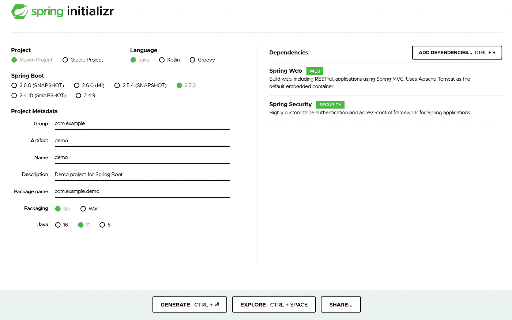
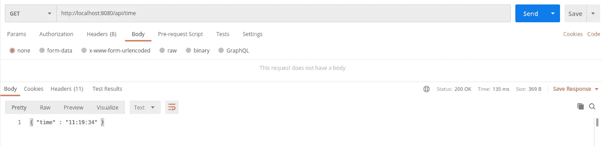
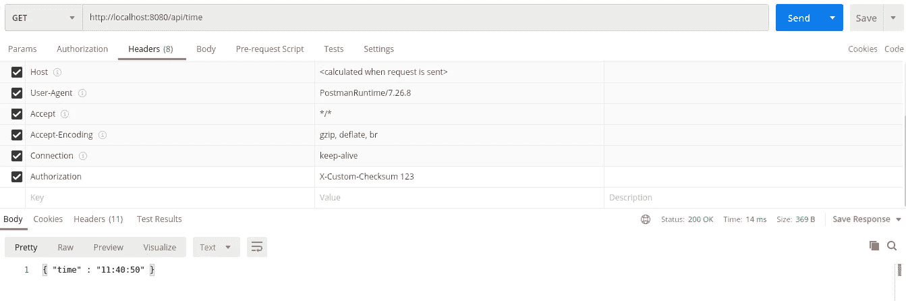
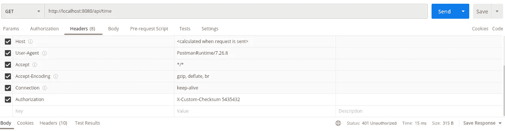

# 用 Java/Spring 定制 HTTP 安全机制

> 原文：<https://medium.com/javarevisited/custom-http-security-mechanisms-with-java-spring-30326110933b?source=collection_archive---------4----------------------->

如今，典型的 HTTP 安全性要么通过传递可以使用 OAUTH2 或 JWT 验证的不记名令牌来处理，要么有时甚至只是通过 HTTP 基本身份验证来保持简单。

如果您需要使用替代的身份验证机制——因为您的客户有一些古怪的遗留需求，或者因为典型的基于令牌的凭证不适合集成范例——那么您可能需要实现一个定制的处理程序。

使用 [Spring Security](/javarevisited/top-10-courses-to-learn-spring-security-and-oauth2-with-spring-boot-for-java-developers-8f0222d6066d) ，在 Java 中这样做相当简单。我们的例子将使用 Java 11、 [Maven](/javarevisited/6-best-maven-courses-for-beginners-in-2020-23ea3cba89) 和 [Spring Boot](/javarevisited/top-10-courses-to-learn-spring-boot-in-2020-best-of-lot-6ffce88a1b6e?source=---------39------------------) 来构建。

使用 [Spring Initializr](https://start.spring.io/) 创建一个带有 Spring Web 和 Spring Security 的新 Maven 项目——这将为您提供入门所需的一切:

[](https://javarevisited.blogspot.com/2020/05/top-20-spring-boot-interview-questions-answers.html)

为您的工件和打包使用您想要的任何名称——但是使用 Jar 打包来保持它的简单。

下载项目并将其加载到您选择的 IDE 中。您将有一个开箱即用的工作 REST 服务器，所以现在我们只需要添加一些简单的 API，我们可以使用我们的自定义安全性来保护它们。下面是一个返回当前时间的 API 的简单示例:

```
package net.cambium.examples.rest;import java.text.SimpleDateFormat;
import java.util.Date;import org.springframework.web.bind.annotation.GetMapping;
import org.springframework.web.bind.annotation.RequestMapping;
import org.springframework.web.bind.annotation.RestController;/**
 * TimeController.
 * 
 *  Simple example REST service that we plan on securing
 *  with a custom security mechanism.  
 *
 * [@author](http://twitter.com/author) Baruch Speiser, Cambium.
 */
[@RestController](http://twitter.com/RestController)
[@RequestMapping](http://twitter.com/RequestMapping)("/api/time")
public class TimeController {

  [@GetMapping](http://twitter.com/GetMapping)
  public String now() {
    Date now = new Date();
    SimpleDateFormat formatter = new SimpleDateFormat("hh:mm:ss");
    String result = formatter.format(now);
    return String.format("{ \"time\" : \"%s\" }", result);
  }

}
```

运行您的应用程序并使用 HTTP 客户端(如 [Postman](/javarevisited/7-best-courses-to-learn-postman-tool-for-web-service-and-api-testing-f225c138fa5a) )来查看您的 API 是否可访问:



现在我们准备介绍我们的自定义安全方法。在我们的例子中，我们将使用一个简单的校验和验证作为例子——这显然不是一个保护 API 的好方法，但是我们更感兴趣的是如何将一个定制的例子应用到您的应用程序中，所以现在已经足够了。

我们将从创建一个定制的 HTTP 请求过滤器[开始，它将允许我们拒绝任何我们不想批准的 HTTP 请求。为了便于说明，我们将对其进行编码，以查看标准授权头，但使用非标准头值:](https://javarevisited.blogspot.com/2021/02/spring-security-interview-questions-answers-java.html)

```
package net.cambium.examples.rest.security;import java.io.IOException;import javax.servlet.Filter;
import javax.servlet.FilterChain;
import javax.servlet.ServletException;
import javax.servlet.ServletRequest;
import javax.servlet.ServletResponse;
import javax.servlet.http.HttpServletRequest;
import javax.servlet.http.HttpServletResponse;import org.slf4j.Logger;
import org.slf4j.LoggerFactory;
import org.springframework.http.HttpHeaders;
import org.springframework.http.HttpStatus;/**
 * CustomAuthorizationFilter.
 *
 *  Introduce our own custom security mechanism to determine access. 
 *  We use a simple checksum verification as an oversimplified 
 *  example. 
 *
 * @author Baruch Speiser, Cambium.
 *
 */
public class CustomAuthorizationFilter implements Filter {
  private static final String AUTHORIZATION_TYPE_PREFIX = 
                                "X-Custom-Checksum ";
  private static final Logger log LoggerFactory.getLogger(
                                CustomAuthorizationFilter.class);

  /** Perform basic HTTP request filter handling. */
  @Override
  public void doFilter(
    ServletRequest request, 
    ServletResponse response, 
    FilterChain chain) 
  throws IOException, ServletException 
  {
    if(request instanceof HttpServletRequest) {
      //We only care about HTTP requests, 
      // there isn't anything else here anyway
      HttpServletRequest req = (HttpServletRequest)request;
      if(!isAuthenticated(req)) {
        //Not allowed in, reject the request:
        HttpServletResponse res = (HttpServletResponse)response;
        res.sendError(HttpStatus.UNAUTHORIZED.value());
        return;
      }
      //otherwise, fall through and continue handling the request
    } 
    chain.doFilter(request, response);
  } /** 
   * Check to see if the request includes our 
   * custom authorization header. 
   */
  private boolean isAuthenticated(HttpServletRequest request) {
    try {
      String authorization = request.getHeader(
                               HttpHeaders.AUTHORIZATION);
      //our custom authorization mechanism is here:
      if(null != authorization 
      && authorization.startsWith(AUTHORIZATION_TYPE_PREFIX)) 
      {
        String numerical = authorization.substring(
                             AUTHORIZATION_TYPE_PREFIX.length());
        long number = Long.parseLong(numerical);
        return isValidChecksum(number); 
      }
      //otherwise:
      return false;
    } catch(Exception e) {
      log.warn("Failure while parsing authorization header, " +
               "could have been sent in an incorrect format", 
               e);
      return false;
    }
  } /** 
   * Validate checksum, i.e. verify the 
   * supplied "credentials" to see if they are valid 
   */
  private boolean isValidChecksum(long number) {
    //Extract the last digit:
    long last = number % 10;
    //Add up all the other digits:
    long sum = 0;
    for(long num = (number /= 10); num > 0; num /= 10) {
      sum += num % 10;
    }
    //Now check if the last digit of the sum 
    // matches the last digit of the original number:
    return (sum % 10 == last); 
  }

}
```

在上面的算法中，传递头值“X-Custom-Checksum 123”会被允许通过(因为 1+2=3)，但是“X-Custom-Checksum 1234”会失败(因为 1+2+3！= 4).

最后一步是[配置 Spring Security](https://javarevisited.blogspot.com/2017/05/how-to-enable-spring-security-in-java-web-application.html) 来使用我们的过滤器作为安全过滤器链的一部分。因为我们不使用用户名和密码，所以我们将使用校验和验证来替换标准的 Spring Security 用户名/密码验证选项:

```
package net.cambium.examples.rest.security;import org.springframework.context.annotation.Configuration;
import org.springframework.security.config.annotation
          .web.builders.HttpSecurity;
import org.springframework.security.config.annotation
          .web.configuration.EnableWebSecurity;
import org.springframework.security.config.annotation
          .web.configuration.WebSecurityConfigurerAdapter;
import org.springframework.security
          .web.authentication.UsernamePasswordAuthenticationFilter;/**
 * SecurityConfiguration.
 *
 *  Spring Security configuration for Spring Boot that 
 *  will allow us to use a custom authorization mechanism.
 *  
 * [@author](http://twitter.com/author) Baruch Speiser, Cambium.
 */
[@Configuration](http://twitter.com/Configuration)
[@EnableWebSecurity](http://twitter.com/EnableWebSecurity)
public class SecurityConfiguration 
     extends WebSecurityConfigurerAdapter 
{ [@Override](http://twitter.com/Override)
  protected void configure(HttpSecurity http) throws Exception {
    //Use our custom security filter instead 
    // of username/password authentication:
    http.addFilterAt(
        new CustomAuthorizationFilter(), 
        UsernamePasswordAuthenticationFilter.class);
  }

}
```

然后，我们应该能够看到我们的自定义校验和验证在起作用:

[](https://javarevisited.blogspot.com/2018/07/ldap-authentication-active-directory-authentication-java-spring-security-example.html)

有效的校验和给你一个成功的响应。



如果校验和没有通过验证，那么请求将被拒绝，并显示 401 Unauthorized。

我们没有理由不能使用与常规令牌相同的约定来传递我们的数字，使用“Bearer 123”的头值，然后以相同的方式提取数值。

作为一条规则，你应该尽可能地坚持惯例——但是如果需要的话， [Spring Security](/javarevisited/3-best-spring-security-books-and-resources-for-java-programmers-653d05c8afd4) 提供了引入任何你需要的适合你的项目的机制的灵活性。