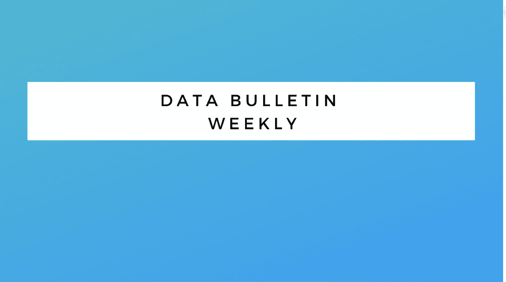

# 数据工程通报—文摘#2

> 原文：<https://medium.com/javarevisited/data-engineering-bulletin-digest-2-e2042137d667?source=collection_archive---------6----------------------->

## 本周的更新涵盖了数据管理、工作流、静态 SQL 分析、实时消息传递、跨云分析等等。

## 介绍

*   作为一名[数据工程师](/javarevisited/5-best-data-engineering-and-cloud-certifications-from-ibm-on-coursera-88571c6f47e3)，我总是很好奇，想知道别人在这个领域做什么。了解…发生了什么的最好方法是