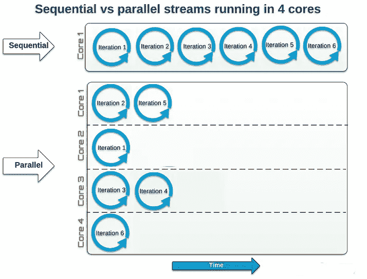

# 数据处理—在并行线程中执行功能— java8

> 原文：<https://medium.com/javarevisited/data-processing-execute-functions-in-parallel-threads-java8-14cef4390853?source=collection_archive---------7----------------------->

减少数据处理时间并更快地获得结果，成为开发人员一生的座右铭。🤦‍♂️🤷‍♂ ️In 是一个微服务架构，我们经常需要将一个 POJO 对象转换成另一个。因此性能在软件开发生命周期中起着至关重要的作用。

在这篇博客中，我们将介绍 parallelStream()的 java8 的一个特性。在此之前，我们先了解一下 parallelStream 的概念以及 Stream()和 parallelStream()的区别。

🔊大多数现代操作系统将单线程应用程序划分到多个内核上(同一线程的某些部分可能会在几个内核上运行，但当然不会同时运行)。[并行流](/javarevisited/7-best-java-tutorials-and-books-to-learn-lambda-expression-and-stream-api-and-other-features-3083e6038e14)利用计算机的多个内核，将提供的任务分成多个，在不同的线程中运行。

另一方面，顺序流的工作方式就像使用单核的 for-loop。

[](https://medium.com/javarevisited/top-5-courses-to-learn-new-features-of-java-8-to-java-13-107eb51d2a13)

例如，我们有 OrderVo.class，它也包含关于支付的信息，我们需要准备`PaymentVo.class`来传递支付微服务，但是如果当时我们在`List<OrderVo>?` 中有数百万个订单对象，为了有效地利用内存，我们可以使用 parallelStream()和 fork-join 池来获得更快的输出。

让我们看看下面的代码片段，它有两个输入(主要)，一个是输入数据的集合，第二个是将输入转换为输出格式的函数名。

```
**public static** <T, E> List<E> executeFunctionsInParallelThreads(Collection<T> collectionInput, Function<T, E> functionOfClass, **int** parallelThreads){
   List<E> responseList = **null**;
   **if**(collectionInput == **null** || collectionInput.isEmpty()){
      **return** responseList;
   }
   Stream<E> stream = collectionInput.parallelStream().map(functionOfClass);
   Callable<List<E>> task = () -> stream.collect(Collectors.*toList*());
   ForkJoinPool forkJoinPool = **new** ForkJoinPool(parallelThreads);
   **try** {
      responseList = forkJoinPool.submit(task).get();
   } **catch** (Exception e) {
      e.printStackTrace();
   }
   **return** responseList;
}
```

下面是根据我们的示例调用上述函数的调用部分。✔

```
*// fetchOrderList() which provides list of Order data* **List<OrderVo> orderVoList = fetchOrderList();**
*// convertOrderToPayment() which has logic to convert orderVo to PaymentVo, here 5 is number of parallel threads to be executed* **List<PaymentVo> paymentList = *executeFunctionsInParallelThreads*(orderVoList, convertOrderToPayment, 5);**
*// second example where convertOrderToPayment() method from PaymentVoConverter class***List<PaymentVo> paymentList = *executeFunctionsInParallelThreads*(orderVoList, PaymentVoConverter::convertOrderToPayment, 5);**
```

要了解更多关于 parallelStream()和 ForkJoinPool 的信息，您可以点击下面的链接。

感谢阅读。享受…！！！😊😊

    </hackernoon/top-5-java-8-courses-to-learn-online-2db57d9dfb8d> 