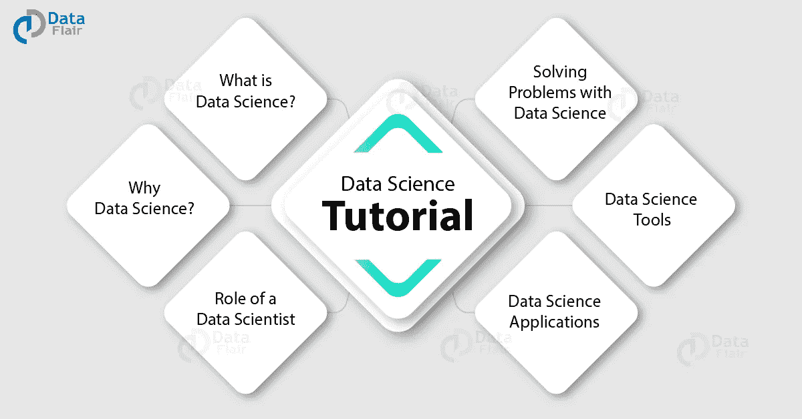

# 数据科学—完整教程

> 原文：<https://medium.com/javarevisited/data-science-the-complete-tutorial-5310bc25d1f4?source=collection_archive---------3----------------------->

数据科学已经成为 21 世纪最受欢迎的工作之一。这已经成为一个几乎每个人都在谈论的流行语。但是什么是数据科学呢？在本文中，我们将揭开数据科学家的角色[数据科学](https://dev.to/javinpaul/10-data-science-and-machine-learning-courses-for-programmers-looking-to-switch-career-57kd)的神秘面纱，并了解掌握数据科学所需的工具。

# 什么是数据科学？

“数据科学是关于信息的提取、准备、分析、可视化和维护。它是一个跨学科领域，使用科学方法和过程从数据中获取洞察力。”

随着新技术的出现，数据呈指数级增长。这创造了一个从数据中分析和得出有意义的见解的机会。

它需要“数据科学家”的特殊专业知识，能够使用各种统计和机器学习工具来理解和分析数据。专攻[数据科学](https://hackernoon.com/10-machine-learning-data-science-and-deep-learning-courses-for-programmers-7edc56078cde)的数据科学家不仅分析数据，还使用**机器学习算法来预测未来事件的发生**。

因此，我们可以将数据科学理解为一个使用各种统计方法和[计算机算法](https://javarevisited.blogspot.com/2018/11/top-5-data-structures-and-algorithm-online-courses.html#axzz5YFaOvjsh)处理数据处理、分析和从数据中提取洞察力的领域。它是一个结合了数学、统计学和计算机科学的多学科领域。

# 为什么是数据科学？

所以，在知道数据科学到底是什么之后，你必须探究数据科学为什么重要。因此，数据已经成为工业的燃料。这是新的电力。公司需要数据来运作、发展和改善他们的业务。

数据科学家处理数据，以帮助公司做出正确的决策。公司在数据科学家[的帮助下采用的数据驱动方法](http://www.java67.com/2018/01/top-10-web-mobile-and-big-data-framework-libraries-technologies-programmers-should-learn-in-2018.html)，数据科学家分析大量数据以得出有意义的见解。

这些见解将有助于那些希望分析自己及其市场表现的公司。

除了商业行业，医疗保健行业也使用数据科学。这种技术在早期诊断阶段对识别微小肿瘤和畸形有着巨大的需求。

自 2012 年以来，数据科学家的职位数量增长了 650%。根据美国劳工统计局的数据，到 2026 年，T4 将创造约**1150 万个工作岗位**。此外，数据科学家的工作在 Linkedin 上名列前茅。所有的统计数据都表明对数据科学家的需求越来越大。

# 数据科学家的角色

您可能想知道谁是数据科学家，他/她在不同领域的角色是什么。数据科学家处理非结构化数据和结构化数据。

非结构化数据以原始格式呈现，需要大量的数据预处理、清理和组织，以便为数据集赋予有意义的结构。

然后，数据科学家调查这些有组织的数据，并使用各种统计方法对其进行彻底分析，以从中获取信息。

我们使用这些统计方法来描述、可视化和假设来自数据的信息。然后，通过使用高级机器学习算法，数据科学家预测事件的发生，并做出数据驱动的决策。

一个 [**数据科学家**](https://www.sas.com/en_us/insights/analytics/what-is-a-data-scientist.html) 部署大量工具和实践来识别数据中的冗余模式。这些工具范围从 [SQL](https://hackernoon.com/top-5-sql-and-database-courses-to-learn-online-48424533ac61) 、 [Hadoop](/swlh/5-free-online-courses-to-learn-big-data-hadoop-and-spark-in-2019-a553e6ccfe30) 到 Weka、 [R](https://hackernoon.com/5-free-r-programming-courses-for-data-scientists-and-ml-programmers-5732cb9e10) 和 [Python](https://hackernoon.com/top-5-courses-to-learn-python-in-2018-best-of-lot-26644a99e7ec) 。

数据科学家通常担任公司聘用的顾问，参与各种决策流程和战略制定。换句话说，数据科学家使用来自数据的有意义的见解来帮助公司做出更明智的商业决策。

例如，像网飞、谷歌和亚马逊这样的公司正在利用数据科学为他们的用户开发强大的推荐系统。同样，各种金融公司正在使用预测分析和预测方法来预测股票价格。

数据科学有助于创建更智能的系统，这些系统可以根据历史数据集做出自主决策。通过与计算机视觉、自然语言处理和强化学习等新兴技术的融合，它已经形成了一个更大的 [**人工智能**](https://data-flair.training/blogs/artificial-intelligence-tutorial/) 的图景。

# 用数据科学解决问题

使用数据科学解决现实世界的问题时，解决问题的第一步是从数据清理和预处理开始。当向数据科学家提供数据集时，它可能是非结构化格式的，存在各种不一致。

组织数据并删除错误信息使得分析和获得洞察力变得更加容易。这个过程包括删除冗余数据、将数据转换成规定的格式、处理丢失的值等。

数据科学家通过各种统计程序分析数据。具体而言，使用的两种程序是:

*   描述统计学
*   推断统计学

假设你是一名数据科学家，在一家制造手机的公司工作。你得用你公司的手机分析客户。为了做到这一点，你首先要彻底查看数据，了解各种趋势和模式。

最后，您将汇总数据，并以图表的形式呈现出来。因此，你应用描述统计学来解决这个问题。

然后你将从数据中得出“推论”或结论。我们将通过下面的例子来理解推断统计——假设您希望找出制造过程中出现的大量缺陷。

然而，手机的单独测试可能需要时间。因此，您将考虑给定手机的一个样本，并对总样本中有缺陷手机的数量进行归纳。

现在，你必须预测两年内手机的销量。因此，您将使用回归算法。根据给定的历史销售额，您将使用回归算法来预测一段时间内的销售额。

此外，您希望根据客户的年薪、年龄、性别和信用评分来分析他们是否会购买产品。您将使用历史数据来确定客户是否会购买(1)或(0)。

由于有两个输出或“类”，您将使用二进制分类算法。此外，如果有两个以上的输出类，我们使用多元分类算法来解决这个问题。上述两个问题都是“监督学习”的一部分。

也有“未标记”数据的实例。在这种情况下，不存在如上所述的固定类别中的输出分离。假设您必须根据潜在客户和潜在客户的社会经济背景来寻找他们。

由于您的历史数据中没有固定的一组类，因此您将使用聚类分析算法来识别潜在客户的分类或集合。聚类是一种“无监督学习”算法。

自动驾驶汽车已经成为一种趋势技术。自动驾驶汽车背后的原则是自主性，即能够在没有人类干预的情况下做出决定。

传统的计算机需要人工输入才能产生输出。强化学习解决了人类依赖性的问题。强化学习是关于采取特定的行动来积累最大的回报。你可以通过下面的例子来理解这一点:假设你正在训练一只狗去捡球。

然后，每当狗拿到球时，你就奖励它一份食物或奖励。如果它不去捡球，你就不要给它奖励。如果狗把球捡回来，它就会意识到奖励的存在。

强化学习使用同样的原理。我们根据代理的活动给它一个奖励，它会努力使奖励最大化。

数据科学家需要工具和软件来解决上述问题。我们现在来看看数据科学家用来解决这些问题的一些工具。

# 数据科学工具

数据科学家使用传统的统计方法，这些方法构成了机器学习算法的核心骨干。他们还使用[深度学习算法](https://javarevisited.blogspot.com/2018/10/data-science-and-machine-learning-courses-using-python-and-R-programming.html)来生成稳健的预测。数据科学家使用以下工具和编程语言 *:*

# 国税局

[**R 是一种专门为统计计算量身定制的脚本语言**](https://data-flair.training/blogs/r-tutorial/) 。它被广泛用于数据分析、统计建模、时间序列预测、聚类等。r 主要用于统计运算。它还拥有面向对象编程语言的特性。R 是一种基于解释器的语言，广泛流行于多个行业。如果你想学习 R，你可以查看这个免费 R 编程课程列表。

# 二。计算机编程语言

像 R 一样，Python 是一种基于解释器的高级编程语言。Python 是一种通用语言。它主要用于数据科学和软件开发。 [Python](https://dzone.com/articles/top-5-courses-to-learn-python-in-2018-best-of-lot) 因其易用性和代码可读性而广受欢迎。

因此，Python 被广泛用于数据分析、自然语言处理和计算机视觉。Python 自带了各种图形和统计包，如 Matplotlib、Numpy、SciPy 以及更高级的深度学习包，如 [TensorFlow](https://hackernoon.com/top-5-tensorflow-and-ml-courses-for-programmers-8b30111cad2c) 、PyTorch、Keras 等。

出于数据挖掘、争论、可视化和开发预测模型的目的，我们利用 Python。这使得 Python 成为一种非常灵活的编程语言。如果你想学习 Python，这里有一份[为程序员准备的 10 门免费 Python 课程](https://hackernoon.com/10-free-python-programming-courses-for-beginners-to-learn-online-38312f3b9912?source=extreme_sidebar---------0-2--------------------)的清单。

# 三。结构化查询语言

SQL 代表结构化查询语言。数据科学家使用 SQL 来管理和查询存储在数据库中的数据。能够从数据库中提取信息是分析数据的第一步。关系数据库是以表格形式组织的数据集合。

我们使用 [SQL](https://dzone.com/articles/top-5-sql-and-database-courses-to-learn-online-bes) 来提取、管理和操作数据。例如，一位在银行业工作的数据科学家使用 SQL 提取客户信息。如果你想学习 SQL 和数据库概念，这里有一个[免费课程列表，供程序员学习 SQL](http://www.java67.com/2018/02/5-free-database-and-sql-query-courses-programmers.html) 。

虽然关系数据库使用 SQL，但对于非关系数据库或分布式数据库来说，“NoSQL”是一种流行的选择。

最近 [NoSQL](https://javarevisited.blogspot.com/2019/03/top-5-nosql-database-web-developers-should-learn.html) 因其灵活的可伸缩性、动态设计和开放源代码的特性而越来越受欢迎。MongoDB、Redis 和 Cassandra 是一些流行的 NoSQL 语言。

# 四。Hadoop

大数据是另一个趋势术语，涉及海量数据的管理和存储。数据可以是结构化的，也可以是非结构化的。数据科学家必须熟悉复杂数据，并且必须知道管理海量数据集存储的工具。Hadoop 就是这样一个工具。

虽然是开源软件，但 Hadoop 利用了一个分布式存储系统，该系统使用一种称为“MapReduce”的模型。Hadoop 中有 Apache Pig、Hive、HBase 等几个包。有兴趣的可以看看这份学习大数据技术的[课程列表。](https://javarevisited.blogspot.com/2017/12/top-5-courses-to-learn-big-data-and.html#axzz5bKDxWpoU)

由于其快速处理海量数据的能力，可扩展的架构和低成本的部署， [**Hadoop 已经成为最受欢迎的大数据软件**](https://data-flair.training/blogs/hadoop-tutorial/) 。

# 动词 （verb 的缩写）（舞台上由人扮的）静态画面

Tableau 是一个数据可视化软件，专门从事数据的图形分析。它允许用户创建交互式可视化和仪表板。这使得 Tableau 成为以交互式图表(如树状图、直方图、箱线图等)的形式显示数据的各种趋势和见解的理想选择。Tableau 的一个重要特性是它能够连接电子表格、关系数据库和云平台。这允许 Tableau 直接处理数据，使用户更容易使用。

# 不及物动词新西兰黑秧鸡

对于期待熟悉机器学习的数据科学家来说，Weka 可能是一个理想的选择。Weka 一般用于数据挖掘，但也包括机器学习 操作所需的 [**各种** **工具。它是完全开源的软件，使用 GUI 界面，使用户更容易与它交互，而不需要任何代码。**](https://data-flair.training/blogs/machine-learning-software/)

# 数据科学的应用

数据科学已经在医药、银行、制造、运输等多个行业建立了强大的立足点。它有着巨大的应用和多种用途。以下是数据科学的一些应用:

# I .医疗保健中的数据科学

数据科学在医疗保健行业一直扮演着举足轻重的角色。在分类算法的帮助下，医生能够使用图像识别软件在早期检测癌症和肿瘤。基因产业使用数据科学对基因组序列模式进行分析和分类。各种虚拟助手也在帮助病人解决他们的身体和精神疾病。

# 二。电子商务中的数据科学

亚马逊使用一个推荐系统，根据用户的历史购买记录向用户推荐各种产品。数据科学家开发了推荐系统，利用机器学习预测用户偏好。

# 三。制造业中的数据科学

工业机器人已经取代了制造部门所需要的平凡而重复的角色。这些工业机器人在本质上是自主的，并使用强化学习和图像识别等数据科学技术。

# 四。作为对话代理的数据科学

亚马逊的 Alexa 和苹果的 Siri 使用语音识别来理解用户。数据科学家开发了这个语音识别系统，将人类语音转换成文本数据。此外，它使用各种机器学习算法对用户查询进行分类，并提供适当的响应。

# 动词 （verb 的缩写）运输中的数据科学

自动驾驶汽车使用自主代理，这些代理利用强化学习和检测算法。由于数据科学的进步，自动驾驶汽车不再是虚构的。

# 摘要

虽然数据科学是一个庞大的学科，是多种技术和学科的集合，但通过正确的方法获得这些技能是可能的。最后，数据科学是一个非常强大的领域，最适合擅长实验和解决问题的人。随着大量的应用， [**数据科学已经成为最通用的职业**](https://data-flair.training/blogs/future-of-data-science/) 。

其他有用的**数据科学与机器学习**资源
[机器学习作者吴恩达](https://click.linksynergy.com/fs-bin/click?id=JVFxdTr9V80&subid=0&offerid=467035.1&type=10&tmpid=18061&RD_PARM1=https%3A%2F%2Fwww.coursera.org%2Flearn%2Fmachine-learning)
[数据科学 A-Z:真实数据科学习题收录](https://click.linksynergy.com/fs-bin/click?id=JVFxdTr9V80&subid=0&offerid=323058.1&type=10&tmpid=14538&RD_PARM1=https%3A%2F%2Fwww.udemy.com%2Fdatascience%2F)[Top 8 Python 机器学习库](https://javarevisited.blogspot.com/2018/10/top-8-python-libraries-for-data-science-machine-learning.html)
[5 门免费课程学习机器学习 R 编程](http://www.java67.com/2018/09/top-5-free-R-programming-courses-for-Data-Science-Machine-Learning-Programmers.html)
[5 门免费课程学习 Python 2018 年](http://www.java67.com/2018/02/5-free-python-online-courses-for-beginners.html)
[Top 5 数据科学与机 TensorFlow 和机器学习课程](https://hackernoon.com/top-5-data-science-and-machine-learning-course-for-programmers-e724cfb9940a)
[程序员可以学习的 10 项技术 2018 年](http://www.java67.com/2018/01/top-10-web-mobile-and-big-data-framework-libraries-technologies-programmers-should-learn-in-2018.html)
[更好地学习 Python 的前 5 门课程](http://javarevisited.blogspot.sg/2018/03/top-5-courses-to-learn-python-in-2018.html)
[一个日本黄瓜农如何利用深度学习和 TensorFlow](https://cloud.google.com/blog/products/gcp/how-a-japanese-cucumber-farmer-is-using-deep-learning-and-tensorflow)