# 数据类型、常用算法、时间复杂度和数据结构

> 原文：<https://medium.com/javarevisited/data-types-common-algorithms-time-complexity-and-data-structures-23a06a68a355?source=collection_archive---------0----------------------->

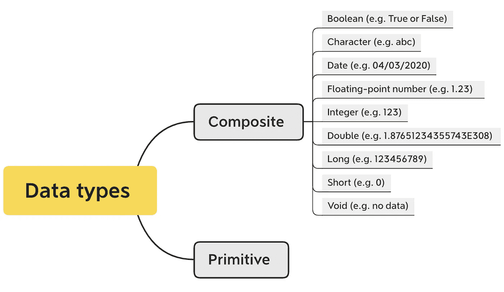

*   原始数据类型——包括`byte`、`short`、`int`、`long`、`float`、`double`、`boolean`和`char`
*   复合(非基元)数据类型——例如`String`、`arrays`和`classes`(当您将基元组合成包含或合并它们的单个“实体”时)。

# 常见算法

## 1.分步解决

我们首先将问题分成子问题，然后将它们组合在一起，得到问题的最终解决方案。该算法分两步处理:

*   Divide:我们将输入数组分成两半。轴心是数组的中点。递归地执行该步骤，直到不再有半数组要划分。
*   征服:我们从下到上对分割后的数组进行排序合并，最终得到排序后的数组。

以下面的“ [**归并排序**](https://www.java67.com/2018/03/mergesort-in-java-algorithm-example-and.html) ”为例，我们可以看到数组被递归减半，直到大小变为 1。一旦大小变为 1，合并和排序就开始了。

[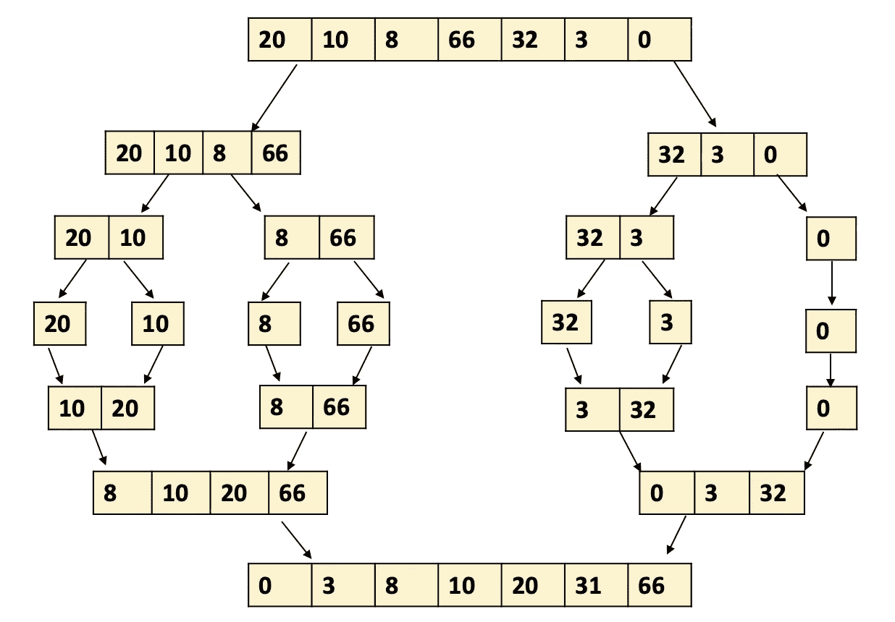](https://javarevisited.blogspot.com/2017/06/difference-between-stable-and-unstable-algorithm.html#axzz6dXsEfLvJ)

**Java 代码:**

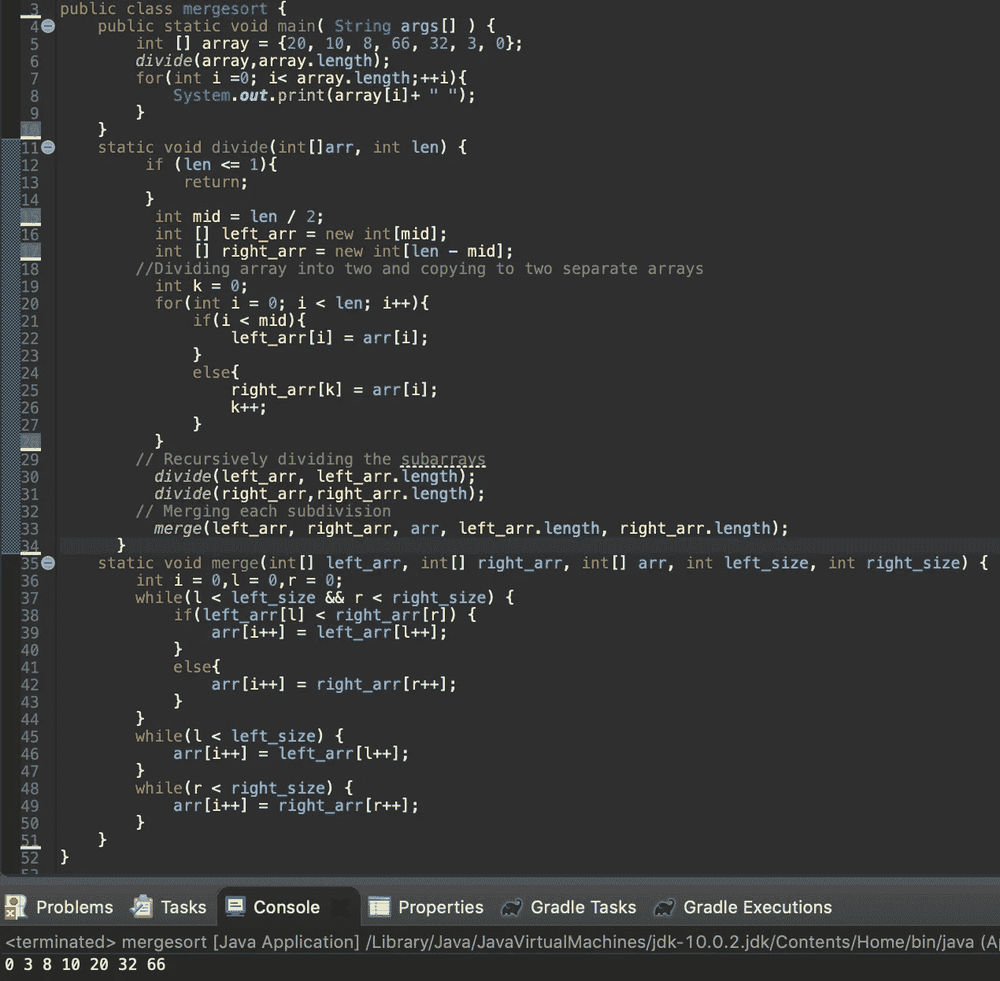

Java 中的合并排序

## 2.递归

如果你想学习递归，汉诺塔是一个经典的问题。

**Java 中的代码:**

[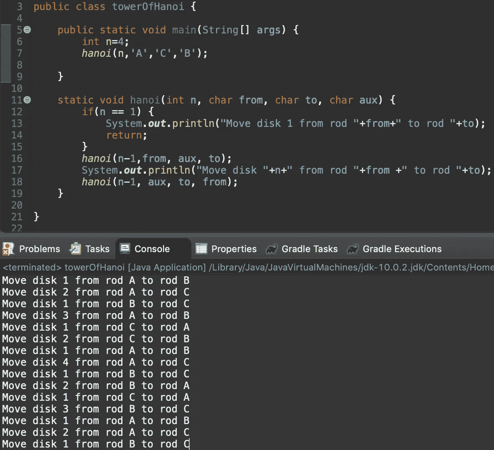](https://javarevisited.blogspot.com/2012/12/recursion-in-java-with-example-programming.html#axzz6ieZZarMY)

爪哇的河内塔

## 3.贪婪算法

例如，考虑**最小硬币数**问题。给定一个值 V，如果我们要兑换 V，我们有无限量的台湾货币。进行兑换最少需要多少硬币？

**Java 中的代码:**

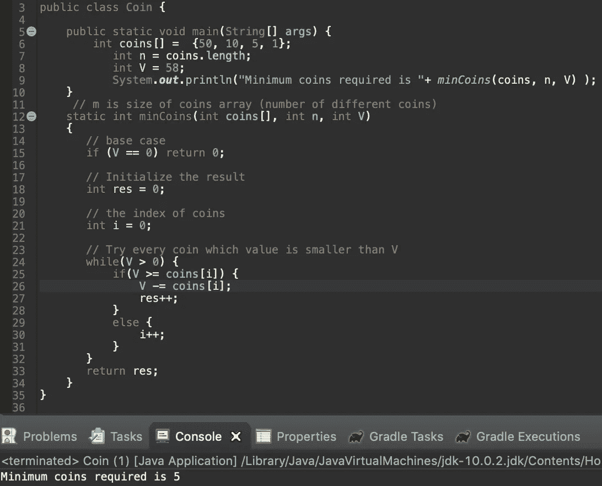

## 4.动态规划

[动态规划](https://javarevisited.blogspot.com/2021/03/top-dynamic-programming-problems-for-coding-interviews.html)的主要思想是保存子问题的结果，以便我们在将来可以简单地使用这些结果，而不是重新计算这些值。

我们就拿 [**斐波那契数列**](https://www.java67.com/2019/03/nth-fibonacci-number-in-java-coding.html) 这个简单的例子来说:求 Fn = Fn-1 + Fn-2 定义的第 n 个斐波那契数对于 n > 1，F0 = 0，F1 = 1

**Java 代码:**

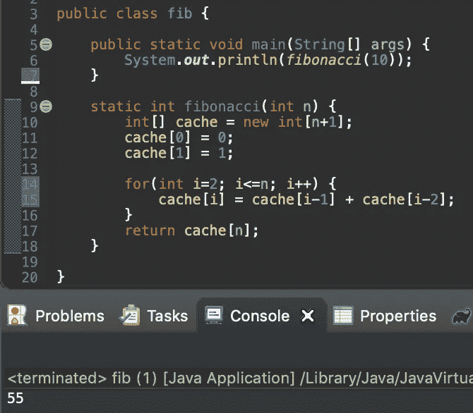

## **5。迭代**

问题: [LeetCode #104。**二叉树的最大深度**](https://leetcode.com/problems/maximum-depth-of-binary-tree/)

Java 中求深度的迭代版本如下:

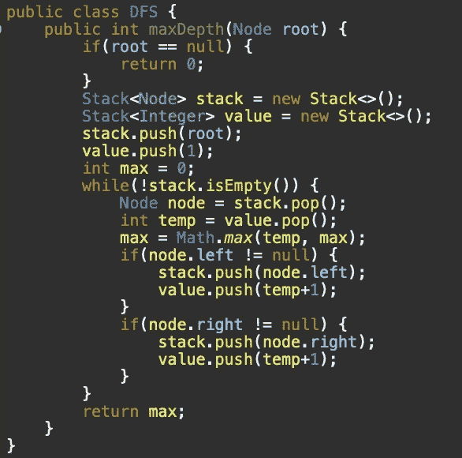

深度优先搜索

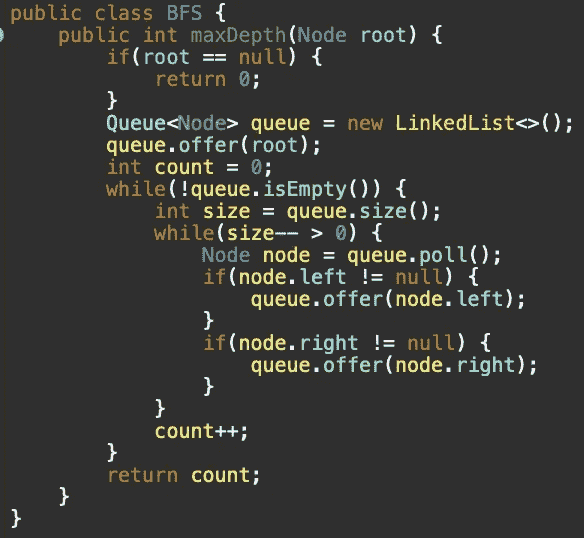

BFS

## 6.列举

枚举(或 enum)是用户定义的数据类型。它主要用于给整型常量命名，这些名字使得程序易于阅读和维护。**回溯**是一种典型的枚举策略。回溯是一种不用尝试所有可能性就能解决**约束满足问题**的方法。n 皇后问题是经典的回溯问题。问题是在一个 n×n 的棋盘上放置 n 个皇后，这样就不会有两个皇后互相攻击。这意味着没有两个皇后在同一行、同一列或同一对角线上。

问题: [LeetCode #51。n 皇后](https://leetcode.com/problems/n-queens/)

Java 代码:

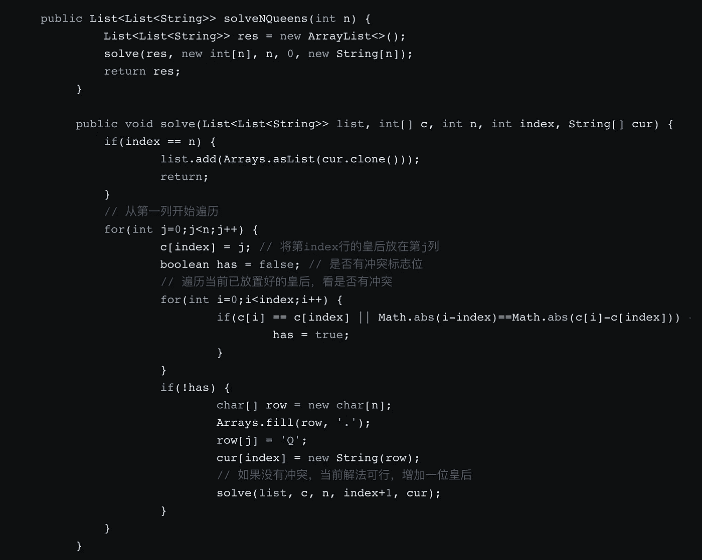

来源:[https://zgljl2012.com/leetcode-51-n-queens/](https://zgljl2012.com/leetcode-51-n-queens/)

# 大 O 符号

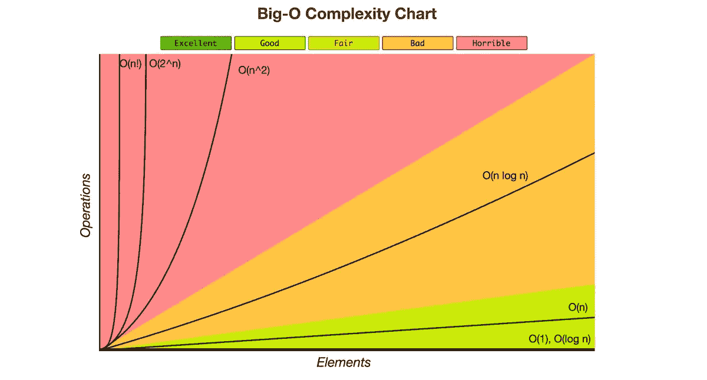

来源:[https://www.bigocheatsheet.com/](https://www.bigocheatsheet.com/)

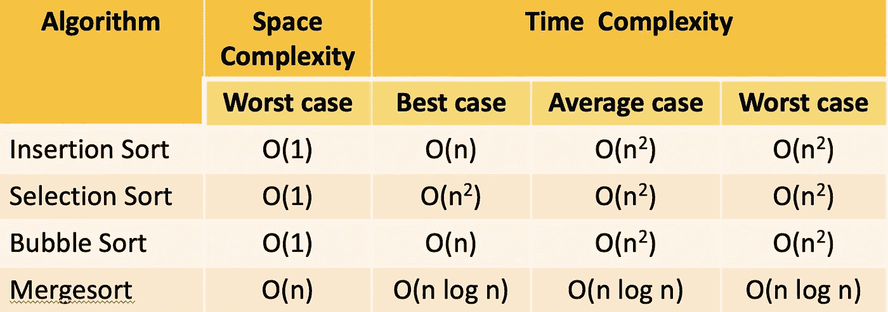

常见排序算法

# 静态和动态数据结构

以下材料来自[http://www . ayomaonline . com/academic/static-vs-dynamic-data-structures/](http://www.ayomaonline.com/academic/static-vs-dynamic-data-structures/)❤️，特此致谢

## 静态数据结构:数组，列表

正如静态这个词所暗示的一样，[静态数据结构](https://www.java67.com/2019/07/top-10-online-courses-to-learn-data-structure-and-algorithms-in-java.html)是用来存储静态“数据集”的。然而，一个静态的“数据集”，并不意味着我们不能改变元素的赋值。它是分配给“数据”的内存大小，是静态的。因此，有可能改变静态结构的内容，但不增加分配给它的内存空间。

## 动态数据结构:堆栈、队列、堆、树、链表

动态数据结构旨在便于运行时[数据结构](https://www.java67.com/2013/08/ata-structures-in-java-programming-array-linked-list-map-set-stack-queue.html)的改变。可以改变元素的赋值，就像静态结构一样。A

同样，在动态结构中，初始分配的内存大小不是问题。可以添加新元素、删除现有元素或对数据集进行任何类型的操作，而无需考虑最初分配的内存空间。

## 静态数据结构与动态数据结构

静态数据结构被给定了一个固定的内存区域，它可以在其中操作。不可能在运行时扩展这个固定大小。因此，每个元素的位置都是固定的，并且为程序所知。

动态数据结构也有它可以操作的区域。然而，这个区域的大小是灵活的，不像静态数据结构那样是固定的。通过添加或删除[数据结构](/javarevisited/top-10-free-data-structure-and-algorithms-courses-for-beginners-best-of-lot-ad807cc55f7a?source=grid_home---------0-2-----------------18---ce729948_f262_4982_a7a1_a5058c8fe9fa--)中的元素，可以根据需要扩大或缩小区域。

# 公共数据结构操作

从下面的图表可以看出动态和静态数据结构在时间复杂度上的巨大差异。

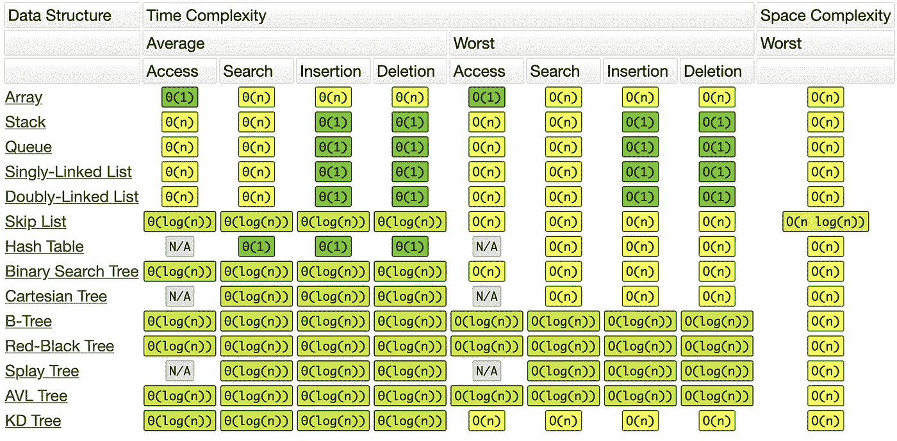

来源:来源:【https://www.bigocheatsheet.com/ 

—

# 另外，我想通过这里的掌声和你交流。所以如果你喜欢这个故事，请奖励我 1-3👏(PS 按住点击👏不用动手指就能连续鼓掌。);如果你在关注我，也期待我访问你的故事，请给我 5 分👏让我去 know️ ❤ ️