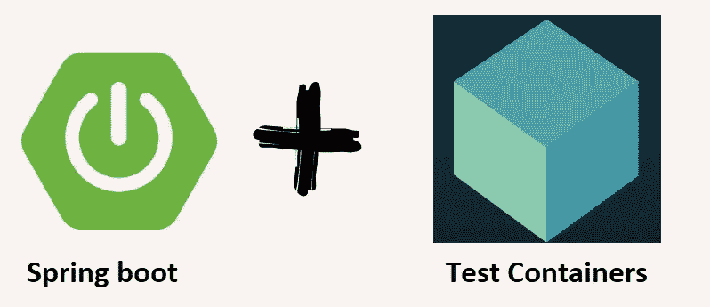

# 用 Testcontainers 进行数据库集成测试

> 原文：<https://medium.com/javarevisited/database-integration-testing-with-testcontainers-8b4be2404a55?source=collection_archive---------2----------------------->



用 Testcontainers 进行数据库集成测试

# 介绍

在本文中，我们将关注 Testcontainers，以及如何使用它来为您的集成测试构建一次性测试数据库。您将看到 Testcontainers 为内存数据库(如 H2)提供了一个很好的替代方案。

在内存中，数据库在速度和简单性方面有优势，但是有一个根本性的缺点。您的集成测试使用的数据库技术与您的应用程序将在生产中使用的数据库技术有很大不同。Testcontainers 允许您旋转您选择的数据库，以便您的持久性测试运行在您将在生产中使用的相同数据库技术上。这使你的测试更加可信，并降低风险。

注意:除了数据库，Testcontainers 还支持很多其他技术，比如 Rabbit MQ、Kafka 和 Elasticsearch。本文将关注数据库支持。

# Spring Boot 演示应用程序

为了演示如何在典型的 Java 项目中使用 Testcontainers，我创建了一个简单的 Spring Boot REST API 来创建和检索客户。REST API 使用 Hibernate 持久层与 MySQL 数据库对话。我将向您展示如何使用 Testcontainers 来支持持久层集成测试和端到端测试。

完整的源代码可以在 [Github](https://github.com/reachansari/spring-boot-testcontainers-db-it) 上找到，所以在你进一步研究之前，请随意下载。

# Rest API

REST API 使用一个 ***客户道*** 来创建和读取 ***客户*** 实体。

```
@Slf4j
@RestController
@AllArgsConstructor
public class CustomerController { private CustomerDao customerDao; @PostMapping(path = "/api/customer")
  public Customer createCustomer(@RequestBody Customer customer) {
    log.info("saving [{}]", customer);
    Long persistedCustomerId = customerDao.save(customer);
    log.info("returning [{}]", persistedCustomerId);
    return customerDao.findById(persistedCustomerId).get();
  } @GetMapping(path = "/api/customer/{id}")
  public Customer getCustomer(@PathVariable("id") Integer customerId) {
    log.info("retrieving customer Id [{}]", customerId);
    Optional <Customer> customer = customerDao.findById(Long.valueOf(customerId));
    log.info("returning [{}]", customer);
    return customer.orElseThrow(() -> new RuntimeException("customer not found for Id " + customerId));
  }
}
```

# 顾客道

***客户道*** 提供了按客户 Id 查询、按名字查询和保存 ***客户*** 的方法。

```
@Repository
@AllArgsConstructor
public class CustomerDao { private SessionFactory sessionFactory; @Transactional
  public List <Customer> findByLastName(final String lastName) {
    Query <Customer> query = sessionFactory.getCurrentSession()
      .createQuery("From Customer Where lastName= :lastName")
      .setParameter("lastName", lastName);
    return query.list();
  } @Transactional
  public Optional <Customer> findById(Long customerId) {
    return Optional.ofNullable(sessionFactory.getCurrentSession().get(Customer.class, customerId));
  } @Transactional
  public Long save(Customer customer) {
    return (Long) sessionFactory.getCurrentSession().save(customer);
  }
}
```

# 测试演示应用

在编写任何集成或端到端测试之前，我们将创建一个定制的测试容器，以便我们可以启动 MySQL 数据库。

***定义一个定制的测试容器***
对于简单的用例来说，Testcontainers 附带了一组预定义的数据库容器，您可以开箱即用。例如，默认的***MySQL container***容器可以添加到您的测试中，如下所示。

```
private static MySQLContainer sqlContainer = new MySQLContainer<>(“mysql:8.0”);
```

如果您需要更多的控制，比如访问启动和关闭挂钩，您可以通过扩展一个标准容器来定义自己的测试容器。下面我用***custom MySQL container***就是这么做的。

```
@Slf4j
public class CustomMySqlContainer extends MySQLContainer <CustomMySqlContainer> { ***# Step 1***
  private static final String DB_IMAGE = "mysql:5.7"; ***# Step 2***
  private static CustomMySqlContainer mysqlContainer; ***# Step 3***
  private CustomMySqlContainer() {
    super(DB_IMAGE);
  } ***# Step 4***
  public static synchronized CustomMySqlContainer getInstance() {
    if (mysqlContainer == null) {
      mysqlContainer = new CustomMySqlContainer();
    }
    return mysqlContainer;
  } ** *# Step 5***
  @Override
  public void start() {
    super.start();
    System.setProperty("TEST_DB_URL", mysqlContainer.getJdbcUrl());
    System.setProperty("TEST_DB_USERNAME", mysqlContainer.getUsername());
    System.setProperty("TEST_DB_PASSWORD", mysqlContainer.getPassword());log.info("started MySql container TEST_DB_URL [{}] TEST_DB_USERNAME [{}] TEST_DB_PASSWORD [{}]");
  } ** *# Step 6***
  @Override
  public void stop() {}
}
```

***第一步*** —定义我要在测试容器中运行的 Docker 映像。这里我指定了 mysql:5.7，它将从公共 Docker Hub repo 中提取。在企业环境中，您可以从私有企业容器存储库中指定一个映像。
***第二步*** —将 CustomMysqlContainer 定义为静态。这是为了让我们可以将 CustomMysqlContainer 创建为单例。
***第三步*** —私有构造函数使用指定的映像创建 MysqlContainer 的实例。
***步骤 4***—synchronized getInstance 方法创建一个 CustomMysqlContainer singleton。
***步骤 5*** —是一个容器启动事件挂钩，启动后可以使用它来访问容器。这是获取测试中可能需要的容器元数据的一个好方法。我还从容器中获取 URL、用户名和密码，并将它们设置为系统属性，以便以后在 Spring 配置文件 application.yaml 中引用它们。这允许我们获得关于测试容器的重要信息，并在 Spring bootstraps 之前将其作为环境变量公开。
***步骤 6*** —调用父容器类上的 stop。

注意***custommysql container***是一个通用组件，因此将这个类添加到每个项目中是没有意义的。相反，它可以被添加到一个 utils Jar 中，并跨项目重用。

我们现在有了一个定制的测试容器，可以在任何需要的时候使用它来启动 MySQL 实例。接下来，我们将看看如何将***custommysql container***用作 DAO 集成测试的一部分。

# ***定制道集成测试与测试容器***

CustomerDaoTests 是一个标准的 Spring Boot 集成测试，它使用 JUnit 5 和我们在上面创建的自定义***custommysql container***。

```
***# Step 1***
@SpringBootTest***# Step 2***
@Testcontainersclass CustomerDaoTests {
  @Autowired
  private CustomerDao customerDao; ***# Step 3***
  @Container
  public static CustomMySqlContainer mySqlContainer = CustomMySqlContainer.getInstance()
    .withInitScript("database/customer-schema.sql"); ***# Step 4***
  @Test
  public void should_returnCustomers_with_LastNameJones() {
    List <Customer> customers = customerDao.findByLastName("jones");
    assertThat(customers.get(0).getFirstName(), is("Jack"));
    assertThat(customers.get(0).getLastName(), is("jones"));
    assertThat(customers.get(0).getDob(), is(LocalDate.of(1990, 01, 11)));
    assertThat(customers.get(0).getGender(), is("male"));
  } ***# Step 5***
  @Test
  public void should_returnSavedCustomer() {
    Customer customer = new Customer();
    customer.setFirstName("Olivia");
    customer.setLastName("mia");
    customer.setDob(LocalDate.of(2001, 10, 19));
    customer.setGender("female");
    customerDao.save(customer);
    List <Customer> customers = customerDao.findByLastName("mia");
    assertThat(customers.get(0).getFirstName(), is("Olivia"));
    assertThat(customers.get(0).getLastName(), is("mia"));
    assertThat(customers.get(0).getDob(), is(LocalDate.of(2001, 10, 19)));
    assertThat(customers.get(0).getGender(), is("female"));
  }
}
```

***第一步***——@ Spring Boot test 是加载 Spring test 应用上下文的标准引导注释。测试应用程序上下文包括应用程序中所有的 Spring 托管组件，并允许我们注入@CustomerDao 测试主题。
***第二步***——@ test containers 是 JUnit 5 Jupiter 的扩展。它扫描测试中用@Container 注释的字段，并调用注释容器引用的生命周期方法。
***第三步***——@ Container 用于标记我们之前创建的 CustomMySqlContainer。这确保了 Testcontainers 将调用 CustomMySqlContainer 上的生命周期方法来启动和停止测试的一部分。CustomMySqlContainer 被定义为一个静态字段，因此它在类中的所有测试方法之间共享。如果我们将 CustomMySqlContainer 定义为一个实例字段，那么将为每个测试方法启动和停止一个新的容器实例。 ***。withInitScript(" database/customer-schema . SQL ")***将一个初始化脚本传递给容器，容器一启动就对数据库运行。这是创建模式和设置测试数据的理想挂钩。
***第 4 步*** —一个简单的 DAO 测试，按姓氏 Jones 检索客户。为了让这些数据存在于数据库中，我们在启动时使用 customer-schema.sql 脚本将其植入。
***第五步*** —通过创建一个客户然后检索它来测试保存方法。

# 使用 Testcontainers 进行端到端测试

Testcontainers 对于编写可信的端到端测试也很有用。该模式几乎与上述 ***客户测试*** 中描述的模式相同。然而，这一次，我们正在测试我们的 API 端到端，包括 dta 访问层。

```
@Testcontainers
@SpringBootTest(webEnvironment = SpringBootTest.WebEnvironment.RANDOM_PORT)
class CustomerAPITest {@Autowired
private TestRestTemplate restTemplate;@Container
public static CustomMySqlContainer mySqlContainer = CustomMySqlContainer.getInstance()
    .withInitScript("database/customer-schema.sql");@Test
public void should_returnCustomer_forCustomerId_1() {ResponseEntity <Customer> customerResponse = restTemplate.getForEntity("/api/customer/1", Customer.class);assertThat(customerResponse.getStatusCode(), is(HttpStatus.OK));assertThat(customerResponse.getBody().getFirstName(), is("Jack"));
    assertThat(customerResponse.getBody().getLastName(), is("jones"));
    assertThat(customerResponse.getBody().getDob(), is(LocalDate.of(1990, 01, 11)));
    assertThat(customerResponse.getBody().getGender(), is("male"));
  }@Test
  public void should_saveCustomer_andReturnNewEntity() {Customer customer = new Customer();
    customer.setFirstName("Olivia");
    customer.setLastName("mia");
    customer.setDob(LocalDate.of(2001, 10, 19));
    customer.setGender("female");HttpEntity customerEntity = new HttpEntity < > (customer);ResponseEntity < Customer > savedCustomerResponse = restTemplate.postForEntity("/api/customer", customerEntity, Customer.class);assertThat(savedCustomerResponse.getBody().getId(), is(notNullValue()));
    assertThat(savedCustomerResponse.getBody().getFirstName(), is("Olivia"));
    assertThat(savedCustomerResponse.getBody().getLastName(), is("mia"));
    assertThat(savedCustomerResponse.getBody().getDob(), is(LocalDate.of(2001, 10, 19)));
    assertThat(savedCustomerResponse.getBody().getGender(), is("female"));
  }}
```

# 测试执行时间

Testcontainers 是对您的测试工具箱的一个很好的补充，也是内存数据库的一个很好的替代品。也就是说，有一个你应该知道的性能权衡。Testcontainer 集成测试比内存测试慢。这并不奇怪，因为在运行测试之前，Testcontainers 需要启动一个容器，启动您选择的数据库并从容器中公开它。相比之下，内存中的数据库启动非常快，并导致更快的测试执行和开发人员反馈。

您可以通过为多个测试重用测试数据库容器来加快速度。根据经验，我认为如果你想要合理的执行时间，这几乎是必不可少的。如果您真的需要在每次测试中隔离一个新的数据库实例，那么您将不得不忍受非常慢的测试。

同样重要的是要记住，你应该少用 TestContainers，多用 mocks。例如，如果您正在对应用程序的服务层进行单元测试，您应该使用 Mockito 之类的模拟框架来模拟持久层，而不是使用 Testcontainers。

当您想要专注于持久层测试或者想要一些真实的端到端测试时，Testcontainers 是很棒的，但是对于其他任何事情，您最好模仿您的持久层以尽可能快地保持测试。

# 结论

总而言之，Testcontainers 是内存数据库测试的一个很好的替代品。尽管在测试执行时间方面有所取舍，但我认为为更紧密地符合您的生产设置的真实测试付出代价是合理的。

这篇文章的示例代码可以在[这里](https://github.com/reachansari/spring-boot-testcontainers-db-it)找到。

快乐编码..