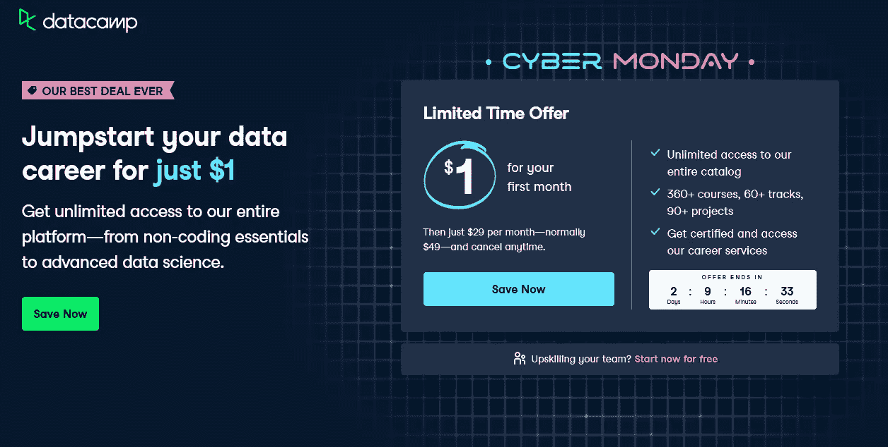

# 面向数据科学专业人士的最佳数据营折扣和优惠券

> 原文：<https://medium.com/javarevisited/datacamp-for-1-jumpstart-your-data-career-for-just-one-dollar-ef423bb16b8a?source=collection_archive---------4----------------------->

## DataCamp 有史以来第一次提供包月服务，第一个月只需 1 美元。如果你想尝试 Datacamp，这是一个增长你技能的绝佳机会。

朋友们好，我是网络星期一，我有令人兴奋的消息要和你们分享。有史以来第一次， [*DataCamp 开始提供包月服务，第一个月只需 1 美元*](https://datacamp.pxf.io/c/1193463/1012793/13294?u=https%3A%2F%2Fwww.datacamp.com%2Fpromo%2Fcyber-monday-sale-2021%3F%7B%7D) 。如果你想尝试 Datacamp，这是一个增长他们技能的绝佳机会。

从上周开始，我一直在为开发者分享惊人的交易和折扣，我收到了很多感谢你的邮件。虽然你们中的一些人说你错过了黑色星期五的交易，但不要担心，你仍然有网络星期一的交易要抢。

一个这样的交易是[**1 美元**](https://datacamp.pxf.io/c/1193463/1012793/13294?u=https%3A%2F%2Fwww.datacamp.com%2Fpricing) 的数据营，是的你没看错。Datacamp 正在开放它的整个平台，价格仅为 1 美元，这是我在网络星期一上发现的最令人惊讶的交易。

您将可以无限制地访问整个 Datacamp 平台——从非编码基础到高级数据科学，只需 1 美元

这笔交易与 Coursera 的 [**1 美元收购 Coursera Plus、**](https://coursera.pxf.io/c/3294490/1164545/14726?u=https%3A%2F%2Fwww.coursera.org%2Fcourseraplus) 非常相似，对于希望向谷歌和微软等世界顶级科技公司学习的程序员和开发人员来说，这是另一笔令人惊叹的交易

[Datacamp](https://datacamp.pxf.io/c/1193463/1012793/13294) 是学习 Python、SQL、数据科学以及数据分析、数据可视化、机器学习等与数据相关的一切的最佳场所之一，如果你想学习这些技能，这对你来说是一个惊人的机会。

这里是只需 1 美元即可加入 Datacamp 的链接— [**只需 1 美元即可加入 data camp**](https://datacamp.pxf.io/c/1193463/1012793/13294?u=https%3A%2F%2Fwww.datacamp.com%2Fpricing)

## 开发商获得更多网络星期一交易

此外，如果你还在寻找其他网络星期一最佳交易，这里有一个为程序员和软件开发人员精心策划的交易列表:

1.  [**Udemy 课程 85 折**](https://click.linksynergy.com/fs-bin/click?id=JVFxdTr9V80&offerid=323058.9410&type=3&subid=0)
2.  [**Coursera Plus 为 1 美元**](https://coursera.pxf.io/c/3294490/1164545/14726?u=https%3A%2F%2Fwww.coursera.org%2Fcourseraplus)
3.  [**Codecademy 年度计划五折优惠**](https://www.gopjn.com/t/TUJGR0lLR0JHRklJSkhCR0ZISk1N?url=https%3A%2F%2Fwww.codecademy.com%2Fsubscriptions%2FproAnnualV3%2Fcheckout%3FdiscountCode%3DCYBER21)
4.  **plur sight 年度套餐享受 40%的折扣**
5.  **[**教育性不限打 7 折**](https://www.educative.io/subscription?affiliate_id=5073518643380224)**
6.  **[**101 项区块链认证六折优惠**](http://shrsl.com/349rm)**
7.  **[**乌达城买一赠一**](https://imp.i115008.net/c/1193463/1201337/11298)**
8.  **[**whiz labs 订阅和课程六折优惠**](https://shareasale.com/r.cfm?b=1551042&u=880419&m=43514&urllink=&afftrack=)**
9.  **[**一个月会员半价**](https://mbsy.co/onemonth/33945365)**

**以上就是关于**data camp 值不值的问题。嗯，现在花一美元肯定是值得的，即使在那之后，由于他们的课程质量、讲师组合和互动学习平台，我强烈建议初学者在 2022 年加入 Datacamp，学习按需数据技能。****

**无论你是想成为数据科学家、程序员、开发人员、数据分析师，还是机器学习专家，你都可以在这个网络星期一上花 1 美元加入 Datacamp，开始你的职业生涯。**

**祝你学习顺利。**