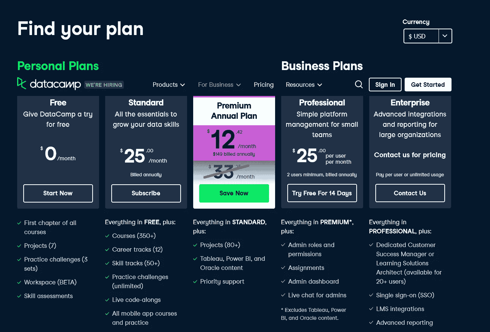

# Udemy vs Datacamp 回顾？2023 年学数据技能哪个网站最好？

> 原文：<https://medium.com/javarevisited/datacamp-vs-udemy-which-is-better-to-learn-data-skills-in-2022-b715f3cfc369?source=collection_archive---------0----------------------->

## Datacamp 值得吗？2023 年学习 Python、SQL、数据科学之类的数据技能，Udemy 和 Datacamp 哪个好

大家好，如果你想在 2023 年学习 Python、SQL、数据科学和数据分析，并且想知道你是否应该去 f *或 Udemy 或 DataCamp* ，那么你来对地方了。

早些时候，我已经发表了一篇关于 [Udemy vs Coursera](https://javarevisited.blogspot.com/2020/01/coursera-vs-udemy-which-is-better-for-programming-tech.html#axzz6VcvP6WNj) 和 [Udemy vs Pluralsight](https://javarevisited.blogspot.com/2019/10/udemy-vs-pluralsight-review-which-is-better-to-learn-code.html) 的评论，在这篇文章中，我们将回顾 Udemy vs DataCamp，但我们将只关注数据技能。

谈到学习数据技能，如 [SQL](/javarevisited/top-5-sql-and-database-courses-to-learn-online-48424533ac61) 、[数据科学](/javarevisited/my-favorite-data-science-and-machine-learning-courses-from-coursera-udemy-and-pluralsight-eafc73acc73f)、[数据可视化](/javarevisited/7-best-online-courses-to-learn-d3-js-for-data-visualization-in-2020-1a8c79add4e4)、 [Tableau](/javarevisited/my-favorite-courses-to-learn-tableau-for-data-science-and-visualization-46623ba5b424) 、[微软 Power BI](/javarevisited/10-free-microsoft-power-bi-courses-for-beginners-19ee524008e1) ，Datacamp 拥有一些最好的资源，这是他们的独特卖点，但价格呢？这些就是我在这篇文章中试图回答的问题。

学习新事物意味着获得任何你想要的行业的新知识或技能的能力，如 IT 或医疗保健，这在当今生活或职业生涯中是一件至关重要的事情，因为它使你能够更快地理解并超级容易地解决你的生活问题，以及帮助你的大脑获得批判性思维技能等等。

出于这个原因，许多平台来到这个世界，帮助人们和学生与教师联系，每天在线从他们那里获得新技能，而不需要浪费你的时间和金钱去大学，他们让每个人都可以访问，一些最大的平台命名为****和 [**数据营**](https://datacamp.pxf.io/c/1193463/1012793/13294) 。

本文将与您讨论这两个最好的在线学习平台在许多方面的差异，如定价和课程质量，这样您可以选择哪个平台最适合您的需求，然后您可以花时间学习新技能。****

# ****Udemy vs Datacamp 回顾？2023 年学数据技能哪个平台最好？****

****正如我所说的， [**DataCamp**](https://datacamp.pxf.io/c/1193463/1012793/13294) 在获取数据技能和学习像 [Python](/javarevisited/the-complete-python-bootcamp-udemy-course-review-b1ab69f232b5) 、 [SQL](/javarevisited/7-free-courses-to-learn-database-and-sql-for-programmers-and-data-scientist-e7ae19514ed2) 和[数据科学](/javarevisited/10-free-data-science-online-courses-for-beginners-a5fe78c2cb7b)这样的技术方面有着独特的地位，但是 Udemy 不是一只小鸡。****

****它有一些最好的数据技术在线课程，也有一些最好的导师，比如何塞·波尔蒂利亚、基里尔·叶列缅科等人。让我们找出两个平台的 USP，并根据您的需求确定哪一个更适合。****

## ****1.Udemy****

****Udemy 平台是一个巨大的市场，像你这样的学生可以从你能想到的几乎每个行业的数万门课程中学习技能，例如编程语言、web 开发、商业和咨询。****

****以及职业发展，这个平台最好的一点是，让任何人都可以将自己的热情转化为在线课程，并在 Udemy 上出售，许多教师通过做他们喜欢的事情来谋生。Udemy 平台允许教师(讲师)指定他们在线课程的价格，但每门课程的价格不能超过 9.99 美元，因为这将使平台亏损，而且当你注册任何课程时，你将终身获得访问权，而不是像大多数在线学习平台那样订阅。

最贵的课程每门都不会超过 199.99 美元，Udemy 有时会运行一种叫做 [**Udemy sales**](https://click.linksynergy.com/deeplink?id=JVFxdTr9V80&mid=39197&murl=https%3A%2F%2Fwww.udemy.com%2F) 的东西，这意味着它可以暂时降低课程成本，而且教学也可以免费让他们的课程获得一些评论和注册，然后将其转换为付费课程。****

********

****Udemy 平台允许任何人以讲师或教师的身份加入他们，并以他想要的任何价格发布他的在线课程，比如免费或付费。该平台依靠人们的支持来填充平台上的课程，并从每一次课程购买的佣金中赚钱，该平台的好处是他们的大多数课程都很长，其中一些课程的视频内容可以达到五十多个小时。****

****因此，如果你想参加个人课程并寻找一个负担得起的选择，Udemy 是你最好的在线学习平台，因为你不会像[**Complete Python boot camp:Go from zero to hero in Python**](http://bit.ly/2BY5LJC)那样，在任何其他地方只需 9.9 美元就能获得全面的 30 小时 SQL 或 Python 课程。****

********

## ****2.[数据营](https://datacamp.pxf.io/c/1193463/1012793/13294)****

****Datacamp 也是另一个具有竞争力的电子学习平台，用于学习与 IT 相关的东西，例如像 [Python](/javarevisited/7-best-python-online-courses-for-beginners-to-learn-programming-abe12cecb1ad) 、R、 [SQL](/javarevisited/7-free-courses-to-learn-database-and-sql-for-programmers-and-data-scientist-e7ae19514ed2) 这样的编程语言，以及数据工程、数据科学、数据可视化等专业，以及诸如[*【Tableau】*](https://javarevisited.blogspot.com/2019/07/top-5-tableau-online-courses-and-certifications-for-data-science-engineers.html)、 [*Power BI*](/javarevisited/7-best-courses-to-learn-microsoft-power-bi-for-beginners-and-experienced-developers-83695c9428dc) 、 [*Excel*](/javarevisited/10-free-courses-to-learn-microsoft-excel-for-beginners-69561f2f2678) 等软件。他们还提供一些未来最受欢迎的领域，如机器学习和人工智能。

data camp 平台依靠订阅来赚钱，他们有一个 [**免费计划**](https://datacamp.pxf.io/c/1193463/1012793/13294?u=https%3A%2F%2Fwww.datacamp.com%2Fpricing) 让你只能访问每门课程的第一章，但如果你想参加完整的课程，你必须每月支付至少 12.42 美元才能访问超过 335 门课程。****

****他们还在 Datacamp 年度订阅上提供 [**63%的折扣**](https://datacamp.pxf.io/c/1193463/1012793/13294?u=https%3A%2F%2Fwww.datacamp.com%2Fpricing) **现在******

********

****也有一些其他的计划给你更多的选择，比如使用课程项目以及应用平台的分配，而不需要在你的计算机上安装任何东西。

该平台允许人们创建课程，但不是每个人都可以这样做*就像 Udemy 的情况一样，*你必须申请这个角色才能成为该平台的讲师，如果你不符合条件，可能会被拒绝，这是为了确保他们的课程质量和他们在其他电子学习平台中的声誉。

像 Paypal、Google、Intel、优步这样的大公司使用 [DataCamp 平台](https://datacamp.pxf.io/c/1193463/1012793/13294?u=https%3A%2F%2Fwww.datacamp.com%2Fpricing)在编程和数据科学领域培训他们的员工，这无疑确保了他们的讲师和课程的质量。****

****[**的 USP data camp**](https://datacamp.pxf.io/c/1193463/1012793/13294?u=https%3A%2F%2Fwww.datacamp.com%2Fpricing)是他们的互动学习平台，让你边做边学，这是学习新技术的最好方式。****

****他们也有一个技能途径来获得数据技能，这是更有组织的，他们也有一个评估来检查你的技能水平，不断给你反馈，你站在哪里。比如你可以拿这个 [**免费考核**](https://datacamp.pxf.io/c/1193463/1012793/13294) 来检验你的数据技能。****

****因此，如果你想拥有一个单一的会员资格，让你在浏览器上以互动的方式学习很多东西，而不需要设置任何东西，那么 DataCamp 是你的最佳平台。他们结构化的职业道路和评估也有助于提升你的技能，进入下一个层次。

以上就是 **Udemy vs Datacamp。**我已经与你们分享了两个平台，这两个平台被认为是每个人开始学习新技能的最佳选择之一，并可能作为各种行业的专家开始新的职业生涯，无论你是想成为数据科学家还是自由职业者。****

****您可能喜欢的其他**编程**和**开发**文章:****

*   ****[Udemy vs LinkedIn Learning vs edu reka](https://javarevisited.blogspot.com/2020/10/udemy-vs-edureka-vs-linkedin-learning.html#axzz6vVPaF500)****
*   ****[data camp vs plural sight vs LinkedIn Learning](https://javarevisited.blogspot.com/2021/11/datacamp-vs-pluralsight-vs-linkedin.html#axzz7D1K8JL8x)****
*   ****[2023 年学习 Python 的十大 Udemy 课程](https://javarevisited.blogspot.com/2020/05/top-10-udemy-courses-to-learn-python-programming.html)****
*   ****[plural sight vs Codecademy Review——哪个更好？](https://javarevisited.blogspot.com/2019/10/pluralsight-vs-codecademy-which-is-best-online-learning-platform.html)****
*   ****[2023 年 Coursera Plus 值得吗](https://javarevisited.blogspot.com/2020/08/coursera-plus-better-way-to-take-coursera-courses-specilizations-certification.html#axzz6oofWUIUh)****
*   ****[devo PS 程序员路线图](https://javarevisited.blogspot.com/2018/09/the-2018-devops-roadmap-your-guide-to-become-DevOps-Engineer.html)****
*   ****[在线学习 10 门免费 Python 编程课程](https://javarevisited.blogspot.com/2018/12/10-free-python-courses-for-programmers.html)****
*   ****[2023 年学数据库和 SQL 的 5 门课程](https://hackernoon.com/top-5-sql-and-database-courses-to-learn-online-48424533ac61)****
*   ****[20 多个网站免费学习编码](https://dev.to/javinpaul/top-20-websites-to-learn-coding-with-java-python-sql-algorithms-and-git-for-free-in-2019-best-of-lot-l2l)****
*   ****Udemy 和 Pluralsight 评论——哪个更好？****
*   ****[学习 Java 和 Spring 的 15 大 Udemy 课程](/javarevisited/top-15-java-and-spring-framework-courses-from-udemy-best-of-lot-d7b965b62a9f?source=rss------java-5)****
*   ****[2023 年 Java 开发者路线图](https://javarevisited.blogspot.com/2019/10/the-java-developer-roadmap.html)****
*   ****[学习 React.js 的十大 Pluralsight 课程](https://javarevisited.blogspot.com/2020/08/top-10-pluralsight-courses-to-learn-React.js.html)****
*   ****[2023 年学习 Python 的 5 大课程](https://hackernoon.com/top-5-courses-to-learn-python-in-2018-best-of-lot-26644a99e7ec)****
*   ****[前端和后端开发者路线图](https://hackernoon.com/the-2019-web-developer-roadmap-ab89ac3c380e)****
*   ****[学习 JavaScript 的十大 Pluralsight 课程](https://www.java67.com/2020/08/top-10-pluralsight-courses-to-learn-JavaScript.html)****
*   ****[Datacamp vs Udemy？学 Python 哪个好？](https://javinpaul.medium.com/datacamp-vs-udemy-which-is-better-to-learn-data-skills-in-2022-b715f3cfc369)****

****感谢您阅读本文。如果你喜欢我对 Datacamp vs. Udemy 的评论，以及 2023 年加入哪一个，请分享给你的朋友和同事。如果您有任何问题或反馈，请留言。****

******P. S. —** 如果你正在寻找免费的网络平台免费学习编码，不要着急；你会在 Udemy 上找到很多免费课程。如果需要更多选项，还可以查看这个 [**21 个网站免费学习编码的列表**](https://www.java67.com/2018/06/21-websites-to-learn-how-to-code-for.html) 。****

**** [## CodeCademy vs Datacamp vs Udemy？2023 年加入哪家？

### 你好，伙计们，如果你想提升自己的技能，想加入一个在线学习平台，或者在…

www.java67.com](https://www.java67.com/2021/11/codecademy-vs-datacamp-vs-udemy-which.html)****