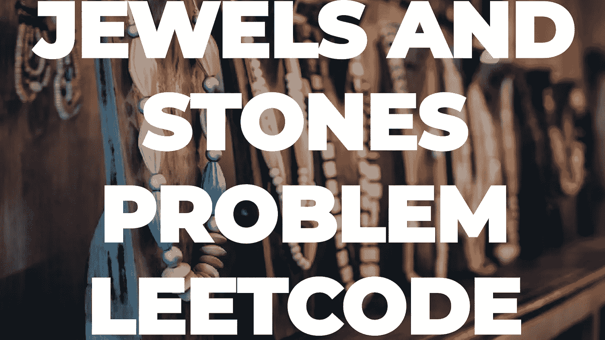

# 第 28 天——珠宝和宝石

> 原文：<https://medium.com/javarevisited/day-28-jew-e6f1511e769?source=collection_archive---------3----------------------->

## **亚马逊 100 天**

[**亚马逊 100 天—第 28 天—珠宝与宝石**](https://leetcode.com/problems/jewels-and-stones/)

Artem Beliaikin 在 [Unsplash](https://unsplash.com/s/photos/jewels?utm_source=unsplash&utm_medium=referral&utm_content=creditCopyText) 上拍摄的照片

出于免费的故事？下面是我的 [**好友链接。**](/@akshay_ravindran/day-28-jew-e6f1511e769?source=friends_link&sk=6bbc8475e77964463f763fea4b556575)

# 介绍

嘿伙计们，今天是我接受挑战的第 28 天。在这 100 天里，我将每天解决 [**编程问题**](https://www.java67.com/2018/05/top-75-programming-interview-questions-answers.html) ，这些问题在**之前的面试中已经被问过了。**