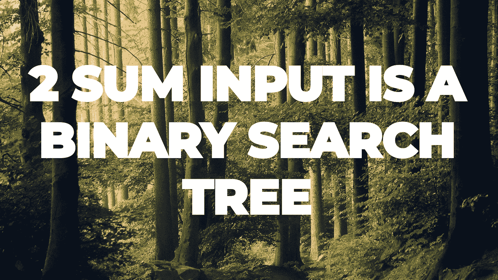

# 第 29-2 天的总和输入是一个二叉查找树

> 原文：<https://medium.com/javarevisited/day-29-2sum-input-is-a-bst-909ddfde6eb9?source=collection_archive---------1----------------------->

## **亚马逊 100 天**

由 [Lukasz Szmigiel](https://unsplash.com/@szmigieldesign?utm_source=unsplash&utm_medium=referral&utm_content=creditCopyText) 在 [Unsplash](https://unsplash.com/s/photos/nature?utm_source=unsplash&utm_medium=referral&utm_content=creditCopyText) 上拍摄的照片

出免费故事？下面是我的 [**好友链接。**](/@akshay_ravindran/day-29-2sum-input-is-a-bst-909ddfde6eb9?source=friends_link&sk=6f0f9564ad88839111df2cff3067b0a3)

[**亚马逊第 100 天—第 29 天 2Sum 输入是 BST**](https://leetcode.com/problems/two-sum-iv-input-is-a-bst/)

# 介绍👓

嘿伙计们，今天是我接受挑战的第 29 天。其中我将在 100 天内每天解决 [**编程问题**](/javarevisited/top-21-string-programming-interview-questions-for-beginners-and-experienced-developers-56037048de45) 这些问题在**之前的**中已经被问过了…