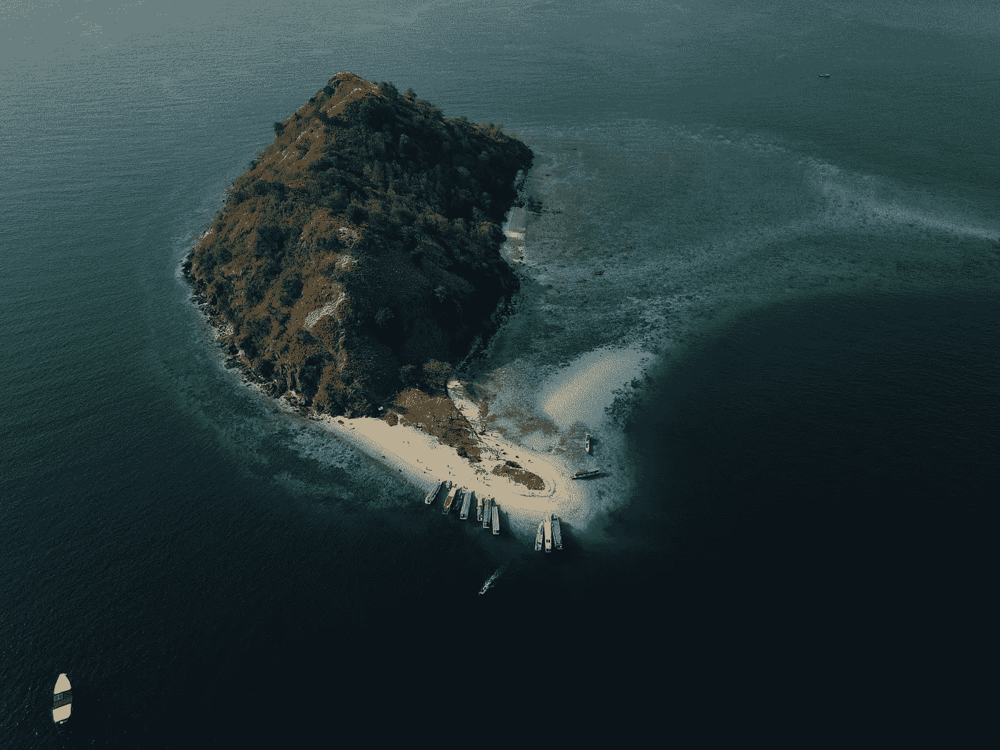

# 第 33 天—岛屿数量

> 原文：<https://medium.com/javarevisited/day-33-number-of-islands-80ecd0490fe3?source=collection_archive---------1----------------------->

## **亚马逊 100 天**

由[塞尔文·普尔纳马](https://unsplash.com/@celvinpurnama?utm_source=unsplash&utm_medium=referral&utm_content=creditCopyText)在 [Unsplash](https://unsplash.com/s/photos/island?utm_source=unsplash&utm_medium=referral&utm_content=creditCopyText) 上拍摄

[**亚马逊 100 天—第 32 天岛屿数量**](https://leetcode.com/problems/number-of-islands/)

出免费故事？下面是我的 [**好友链接。**](/@akshay_ravindran/day-33-number-of-islands-80ecd0490fe3?source=friends_link&sk=8ccea994e2ad31d59813f64437275dea)

# 介绍😎

嘿伙计们，今天是我接受挑战的第 33 天。在这 100 天里，我将每天解决 [**编程问题**](https://javarevisited.blogspot.com/2011/06/top-programming-interview-questions.html) ，这些问题在**之前的面试中已经被问过了。**