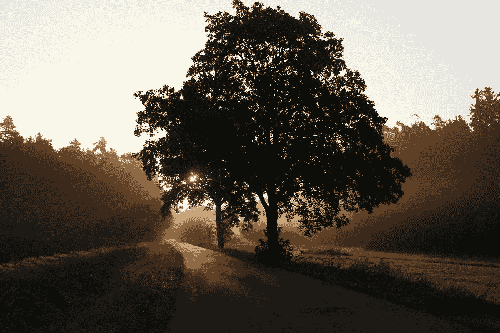

# 第 39 天—使用 BFS 的二叉树的最大深度

> 原文：<https://medium.com/javarevisited/day-39-max-depth-of-binary-tree-using-bfs-2df05aa8e8c4?source=collection_archive---------1----------------------->

## 亚马逊 100 天

在 [Unsplash](https://unsplash.com/images/nature/tree?utm_source=unsplash&utm_medium=referral&utm_content=creditCopyText) 上由[凯·多尔纳](https://unsplash.com/@photoversum?utm_source=unsplash&utm_medium=referral&utm_content=creditCopyText)拍摄的照片

[**亚马逊 100 天—第 39 天—使用 BFS 的二叉树的最大深度**](https://leetcode.com/problems/maximum-depth-of-binary-tree/)

出免费故事？下面是我的 [**好友链接。**](/@akshay_ravindran/day-39-max-depth-of-binary-tree-using-bfs-2df05aa8e8c4?source=friends_link&sk=539f484cab856159743df193de1efc80)

# Introduction🛹

嘿伙计们，今天是我接受挑战的第 39 天。在这 100 天里，我每天都要解决已经解决的 [**编程问题**](https://javarevisited.blogspot.com/2015/01/top-20-string-coding-interview-question-programming-interview.html)