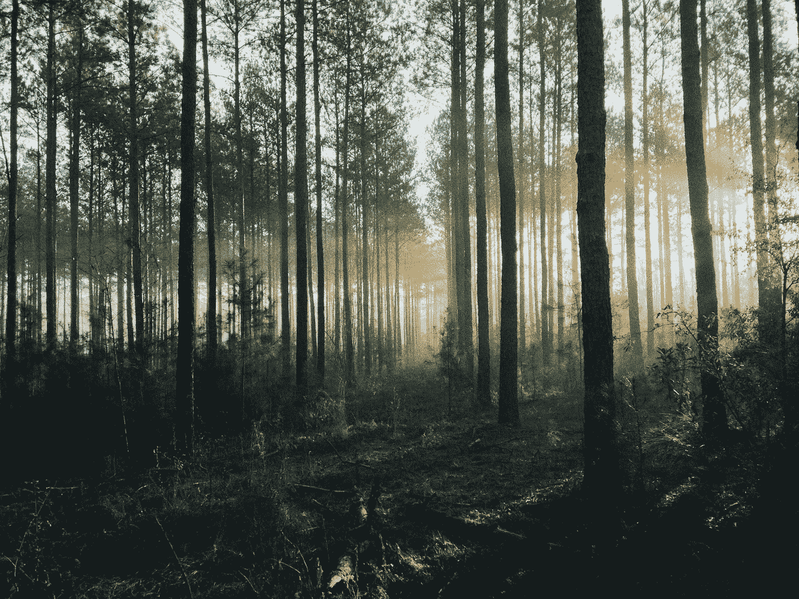

# 第 49 天——二叉树之字形遍历

> 原文：<https://medium.com/javarevisited/day-49-binary-tree-zig-zag-traversal-d07e769805d7?source=collection_archive---------0----------------------->

## **亚马逊 100 天**

由[史蒂文·卡梅纳](https://unsplash.com/@skamenar?utm_source=unsplash&utm_medium=referral&utm_content=creditCopyText)在 [Unsplash](https://unsplash.com/s/photos/forest?utm_source=unsplash&utm_medium=referral&utm_content=creditCopyText) 上拍摄的照片

[**亚马逊 100 天——第 49 天——二叉树之字形遍历**](https://leetcode.com/problems/binary-tree-zigzag-level-order-traversal/)

出于免费的故事？下面是我的 [**好友链接。**](/@akshay_ravindran/day-49-binary-tree-zig-zag-traversal-d07e769805d7?source=friends_link&sk=35a8f821e4e8f8923de22d53549b36a9)

# Introduction🛹

嘿伙计们，今天是我接受挑战的第 49 天。其中我将在 100 天内每天解决 [**编程问题**](/javarevisited/25-software-design-interview-questions-to-crack-any-programming-and-technical-interviews-4b8237942db0) 这些问题在**之前的**中已经被问过了…