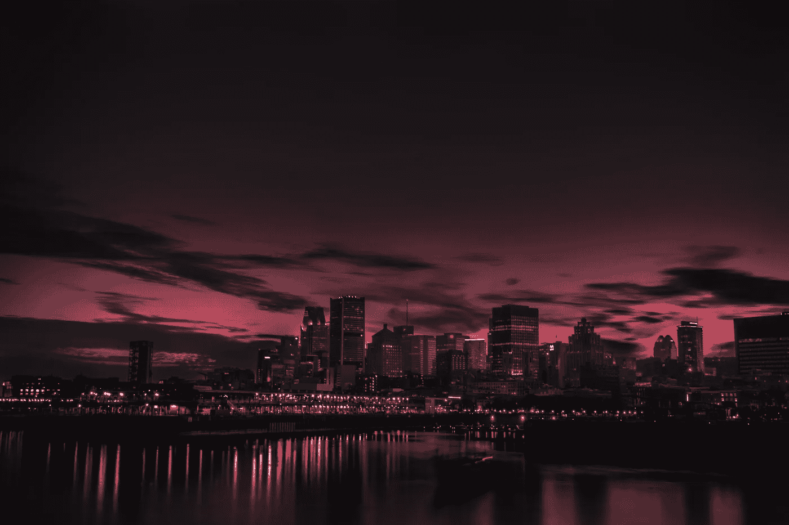

# 第 62 天——保持天际线的最大增量

> 原文：<https://medium.com/javarevisited/day-62-maximum-increase-to-keep-skyline-2686afebe910?source=collection_archive---------0----------------------->

## 亚马逊 100 天

[**亚马逊 100 天—第 62 天—最大涨幅保持天际线**](https://gist.github.com/akshay-ravindran-96/b7c78a6394c1950f6c5c15c902bb1997)

照片由[马克-奥利维耶·乔多因](https://unsplash.com/@marcojodoin?utm_source=unsplash&utm_medium=referral&utm_content=creditCopyText)在 [Unsplash](https://unsplash.com/s/photos/skyline?utm_source=unsplash&utm_medium=referral&utm_content=creditCopyText) 上拍摄

# Introduction🛹

嘿，伙计们，今天是我挑战的第 62 天。在接下来的 100 天里，我将每天解决**编程问题**，这些问题在**之前的采访中已经被问过了。**下面是我的 [**好友链接**](/@akshay_ravindran/day-62-maximum-increase-to-keep-skyline-2686afebe910?source=friends_link&sk=489770da4865c0381a917c6603b34c39) **。**