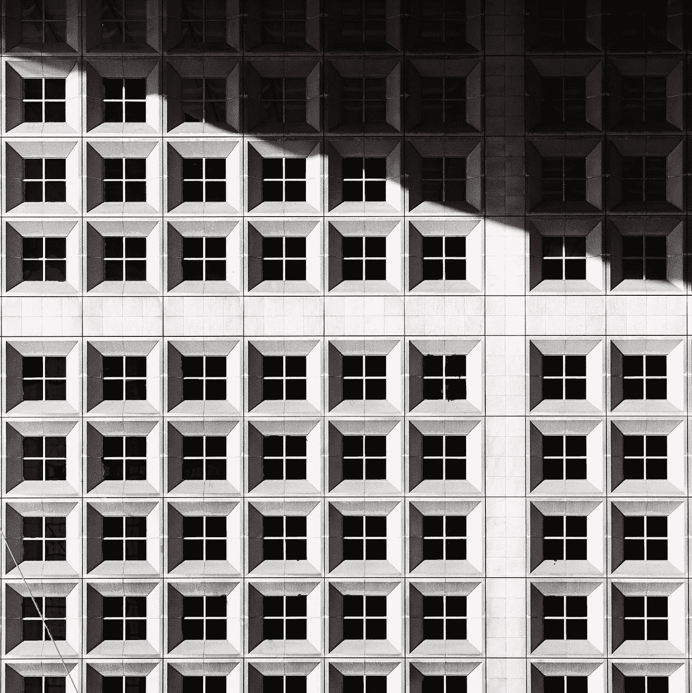

# 第 83 天—最大平方

> 原文：<https://medium.com/javarevisited/day-83-maximal-square-482937065c28?source=collection_archive---------1----------------------->

## 亚马逊 100 天

Benjamin Bousquet 在 [Unsplash](https://unsplash.com/s/photos/square?utm_source=unsplash&utm_medium=referral&utm_content=creditCopyText) 上拍摄的照片

[**亚马逊 100 天—第 83 天最大平方**](https://leetcode.com/problems/maximal-square/)

出于免费的故事？下面是我的 [**好友链接。**](/@akshay_ravindran/day-83-maximal-square-482937065c28?source=friends_link&sk=5db01a3c2df023a817bd9693e3a1ce60)

# Introduction🛹

嘿，伙计们，今天是我挑战的第 83 天。其中我将在 100 天内每天解决 [**编程问题**](/javarevisited/top-21-string-programming-interview-questions-for-beginners-and-experienced-developers-56037048de45) ，这些问题在**之前的面试中已经被问过。**