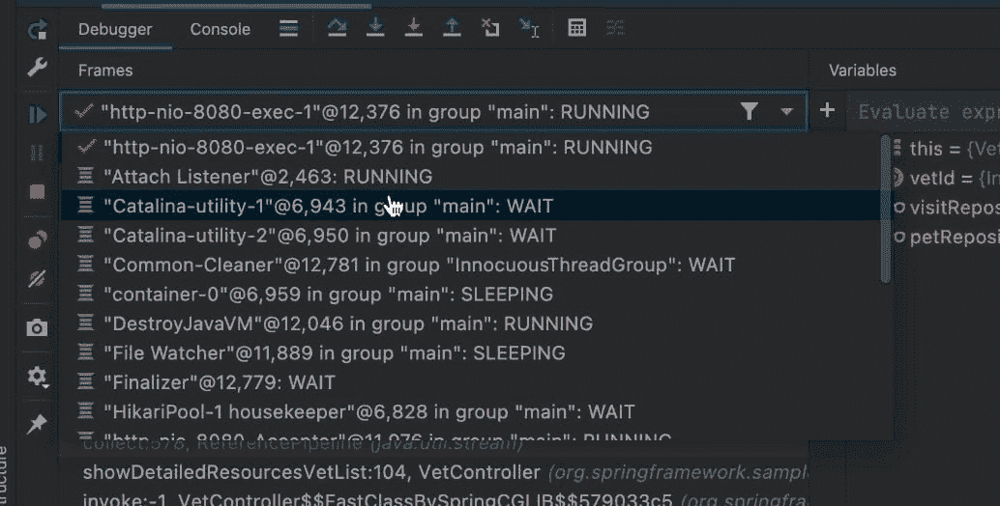
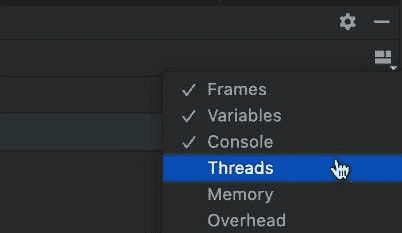
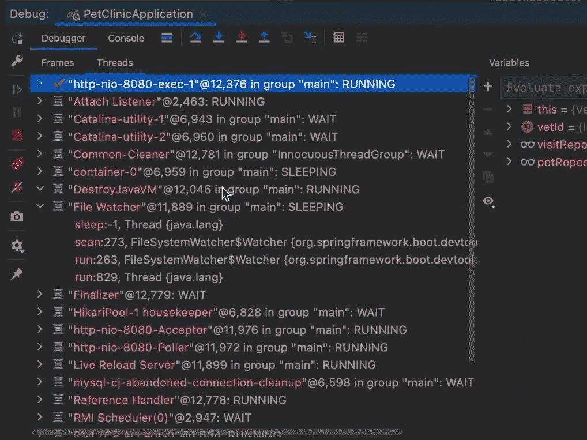
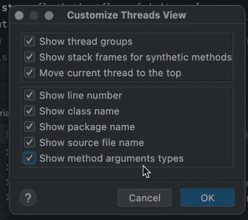
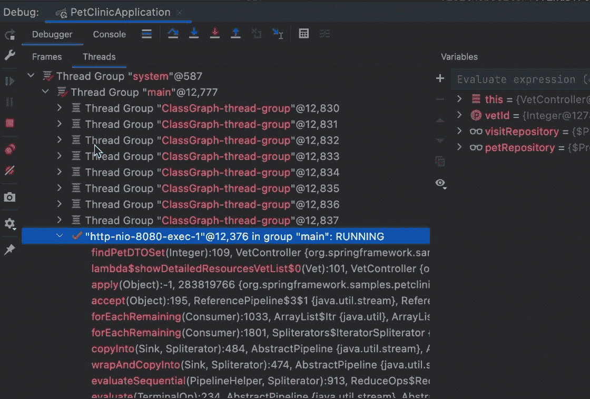
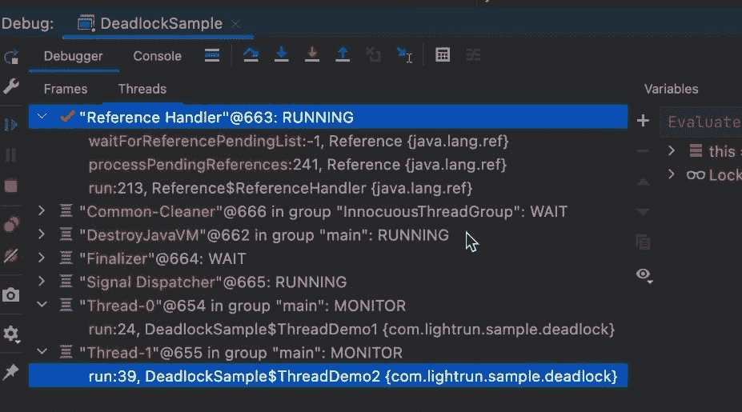
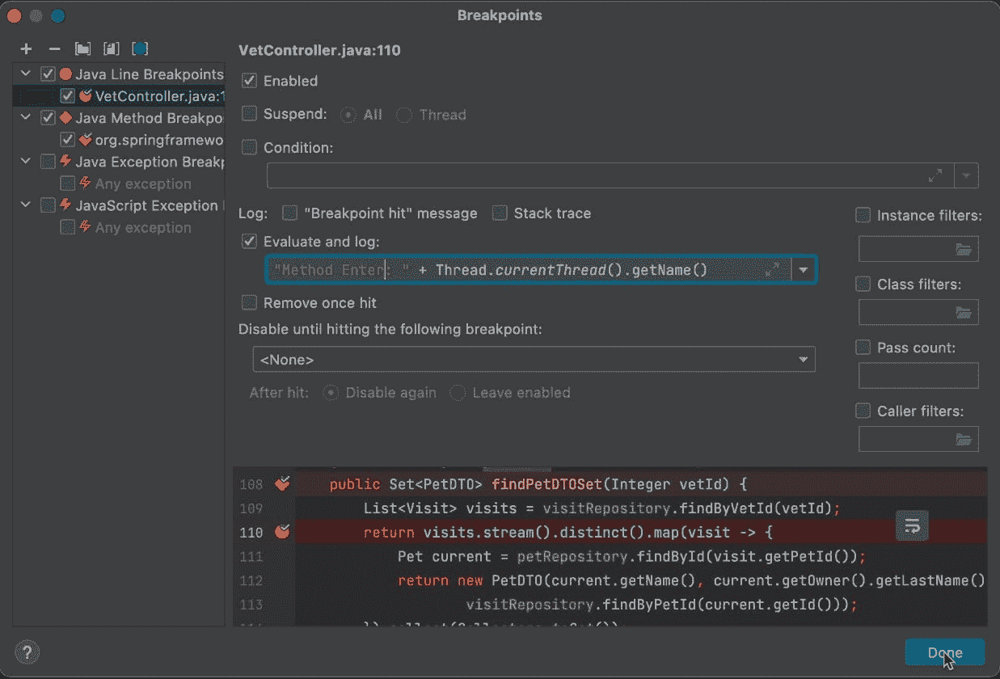
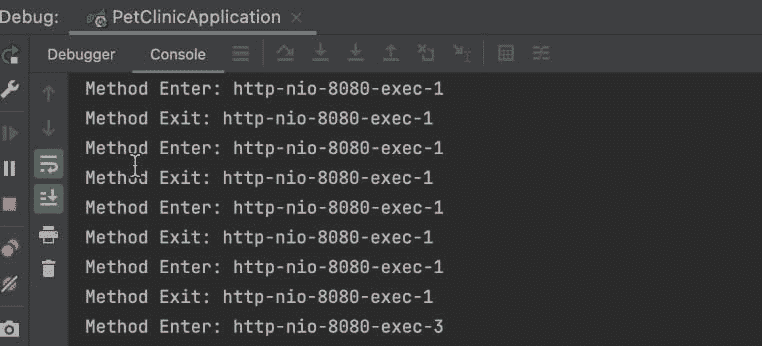
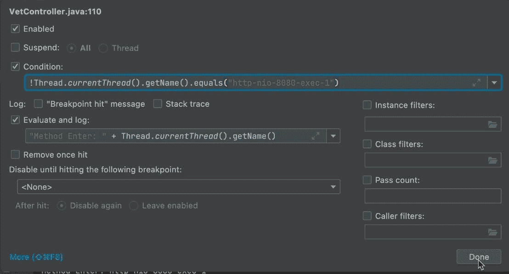

# 调试死锁和竞争条件

> 原文：<https://medium.com/javarevisited/debugging-deadlocks-and-race-conditions-8d184525a1fd?source=collection_archive---------1----------------------->


众所周知，线程调试是开发人员最艰巨的任务之一。恕我不能苟同。异步调试要糟糕得多。它应该解决线程的问题，并且在某种程度上异步有所帮助…但是它并没有使调试变得更简单。我将在下一篇文章中讨论这个问题。

在上两个小鸭子中，我谈到了线程问题:

今天我们将讨论调试线程问题的过程，处理调试器中的死锁和竞争情况。

# 多线程调试

在多线程环境中调试通常被认为是困难的，因为很难知道发生了什么。您放置了一个断点，一个可能死锁的线程在后台被挂起。因此，您不能再用调试器重现该问题。开发人员没有修改调试技术，而是责怪工具。那是把婴儿和洗澡水一起倒掉。调试器有如此多令人惊奇的工具来控制他们的环境。一旦你学会了如何掌握这些资源，像死锁检测这样的事情就会变得微不足道。

# 线程视图

如果你使用过 JetBrains IDEs，比如 [IntelliJ](/javarevisited/7-best-courses-to-learn-intellij-idea-for-beginners-and-experienced-java-programmers-2e9aa9bb0c05) ，你可能对 UI 中堆栈跟踪面板上方的线程组合框很熟悉。这个小部件让我们切换当前线程和我们正在查看的堆栈。这是一个非常有效的工具，但是它也提供了一个非常有限的视角。很难通过查看组合框来判断特定线程的状态。其他细节，如分组、位置等。仅看这个小部件时不清楚。

[](https://javarevisited.blogspot.com/2018/09/top-5-courses-to-learn-intellij-idea-java-and-android-development.html)

幸运的是，大多数 ide 支持一个更加面向多线程应用的视图。缺点是相比之下有点吵。我想这就是它不是默认 UI 的原因。但是，如果您正在调试的进程具有复杂的并发性，这可能会显著改善您的体验！

要启用该模式，我们需要在调试器视图中检查 IDE 中的“线程”选项:



这是默认关闭的，因为 UX 很难，大多数开发人员不需要这种典型的应用程序。但是当我们有一个线程繁重的应用程序时，这个视图就成了救命稻草…



线程实际上成为了顶级元素。我们可以通过展开一个特定的线程(例如，此图中的文件监视器)来查看堆栈。在这里，我们可以像以前一样完全访问堆栈，但是我们可以看到所有的线程。如果你有一个线程数非常高的应用程序，这可能是一个问题，例如，对于即将到来的 project Loom，这可能会变得难以维持。

我们可以通过设置进一步调整此视图，这可以支持更多的详细信息和层次结构:



设置对话框中提到了几个有趣的功能，但最有趣的是按线程组分组。线程组让我们将一个线程打包成一个组的一部分。因此，我们可以为内部的所有线程创建通用行为。例如单个捕捉处理器等。

您将从一个池或一个框架中接收到的大多数线程已经被逻辑地分组了。这意味着分组应该是相对直观和容易理解的。



# 调试死锁情况

维基百科将死锁定义为:

_ "在[并发计算](https://en.wikipedia.org/wiki/Concurrent_computing)，**死锁**是任何一种情况，其中某个实体组中的任何成员都不能继续，因为每个实体都在等待另一个成员(包括它自己)采取行动，例如发送消息，或者更常见的是，释放[锁](https://en.wikipedia.org/wiki/Lock_(computer_science)。[【1】](https://en.wikipedia.org/wiki/Deadlock#cite_note-coulouris-1)死锁是[多处理](https://en.wikipedia.org/wiki/Multiprocessing)系统、[并行计算](https://en.wikipedia.org/wiki/Parallel_computing)和[分布式系统](https://en.wikipedia.org/wiki/Distributed_computing)中的常见问题，因为在这些环境中，系统通常使用软件或硬件锁来仲裁共享资源并实现[进程同步](https://en.wikipedia.org/wiki/Synchronization_(computer_science)。”_

这听起来很复杂，但还不算太糟……不幸的是，如果您放置一个断点，问题将不再出现，因此您甚至不能使用典型的调试工具来处理死锁情况。原因是当断点停止时，它通常会暂停整个进程，而您不会看到问题的发生。

我不会谈论死锁预防，这本身就是一个庞大的主题。好的一面是，一旦你在调试器运行的情况下重现它，调试就变得非常容易了！

我们需要做的就是在调试器中按下暂停键:



一旦申请被暂停，我们可以查看列表中的条目。注意，这两个条目被阻塞在等待监视器的“监视器”线程上。这实际上意味着它们可能被一个同步块或其他一些同步 API 调用卡住了。

这可能没有任何意义，但是查看这个列表和堆栈来查看它们正在等待的资源是非常容易的。如果一个条目正在等待另一个条目持有的资源…这可能是死锁的风险。如果双方都持有对方所需的资源，这是一个非常明显的死锁。

您可以在线程之间切换并遍历堆栈。在这个截图中，堆栈是一个方法深度，所以它不能代表“真实世界的情况”。但是，这是检测此类问题的简单方法。

# 调试竞争条件

多线程最常见的问题是竞争条件。维基百科将竞争条件定义为:

_ "一个**竞态条件**或**竞态危险**是一个[电子](https://en.wikipedia.org/wiki/Electronics)、[软件](https://en.wikipedia.org/wiki/Software)或其他[系统](https://en.wikipedia.org/wiki/System)的条件，其中系统的实质行为依赖于其他不可控事件的顺序或时间。当一个或多个可能的行为不受欢迎时，它就变成了一个 [bug](https://en.wikipedia.org/wiki/Software_bug) _

这是一个更加隐蔽的问题，因为几乎不可能检测到。我以前写过这个问题，也在这里写过用 Lightrun 调试这个问题。德里克也在 Lightrun 博客中写到了这一点，但他的报道略有不同。我的技术在我看来更简单…

# 方法断点做对了

我以前对方法断点说过一些严厉的话。他们效率低下，问题重重。但是对于这辆卡车，我们需要它们。它们给了我们所需的对断点位置的控制类型。

例如，在这种方法中:

```
public Set<PetDTO> findPetDTOSet(Integer vetId) {
  List<Visit> visits = visitRepository.findByVetId(vetId);
  return visits.stream().distinct().map(visit -> {
     Pet current = petRepository.findById(visit.getPetId());
     return new PetDTO(current.getName(), current.getOwner().getLastName(),
           visitRepository.findByPetId(current.getId()));
  }).collect(Collectors.toSet());
}
```

如果我们在最后一行放置一个断点，我们将会错过这个方法的功能。但是如果我们放置一个跟踪方法出口的方法断点，它将在方法中的所有内容都被执行后命中。

理想情况下，我们可以跟踪方法的入口和出口，但这样我们就无法区分它们了…


创建方法断点后，我们将其设置为不挂起并启用日志记录。我们有效地创建了一个追踪点。我们现在可以记录我们正在退出该方法，并记录线程名称。这将打印该方法的每次退出。

# 方法入口事件

我们可以对方法入口做同样的事情，但是这里我们可以使用一个常规断点:



同样，我们不挂起线程，而是使用有效的跟踪点。这让我们通过查看日志来了解我们是否是死锁的受害者。如果它们连续包含两个条目日志…这可能是一个竞争条件。因为线程没有被挂起，所以调试过程不会干扰到任何事情。



在某些情况下，输出可能非常冗长，并且来自单个线程。在这种情况下，我们可以使用一个简单的条件语句来过滤噪声:

[](https://javarevisited.blogspot.com/2018/08/how-to-avoid-deadlock-in-java-threads.html)

我们也可以使用类似的技术构建一个穷人的[死锁](https://javarevisited.blogspot.com/2018/08/how-to-avoid-deadlock-in-java-threads.html)检测器。它可以给我们一种共享资源使用的感觉，因此我们可以正确地评估死锁的可能性。

# TL；速度三角形定位法(dead reckoning)

死锁代码的可能性使得调试进程相当具有挑战性。对资源的锁定会使事情变得更糟，断点的传统用法根本不起作用…每次我们遇到怀疑多任务处理中的竞争或死锁问题时，我们都需要停下来。使用这些技术来检查死锁或竞争的发生。

多线程调试并不像人们通常认为的那样困难。您可能不会得到直接指向该行的错误，但是通过正确的并发控制，您可以大大缩小范围。