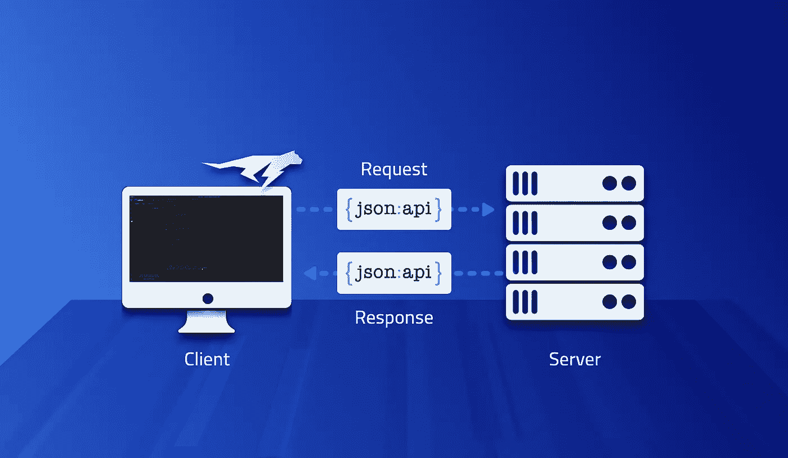
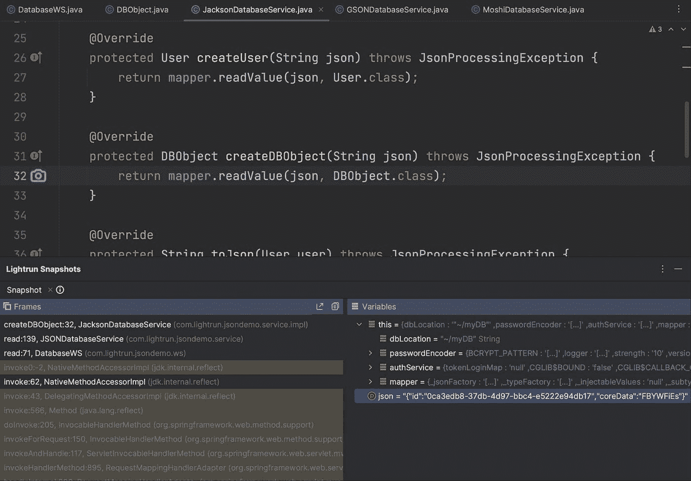

# 在生产中调试 Gson、Moshi 和 Jackson JSON 框架

> 原文：<https://medium.com/javarevisited/debugging-gson-moshi-and-jackson-json-frameworks-in-production-8c6182d6f001?source=collection_archive---------4----------------------->

[](https://javarevisited.blogspot.com/2011/02/how-to-setup-remote-debugging-in.html)

解析 bug 是 API 时代一直给予的礼物。我们使用服务；在调试、QA 等方面都非常好用。然后一些用户输入到达 web 请求，返回一个我们无法解析的结果。不幸的是，现阶段我们无能为力。我们需要了解失败发生的原因，以及如何解决和修复它。

在生产中，这不是小事。我们可以记录我们进行的所有调用和传递的所有对象。但是这将会破坏我们的性能，并使我们的日志存储费用飞涨。这也可能使我们违反隐私法，因为 [JSON 数据](https://www.java67.com/2016/10/3-ways-to-convert-string-to-json-object-in-java.html)可能包含私人用户信息。这是生产中的一个常见问题，因为 webservice 可能会在运行时更改并触发序列化失败。在多语言环境中尤其如此，使用像 Jackson 这样的 API 映射的 Java 类可能会在 NodeJS 对象的反序列化上失败。

对于 JSON 处理，Java 有三个公共库:

*   [杰克森](https://www.java67.com/2019/05/how-to-read-csv-file-in-java-using-jackson-library.html)——三者中最老、最稳定的解析器 API
*   [Gson](https://javarevisited.blogspot.com/2022/03/3-examples-to-parse-json-in-java-using.html)——谷歌的一个更轻量级的 API
*   Moshi —在服务器中知名度不高(在 Android 上更受欢迎)。由 Gson 的作者编写，应被视为其继任者，因为 Gson 不再被积极维护

# Java 中 JSON 解析的基础

这些库在概念上非常相似。它们支持泛型类型的序列化，并将它们映射到对象。我们可以在任意 Java 对象或对象列表之间进行转换。为了简单起见，我将把重点放在字符串上，因为这是一个关于调试的教程。

在下面的代码片段中，我们使用标准 Java POJO(普通旧 Java 对象)作为 User 和 DBObject 值。这些是琐碎的对象，包含相对简单的字段，如字符串、原语、字节数组等。在演示代码中，为了方便起见，我用 Lombok 创建了它们，但是它们用 getter/setter 也能很好地工作。这也适用于具有深度嵌套、集合类型等的复杂对象。

使用 Jackson，您可以使用如下代码生成一个 JSON 字符串:

```
String json = mapper.writeValueAsString(user);
```

您可以使用 Jackson 来执行对象序列化:

```
DBObject object = mapper.readValue(json, DBObject.class);
```

对于 Gson，我们可以使用以下方法完成同样的工作:

```
String json = gson.toJson(user);
```

这就是 Gson 如何转换成一个对象:

```
DBObject object = gson.fromJson(json, DBObject.class);
```

Moshi 有点冗长，但是支持更多的定制特性和类型安全:

```
String json = moshi.adapter(User.class).toJson(user);
```

这是在 Moshi 中获取一个对象的代码:

```
DBObject object = moshi.adapter(DBObject.class).fromJson(json);
```

注意，Moshi 使用现成的类型适配器。“类型适配器”的概念不是 Moshi 独有的，它存在于所有这些工具中。它允许我们执行定制的反序列化，特别是“低级”对象/JSON 映射。在这种情况下，Moshi 将这个 API 放在最前面

# 演示

为了演示调试，我创建了一个简单的 JSON 数据库应用程序，它允许我们将元素保存为 JSON 文件。你可以在这里找到完整的源代码。这个演示涵盖了所有三个 JSON 解析器以及它们的大部分基本特性，比如类型适配器。

我们可以通过提交 HTTP 头来选择在请求中使用的 API，DatabaseWS 类中的工厂方法选择正确的实现实例。这样，我们可以像 Gson、Jackson 或 Moshi 一样处理任何请求。默认为魔石。

这是一个可以在 IntelliJ/IDEA 中打开的标准 Spring Boot 项目。本文的其余部分假设您已经安装并运行了 Lightrun。如果没有，请在这里免费安装[。你可以在这里阅读](https://lightrun.com/free)。

# 创建数据库用户

在开始之前，我们需要创建一个新的数据库用户。我们可以用下面的命令来实现:

```
curl -X PUT  -H "Content-Type: application/json" -H "Authorization: 45971c45-4049-48f8-970f-04d47be2defc" -d '{"login":"user", "password":"123456", "givenName":"Shai", "surname":"Almog"}' "http://localhost:8080/addUser"
```

一旦执行，您应该会看到一个名为“~/myDB/user.user”的文件。注意~代表当前用户的主目录。该文件应该包含类似于以下 JSON 的内容:

```
{
  "login": "user",
  "givenName": "Shai",
  "surname": "Almog",
  "email": null,
  "hashedPassword": "$2a$10$DeBGvevs8RiHCIdRqa9fo.ED.6K2UYXXgXYF1.6uLxU1yxmq9c8ZK",
  "token": "7e5a50db-f44a-4177-af48-6fa39c127810",
  "password": null
}
```

该文件是由 Moshi 生成的。如果我们希望为解析器/生成器使用另一个选项，我们可以添加参数:

```
-H "type: jackson" or -H "type: gson" respectively.
```

# 证明

一旦我们创建了一个用户，我们就可以使用类似如下的 curl 命令使用身份验证 API 登录到数据库:

```
curl -H "Content-Type: application/json" -H "Authorization: 45971c45-4049-48f8-970f-04d47be2defc" -H "type: jackson" -d '{"login":"shai","password":"123456"}' "http://localhost:8080/auth"
```

在这种情况下，我选择使用 Jackson 解析器登录，而不是默认的 moshi。这个命令在响应中返回一个令牌，我们可以用它来执行操作。

# 添加条目

我们可以使用命令向“数据库”添加记录，例如:

```
curl -H "Content-Type: application/json" -H "Authorization: 45971c45-4049-48f8-970f-04d47be2defc" -H "type: jackson" -d '{"coreData":"FBYWFiEs"}' "http://localhost:8080/create"
```

注意，我们在上面发送的身份验证调用的响应被用在授权头中。

数据库中还有其他几个特性，但我现在将跳过它们…

# 读取条目

使用反序列化从数据库中读取元素甚至更容易。这是一个简单的 REST GET 方法:

```
curl -H "Content-Type: application/json" -H "Authorization: 45971c45-4049-48f8-970f-04d47be2defc" -H "type: jackson" "http://localhost:8080/read?id=0ca3edb8-37db-4d97-bbc4-e5222e94db17"
```

在这种情况下，我再次使用杰克逊，但它应该同样适用于 Moshi/Gson。注意，read 调用的参数是对象的 ID。我们从创建调用接收 id 作为响应。

# 检查和调试

调试 Gson、Jackson 或 Moshi 之类的 API 相当具有挑战性。不像典型的 Java APIs 在失败时会抛出一个检查过的异常，这些工具通常会记录解析错误。此外，许多序列化错误或问题可能看起来是一个缺少的选项，而不是一个可见的 bug。

一个类可能有不同的字段名称，或者可能缺少一个额外的字段，因此对象字段可能包含反序列化过程之后的部分信息。不幸的是，当我们拥有类型对象的时候，已经有点太晚了。JSON 没了，我们没法跟结果比。我们希望在序列化过程中检查对象。

在我们继续之前，你需要确保你安装了 Lightrun，并且对它的用法有一个基本的了解。你可以从[这里](https://lightrun.com/free)安装一个免费版本。

一旦我们有了这些，我们就可以开始调试了…

# 调试运行中的序列化

生成 JSON 文件的代码通常更容易调试，问题也更少。这是一个简单的起点。我们可以在写入对象的位置放一个快照。例如，在这种情况下，我使用了 JSONDatabaseService 类，并在 writeString 方法调用上放置了一个快照。


在堆栈中，我可以看到 JSON 数据和原始对象。这样，我们可以检查两者之间的任何差异。通常，这可能与像 Jackson 或 Gson 这样的实现在空对象、日期、时间等方面的默认行为有关。这些细微差别在不同的实现之间有很大的不同。

# 反序列化

将 JSON 字符串或文件读入一个类是我们大多数人失败的地方。遗漏的名字会被跳过，一个小小的错别字会成为一个巨大的问题。

这是在我们将字符串转换为对象之前检查 JSON 的能力的真正价值。在这个示例中，我们可以通过在`JacksonDatabaseService`类中放置一个快照来轻松做到这一点。注意这是杰克逊特有的。我们可以对 Gson 和 moshi 做同样的事情，将快照放在它们各自的抽象类中。



一旦这个被放置，我们可以尝试读取一个对象，我们将看到收到的 JSON。在这种特殊情况下，从方法参数中获取 JSON 是微不足道的。然而，这并不是例外，在大多数情况下获取这些数据是可能的。

这是查看字段名和各种类型适配器以理解结果对象字段的地方。

# 一锤定音

无论你使用 Jackson、Gson 还是 moshi，Java 中的 JSON 处理总是一个挑战。它们都以大致相同的方式失败，并且经常出现在生产数据中。由于记录数据可能会使我们承担责任和增加成本，我们调试这些 API 的唯一选择是通过开发人员的可观察性工具，比如 Lightrun。

对于大多数调试情况，我们可以在 API 访问上放置一个快照，并检查结果节点、列表等。这通常是帮助我们转换类型表示的通用代码，比如 foo 类型的对象。我们可以发送/存储的 JSON 文件，等等。