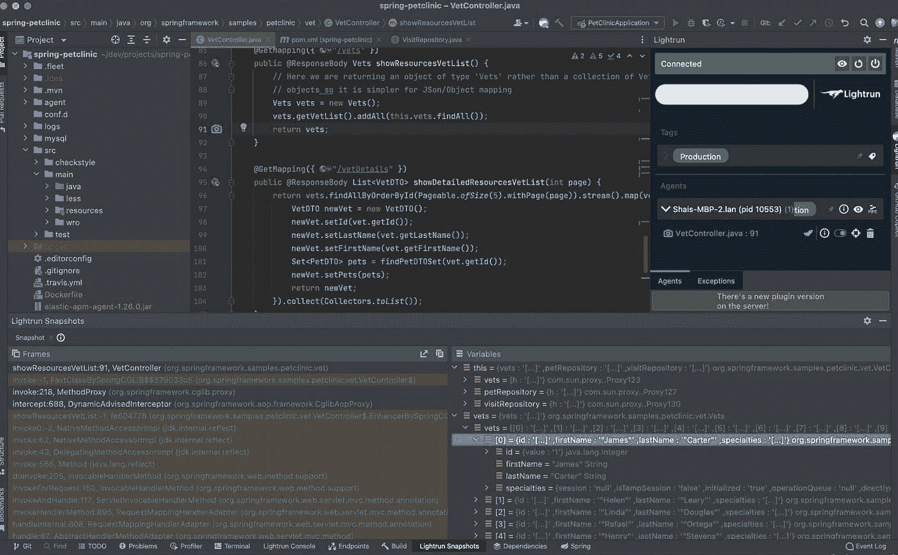
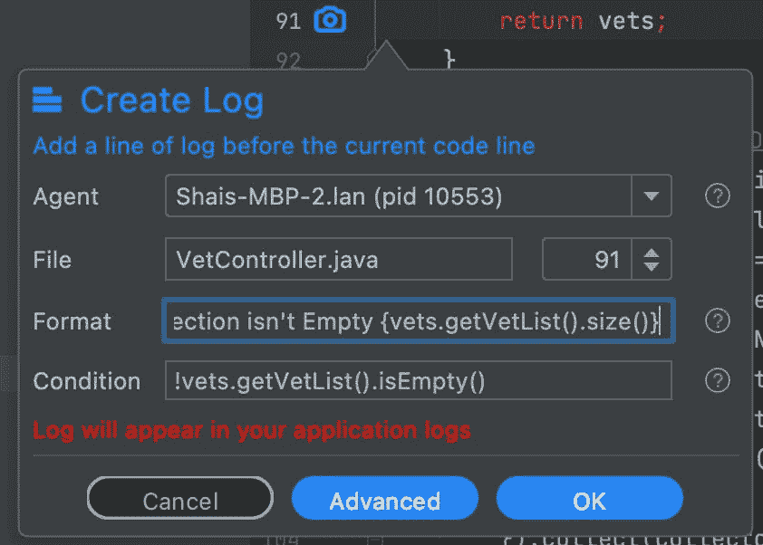
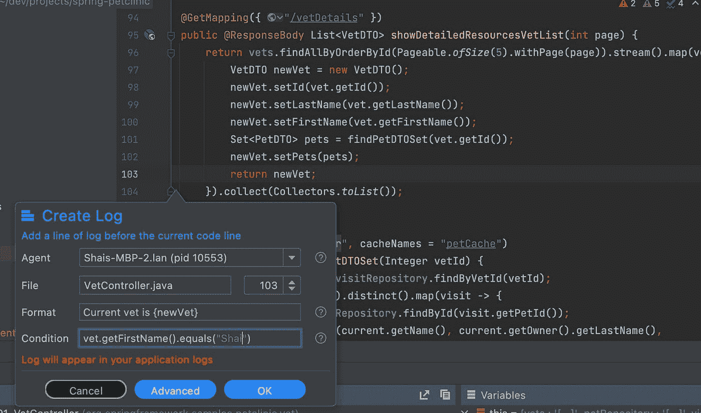

# 调试生产中的 Java 集合框架问题

> 原文：<https://medium.com/javarevisited/debugging-java-collections-framework-issues-in-production-a665241a074c?source=collection_archive---------5----------------------->


当 Java 集合框架作为 Java 2 (JDK 1.2)的一部分被引入时，它是一个巨大的飞跃。多亏了包含的集合类，我们终于超越了`[Vector](http://javarevisited.blogspot.sg/2011/09/difference-vector-vs-arraylist-in-java.html)` <http://javarevisited.blogspot.sg/2011/09/difference-vector-vs-arraylist-in-java.html>和`[Hashtable](https://javarevisited.blogspot.com/2012/01/java-hashtable-example-tutorial-code.html)`的限制，获得了更加成熟和通用的解决方案。随着流和函数概念在 Java 8 中的引入，这个框架把一切都带到了一个新的层次。

框架的核心原则之一是对接口进行编码。因此，您可以使用列表接口或集合接口，而不是具体的实现。这是一项伟大的工程，但是它使得调试 Java 集合更加具有挑战性。

当我们调试一个典型的类时，我们可以检查变量或实现。在这种情况下，对象集合通常隐藏在一个[抽象](https://javarevisited.blogspot.com/2010/10/abstraction-in-java.html)后面，该抽象掩盖了一个复杂的内部结构，例如[红黑树](https://www.java67.com/2019/10/difference-between-binary-tree-avl-red-black-binary-search-tree.html)等。

# 本地调试很容易

通过本地调试，我们可以添加一个检查，如`aslist.toArray()`。这将表现不佳，但仍将工作。然而，在生产环境中使用 [Lightrun](https://lightrun.com/) 时，这将会失败。当试图[打印出一个复杂的列表](https://javarevisited.blogspot.com/2011/05/example-of-arraylist-in-java-tutorial.html)时，我们可能会在方法调用本身上失败(这可能会低于配额),或者只是输出的长度可能会被裁剪掉。

打印元素集合的内容是有问题的。即使您有使用`Iterable`接口循环遍历整个列表的代码，避免配额限制的可能性也很低。打印一个[原始类型数组](https://www.java67.com/2014/03/how-to-print-array-in-java-example-tutorial.html)很容易，但是打印对象需要更多。

# 集合元素的擦除

在调试时，集合框架包括另一个挑战:擦除。在 Java 中，人们会期望这样的代码能够工作:

```
List<MyObject> myList = new ArrayList<>();
```

那么日志可能如下所示:

```
The property value of the first element is {myList.get(0).getProperty()}
```

这将失败。

Java 中的泛型在编译过程中被移除，对字节码没有影响。因此，工作在字节码级别的 Lightrun 并不知道它们。解决方案是编写代码，就像泛型不存在一样，并将其转换为适当的类:

```
The property value of the first element is {((MyObject)myList.get(0)).getProperty()}
```

# 绕过配额限制

# 什么是配额？

Lightun 在沙箱中执行用户代码。使用代码可以作为任何条件、表达式日志等。沙盒让我们保证:

*   代码是只读的，不会以任何方式影响状态。即使你调用额外的方法也不行。
*   代码没有失败(抛出异常等)。)
*   该代码是高性能的，不会占用太多的 CPU

这个沙箱有它自己的开销。这是“配额限制”分配给用户代码的 CPU 处理量。请注意，这可以基于每个代理进行配置。

如果对象依赖图很深并且需要访问许多类对象，配额可能会受到影响。然而，ֿThere 是我们可以从集合接口中提取一些可调试值的两件事情。

# 使用快照

快照提供了关于所有类型集合的更多细节。因为它们只需一次操作就能访问对象的内部状态，所以它们倾向于在类中获取大量适用的数据。例如，以 Spring Boot 宠物诊所演示的这张快照为例。它列出了一个向量和其中的 10 个元素。其中各个对象的值在快照中清晰可见，并且可以轻松遍历。

[](https://javarevisited.blogspot.com/2011/07/java-debugging-tutorial-example-tips.html)

# 使用尺寸和相关方法

调试是做出假设并验证它们的过程。来自 [java collections](/javarevisited/50-java-collections-interview-questions-for-beginners-and-experienced-programmers-4d2c224cc5ab) 的`size()`方法非常高效，几乎可以免费使用。如果您期望一个结果包含一组固定的元素，您可以很容易地使用`[size()](https://www.java67.com/2014/04/array-length-vs-arraylist-size-java.html)`或`[isEmpty()](https://javarevisited.blogspot.com/2013/02/5-ways-to-check-if-string-is-empty-in-java-examples.html)`方法来表明一个集合是否符合期望。这里的方法调用将非常高效。

您可以将它作为一个条件或在日志格式本身中使用:

[](https://www.java67.com/2019/07/top-50-java-generics-and-collection-interview-questions.html)

# 记录单个条目

正如我们之前提到的，如果我们在一个循环中尝试记录所有的元素，我们会很快达到配额。但是如果我们只从 collections 类中记录我们需要的元素，我们将能够保持在配额之内。这也适用于位置访问，假设我们有元素的偏移量。

下面的代码使用 [java streams API](/javarevisited/7-best-java-tutorials-and-books-to-learn-lambda-expression-and-stream-api-and-other-features-3083e6038e14) 来转换元素。在转换代码中，我可以粘贴一个日志，只有当兽医是我时才打印它。这是使用 Vet 类的 getFirstName()方法的条件:

```
vet.getFirstName().equals("Shai")
```

如果符合，我可以打印出条目的全部细节:`Current vet is {newVet}`。

[](https://javarevisited.blogspot.com/2018/08/top-5-java-8-courses-to-learn-online.html)

# 准备

当我们没有准备好的时候，调试 Java 集合会更加困难。好的一面是，准备也是为长期维护编写更好代码的第一步。它适用于所有类型的集合，也适用于集合和流操作。

到目前为止，最大的错误是代码过于简洁。这里我也有错…例如，这段代码直接从方法返回:

```
return vets.findAllByOrderById(Pageable.ofSize(5).withPage(page)).stream().map(vet -> {
  VetDTO newVet = new VetDTO();
  newVet.setId(vet.getId());
  newVet.setLastName(vet.getLastName());
  newVet.setFirstName(vet.getFirstName());
  Set<PetDTO> pets = findPetDTOSet(vet.getId());
  newVet.setPets(pets);
  return newVet;
}).collect(Collectors.toList());
```

这似乎比赋值后从方法返回的代码要酷得多:

```
List<VetDTO> returnValue = vets.findAllByOrderById(Pageable.ofSize(5).withPage(page)).stream().map(vet -> {
  VetDTO newVet = new VetDTO();
  newVet.setId(vet.getId());
  newVet.setLastName(vet.getLastName());
  newVet.setFirstName(vet.getFirstName());
  Set<PetDTO> pets = findPetDTOSet(vet.getId());
  newVet.setPets(pets);
  return newVet;
}).collect(Collectors.toList());
return returnValue;
```

但是第二种方法让我们可以在本地和远程调试集合。这也使得添加包含收集结果值的日志语句变得更加容易，这是您通常应该考虑的事情。

在处理强调这种简洁语法的 Java 流时尤其如此。

# 包括适当的 toString 方法

我怎么强调这一点都不为过:如果它进入集合框架，它应该在类中有一个`[toString()](https://javarevisited.blogspot.com/2015/01/why-override-equals-hashcode-or-tostring-java.html)`方法。这使得调试元素变得更加容易！

当我们在快照或日志中包含该类时，就会调用`toString()`方法。如果类中没有实现，我们将看到没有用的对象 ID。

# 摘要

快照优于调试集合框架对象，因为它们显示了更多的层次结构。Java 流可以被调试，但是由于它们默认的简洁特性，它们更具挑战性。我们应该尝试编写不那么简洁的代码，以便于日志记录和调试。

在一个`Iterable`界面中打印所有内容是行不通的，但是使用一个条件语句只打印重要的那一行就可以了。

集合中的标准方法对于配额 CPU 时间机制来说可能仍然过于昂贵。但是像`isEmpty()`或者``size()`这样的 API 是高效的。