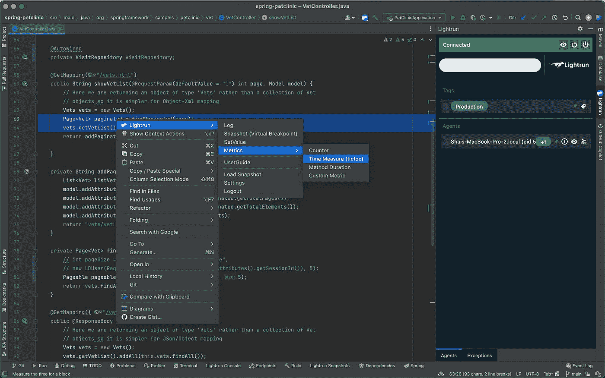
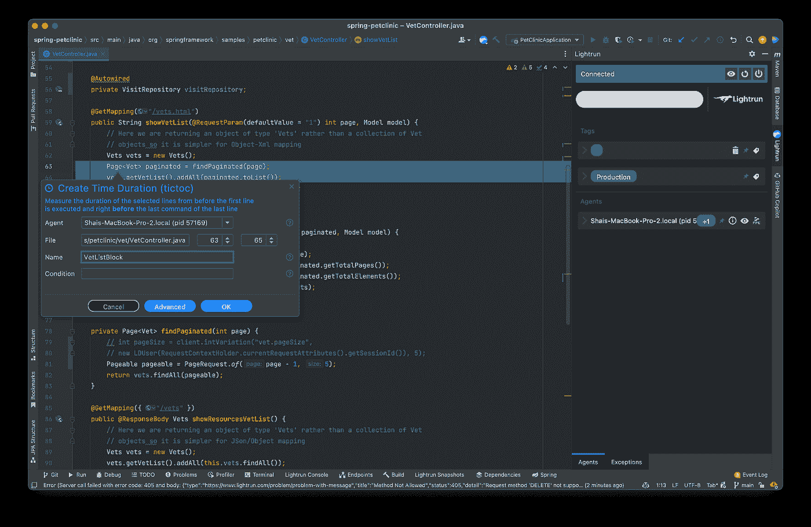
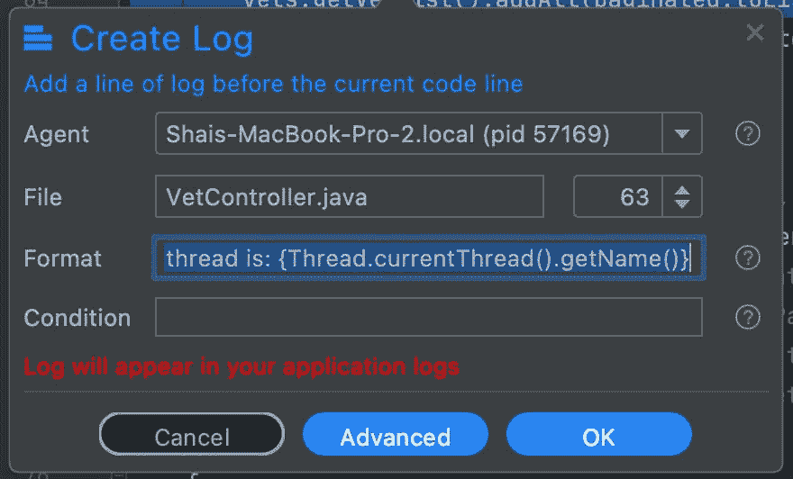

# 在生产中调试 Java Equals 和 Hashcode 性能

> 原文：<https://medium.com/javarevisited/debugging-java-equals-and-hashcode-performance-in-production-2901df4fcd3?source=collection_archive---------1----------------------->


我在本文的[中写了很多关于 equals 方法和哈希代码的性能指标。这些方法中有许多细微差别会导致性能问题。问题是，其中一些东西可以隐藏得很好。](https://talktotheduck.dev/hashcode-and-equals-debugging-performance)

总结一下核心问题:hashcode 方法是 java 集合 API 的核心。具体来说，就是哈希表的性能(具体来说就是映射接口[哈希表](https://www.java67.com/2012/08/5-difference-between-hashtable-hashmap-Java-collection.html))。equals 方法也是如此。如果我们有比字符串对象或原语更复杂的东西，开销会迅速增加。

但主要问题是细微的行为。本文给出的例子是 Java SE URL 类的例子。该类的 API 指定这些不同对象的以下比较将评估为真:

```
new URL("http://127.0.0.1/").equals(new URL("http://localhost/")); new URL("http://127.0.0.1/").hashcode() == new URL("http://localhost/").hashcode();
```

这是规范中的一个 bug。请注意，这适用于所有域，因此查找是执行散列或等于所必需的。那可能非常昂贵。

**提示:**equals/hashcode 的性能对于键值容器的使用必须非常高效，比如 [maps](https://javarevisited.blogspot.com/2015/08/difference-between-HashMap-vs-TreeMap-vs-LinkedHashMap-Java.html) 和其他基于散列的集合

这些方法有很多陷阱。其中一些只有在一定比例下才看得见。例如，一位朋友向我展示了一种比较对象的方法，它对一系列潜在值具有外部依赖性。这在本地表现很好，但是在生产中却很慢，因为列表中有更多的元素。

如何判断一个哈希函数在生产中是否很慢？

你怎么知道这是哈希函数的错呢？

# 衡量绩效

对于大多数意图和目的，我们不知道问题出在 equals 方法或哈希代码中。我们需要缩小问题的范围。很可能一个服务器进程比我们预期的要长，并可能在 APM 上显示出来。

我们在 APM 上看到的是 web 服务的缓慢性能。我们可以通过使用 Lightrun 提供的[度量工具](https://docs.lightrun.com/actions/#metrics)来缩小范围。

注意:在我们继续之前，我假设您已经熟悉了 Lightrun 的基础知识并安装了它。如果没有，请查看[这篇介绍](https://docs.lightrun.com/)。

[](https://javarevisited.blogspot.com/2018/05/top-5-java-courses-for-beginners-to-learn-online.html)

Lightrun 能够设置多种度量类型:

*   一种计数器，对到达特定代码行的次数进行计数
*   时间测量(tictoc ),用于测量特定代码块的性能
*   方法持续时间—与完整方法的 tictoc 相同
*   自定义度量-基于自定义表达式的测量

请注意，您可以在所有指标上使用条件。如果性能开销影响了特定用户，您可以将测量限制为仅针对该特定用户。

我们现在可以使用这些工具来缩小性能问题的范围并找到根本原因，例如，在这里我可以检查方法中的这两行是否有问题:

[](https://javarevisited.blogspot.com/2018/09/top-5-courses-to-learn-intellij-idea-java-and-android-development.html)

添加 tictoc 为我们提供了如下定期打印输出:

```
INFO: 13 Feb 2022, 14:50:06 TicToc Stats::
{
  "VetListBlock" : {"breakpointId" : "fc27d745-b394-400e-83ee-70d7644272f3","count" : 33,"max" : 32,"mean" : 4.971277332041485,"min" : 1,"name" : "VetListBlock","stddev" : 5.908043099655046,"timestamp" : 1644756606939  }
}
```

您可以查看这些打印输出，了解这些行产生的开销。您还可以使用计数器来查看我们调用方法的频率。

**注意:**您可以将这些结果通过管道传输到[普罗米修斯/格拉夫纳](https://docs.lightrun.com/integrations/prometheus/)以获得更好的可视化效果，但这需要一些配置，这超出了本教程的范围。

如果您将集合或映射视为应用程序中的主要性能损失，那么很可能是一个任意的哈希代码或 equals 方法出了问题。此时，您可以在方法本身中使用度量来衡量其开销。

这与我们经常在本地调试这些东西的方式非常相似。通过测量包围可疑区域，然后重新进行测试。不幸的是，这种方法很慢，因为它需要重新编译/部署应用程序。在生产中也不切实际。使用这种方法，我们可以快速检查所有“可疑”区域，并快速缩小范围。

此外，我们可以在一组服务器上使用标记功能来实现这一点。这样，我们可以像扩展服务器一样扩展我们的测量。

# 检查线程安全

当我们试着调试可变对象时，它们可以从多线程中被改变。这可能会引发看似性能问题的问题。通过验证我们拥有单线程访问，我们还可以减少关键部分的同步。

例如，在键值存储中，如果单独的线程改变了键，则存储可能会被破坏。

最简单的方法是使用条件当前线程是:`{Thread.currentThread().getName()}`记录当前线程:



问题是，像这样的情况可能会触发难以理解的输出，您可能会看到数百个打印输出。所以一旦我们找出了线程的名称，我们就可以添加一个条件:

```
!Thread.currentThread().getName().equals("threadName")
```

这将只记录来自不同线程的访问。这是我在之前的文章[这里](https://lightrun.com/tutorials/debug-race-condition-production/)中讨论过的事情。

# TL；速度三角形定位法(dead reckoning)

Java SE 中 equals 和 hashcode 方法的性能指标至关重要。它们对 [Java 集合 API](https://javarevisited.blogspot.com/2020/04/top-5-courses-to-learn-java-collections-and-streams.html) 有着广泛的深远影响，尤其是在与键值相关的调用中。对象必须有效地实现这一点，但是通常很难确定出错的 Java 类。

我们可以使用 Lightrun 指标来为生产中的任意方法计时。在“真实世界”环境中测量类的性能是很重要的，这可能与我们的本地测试用例不同。对于生产规模的数据，对象的行为可能完全不同，对一个类的微小更改可能会产生很大的不同..

我们可以缩小哈希的开销，使用日志来确定线程问题，并使用计数器来确定 API 的使用。

[](/javarevisited/top-21-string-programming-interview-questions-for-beginners-and-experienced-developers-56037048de45) [## 面向初学者和有经验的开发人员的 21 个字符串编程面试问题

### 除了数组、二叉树和链表数据结构，字符串是编程工作中的另一个热门话题…

medium.com](/javarevisited/top-21-string-programming-interview-questions-for-beginners-and-experienced-developers-56037048de45)  [## 50 大数据结构和算法程序员面试问题

### 准备编程工作面试？这里有 50 多个数据结构和算法问题，你可以练习…

medium.com](/javarevisited/50-data-structure-and-algorithms-interview-questions-for-programmers-b4b1ac61f5b0)