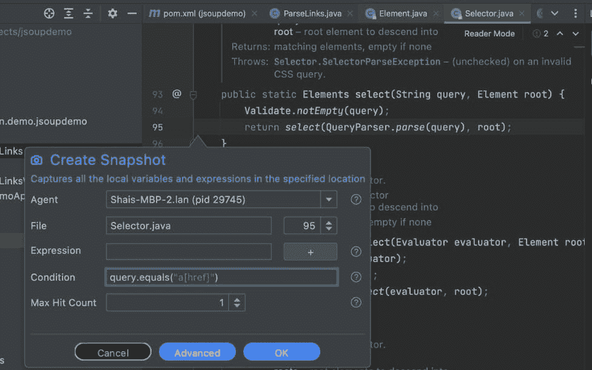
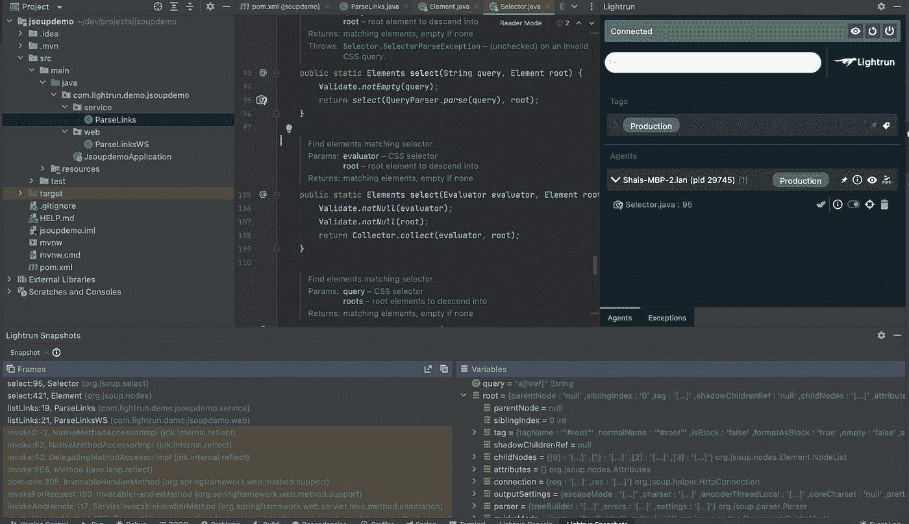
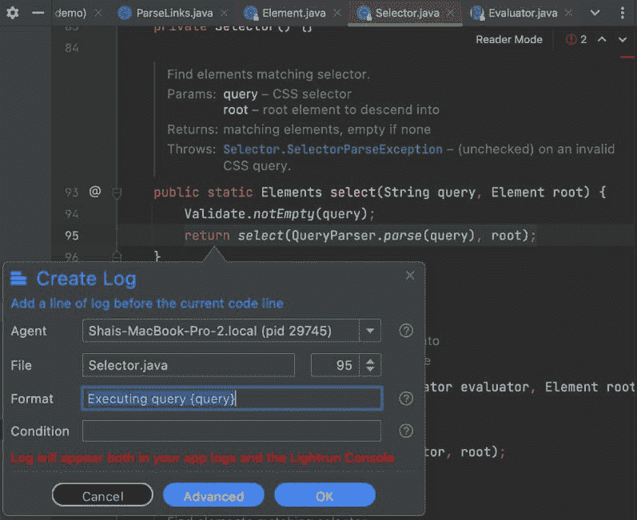
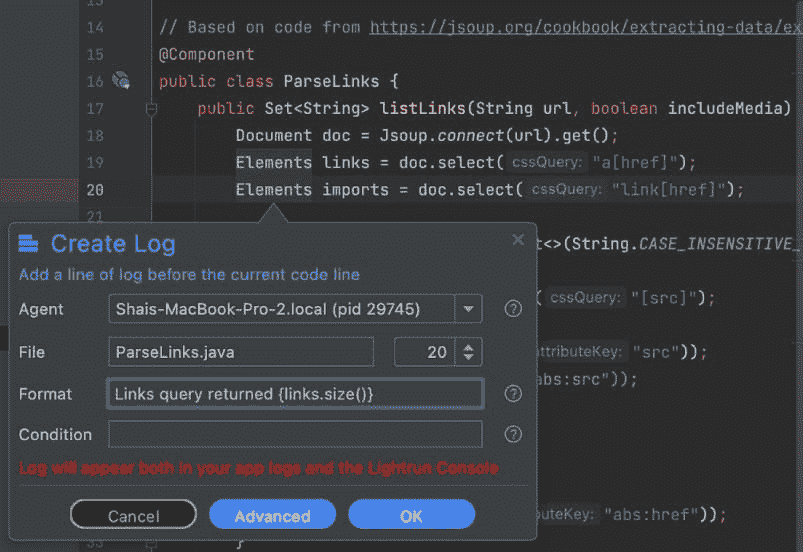

# 使用 Lightrun 调试生产中的 jsoup Java 代码

> 原文：<https://medium.com/javarevisited/debugging-jsoup-java-code-in-production-using-lightrun-ef8b65ec137d?source=collection_archive---------1----------------------->


抓取为现代浏览器构建的网站远比十年前更具挑战性。jsoup 是一个方便的 API，通过 DOM 遍历、CSS 选择器、类似 JQuery 的方法等等使抓取网站变得简单。但是它也不是没有警告。每个抓取 API 都是一个定时炸弹。

现实世界的 HTML 是不可靠的。因为它不是一个文档化的 API，所以它的改变不会事先通知。当我们的 Java 程序抓取失败时，我们突然被一个定时炸弹卡住了。在某些情况下，这是一个简单的问题，我们可以在本地重现并进行部署。但是在本地测试用例中，DOM 树中的一些细微变化可能更难观察到。在这些情况下，我们需要在推送更新之前理解解析树中的问题。否则，我们生产的产品可能会有问题。

# 什么是 jsoup？Java HTML 解析器

在我们深入调试 jsoup 的具体细节之前，让我们先回答上面的问题，并讨论 jsoup 背后的核心概念。

jsoup 网站将其定义为:

jsoup 是一个用于处理真实世界 HTML 的 Java 库。它提供了一个非常方便的 API 来获取 URL、提取和操作数据，使用了最好的 HTML5 DOM 方法和 CSS 选择器。

[jsoup](http://javarevisited.blogspot.sg/2014/09/how-to-parse-html-file-in-java-jsoup-example.html#axzz57nN5jeqk) 实现了 [WHATWG HTML5](https://whatwg.org/html) 规范，并将 HTML 解析为与现代浏览器相同的 DOM。

记住这一点，让我们直接看一个同样来自同一网站的简单示例:

```
Document doc = Jsoup.connect("https://en.wikipedia.org/").get();
log(doc.title());
Elements newsHeadlines = doc.select("#mp-itn b a");
for (Element headline : newsHeadlines) {
  log("%s\n\t%s",
    headline.attr("title"), headline.absUrl("href"));
}
```

这段代码片段从维基百科获取标题。在上面的代码中，您可以看到几个有趣的特性:

*   到 URL 的连接几乎是无缝的——只需将一个字符串 URL 传递给 connect 方法
*   有些元素子元素有特殊情况。例如，Title 被公开为一个简单的方法，它返回一个字符串，而不从 DOM 树中选择
*   然而，我们可以使用非常复杂的选择器语法来选择条目

如果你看着它，想着“它看起来很脆弱”。是的，它是。

# 简单联合测验

为了演示[调试](https://javarevisited.blogspot.com/2011/02/how-to-setup-remote-debugging-in.html)，我创建了一个简单的演示，您可以在这里下载。

您可以使用下面的 Maven 依赖项将 jsoup 安装到任何 Java 程序中。 [Maven](/javarevisited/6-best-maven-courses-for-beginners-in-2020-23ea3cba89) 将无缝下载 jsoup jar:

```
<dependency>
  <groupId>org.jsoup</groupId>
  <artifactId>jsoup</artifactId>
  <version>1.14.3</version>
</dependency>
```

这个演示程序是一个简单的 Java 应用程序，它在一个页面中返回外部链接和带有 src 属性的元素的完整列表。这是基于这里的代码，转换成 Spring Boot Java 程序。jsoup 适用的代码相对较短:

```
public Set<String> listLinks(String url, boolean includeMedia) throws IOException {
   Document doc = Jsoup.connect(url).get();
   Elements links = doc.select("a[href]");
   Elements imports = doc.select("link[href]"); Set<String> result = new TreeSet<>(String.CASE_INSENSITIVE_ORDER);
   if(includeMedia) {
       Elements media = doc.select("[src]");
       for (Element src : media) {
           result.add(src.absUrl("src"));
           //result.add(src.attr("abs:src"));
       }
   } for (Element link : imports) {
       result.add(link.absUrl("abs:href"));
   } for (Element link : links) {
       result.add(link.absUrl("abs:href"));
   } return result;
}
```

如您所见，我们获取了输入的字符串 URL。我们也可以使用输入流，但是在解析相对 URL 时，这会使事情稍微复杂一些(我们无论如何都需要一个基本 URL)。然后，我们搜索具有 src 属性的链接和对象。然后，代码将它们全部添加到一个集合中，以保持条目的排序和唯一性。

我们使用以下代码将其公开为 web 服务:

```
@RestController
public class ParseLinksWS {
   private final ParseLinks parseLinks; public ParseLinksWS(ParseLinks parseLinks) {
       this.parseLinks = parseLinks;
   } @GetMapping("/parseLinks")
   public Set<String> listLinks(@RequestParam String url, @RequestParam(required = false) Boolean includeMedia) throws IOException {
       return parseLinks.listLinks(url, includeMedia == null ? true : includeMedia);
   }
}
```

一旦我们运行了这个应用程序，我们就可以用一个简单的 curl 命令来使用它:

```
curl -H "Content-Type: application/json" "http://localhost:8080/parseLinks?url=https%3A%2F%2Flightrun.com"
```

这将打印出 Lightrun 主页中引用的 URL 列表。

# 调试内容失败

典型的字符串抓取问题发生在元素对象改变时。例如，维基百科可以改变页面的结构，上面的选择方法可能会突然失效。这通常是一个细微的错误，例如，在 Java 对象层次结构中缺少 DOM 元素会触发 select 方法的错误。

不幸的是，这可能是一个微妙的失败。尤其是在处理嵌套节点元素和文档间依赖关系时。大多数开发人员通过记录大量数据来解决这个问题。这可能是一个问题，原因有两个:

*   巨大的日志——它们既难以阅读，又非常昂贵
*   侵犯隐私/GDPR——抓取的网站可能包含用户特定的私人信息。更糟！
*   最初实施抓取后，抓取的站点可能会更改为包含私人信息。记录这些私人信息可能会违反各种法律。

如果我们没有记录足够的日志，并且不能在本地重现问题，事情会变得困难。我们陷入了添加日志、构建、测试、部署、重现—清洗重复的循环中。

Lightrun 提供了一个更好的方法。只需在生产中直接跟踪特定故障，验证问题，并创建一个适用于一个部署的修复程序。

**注意:**本教程假设你已经安装了 Lightrun，并且理解它背后的基本概念。如果没有，请[查看文件](https://docs.lightrun.com/)。

# 在浏览器 DOM 中找到自己的路

假设您不知道从哪里开始，那么从 jsoup API 内部开始是一个不错的地方。这可以让您回到用户代码。最酷的是，不管你的代码是什么，这都能工作。通过深入研究 API 调用，我们可以为快照找到正确的行/文件。

我在这里按住 ctrl 键单击(在 Mac 上使用 Meta-click)select 方法调用:

```
Elements links = doc.select("a[href]");
```

这让我想到了元素课。在其中，我按住 ctrl 键单击选择器的“select”方法，到达“有趣”的地方。

在这里，我可以放置一个条件快照来查看进行“a[href]”查询的每一种情况:

[](http://javarevisited.blogspot.sg/2014/09/how-to-parse-html-file-in-java-jsoup-example.html#axzz57nN5jeqk)

这可以向我显示执行该查询的方法/行:



这有助于缩小文档对象层次结构中的一般问题区域。

有时，快照可能还不够。我们可能需要使用日志。[日志](https://javarevisited.blogspot.com/2011/05/top-10-tips-on-logging-in-java.html)的优势在于我们可以产生大量的信息，但只针对特定的案例和按需提供。

日志的价值在于，它们可以以非常类似于单步执行代码的方式跟踪问题。我们放置快照的位置对于日志来说是有问题的。我们知道发送了查询，但是还不知道返回值。我们可以用日志轻松解决这个问题。首先，我们添加一个包含以下文本的日志:

```
"Executing query {query}"
```

[](https://javarevisited.blogspot.com/2017/04/log4j-tips-use-mdc-or-mapped-dignostic-context-to-log-per-client-or-request.html)

然后，为了找出我们返回了多少条目，我们只需转到调用者(由于快照中的堆栈，我们知道这一点)并在那里添加以下日志:

```
Links query returned {links.size()}
```

[](https://www.java67.com/2021/05/how-to-solve-nullpointerexception-in-java.html)

这产生了下面的日志，让我们看到我们有 147 个`a[href]`链接。其妙处在于，额外的日志与上下文中预先存在的日志交织在一起:

```
Feb 02, 2022 11:25:27 AM org.jsoup.select.Selector select
INFO: LOGPOINT: Executing query a[href]
Feb 02, 2022 11:25:27 AM com.lightrun.demo.jsoupdemo.service.ParseLinks listLinks
INFO: LOGPOINT: Links query returned 147
Feb 02, 2022 11:25:27 AM org.jsoup.select.Selector select
INFO: LOGPOINT: Executing query link[href]
Feb 02, 2022 11:25:27 AM org.jsoup.select.Selector select
INFO: LOGPOINT: Executing query [src]
```

# 避免安全和 GDPR 问题

GDPR 和安全问题可能是将用户信息泄露到日志中的一个问题。这可能是一个主要问题，Lightrun 可以帮助您显著降低这种风险。

Lightrun 提供了两种潜在的解决方案，在适用的情况下可以结合使用。

# 原木管道

GDPR 最大的问题是摄入原木。如果你记录私人用户数据，然后将其发送到云端，它会在那里存在很长时间。事后很难发现，也很难修复。

Lightrun 提供了将 Lightrun 的所有注入日志直接传输到 IDE 的能力。这有一个好处，可以消除可能使用日志的其他开发人员的干扰。它还可以跳过摄入(可选)。

要仅向插件发送日志，请将管道模式选择为“插件”。

[](https://www.java67.com/2021/05/how-to-solve-nullpointerexception-in-java.html)

# PII 缩减/阻止列表

个人身份信息(PII)是 GDPR 的核心，也是一个主要的安全风险。您组织中的恶意开发人员可能想要使用 Lightrun 来窃取用户信息。阻止列表阻止开发人员在特定文件中放置动作。

PII 缩减使我们可以隐藏日志中与特定模式匹配的信息(如信用卡格式等)。这可以由经理角色在 Lightrun web 界面中定义。

# TL；速度三角形定位法(dead reckoning)

在 Java 内容抓取方面，jsoup 是明显的领导者。用 jsoup 进行开发不仅仅是字符串操作，甚至不仅仅是处理连接方面。除了获取文档对象，它还处理 DOM 元素和脚本所需的复杂方面。

刮痧是一件有风险的事情。当一个网站稍有变化时，它可能会在一瞬间崩溃。

更糟糕的是，它可能会以奇怪的方式影响到一些用户，而这些方式是不可能在本地复制的。

多亏了 Lightrun，我们可以直接在生产环境中调试这种故障，并迅速发布一个工作版本。你可以在这里注册免费使用 Lightrun。