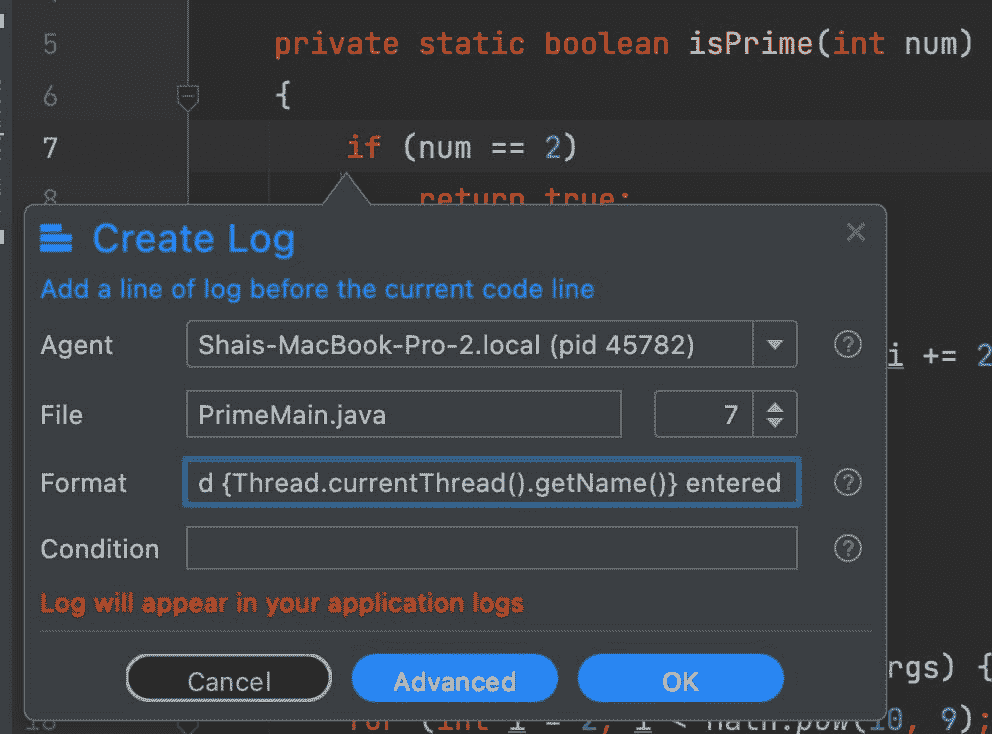
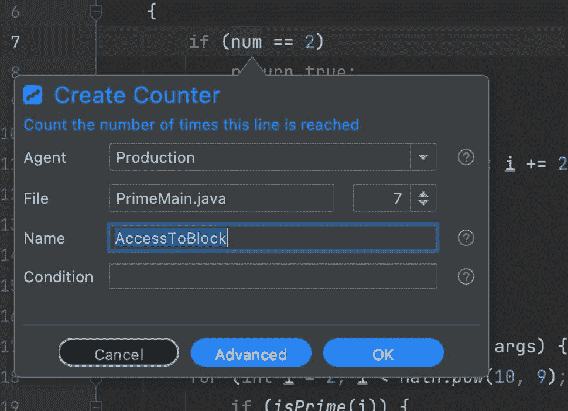
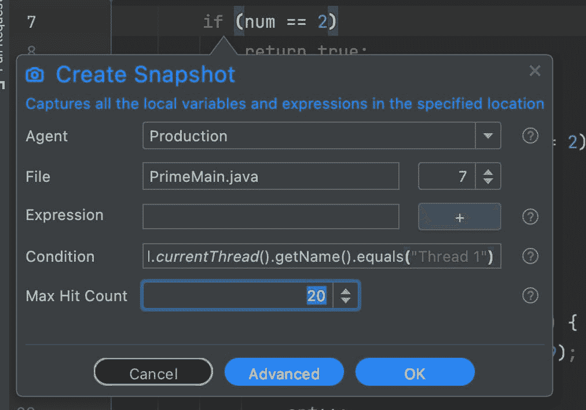
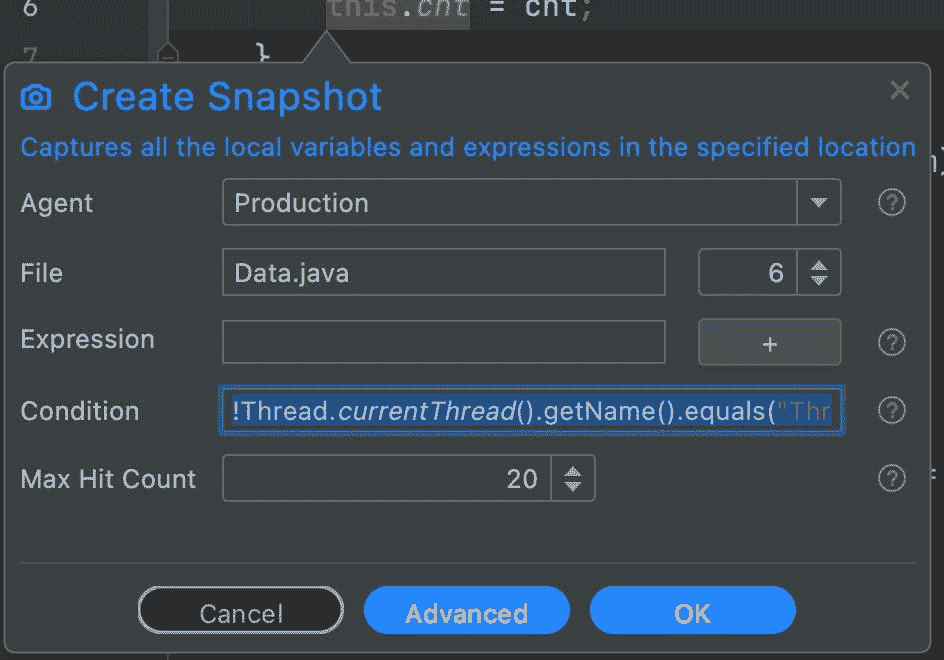

# 调试生产中的竞争条件

> 原文：<https://medium.com/javarevisited/debugging-race-conditions-in-production-73b05558fe9b?source=collection_archive---------1----------------------->

[](https://javarevisited.blogspot.com/2020/05/top-5-courses-to-learn-eclipse-ide-for-java-developers.html)

当多线程应用程序使用多个线程访问共享资源时，可能会发生争用情况。除非我们有适当的保护，否则结果可能取决于哪个线程“先到达那里”。当状态从外部改变时，这尤其成问题。

一场比赛能引起的不仅仅是不正确的行为。当有问题的资源以正确的方式被破坏时，它会导致安全漏洞。[竞争条件漏洞](http://javarevisited.blogspot.sg/2012/02/what-is-race-condition-in.html)的一个很好的例子是内存混乱。假设我们有一个受限制的特权管理员用户名。由于验证，您不能将用户名更改为 admin。但是你可以把它改成其他任何东西…

恶意代码可以重复地将该值设置为“混合”、“xdmin”等。如果系统按顺序书写字符，您可能会以“admin”结尾。我们可以重复运行这段代码，直到得到正确的结果。这是一种权限提升攻击，允许我们访问我们不应该访问的信息和功能，如文件系统等。安全隐患是严重的。

对我个人来说，最大的问题是未定义的行为会触发难以捉摸的错误。

请注意，我使用了 [Java](/javarevisited/10-best-places-to-learn-java-online-for-free-ce5e713ab5b2) 作为本教程的语言，但它应该同样适用于其他编程语言。

# 连载一切？

不幸的是，竞争条件非常难以解决。独占访问或临界区会大大降低应用程序的性能。它们阻塞了计算机资源的使用，破坏了我们的 CPU 缓存利用率。

我们希望尽可能减少[同步](https://javarevisited.blogspot.com/2020/04/difference-between-atomic-volatile-and-synchronized-in-java-multi-threading.html)操作，但是我们不希望出现未定义的行为。

构建高性能多线程应用有许多优化和策略。一个很好的例子就是最大化只读状态、不变性等。

但是真正的问题是知道你有一个竞争条件。怎么检测出来的？

# 检测竞争条件

市场上有一些很棒的种族检测工具。有些人使用静态分析，他们审查应用程序代码并显示有风险的区域。其他的在运行时工作，检查线程的活动。它们并不常见，因为调试环境并不代表“真实世界”。

我们的生产环境非常复杂，而且每天都在变得越来越复杂。在这种环境下检测并验证一个比赛是很有挑战性的…

# 用静态分析仪解决差距

静态分析仪的问题是他们经常发布假阳性结果。它们指向风险，而不是现实中可能发生的事情。因此，开发人员经常对他们的产出打折扣。如果你能证实一个潜在的种族呢？

使用 Lightrun 很容易做到这一点。我们可以记录可疑块中的线程。如果[多个线程](https://javarevisited.blogspot.com/2013/02/how-to-join-multiple-threads-in-java-example-tutorial.html#axzz6mtjws1ez)同时进入该区域，那么就会出现竞争情况。

我们可以做的最简单的事情是添加一个日志条目，如下所示:

[](https://javarevisited.blogspot.com/2011/02/how-to-setup-remote-debugging-in.html)

日志打印“Thread {`Thread.currentThread().getName()`} enter”，我们可以在这段代码的末尾添加相应的“exited”版本。但是这给我们带来了一个新的问题。

对于简单的情况，这将很好地工作，但如果我们有许多请求通过该代码，我们可能会遇到节流。当动作占用太多 CPU 时，Lightrun 会对其进行节流，结果，我们可能会得到不均匀的输入/输出打印结果。

该解决方案是一个多部分解决方案。首先，我们可以像上面一样使用日志来获取访问这个块的线程的名称。

接下来，我们需要验证是否有大量的请求。为此，我们可以添加一个计数器:

[](https://javarevisited.blogspot.com/2011/07/java-debugging-tutorial-example-tips.html)

我们还可以通过将计数限制到特定的[线程](https://www.java67.com/2017/11/difference-between-wait-and-join-method-of-thread-java.html)来进一步缩小范围，例如，对于“线程 1 ”,我们可以将条件设置为:

```
Thread.currentThread().getName().equals("Thread 1")
```

最后，我们可以使用包含多个捕获的快照:

[](https://www.java67.com/2015/11/difference-between-multithreading-and-multitasking.html)

注意下面的“最大点击数”。它会触发 20 次不同的点击。然后我们可以查看它们，并看到相应的堆栈跟踪。如果路径不包括同步或包括一个坏的监视器，这里可能有问题。

# 我们不知道的种族…

当我们知道我们在寻找什么的时候，并发性就足够困难了。在我们还不知道方向的情况下追踪一场比赛是具有挑战性的。

谢天谢地，我们有封装来拯救。最糟糕的竞争是那些与记忆位置突变有关的竞争。我们需要做的就是在执行对象变异的代码上放置一个日志，这样它就会打印出当前线程的名称。有了这个，我们可以追踪绝大多数潜在的种族。

但是我们可以做得更好！

在这里，我们添加了一个多点击快照，当用不同的线程调用 [setter 方法](https://javarevisited.blogspot.com/2012/11/difference-between-setter-injection-vs-constructor-injection-spring-framework.html)时。

条件是:

[](https://javarevisited.blogspot.com/2015/10/133-java-interview-questions-answers-from-last-5-years.html)

```
!Thread.currentThread().getName().equals("Thread 1")
```

注意开头的“NOT”操作符。假设只有“线程 1”发生了突变，因此您将会看到从不同线程访问该操作的代码的堆栈跟踪。您可以将这样的操作在长时间运行的系统中保留几天(不要忘记在高级模式下更新到期时间),如果有对该块的访问，该流程将触发此操作。

# TL；速度三角形定位法(dead reckoning)

我们以前所未有的规模部署现代项目。即使是 [Lambda](/javarevisited/8-best-lambdas-stream-and-functional-programming-courses-for-java-developers-3d1836a97a1d) 上的一个简单函数也可以改变复杂部署的动态，并触发同步问题，这是我们在本地调试时无法看到的，因为连接时间、环境等方面的差异。

竞争条件也可能是导致安全问题的攻击媒介。例如，存储位置可能被破坏，特权可能被提升，等等。

在本地流程中调试这些问题已经够难的了，跟踪一个产品是一项艰巨的任务。环境中的同时请求会干扰我们的跟踪，更糟糕的是，如果我们不小心，我们可能会引发生产问题。谢天谢地，Lightrun 消除了这些问题！

由于 Lightrun 在默认情况下是异步的和长时间运行的，所以它非常适合于监控生产中的程序和检查对各种资源(如内存)的访问。