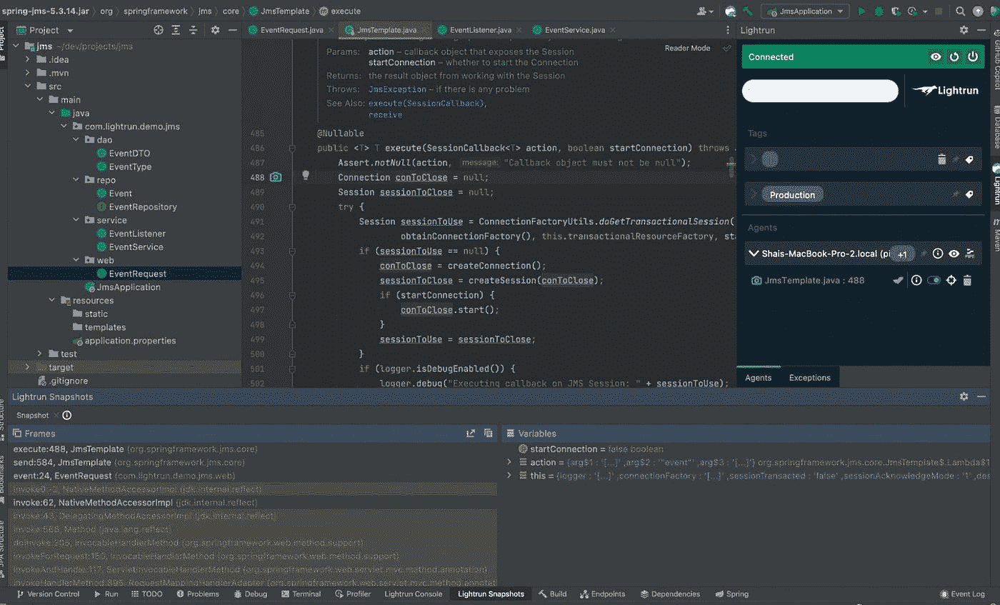
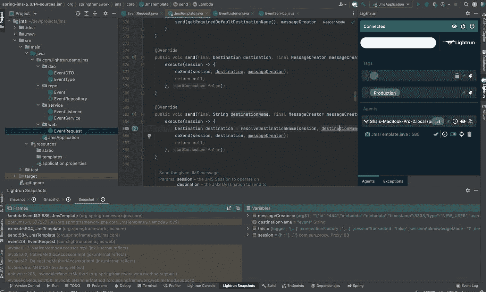

# 使用 Lightrun 调试 Java 消息服务(JMS) API

> 原文：<https://medium.com/javarevisited/debugging-the-java-message-service-jms-api-using-lightrun-3e2ad5765a8e?source=collection_archive---------4----------------------->


Java 消息服务 API (JMS)是在 Java EE(T1)时代由 Sun Microsystems 开发的。JMS API 为我们提供了简单的消息传递抽象，包括消息生产者、消息消费者等。消息传递 API 允许我们将消息放在一个“队列”中，并使用放入该队列中的消息。这对高吞吐量系统非常有用——企业应用程序可以发送消息，而不是通过实时执行缓慢的操作来浪费用户时间。这种非阻塞方法支持极高的吞吐量，同时保持大规模可靠性。

该消息携带一个事务上下文，该上下文提供了对可传递性和可靠性的一些保证。因此，我们可以在一个方法中发布一条消息，然后返回，这提供了与我们在写入一个 [ACID 数据库](https://javarevisited.blogspot.com/2011/11/database-transaction-tutorial-example.html#axzz5WDqhDqX3)时类似的保证。

我们可以认为消息传递有点像社区邮件列表。您向代表特定列表的电子邮件地址发送邮件。订阅该列表的每个人都会收到该消息。在这种情况下，消息主题表示社区邮件列表地址。您可以向它发送消息，Java 消息服务处理程序可以使用消息侦听器来接收所述事件。

值得注意的是，在 [JMS](https://javarevisited.blogspot.com/2020/05/top-16-jms-java-messaging-service-interview-questions-answers.html) 中有两种消息传递模型:发布-订阅模型(我们在这里讨论过)和点对点消息传递，点对点消息传递允许您将消息发送到特定的目的地。

让我们快速演示一下。

# 简单的演示

为了调试 Java 消息服务调用，我创建了一个简单的演示应用程序，其源代码可以在这里找到。

这个 JMS 演示是一个简单的数据库日志 API——它是一个微服务，您可以用它来发布一个日志条目，然后该日志条目被异步写入到数据库[中。然后，RESTful 应用程序可以使用这个数据库日志 API 来添加数据库日志条目，而不会有数据库访问的开销。](/javarevisited/7-free-courses-to-learn-database-and-sql-for-programmers-and-data-scientist-e7ae19514ed2)

这段代码实现了主要的 web 服务:

```
@RestController
@RequiredArgsConstructor
public class EventRequest {
   private final JmsTemplate jmsTemplate;
   private final EventService eventService;
   private final Moshi moshi = new Moshi.Builder().build(); @PostMapping("/add")
   public void event(@RequestBody EventDTO event) {
       String json = moshi.adapter(EventDTO.class).toJson(event);
       jmsTemplate.send("event", session ->
               session.createTextMessage(json));
   } @GetMapping("/list")
   public List<EventDTO> listEvents() {
       return eventService.listEvents();
   }
}
```

注意向事件主题发布消息的`event()`方法。为了简单起见，我之前没有讨论消息体，但是请注意，在这种情况下，我只是传递了一个 [JSON 字符串](https://javarevisited.blogspot.com/2015/05/how-to-print-json-string-in-java-jackson-example.html)作为消息体。虽然 JMS 支持对象序列化，但是使用该功能有其自身的复杂性，我希望保持代码简单。

为了补充主 web 服务，我们需要构建一个侦听器来处理传入的消息:

```
@Component
@RequiredArgsConstructor
public class EventListener {
   private final EventService eventService; private final Moshi moshi = new Moshi.Builder().build(); @JmsListener(destination = "event")
   public void handleMessage(String eventDTOJSON) throws IOException {
       eventService.storeEvent(moshi.adapter(EventDTO.class).fromJson(eventDTOJSON));
   }
}
```

侦听器由发送给侦听器的 [JSON 字符串](https://javarevisited.blogspot.com/2014/12/how-to-read-write-json-string-to-file.html)调用，我们解析该字符串并将其发送给服务。

# 调试隐藏代码

像 [Spring](/javarevisited/10-best-online-courses-to-learn-spring-framework-in-2020-f7f73599c2fd) 和 [JMS](https://www.java67.com/2020/04/top-jms-java-messaging-service-interview-questions-answers.html) 这样的抽象的伟大之处在于你不需要写很多样板代码。不幸的是，这种类型的面向消息的中间件隐藏了许多脆弱的实现细节，这些细节可能会在实现过程中失败。

这在生产场景中尤其痛苦，因为很难知道问题是否是因为消息没有正确发送而发生的。这就是 Lightrun 的用武之地。

您可以放置 Lightrun 操作(快照、日志等。)直接集成到平台 API 和消息服务的实现中。这让我们可以确定消息选择器是否按预期工作，以及消息监听器是否确实被触发。

如上图所示，通过 JMS 支持的 [Spring](/javarevisited/top-10-free-courses-to-learn-spring-framework-for-java-developers-639db9348d25) ,我们可以打开`JmsTemplate`并向执行方法添加一个快照:

[](https://www.java67.com/2021/04/5-free-microservice-courses-for-java.html)

正如您所看到的，当发送到一个主题时，这个动作被调用。我们可以检查堆栈框架，查看接收消息的主题，并使用条件来缩小正确的消息处理程序。

我们可以在消息源中放置一个匹配的快照，这样我们就可以跟踪消息流。在`EventRequest`的一个快照可以给我们一些启示。我们也可以从另一个方向挖。

在上面的堆栈中，您可以看到第 584 行的方法 send 调用了 execute 方法。execute 方法包装调用方，因此操作将是异步的。我们可以进一步深入堆栈，转到闭包并在那里放置一个快照:

[](http://www.java67.com/2017/11/top-5-free-core-spring-mvc-courses-learn-online.html)

请注意，这里我们可以对特定主题设置一个条件，并缩小范围。

# TL；速度三角形定位法(dead reckoning)

我们选择消息传递系统是为了让我们的应用程序可靠。然而，企业消息传递系统在生产中很难调试，这不利于可靠性。我们可以在消息的目标中看到日志，但是如果我们没有到达它会发生什么呢？

有了 Lightrun，我们可以在基于消息传递的应用程序的所有不同层中放置动作。这有助于我们缩小问题范围，而不管消息标准或平台如何。您可以使用[空闲层](https://lightrun.com/free)来完成所有这一切。