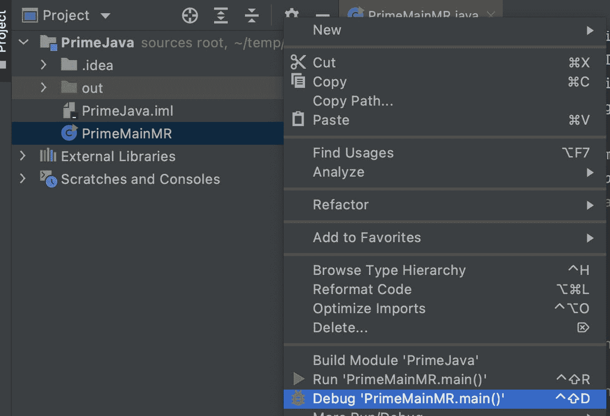
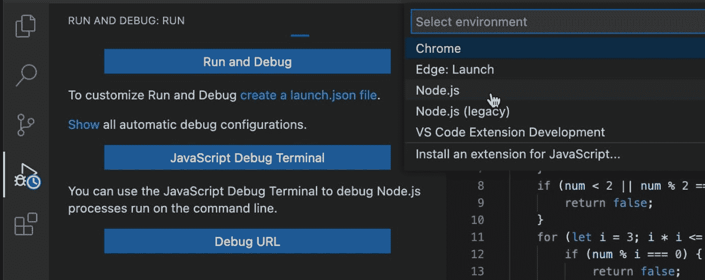
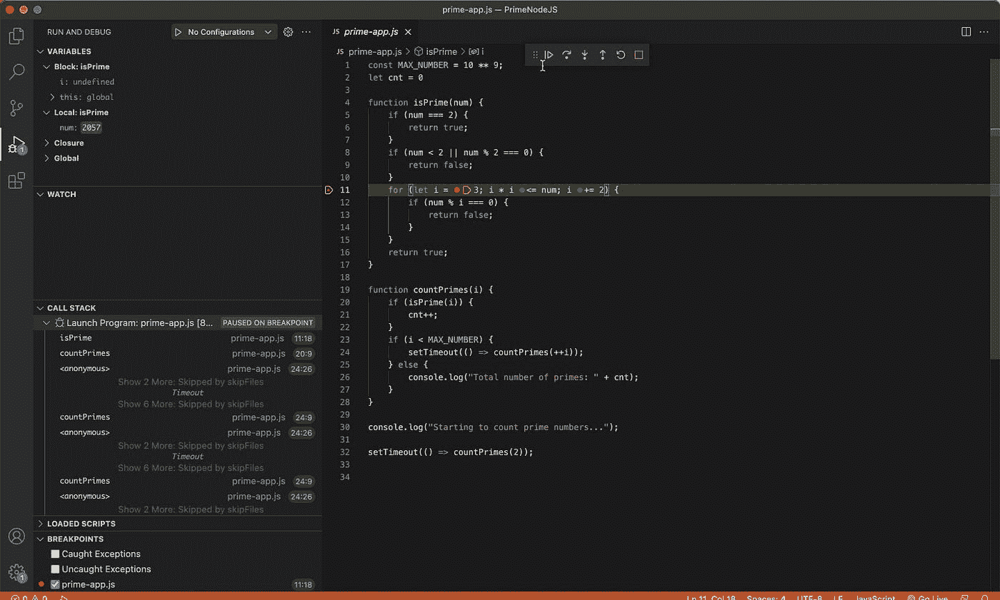
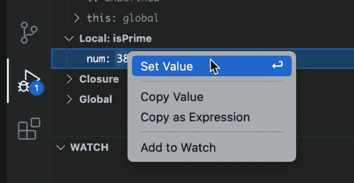
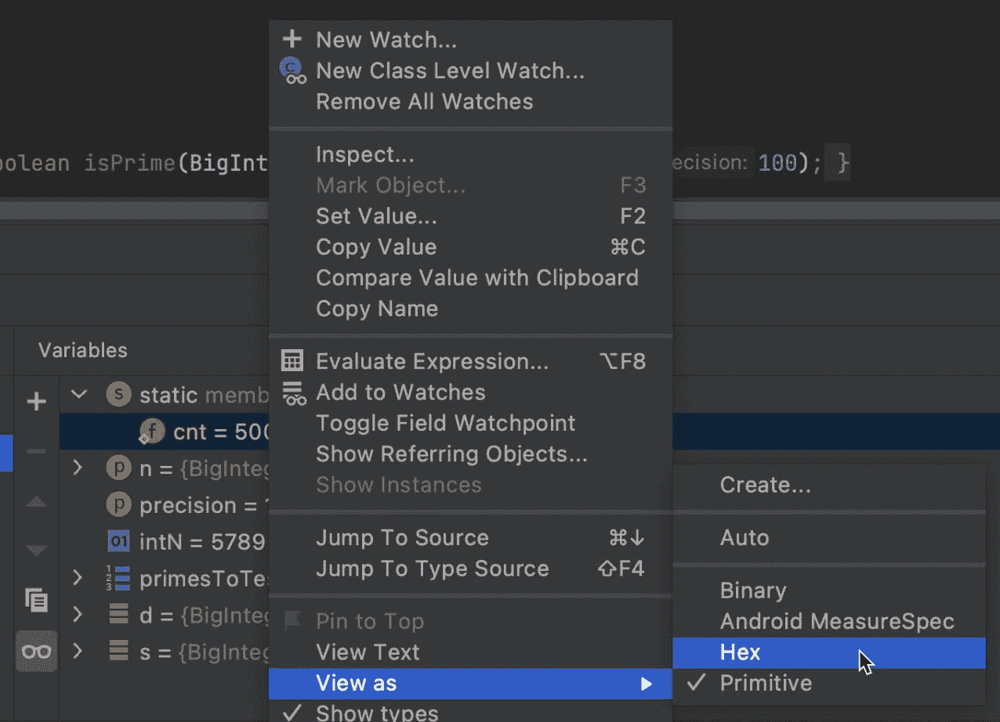
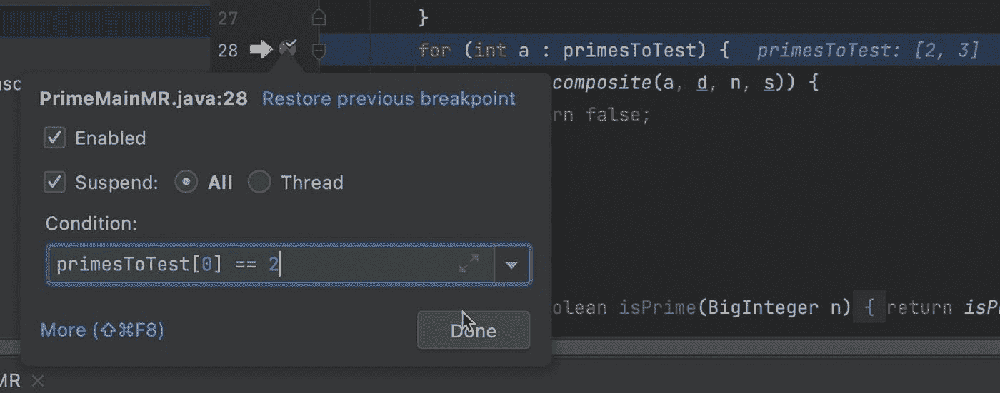
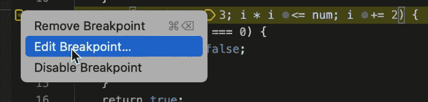
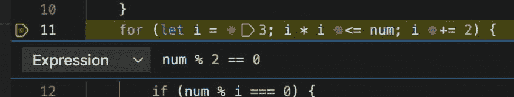

# 调试教程 1 —简介:条件断点

> 原文：<https://medium.com/javarevisited/debugging-tutorial-1-introduction-conditional-breakpoints-1721efee1ace?source=collection_archive---------2----------------------->

在本系列中，我将带您了解调试应用程序并发现其中问题的过程。在我们调试的时候，我们将涵盖对大多数开发人员来说很重要的技术。我将介绍以下调试器:

*   IntelliJ/IDEA —使用 Java/Kotlin
*   PyCharm — Python
*   VSCode —对于 JavaScript
*   WebStorm —针对 JavaScript

这些应该涵盖了您将遇到的大多数用例，有些内容似乎是重复的/多余的，所以如果您觉得自己“掌握了要点”，可以直接跳到适用的部分。

注意，虽然我不会讨论 TypeScript，但是 JavaScript 教程中讨论的所有内容也适用于 TypeScript。这同样适用于大多数 JVM 语言，如 Scala 等。

通常人们根据 IDE/语言来区分这些教程。我认为将它们放在一起有利于提供“大画面”。在我们的职业生涯中，我们也经历过语言/ide，拥有更广阔的视角是有帮助的。

在以后的帖子中，我还想谈谈 Chrome DevTools 和 Firefox Web Developer Tools 的浏览器调试。然而，这是一个稍微不同的过程，所以我现在不考虑它们。

我还附上了一个视频教程，直观地突出了这些步骤。如果我的说明不清楚，这可能会有帮助:

# 动机

本系列的主要目标是让您快速了解，这样我们就可以在接近尾声时深入真正有趣的教程。第一部分可能看起来有点琐碎，因为我假设我对调试技术一无所知，但我计划随着我们的前进深入了解这些帖子。

但你可能会问自己，为什么要经历这些？

为什么我们需要经历一个调试教程？我已经知道编程和使用调试器并不是火箭科学…

嗯……根据这个[研究](http://citeseerx.ist.psu.edu/viewdoc/download?doi=10.1.1.370.9611&rep=rep1&type=pdf)，我们花了 50%的时间来追踪 bug，尽管我看到的数字从 25%到 75%不等。不幸的是，这是大学并不真正教授的技能。甚至在我们的工作中，人们也忽略了这一基本技能。有一些书涵盖了这个主题，但是很多都过时了，而且是针对更复杂的场景。

调试不仅仅是寻找 bug。当我需要在我不熟悉的代码区域实现一个新特性时，我通常会打开调试器，开始调试这些区域。试着像调试问题一样查看流程。检查烟囱、构件等。为了更好地理解系统的工作方式并验证我的假设。

# 入门指南

为了开始，我们需要一个简单的应用程序，我们可以在本教程的初始部分调试。为此，我们将使用 Prime Main 来计算质数。这是一个简单的应用程序，你可以在你的 IDE 中获取并打开它。

请注意，这些应用程序是专门未经优化和冗长的，以给我们更多的地方放置断点和步骤。

以下是各种语言的版本:

*   **爪哇**——【gist.github.com/shai-almog/e400134f01decc96..】T2
*   科特林——[gist.github.com/shai-almog/c454d39464ca2893..](https://gist.github.com/shai-almog/c454d39464ca2893c014807838c5102f)
*   **Python**——[gist.github.com/shai-almog/8c8bbbb4297f758f..](https://gist.github.com/shai-almog/8c8bbbb4297f758f7ce1d5f7a4cc1c74)
*   **JavaScript**——[gist.github.com/shai-almog/167a34571b0fae6e..](https://gist.github.com/shai-almog/167a34571b0fae6eeed56742c44895cd)

下载适当的源文件，并将其作为主源文件添加到 IDE 的新项目中。您可以运行该应用程序，但要记住，它将运行很长时间来搜索质数。

# 简单条件断点

首先，我们需要调试应用程序。在 JetBrains 的 ide 中，我们只需右键单击可执行文件并选择 debug，如下所示:

请注意，您可能需要等待 IDE 完成对文件的扫描和索引，这样它才会显示相应的调试操作。

VSCode 也是如此。选择 IDE 左侧的调试视图，然后单击“运行并调试”按钮。

将提示您使用一个环境，选择 Node.js 继续。

一旦你开始调试，你可以通过点击文件左边的“gutter”区域来设置一个断点。让我们对每种文件类型/IDE 做一个快速实验。

# 运转

在 JetBrains IntelliJ/IDEA 上运行

在 VSCode 上运行

我们在文件的第行放置一个断点。请注意，Java 文件比其他主要的主文件更加复杂:

*   对于 Java，将断点放在第 28 行
*   对于科特林线 21
*   对于 JavaScript 第 11 行
*   对于 Python 第 11 行

一旦命中断点，您应该能够在左下角看到堆栈跟踪。堆栈跟踪表示调用当前方法的方法。在栈顶你可以看到当前的方法。你可以点击每个“堆栈框架”来查看调用者和调用者框架中变量的状态。

在右下角(对于 JetBrains)或左上角(对于 VSCode ),您可以看到当前堆栈框架中的变量。注意 n，这是我们正在计算的数字。请注意，它不是一个原语，而是一个大整数，我们用它来支持 Java 中非常大的数字(这些数字可能大于 9，223，372，036，854，775，807，这是 Long 的极限)。

我们可以使用“设置值”功能更改变量值:

在 JetBrains 中设置价值

在 VSCode 中设置值

这对调试边缘情况非常有帮助。只需将变量设置为您遇到问题的值，然后重现问题。

一个很好的 JetBrains 功能可以让你以不同的方式查看一个值，例如十六进制，二进制等。：

最后，我们可以右键单击断点来编辑它。我们可以为断点设置一个条件，只有满足该条件时才会停止执行:

IntelliJ/IDEA 上 JetBrains 中的条件断点

通过在 VSCode 中编辑断点来添加条件断点

VSCode 中的条件断点编辑

因为 Java 代码有点不同，所以我使用了`primesToTest[0] == 2`,这总是正确的。你可以试着把它设置为 3，这会花很长时间，你可以看到它只会在那个点停止。

在其他情况下，我使用`num % 2 == 0`作为一个永远为假的条件。因为那条线上面的线检查一个数是否是偶数，而它永远不会是偶数。将此条件转换为`num % 2 == 1`将始终为真，断点将被命中。

# 更进一步

条件断点是调试器中最强大的工具之一，但遗憾的是没有得到充分利用。当你在一个循环中经历失败时，我们经常一次又一次地走过这个循环…等待合适的条件出现。

通过使用设置值或条件，我们可以在调试过程中更快地移动，并可能更准确地再现问题，而没有您通常看到的单步调试的延迟。

# TL；速度三角形定位法(dead reckoning)

在本系列的第一部分中，我试图强调调试技能对我们日常工作的重要性。伟大的开发人员有效地使用他们的工具来提高生产率，调试器是一台复杂的机器，我们需要有效地使用它。根据一些统计数据，调试可能和我们的编码技能一样重要。不幸的是，即使是像条件断点，设置值等基本功能。大多数开发人员很少使用。我希望本系列的这篇文章和以后的文章能帮助你改变这种情况，并帮助你快速找到 bug。