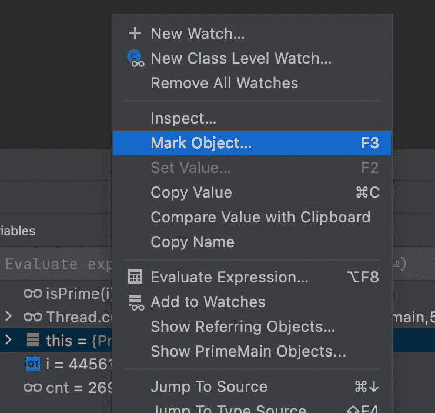
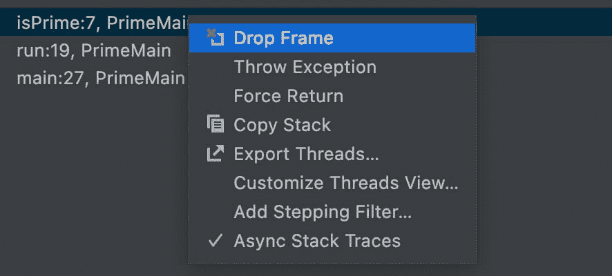

# 调试教程:Java 返回值，IntelliJ 跳转行等等

> 原文：<https://medium.com/javarevisited/debugging-tutorial-java-return-value-intellij-jump-to-line-and-more-6ee7577133dd?source=collection_archive---------1----------------------->

我刚刚发表了第三集的**“140 秒小鸭”**教程系列，我正在进入做它们的节奏。我在上周贴了第二集，在这篇文章中，我会更深入地探讨这两者。

我解决了很多关于调试的基本问题，但是我选择了两个大标题，这两个标题是很多开发人员都不熟悉的。例如，你有多少次跨过退货声明并咒骂？

原始对象没有保存在任何地方，您也不知道 return 语句实际返回了什么。或者更糟，如果你不小心踩到代码怎么办？

等等？发生了什么事？我们能回去吗？

跳转到该行正是工具，使这一点。在撰写本文时，我可以保证使用这个特性的开发人员不到 4.6 万人…

但在我们继续之前，这里有视频(第二和第三):

# Java 返回值

放置我们刚刚跳出的方法的返回值非常简单。然而它默认是关闭的。我们可以在 [IntelliJ](/javarevisited/7-best-courses-to-learn-intellij-idea-for-beginners-and-experienced-java-programmers-2e9aa9bb0c05) 中启用“显示方法返回值”设置选项，它就“神奇地”工作了。

这是否引出了这样一个问题:为什么这个有用的特性在默认情况下是关闭的？

由于时间不够，我在视频中没有提到这个问题。

原因是性能。检查的元素越多，应用程序就越慢。这意味着 IDE 将把插装绑定到 return 关键字(底层字节码)，并在每次命中时收集信息。

如果应用程序感觉很慢，请禁用这些工具。如果可能，投资更新的硬件。尤其是更多的内存。此外，确保我们为 IDE 分配足够内存！

# IntelliJ 跳转到行

那么我怎么知道少于 4.6 万的开发者使用了这个特性呢？

简单。它不是 IDE 的一部分。这是一个[需要一个插件](https://plugins.jetbrains.com/plugin/14877-jump-to-line)来支持的特性。看看安装的数量，这是一个可以从一些社区意识中受益的特性。

安装后，您可以将当前执行位置拖动到不同的位置。请注意，对象的状态没有改变，因此您可能需要编辑值以使一切正常工作。

如果你想再试一次，这是非常有用的。你跳过一个方法，观察到一个副作用。然后你可以把执行拖回来，用不同的属性重新做一遍。这对于缩小问题范围非常有用。

对于[测试](/javarevisited/6-best-rest-api-tools-for-testing-design-and-development-1c5f69ed1f22)也很有用。我们可以一次又一次地尝试不同值的方法，然后为其生成用例。我们不用重启应用就能更好地理解代码覆盖语义。

# 物体标记

另一个绝对显著而我在“真实世界”中看不到的特征是标记。可能是因为大家就是不明白这是什么意思…

标记实际上是对对象的新引用的声明。比如声明一个新的全局变量。这个超级值钱！

开发人员经常在一张纸上写下他们正在查看的对象的对象 ID(或指针值)来跟踪问题。通过对象标记，我们可以给一个实例一个特定的全局名称。然后，我们可以在任何范围之外引用该实例…

例如，当你在[调试](https://javarevisited.blogspot.com/2011/07/java-debugging-tutorial-example-tips.html#axzz6bYzaddcE)时，想要确保你在一个方法中看到的对象是将被发送到另一个方法的对象(而不是克隆的副本)。只需用名称标记对象。然后，在另一个方法中，将参数与标记的对象进行比较。

你可以在[中使用这个条件断点](https://javarevisited.blogspot.com/2011/02/how-to-setup-remote-debugging-in.html)在合适的位置停止。这是一个非常有用的功能。

# 立即返回

当我们在调试期间操作状态时，我们看到的一个常见问题是副作用。一个方法可以触发错误，这实际上污染了整个调试链。太浪费了。

我们可以“仅仅”从错误发生之前的点强制返回，并提供自定义的返回值。因此，我们可以跳过有问题的代码块。

这是一个相当小众的功能，但是当你需要它的时候，它很酷！

# 下拉框架

这是我没有时间做的事情。我计划在未来的视频中介绍它。它本质上是对操作步骤的“撤销”。堆栈只是被它解开了。但是它不能恢复状态，所以它不是一个精确的“撤销”操作。

眼尖的读者还会注意到一个名为“抛出异常”的特性，它就是这样做的。它对于验证代码健壮性和失败行为的一些边缘情况很有用。我以后也会努力解决这个问题。

# 改变状态

与这里的其他特性不同，许多开发人员在调试期间会更改属性的状态。这是大多数开发人员都知道但做得不够的事情。

我们需要在调试源代码时记住这一点，并尝试更多地使用它。

# TL；速度三角形定位法(dead reckoning)

在控制流和调试方面有如此多的特性。这篇文章仅仅触及了我们所能得到的皮毛。

当调试类时，我们需要知道所有我们可以使用的工具。