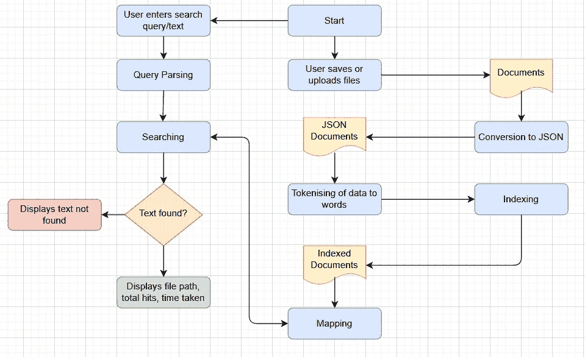

# 弹性搜索简介

> 原文：<https://medium.com/javarevisited/deep-dive-into-elastic-search-702e501762b?source=collection_archive---------2----------------------->

## 什么是弹性搜索，它是如何工作的，有什么用途？

照片由 [Unsplash](https://unsplash.com) 上的[agency followeb](https://unsplash.com/@olloweb)拍摄

Elastic Search 是一个分布式、开源的搜索和分析引擎，构建于 Apache Lucene 之上，用 Java 开发。它最初是 Lucene 开源搜索框架的可扩展版本，后来增加了水平扩展 Lucene 索引的能力。弹性搜索允许您快速、近乎实时地存储、搜索和分析大量数据，并在几毫秒内返回答案。它能够实现快速搜索响应，因为它不是直接搜索文本，而是搜索索引。它支持全文搜索，也就是说，它使用基于文档的结构，而不是表和模式，并且附带了大量的 REST APIs 来存储和搜索信息。其核心是，你可以把 Elasticsearch 想象成一个可以处理 JSON 请求并返回 JSON 数据的服务器。它主要用于单页应用程序项目。

## 弹性搜索的组件

*   索引:索引由一个或多个文档组成
*   文档:文档由一个或多个字段组成
*   碎片:将索引分成称为碎片的水平部分
*   副本:索引的一个或多个副本

## 弹性搜索是如何工作的？

工作流程可以简单解释如下:

*   上传或存储文档；它们可以是任何类型、任何尺寸和任何数量。
*   然后 JSON Builder 将这些文档从各自的类型转换成 JSON 文档。
*   现在，标记器的职责是将数据分解成单个的单词。
*   这些单词被索引，并且映射也被完成，以便将相似类型的单词分组到一个映射类型中。这确保了根据用户发出的查询更快地检索文本。
*   解析器将解析查询，并相应地从索引文档中搜索和检索搜索到的文本。

弹性搜索的工作流程

## 弹性搜索的优势

*   可伸缩性:它可以跨多个节点伸缩。这意味着我们可以从较少的节点开始，如果我们的工作负载增加，我们可以跨多个节点扩展。它很容易扩展。
*   快速:与其他可用的搜索引擎相比，它在性能方面确实很快。
*   多语言:支持多种语言。
*   面向文档:数据存储在文档中，而不是模式和表。所有数据都以 JSON 格式存储。JSON 是被广泛接受的 web 格式，因此如果需要，我们可以很容易地将生成的输出集成到其他应用程序中。
*   自动完成:它返回在提供的字段中包含特定前缀的文档。

## 用例

有各种使用弹性搜索的应用。

*   Adobe 使用 elastic stack 通过大规模机器学习使其搜索更加智能。
*   T-mobile 通过弹性搜索为其客户支持移动应用提供支持。
*   HappFresh 使用弹性云来处理应用搜索中电子商务流量的跳跃。
*   Warehouse Group 使用弹性搜索来快速查找和验证交易，并准确退还客户支付的费用。

这些是使用弹性搜索的实时应用程序的几个例子。由于其多种应用和易于集成，弹性搜索正被许多应用使用。在以后的文章中，我们将使用弹性搜索来设计可伸缩的系统。敬请关注。快乐学习！🎃