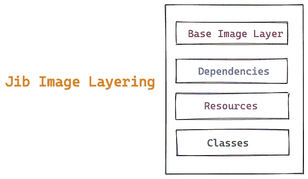
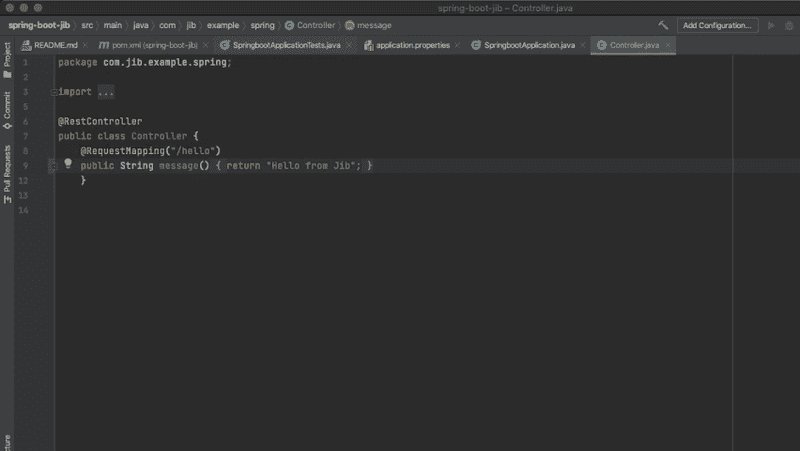
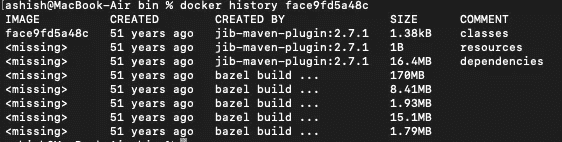

# 揭秘 Google 容器工具 Jib: Java Image Builder

> 原文：<https://medium.com/javarevisited/demystifying-google-container-tool-jib-java-image-builder-583badfe1ba?source=collection_archive---------0----------------------->

> 本文涵盖了由容器映像构建器 Jib 创建的映像分层的一些内部内容，并探讨了什么是发行版映像及其优点。

由[凯文·杰瑞特](https://unsplash.com/@kjarrett?utm_source=medium&utm_medium=referral)在 [Unsplash](https://unsplash.com?utm_source=medium&utm_medium=referral) 上拍摄的照片

你想知道 Jib 是什么吗？。在继续之前，你也许应该读一读我以前的文章。

 [## 用 Jib 集装箱化 Spring Boot 应用

### 在本帖中，我们将了解如何创建 docker 或 OCI 投诉图片，而无需安装任何 docker 客户端或…

ashishtechmill.com](https://ashishtechmill.com/containerizing-spring-boot-application-with-jib) 

对于对 Java 应用程序的容器化感兴趣，但对创建和维护 Dockerfile 或安装 [Docker](/javarevisited/top-15-online-courses-to-learn-docker-kubernetes-and-aws-for-fullstack-developers-and-devops-d8cc4f16e773) 不感兴趣的 Java 开发人员来说，Jib 是一个优秀的工具。

一个 Java 开发者可以给 [Maven](/javarevisited/6-best-maven-courses-for-beginners-in-2020-23ea3cba89) 或者 [Gradle](/javarevisited/5-best-gradle-courses-and-books-to-learn-in-2021-93f49ce8ff8e) 添加一个插件，就这样。你不需要学习新技术来封装你的 Java 应用程序。现在来说一些内部情况。

## 悬臂图像分层

Jib 智能地将您的映像分为以下几层，以进行更精细的增量构建。

1.  属国
2.  资源
3.  班级
4.  快照依赖关系
5.  所有其他依赖项
6.  每个额外的目录(`jib.extraDirectories`在 Gradle 中，`<extraDirectories>`在 Maven 中)构建到它自己的层

悬臂普通层

当您进行任何代码更改时，只会重新生成您的更改，而不是整个应用程序。这意味着 Jib 只推动发生变化的层，其余的层保持不变。

例如，在下面的演示中，只修改了一个类文件，Jib 只推送编译后的类层。后来，我们可以看到，在 docker 提取过程中，只提取了已更改的图层。

动臂

此外，为了更深入地挖掘，现在我们将使用在以前的[文章](/javarevisited/containerizing-springboot-application-with-jib-716daa3e0850)中使用的简单的 spring boot 应用程序。源代码可在[这里](https://github.com/yrashish/spring-boot-jib)获得。我们将在调试模式下运行 maven 来理解这些层。然而，在下面的日志中，您将只看到依赖项、资源和类作为单独的层，因为我们没有其他的依赖项。

Maven 调试日志

## 深潜图像层

您可以使用[潜水](https://github.com/wagoodman/dive)工具检查 Jib 创建的图像。正如您在 RHS 上看到的，我们在下面的路径中展开了类、资源和依赖项的目录结构，它们的大小非常小。

`/apps/classes,/apps/libs,/apps/resources`

其余的内容是你的基本形象。

深潜悬臂图像层

Dive 还会告诉你是否在浪费空间，如果是的话，你可以想办法缩小你的[码头工人/OCI 形象](/javarevisited/top-10-free-courses-to-learn-maven-jenkins-and-docker-for-java-developers-51fa7a1e66f6?source=collection_home---4------3-----------------------)的尺寸。然而，在我们的例子中，没有浪费空间:)。！

您也可以使用 **docker history** 命令查看图像内容。让我们看看它是什么样子的。

图像内容

## 什么是发行版映像？

谷歌对无发行版图片的定义如下:

> 发行版映像是轻量级的基础映像，因为它们只包含运行应用程序所需的依赖项。它们不包含包管理器、shells 或任何其他您期望在标准 Linux 发行版中找到的程序。

此外，Jib 创建的层是在[发行版](https://github.com/GoogleCloudPlatform/distroless)基础映像的顶部创建的。Jib 默认使用 distrolles[Java 8](/hackernoon/top-5-java-8-courses-to-learn-online-2db57d9dfb8d)镜像，但是你可以选择你喜欢的镜像。

## 为什么是 Distroless？

1.  需要修补的漏洞更少
2.  更好的安全性
3.  以最少的依赖性构建

## 调试发行版映像

因为没有安装包管理器，你不能对你的容器使用 ssh，所以运行无发行版的基础映像使得它们很难调试。在理想情况下，您应该添加更好的日志记录，然后为容器启用 shell 访问。但是有一些方法可以让你添加外壳支持和调试你的应用程序。

## 结论

在这篇文章中，我们已经介绍了 Jib 的一些内部知识，例如图像分层，这使得它很快。我们还讨论了发行版映像的优点和缺陷，比如调试。

## 支持我

如果你喜欢你刚刚读的，那么你可以给我买杯咖啡。

## 进一步阅读

你可以在我的博客上继续阅读我以前的一些文章。

 [## 阿什什·乔杜里

### 我是一名软件工程师和技术作家，热爱 Java、Spring Boot、DevOps 和云。

ashishtechmill.com](https://ashishtechmill.com/)  [## 在 Mac 版 Docker 桌面上运行 Kubernetes 应用程序

### 在这篇短文中，我将解释如何在 Mac 版 Docker 桌面上启用 Kubernetes 并进行部署…

ashishtechmill.com](https://ashishtechmill.com/running-kubernetes-application-on-docker-desktop-for-mac)