# 如何在 AWS 弹性豆茎上部署角通用

> 原文：<https://medium.com/javarevisited/deploy-angular-universal-on-aws-elastic-beanstalk-14dcc44d960b?source=collection_archive---------0----------------------->

[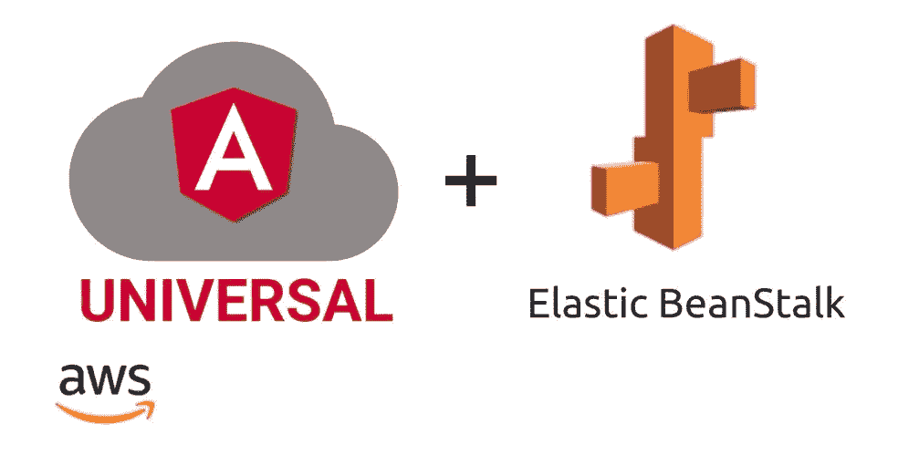](https://javarevisited.blogspot.com/2018/06/5-best-courses-to-learn-angular.html)

在做一个项目的时候，我花了很多时间将 Angular Universal 部署到服务器上进行服务器端渲染。我看了我找到的所有教程，以及所有关于这个话题的 Stackoverflow 问题。这可能是我在编码过程中最沮丧的经历。AWS 不时更新它的文档，而我们却被困在旧的教程中，并最终得到一些不存在或不再受支持的东西。

如果你也经历过这样的旅程，你就会知道我在说什么。而这篇文章会让你今天非常开心。我还将向您展示如何建立代码管道，以及在构建步骤中需要做哪些修改。

有两种方法可以将 Angular Universal/Angular ssr 部署到 AWS ElasticBeanstalk

**1。部署 Angular Universal 而不构建代码**

**2。使用代码构建部署 Angular Universal】**

# 1.部署 Angular Universal，无需构建代码

假设您已经将代码推送到 AWS 代码提交，有两个步骤。因此，在这种情况下，您必须手动构建您的应用程序并推送代码。

要构建您的应用程序，请运行以下命令

```
npm run build:ssr
```

这将在源目录的根目录下创建一个构建文件夹。

现在修改 package.json，用下面的命令替换 npm start

```
"start": "node angular-ssr/server/main.js"
```

## 1.建立一个弹性豆茎环境。

*   转到 [AWS](/javarevisited/5-best-aws-courses-for-beginners-and-experienced-developers-to-learn-in-2021-563212409fbd?source=rss-bb36d8439904------2&utm_source=dlvr.it&utm_medium=linkedin) 并搜索弹性豆茎。点击创建新环境。
*   在下一步中，选择 web 服务器环境，然后单击下一步

[](https://javarevisited.blogspot.com/2019/08/how-to-crack-aws-certified-solution-architect-exam.html)

*   这里有 4 个部分

**第一步:创建一个 web 服务器环境。**

在此部分给出应用程序名称。

**步骤 2:环境信息**

选择环境名称，并根据您的选择选择可用的 URL。

[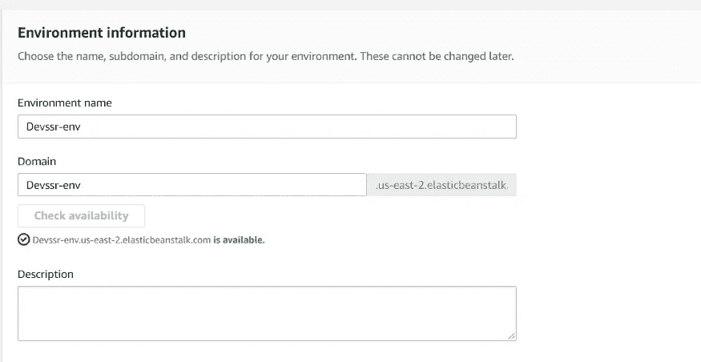](https://www.java67.com/2020/08/top-5-free-courses-to-pass-aws-cloud.html)

**第三步:平台设置**

选择 [Node JS](https://javarevisited.blogspot.com/2018/01/top-5-nodejs-and-express-js-online-courses-for-web-developers.html) 作为环境平台和 Node JS 的最新版本。

[](https://javarevisited.blogspot.com/2018/01/top-5-nodejs-and-express-js-online-courses-for-web-developers.html)

**第四步:申请代码**

选择示例应用程序并配置更多选项。

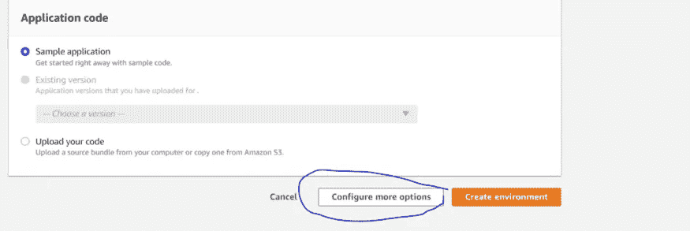

在“更多”部分，单击“软件”部分的“编辑”并滚动到底部。在环境属性中，您应该添加截图中提到的端口和端口号。单击 save，将为您创建环境。

[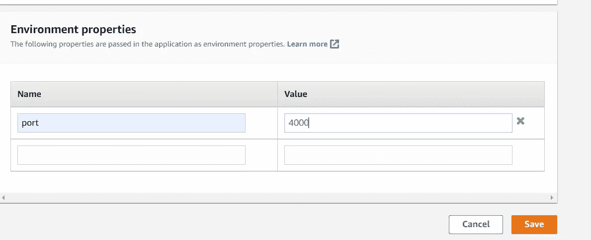](https://www.java67.com/2020/04/how-to-paas-aws-certified-solution-architect-exam-in-2020.html)

## 2.设置代码管道

这需要 4 个阶段来配置

**1。创建管道设置**

去 aws 搜索代码管道。创建一个新管道并给出管道名称。并选择新的服务角色，然后转到下一步

**2。选择源阶段。**

在 source 阶段，您需要选择 repo name 分支和代码提取的源。见附截图。

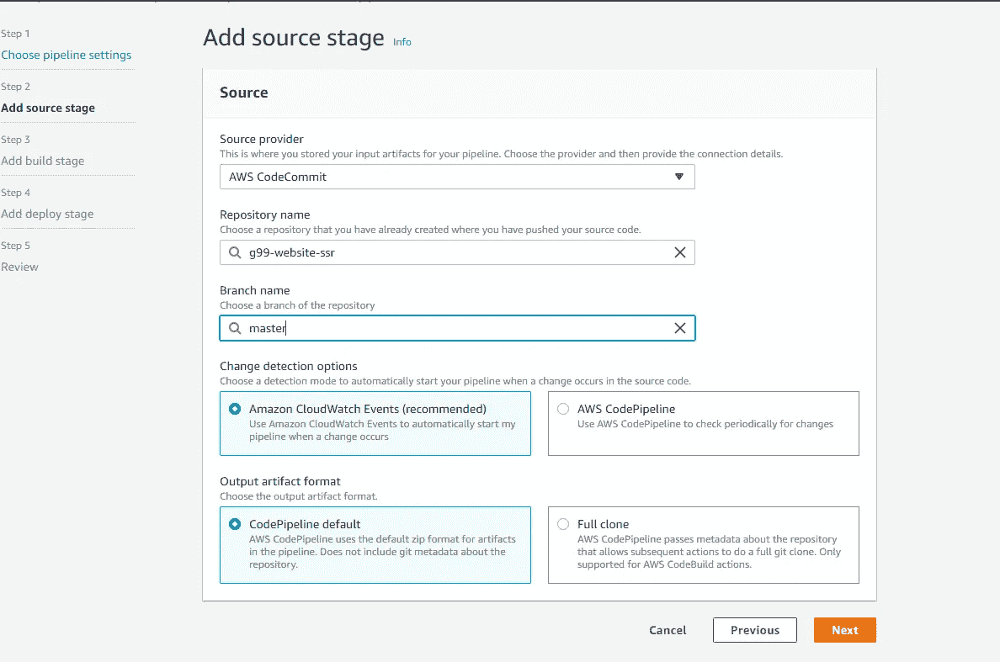

## **3。添加构建阶段**

**我们正在跳过构建阶段**，正如我之前提到的，我们正在部署没有代码构建的代码。如果您需要构建阶段，您可以向下滚动，查看连续构建和部署的角度通用部署的配置。

## **4。部署阶段。**

在部署阶段，选择部署提供者作为 Elastic beanstalk，并选择我们在 Elastic Beanstalk 配置的步骤 1 中创建的环境和应用程序的名称，如下所示。现在，您可以单击“next ”,查看所有设置，然后单击“create”。


所以在做了所有这些之后，你应该能看到下面这样的东西。

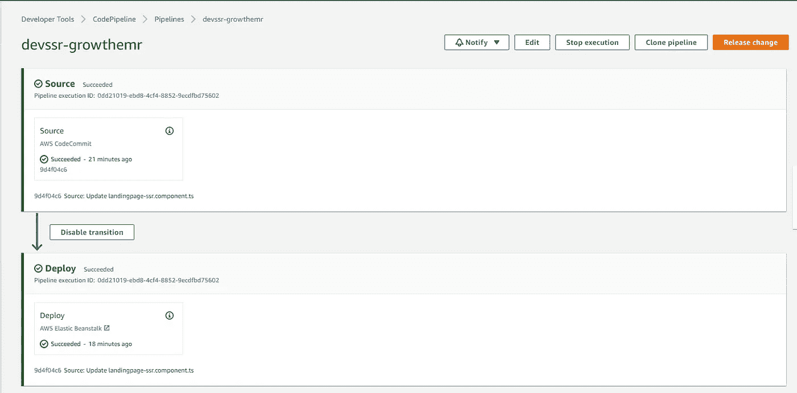

一旦它像这样出现，转到 elastic beanstalk 并打开环境 URL，您应该能够看到您的应用程序，如下所述。您可以看到我的应用程序已经启动并运行。

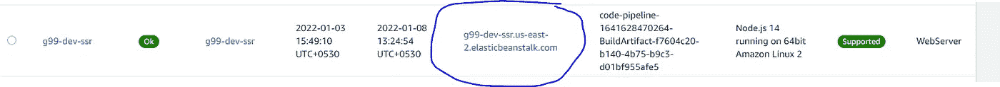

# 2.使用代码构建部署 Angular Universal

在这种情况下，我们不必构建代码，您只需提交代码，构建将自动发生，它将自动部署代码，即持续集成和持续部署。

我们将遵循以下几个步骤。

步骤 1:将配置文件添加到根文件夹

步骤 2:配置 s3 bucket 来保存 Procfile 和。npmrc 文件

步骤 3 创建 AWS 代码构建环境。

步骤 4:更新代码管道环境以添加构建阶段。

## **步骤 1:将配置文件添加到根文件夹**

为此，向源目录的根目录添加两个文件。

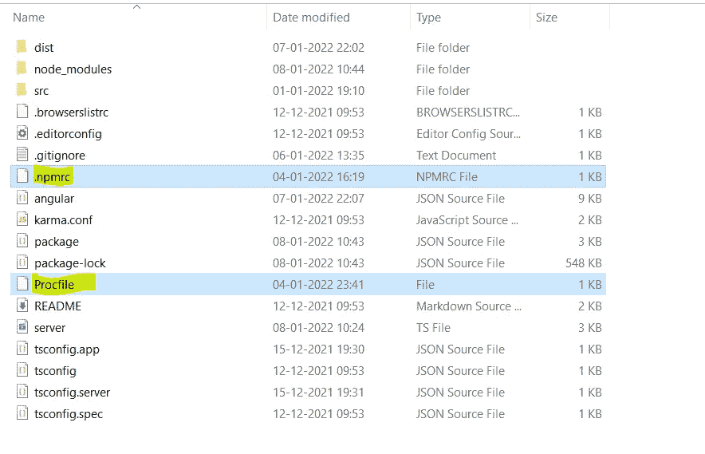

**。npmrc**

```
# Force npm to run node-gyp also as root, preventing permission denied errors in AWS with npm@5unsafe-perm=true
```

**过程文件**

```
web: node angular-ssr/server/main.js
```

## **步骤 2:配置 s3 存储桶以保存 Procfile 和。npmrc 文件**

*   在常规配置中给出铲斗名称
*   在对象中，所有权允许如下所述的所有公共访问。并将其余设置保留为默认设置，并创建一个 bucket。

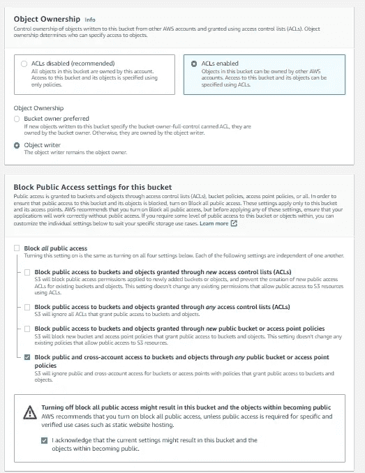

*   创建 bucket 后，单击 bucket go to permission，编辑 bucket 策略，添加以下规则，并使用**替换资源数组中的 bucket 名称。**添加以下规则后，您的存储桶应在顶部显示可公开访问。
*   **现在上传文件。npmrc 和 Procifle 到你的桶里。**

```
{
    "Version": "2012-10-17",
    "Statement": [
        {
            "Sid": "PublicReadGetObject",
            "Effect": "Allow",
            "Principal": "*",
            "Action": "s3:*",
            "Resource": [
                "arn:aws:s3:::your bucket name",
                "arn:aws:s3:::your bucket name/*"
            ]
        }
    ]
}
```

## **步骤 3:创建 AWS 代码构建环境。**

*   去 AWS 搜索代码构建。创建新的生成项目
*   在项目配置中，添加您选择的名称和描述。
*   选择源作为 AWS 代码提交。如果你正在使用 github 或其他一些资源，选择它并添加 repo 和 branch name，保留默认选择的其他设置，并跳到 build Spec 部分

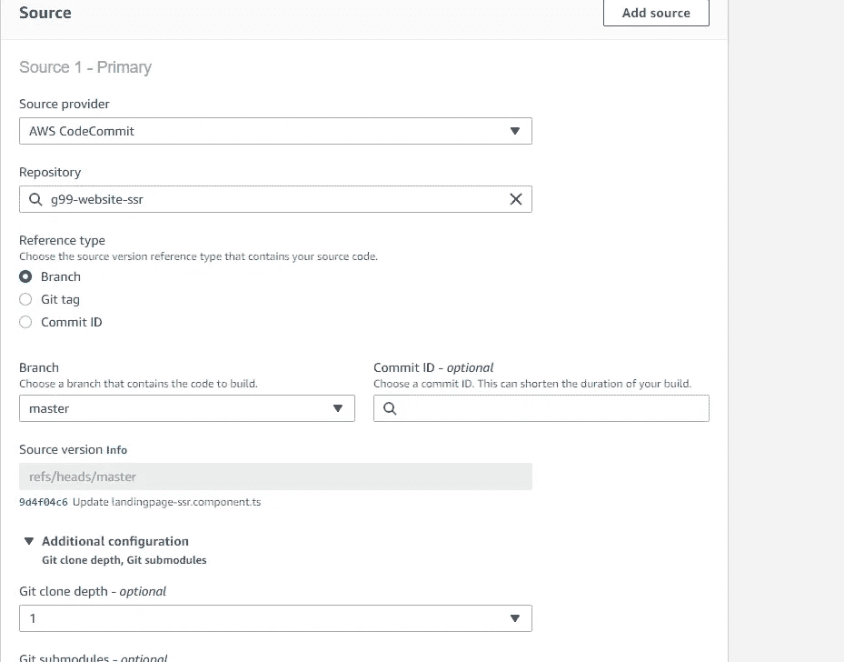

*   在 build spec 部分选择 insert build 命令并点击切换到编辑器，清除所有并添加下面的命令。**确保在 env 和后期构建命令中替换您的存储桶名称**

```
version: 0.2env:
    variables:
        CACHE_CONTROL: "86400"
        S3_BUCKET: "arn:aws:s3:::your bucket name"
        BUILD_FOLDER: "dist"
phases:
  install:
    runtime-versions:
        nodejs: 12
    commands:
        - echo Installing source NPM dependencies...
        - npm install
        - npm install -g [@angular/cli](http://twitter.com/angular/cli)@next
  build:
    commands:
        - echo Build started 
        - npm run build:ssr
  post_build:
    commands:
        - aws s3 cp s3://your bucket name/Procfile ./dist
        - aws s3 cp s3://your bucket name/.npmrc ./dist
        - bash -c "if [ /"$CODEBUILD_BUILD_SUCCEEDING/" == /"0/" ]; then exit 1; fi"

artifacts:
    files:
        - '**/*'
    base-directory: 'dist'
```

*   选择 no artifacts 并选择 Cloud watch 来查看构建日志，然后单击 create bucket。

## **步骤 4:更新代码管道环境以添加构建阶段。**

*   再次转到 aws 并搜索代码管道，编辑您已创建的管道，然后转到构建阶段并创建构建阶段。
*   将构建提供程序添加为 AWS code build，并选择我们在步骤 3 的构建项目中创建的项目名称，然后单击 next。

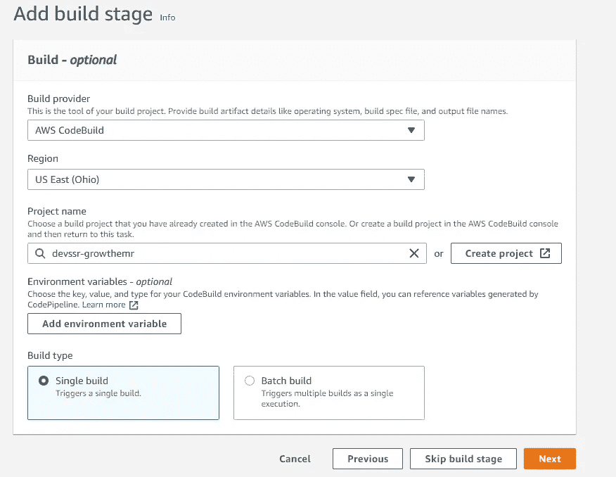

*   现在去改变一些代码，并再次提交，去代码管道。如果一切顺利，您将看到如下内容。


现在转到 elastic beanstalk 的 URL，它应该会显示您部署的应用程序。

就这些了。这有点长，但非常有用，因为当我被困在如何做设置时，我的头很乱。你可以参考下面的 StackOverflow 链接来了解实际问题，并喜欢这个博客，投票支持下面的答案。

[https://stack overflow . com/questions/70564063/angular-universal-build-command-to-include-package-JSON-at-root-level-of-dist-fo/70577526 # 70577526](https://stackoverflow.com/questions/70564063/angular-universal-build-command-to-include-package-json-at-root-level-of-dist-fo/70577526#70577526)

另外，阅读

[](https://javascript.plainenglish.io/personal-portfolio-using-angular-8-and-bootstrap-5dde6fc7cf9b) [## 使用 Angular 8 和 Bootstrap 的个人投资组合

### 技术:Angular 8，Bootstrap，HTML5，CSS3

javascript.plainenglish.io](https://javascript.plainenglish.io/personal-portfolio-using-angular-8-and-bootstrap-5dde6fc7cf9b) [](https://mehulkothari05.medium.com/how-i-earned-400-in-one-week-from-freelancing-86d50a80a760) [## 我是如何从自由职业中一周赚到 400 美元的

### 因此，在辞去第一份工作后，我休息了一个月，利用一个月的空闲时间做了一些自由职业。我是一个…

mehulkothari05.medium.com](https://mehulkothari05.medium.com/how-i-earned-400-in-one-week-from-freelancing-86d50a80a760) [](https://mehulkothari05.medium.com/how-to-show-events-on-calender-to-your-application-c01605a6f3bc) [## 如何将日历上的事件显示到角度应用程序

### git:https://github.com/mehulk05/Mastery

mehulkothari05.medium.com](https://mehulkothari05.medium.com/how-to-show-events-on-calender-to-your-application-c01605a6f3bc) [](/javarevisited/how-was-my-frontend-engineer-interview-experience-amazon-d10055fbdd89) [## 我在亚马逊的前端工程师面试体验如何

### 我是如何申请亚马逊的

medium.com](/javarevisited/how-was-my-frontend-engineer-interview-experience-amazon-d10055fbdd89)