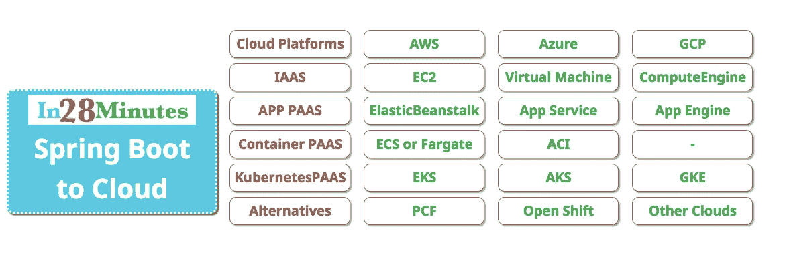
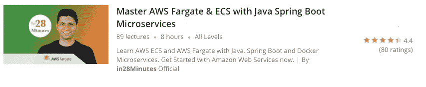
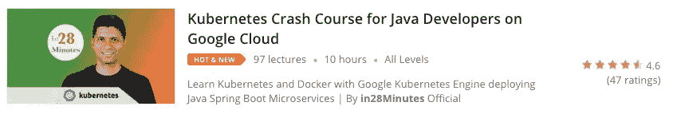

# 使用 Docker 和 Kubernetes 将 Java Spring Boot 应用程序部署到 AWS、Azure 和 GCP

> 原文：<https://medium.com/javarevisited/deploy-java-spring-boot-applications-to-aws-azure-gcp-with-docker-and-kubernetes-58e80999daa2?source=collection_archive---------0----------------------->

在本文中，我们将注意力集中在云上。我们为什么需要云？您如何学习云？

# 你会学到的

*   什么是云？
*   我们为什么需要云？
*   有哪些受欢迎的云提供商？
*   IAAS 和 PAAS 是什么？
*   Docker 是什么？
*   什么是 Kubernetes？
*   AWS、Azure 和 GCP 提供了哪些 PAAS 产品？

# 介绍

你想了解云。但是你不知道从哪里开始。

学习云的最佳选择之一是将您开发的一些应用程序部署到不同的云提供商。

当我们谈到 Java Spring Boot 世界时，我们通常会谈到

*   网络应用
*   REST APIs
*   微服务
*   全栈应用

把这些应用部署到不同的云平台怎么样？

这就是我们将在文章中讨论的课程。

# 云简介

让我们从理解我们为什么需要云开始。

# 我们为什么需要云？

这三个原因是

*   按需资源供应
*   避免“无差别举重”
*   改进的延迟和可用性

## 按需资源供应

如果你是亚马逊或者一家初创公司，你的应用程序负载在一年中变化很大。节假日等旺季的负载可能是正常负载的 2-10 倍。如果您在数据中心中为峰值负载调配基础架构，那么在一年的剩余时间里它会做什么？闲坐着！

这就是云解决的问题！

您可以按需供应和释放资源。

## 避免“无差别举重”

一个企业的重点是什么？

创造惊人的解决方案，为客户提供优质服务。

如果一个企业专注于自动化、工具和基础设施，重点就会从他们的核心工作转移。

为什么不把“无差别的重担”留给云提供商呢？

## 改进的延迟和可用性

每个云提供商在多个大洲和多个国家都有多个数据中心。

企业很难建立如此广泛的基础设施。

但是，要为最终用户提供高可用性和低延迟，您需要在世界各地进行多次部署。

云提供商让您可以轻松地在全球范围内部署多个应用。

# IAAS 对 PAAS

现在，你想去云端。你要做一个重要的选择。

您是希望以使用数据中心时的相同方式部署应用程序，还是希望使用云提供商提供的设施？

例如，如果您正在使用 [AWS](https://www.java67.com/2018/05/top-5-amazon-web-services-or-aws-courses-to-learn-online.html) (Amazon Web Services)，您有两种选择

*   方法 1 —您可以创建虚拟服务器(EC2 —弹性计算云)并将您的应用程序部署到虚拟服务器上。
*   方法 2——您可以使用 AWS 提供的服务——例如，AWS Elastic Beanstalk——来部署您的应用程序，而不必担心虚拟服务器。

方法 1 通常被称为 IAAS，即基础设施即服务。您将从云提供商那里获得基础架构，并以通常的方式部署应用程序。云提供商只负责提供虚拟服务器。您负责安装操作系统、操作系统升级、安装运行时、运行时升级以及随之而来的一切。

不同的云提供不同的 IAAS 服务。在不同的云中，虚拟服务器的名称也不同

*   AWS 称之为 EC2(弹性计算云)
*   Azure 虚拟机
*   谷歌计算引擎

方法 2 称为 PAAS，即平台即服务。您只对您的应用程序可部署单元负责。云提供商负责平台升级、运行时升级和操作系统升级。

PAAS 的例子是由不同的云提供商提供的托管服务。提供的数据库管理服务就是很好的例子。

*   AWS 提供 RDS —关系数据库服务
*   Azure 为 MySQL 提供数据库

这些托管服务的优点在于，云提供商将负责大多数非功能性需求。

*   可靠性
*   有效性
*   备份

如果您想了解更多关于 AWS 的信息，您还可以查看以下免费课程:

 [## 5 大亚马逊网络服务或 AWS 在线学习课程-免费和最好的

### 一些免费的 AWS 课程列表，可以让你按照自己的进度在线学习亚马逊网络服务

hackernoon.com](https://hackernoon.com/top-5-amazon-web-services-or-aws-courses-to-learn-online-free-and-best-of-lot-d94e192054b7) 

# 平台即服务的深度

如果我们深入了解 PAAS，就会发现不同的云提供商提供了许多应用 PAAS 服务

*   AWS 弹性豆茎
*   谷歌应用引擎
*   Azure 网络应用

这些服务使得将 Java 应用、[容器](https://javarevisited.blogspot.com/2018/02/10-free-docker-container-courses-for-Java-Developers.html)和各种各样的应用部署到云变得容易。

这些 PAAS 产品支持

*   多重环境
*   多平台和语言支持
*   容器和多容器支持
*   部署策略—蓝绿色部署
*   自动缩放
*   负载平衡
*   CI/CD (AWS 代码管道、AWS 代码构建、Azure DevOps、Google 云构建)

## 特定于云的容器编排解决方案

过去几年的重要发展之一是容器作为平台中立、语言中立的部署选项的演变。

云提供商围绕容器和容器编排提供 PAAS 选项。最重要的产品有

*   AWS Fargate 或 ECS(弹性集装箱服务)
*   Azure 容器实例——Azure 实际上正在向 AKS (Azure Kubernetes 服务)发展

## 基于云中性 Kubernetes 的容器编排解决方案

过去几年的另一个重要发展是 Kubernetes 作为云中性容器编排服务的发展。

每个云提供商都围绕 Kubernetes 提供容器编排解决方案。

*   GKE(谷歌 Kubernetes 引擎)
*   Azure Kubernetes 服务
*   EKS(为 Kubernetes 提供 AWS 集装箱服务)

如果您想了解更多关于云计算的知识，您也可以查看以下资源:

 [## 2020 年学习云计算的 5 大在线课程-最佳选择

### 随着越来越多的人开始使用云计算，云计算正成为任何软件开发人员或 IT 专业人员的一项基本技能

javarevisited.blogspot.com](https://javarevisited.blogspot.com/2019/07/top-5-online-courses-to-learn-cloud-computing-aws.html) 

# 从 Spring Boot 到 AWS、Azure、GCP、Docker 和 Kubernetes

这里有一些令人惊叹的课程，通过将各种各样的 [Spring Boot](https://www.java67.com/2018/06/5-best-courses-to-learn-spring-boot-in.html) 应用程序部署到云上，帮助你学习云、容器和编排。

# 面向 Java 开发人员的 docker——Spring Boot 微服务

Docker 是容器化 Java Spring Boot 应用程序的首选工具。Learning Docker 将帮助您简化部署流程，并轻松体验新的框架和工具。

我们要讲的第一门课是“面向 Java 开发人员的 Docker——Spring Boot 微服务”。

https://rebrand.ly/MISC-DOCKER

在本实践课程中，您将容器化(创建 docker 映像和容器)各种 Spring Boot 应用程序:

*   REST API—Hello World 和 Todo — Jar
*   Todo Web 应用程序战争
*   React 和 Spring Boot 的全栈应用
*   CCS 和 CES 微服务
*   尤里卡命名服务器和 Zuul API 网关

这门课程将是介绍 Docker 的完美第一步。

您将学习 Docker 架构和 Docker 的基础——注册表、存储库、标签、图像、容器和卷，还将学习重要的 Docker 命令。

您将学习使用 Dockerfile 来自动构建您的 Docker 映像，并使用各种 maven 插件(Dockerfile Spotify 插件、JIB 插件和 Fabric8 Docker Maven 插件)来创建 Docker 映像。您还将学习通过创建 Docker 映像来遵循最佳实践——改进 Docker 映像的缓存并创建多阶段 Docker 构建。

如果你需要更多的选择，你可以看看这篇文章:

 [## 2020 年学习 Docker 和 Kubernetes 的 5 大课程-最佳课程

### 伙计们，你们好吗？你有望实现今年的目标吗？我相信你在…的时候已经有了目标

javarevisited.blogspot.com](https://javarevisited.blogspot.com/2019/05/top-5-courses-to-learn-docker-and-kubernetes-for-devops.html) 

# 了解 AWS——将 Java Spring Boot 部署到 AWS 弹性豆茎

AWS 是最受欢迎的云，AWS Elastic Beanstalk 可以轻松地将各种应用程序部署到 AWS。

“学习 AWS——将 Java Spring Boot 部署到 AWS Elastic Beanstalk”是另一门关于 AWS 的实用课程，帮助您将 Spring Boot 应用程序部署到 AWS。

[https://rebrand.ly/MISC-AWS-BEANSTALK](https://rebrand.ly/MISC-AWS-BEANSTALK)

在本课程中，您将学习如何将各种 Spring Boot 应用程序部署到云中:

*   REST API—Hello World 和 Todo — Jar
*   Todo Web 应用程序战争
*   React 和 Spring Boot 的全栈应用
*   带有 Java REST API 的单一容器
*   带有 Todo REST API 的多容器与 MySQL 对话

作为 AWS 和云的入门，本课程将是一个完美的第一步，尤其是对 Java 开发人员而言。

您将了解如何使用弹性 Beanstalk CLI 实现自动化部署，以及如何使用 AWS 代码管道创建连续的交付管道。您将学习如何基于负载自动扩展应用程序，以及如何使用 Elastic Beanstalk 在负载平衡器后面部署多个实例。

你将使用许多 AWS 服务——EC2、S3、AWS CodePipeLine、AWS CodeBuild、SQS、IAM、CloudWatch。

# Master AWS Fargate & ECS 与 Java Spring Boot 微服务

我们之前了解了 docker。AWS 弹性容器服务和 AWS Fargate 是 AWS 提供的容器编排服务。

“Master AWS Fargate & ECS with Java Spring Boot 微服务”是另一门帮助您学习 AWS 和容器编排的精彩课程。

https://rebrand.ly/MISC-FARGATE

本课程将是亚马逊网络服务——AWS 和云——的完美开端。

在本课程中，您将使用 AWS Fargate 和 ECS(弹性容器服务)将各种 Java Spring Boot 微服务部署到 Amazon Web Services。

您将学习使用 ECS(弹性容器服务)实现容器编排的基础知识—集群、任务定义、任务、容器和服务。您将了解 ECS 的两种发布类型— EC2 和 AWS Fargate。在本课程中，我们将广泛关注 AWS Fargate，以简化您的容器编排。您将学习在同一个 ECS 任务中部署多个容器。

您将学习为您的 Java Spring Boot 微服务项目构建容器映像。

您将为您的微服务实现以下特性

*   通过 AWS 参数存储进行集中式配置管理
*   AWS X 射线分布式跟踪
*   通过 ECS、弹性负载平衡器和目标组实现自动扩展和负载平衡
*   使用 AWS 应用网格的服务网格。您将学习 AWS 应用网格的基础知识——网格、虚拟节点和虚拟服务。您将学习使用 AWS AppMesh 执行 Canary 部署。
*   使用 Route 53 托管区域和 DNS 进行服务发现。
*   与 AWS 代码管道的持续集成和持续部署

您将学习使用服务事件和 AWS CloudWatch 日志来调试部署容器的问题。

您将了解自动化部署和使用 AWS 代码管道创建连续交付管道。您将了解如何基于负载自动扩展应用程序，以及如何使用 AWS ECS Fargate 在负载平衡器后部署多个实例。

您将使用许多 AWS 服务——ECS——弹性容器服务、AWS Fargate、EC2——弹性计算云、S3、AWS CodePipeLine、AWS CodeBuild、IAM、CloudWatch、ELB、Target Groups、X-Ray、AWS Parameter Store、AWS App Mesh 和 Route 53。

此外，如果你想有更多的选择来学习 Spring Boot 的微服务，这里有更多的资源可以查看:

 [## Java 程序员学习 Spring Boot 和微服务的 10 大课程

### 披露:这个帖子包括附属链接；如果您从…购买产品或服务，我可能会收到报酬

开发到](https://dev.to/javinpaul/top-10-courses-to-learn-spring-boot-and-microservices-for-java-programmers-3hjg) 

# 借助 Spring Boot 微服务的 Master Pivotal 云代工厂

Pivotal Cloud Foundry (PCF)为部署 Spring Boot 应用程序提供了一个出色的云原生平台。

Spring Boot 微服务公司的 Master Pivotal Cloud Foundry 是一门很好的课程，可以帮助您了解 PCF，并了解如何使用 PCF 将应用部署到云中。

[https://rebrand.ly/MISC-PCF](https://rebrand.ly/MISC-PCF)

在本课程中，您将通过向 PCF 部署几个全功能的 Spring Boot 应用程序来学习 Pivotal Cloud Foundry 的基础知识。您将部署一个 REST API、一个 web 应用程序、一个使用 Spring Boot 和 React 构建的全栈应用程序。您将学习使用 Docker 将 Java Spring Boot 应用程序容器化部署到 PCF。

本课程还将重点帮助您使用 Service Registry、Config Server 和 Hystrix 等几个 Spring 云服务将令人惊叹的 Spring Boot 微服务部署到 PCF。

您将了解如何基于负载自动扩展应用程序，以及如何使用 Pivotal Cloud Foundry 在负载平衡器后部署多个实例。

作为 PCF 和云的入门课程，本课程将是完美的第一步。

# 掌握 Azure Web 应用程序—将 Java Spring Boot 应用程序带到 Azure

微软 Azure 是当今第二受欢迎的云平台。Azure Web App 是 Azure 的 PAAS 产品，可以帮助你轻松地将应用程序部署到云中。

掌握 Azure Web 应用程序——将 Java Spring Boot 应用程序带到 Azure 是一门非常棒的课程，可以帮助您开始使用 Azure。

https://rebrand.ly/MISC-AZURE

在本课程中，您将把各种 Spring Boot 应用程序部署到云中:

*   REST API—Hello World 和 Todo — Jar
*   Todo Web 应用程序战争
*   React 和 Spring Boot 的全栈应用
*   带有 Java REST API 的单一容器
*   带有 Todo REST API 的多容器与 MySQL 对话

这门课程将是 Azure 和云入门的完美第一步，尤其是对 Java 开发人员而言。

您将了解如何使用 Azure 自动化部署，以及如何使用 Azure DevOps 创建连续交付管道。您将了解如何基于负载自动扩展应用程序，以及如何使用 Azure App Service 在负载平衡器背后部署多个实例。

您将使用许多 Azure 服务——Azure 应用服务、Azure Web 应用、Azure DevOps、用于 MySQL 服务的 Azure 数据库、资源组、Azure 应用服务计划和 Azure 订阅。

# kubernetes Google Cloud Java 开发人员速成班

Kubernetes 可以轻松管理包含 1000 个容器、运行 1000 个微服务的集群。谷歌 Kubernetes 引擎(GKE)使得创建 Kubernetes 集群变得非常容易。

如何将它们整合在一起，并将 Spring Boot 微服务部署到使用谷歌 Kubernetes 引擎(GKE)在谷歌云平台上创建的 Kubernetes 集群？

Kubernetes 针对 Java 开发人员的 Google Cloud 速成课程是一门非常棒的课程，可以帮助您开始使用 Kubernetes。

[https://rebrand.ly/MISC-KUBERNETES](https://rebrand.ly/MISC-KUBERNETES)

在本实践课程中，您将使用 Docker 和 Kubernetes 在使用 Google Kubernetes 引擎的 Google 云上部署各种 Spring Boot 应用程序:

*   REST API—Hello World
*   Todo Web 应用程序战争
*   Spring Boot 微服务公司

您将为部署在 Kubernetes 集群中的 Spring Boot 微服务实现服务发现、集中配置、分布式跟踪和负载平衡。

您将学习使用 Helm Charts、Istio Service Mesh、Google Stackdriver 和 Spring Cloud Kubernetes 在 Kubernetes 上使用 Spring Boot Java 微服务。

这门课程将是介绍 Kubernetes 的完美第一步。

# 其他 Java 和 Web 开发资源

1.  [2020 年 Java 开发者路线图](https://javarevisited.blogspot.com/2019/10/the-java-developer-roadmap.html)
2.  [面向 Java 开发者的 5 门免费 Spring 框架课程](http://www.java67.com/2017/11/top-5-free-core-spring-mvc-courses-learn-online.html)
3.  [2020 年学习 Spring Boot 的五大课程](https://javarevisited.blogspot.com/2018/05/top-5-courses-to-learn-spring-boot-in.html)
4.  [学习大数据和 Apache Spark 的 5 门课程](http://javarevisited.blogspot.com/2017/12/top-5-courses-to-learn-big-data-and.html)
5.  [学习 Java 设计模式的前 5 门课程](https://javarevisited.blogspot.com/2018/02/top-5-java-design-pattern-courses-for-developers.html)
6.  [5 门免费的数据结构与算法课程](https://javarevisited.blogspot.com/2018/01/top-5-free-data-structure-and-algorithm-courses-java--c-programmers.html)
7.  [学习 React JS 框架的 5 门免费课程](http://www.java67.com/2018/02/5-free-react-courses-for-web-developers.html)
8.  [2020 年学习网页开发的五大课程](https://javarevisited.blogspot.com/2018/02/top-5-online-courses-to-learn-web-development.html)

 [## 2020 年 Java 开发者路线图

### 大家好，首先祝大家 2020 新年快乐。我已经分享了很多成为网络的路线图…

javarevisited.blogspot.com](https://javarevisited.blogspot.com/2019/10/the-java-developer-roadmap.html#123)