# 将 Spring Boot 应用程序部署到 AWS 弹性豆茎

> 原文：<https://medium.com/javarevisited/deploy-spring-boot-app-to-aws-elastic-beanstalk-fa42b8b4bfa0?source=collection_archive---------0----------------------->

[](https://javarevisited.blogspot.com/2018/02/top-5-spring-microservices-courses-with-spring-boot-and-spring-cloud.html)

Spring Boot 应用到 AWS 弹性豆茎

# 介绍

在本文中，我们将学习如何创建一个简单的 spring boot web 应用程序，并将其部署在 AWS Elastic Beanstalk 上。

在[**AWS**](https://aws.amazon.com/)Elastic Beanstalk 上部署 Spring boot 应用程序是一个简单的过程。

我们可以使用[**AWS Elastic Beanstalk**](https://aws.amazon.com/elasticbeanstalk/)服务来部署 web 应用程序和服务，并对它们进行伸缩。

> **先决条件:**我们需要有一个 AWS 账户才能使用 AWS 服务。

# 创建弹簧引导应用程序

使用**spring-boot-starter-web**starter 依赖项创建一个简单的 spring boot 应用程序。我们可以使用[**Spring Initializer**](https://start.spring.io/)创建 spring boot 应用模板并下载应用。

## ***添加休息控制器***

创建一个新的包**com . example . demo . controller**并创建一个 **HelloWorldController** 控制器类。

我们已经创建了一个输出“Hello”消息的 REST 端点

```
**package** com.example.demo.controller;**import** org.springframework.web.bind.annotation.GetMapping;**import** org.springframework.web.bind.annotation.PathVariable;**import** org.springframework.web.bind.annotation.RestController;@RestController**public** **class** HelloWorldController {@GetMapping("/")**public** String helloWorld() {**return** "hello ";}}
```

## 更新服务器端口

另外，将下面的配置属性添加到 **src/main/resources** 文件夹下的 spring boot 应用程序的 **application.properties** 文件中。

`server.port=5000`

AWS Elastic Beanstalk 希望我们的应用程序监听端口 5000。

我们需要设置这个属性来配置我们的 spring boot 应用程序监听端口号 **5000** 。

下面是 spring boot 应用程序的最终项目结构。

[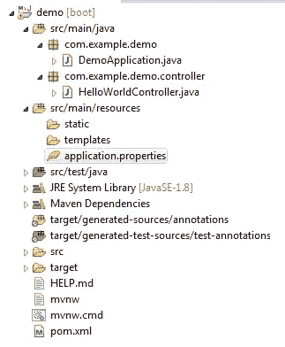](https://www.java67.com/2018/06/5-best-courses-to-learn-spring-boot-in.html)

项目结构

现在应用程序已经准备好了。我们可以通过运行它在本地测试它。

## 本地测试

我们可以通过使用我们的 IDE 在项目>上右击> Spring boot app 来本地启动应用程序。

应用程序在本地启动，我们可以在 http://localhost:5000/访问我们的 REST APIs

[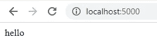](https://javarevisited.blogspot.com/2018/02/top-20-spring-rest-interview-questions-answers-java.html)

本地测试

# 将 Spring boot 应用部署到 AWS Elastic Beanstalk

我们需要构建 spring boot jar 文件，其中包含捆绑在其中的嵌入式 tomcat 服务器。

使用 STS 或 [Eclipse IDE](/javarevisited/6-free-best-eclipse-ide-courses-for-java-programmers-1229ee9e5d87) ，我们可以通过**右键单击项目>运行 maven 构建作为> Maven 安装**。

maven 构建工具将把我们的应用程序构建为项目的 **target/** 文件夹中的 jar 文件。

[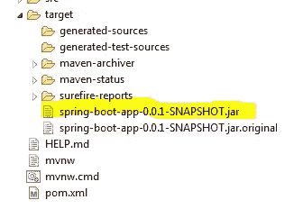](https://javarevisited.blogspot.com/2019/03/top-5-course-to-learn-apache-maven-for.html#axzz6ccm5KWKs)

要部署我们的应用程序，我们必须在 Elastic Beanstalk 服务上导航，如下所示。

[](https://javarevisited.blogspot.com/2020/02/top-5-courses-to-crack-aws-certified-cloud-practitioner-exam-certification-clf-c01.html)

导航 AWS 服务

然后，在 Amazon elastic Beanstalk 主页上，单击**创建应用程序**按钮来创建一个新的应用程序。

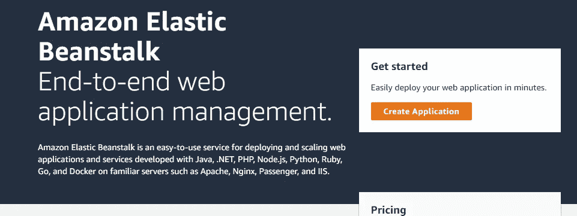

创建应用程序

在应用程序名称字段中输入名称。这里，我们将我们的应用程序命名为 **my-spring-app** 。

[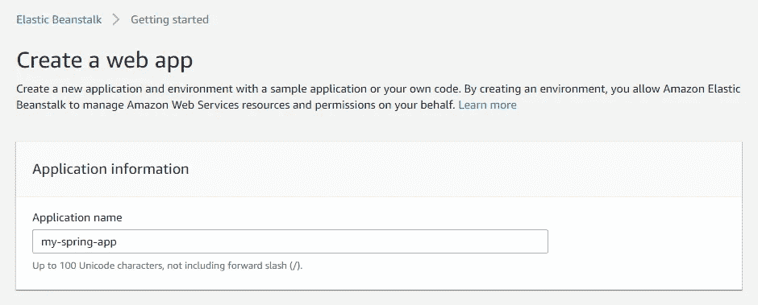](https://javarevisited.blogspot.com/2019/08/how-to-crack-aws-certified-solution-architect-exam.html)

创建应用程序名称

然后选择平台部分下的平台详细信息。我们已经选择了 java 平台，因为我们将要部署一个 Java 应用程序。

同样在**应用代码**部分，选择**上传您的代码**选项。

[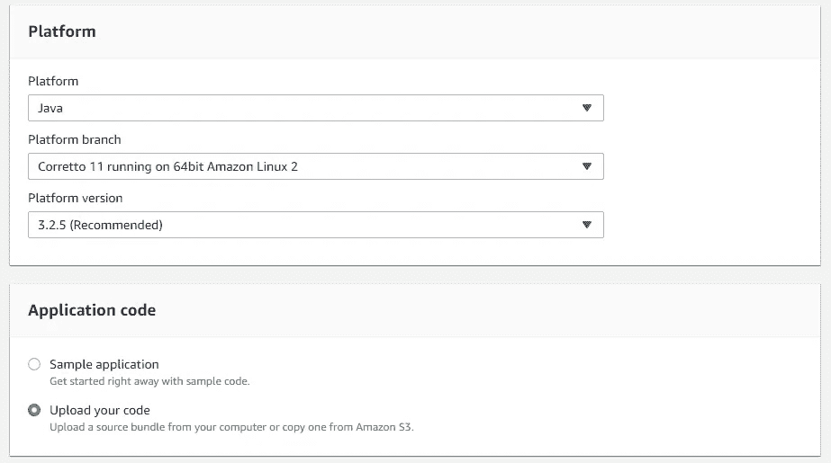](https://www.java67.com/2020/08/top-5-free-courses-to-pass-aws-cloud.html)

上传代码

最后，选择从 maven 构建中生成的 spring boot 应用程序 jar 文件，如下所示。

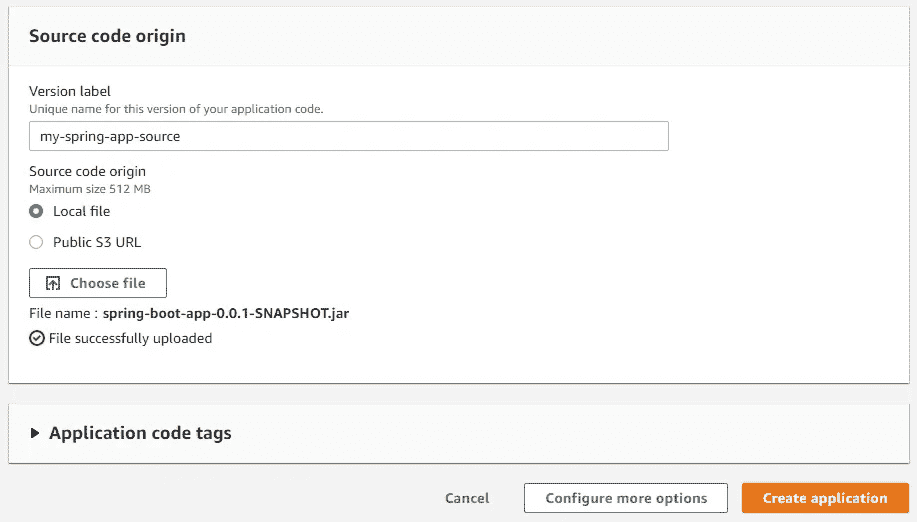

选择并上传应用程序 JAR

单击**创建应用程序**按钮，应用程序开始部署到 AWS elastic beanstalk 中。

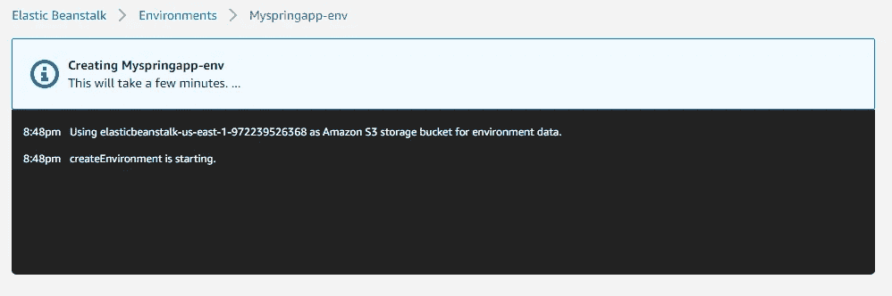

创建应用程序

一旦应用程序部署成功，我们可以在 **Environments，**下看到一个条目，如下所示。


与环境一起列出的应用程序

我们还可以在屏幕上看到应用健康状况为 **Ok、**和最近的事件。

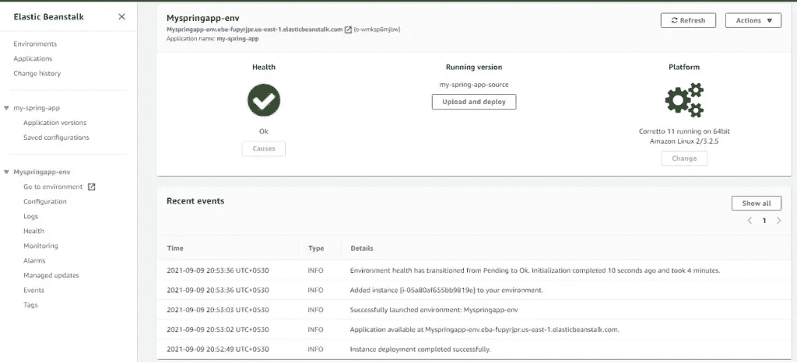

应用程序运行状况检查

# 测试应用程序

AWS 弹性豆茎处理我们的应用程序。我们可以从由 [AWS beanstalk](/javarevisited/5-best-aws-courses-for-beginners-and-experienced-developers-to-learn-in-2021-563212409fbd) 生成的应用程序 URL 访问我们的应用程序。

可以在应用程序实例屏幕上找到该 URL，如上图所示。

打开应用程序 URL 以访问 spring boot 应用程序。

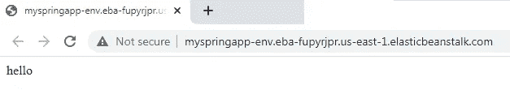

测试端点

# 删除应用程序

我们可以通过简单地选择**动作**菜单下的**删除应用程序**选项来删除应用程序实例。

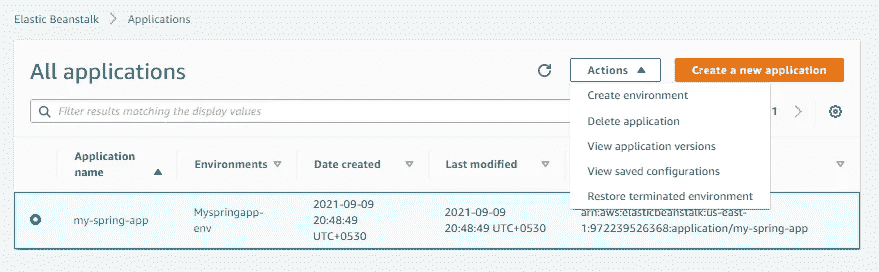

删除应用程序

AWS 可能需要一些时间来完成删除操作。

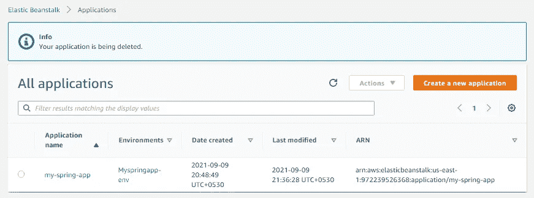

成功删除

# 结论

在本文中，我们学习了如何创建一个简单的 spring boot web 应用程序。

我们还学习了如何在本地测试应用程序并生成应用程序 jar 文件。

最后，我们学习了如何将 spring boot jar 文件部署到 AWS Elastic Beanstalk。

快乐编码..

[](/javarevisited/10-free-spring-boot-tutorials-and-courses-for-java-developers-53dfe084587e) [## 面向 Java 开发人员的 10 个免费 Spring Boot 课程和教程

### 大家好，作为一个 Java 博客的作者和 Java 开发人员，很多人问我关于课程和书籍的问题…

medium.com](/javarevisited/10-free-spring-boot-tutorials-and-courses-for-java-developers-53dfe084587e) [](/javarevisited/top-22-skills-professional-java-programmers-can-learn-in-2022-to-upgrade-themselves-bc3da73d7491) [## 2022 年 Java 程序员和架构师可以学习的 25 项基本技能

### Java 开发人员可以在 2022 年学习的 22 项基本技术技能，以进一步改善他们的形象，并成为…

medium.com](/javarevisited/top-22-skills-professional-java-programmers-can-learn-in-2022-to-upgrade-themselves-bc3da73d7491) [](/javarevisited/13-topics-you-should-prepare-for-your-next-spring-boot-interview-5f2993a04ff5) [## 你应该为 2022 年的下一次 Spring Boot 面试准备的 13 个话题

### 你应该为下一次 Java 和 Spring Boot 面试准备的 13 个基本主题的列表和学习资源…

medium.com](/javarevisited/13-topics-you-should-prepare-for-your-next-spring-boot-interview-5f2993a04ff5)