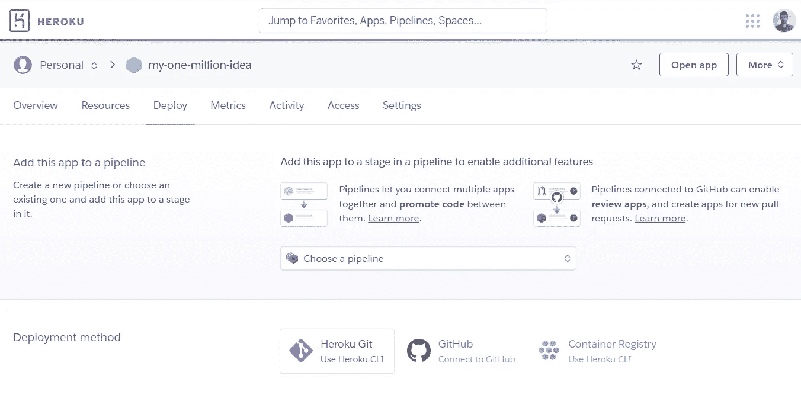
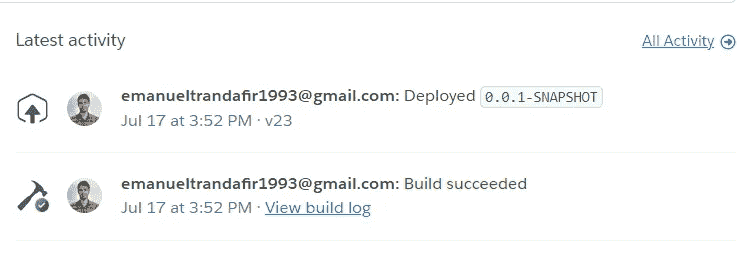
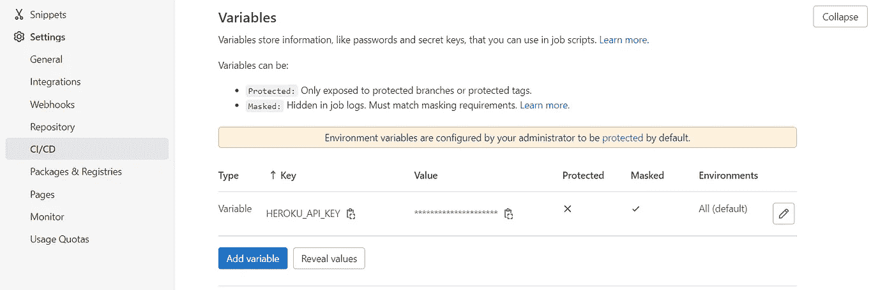
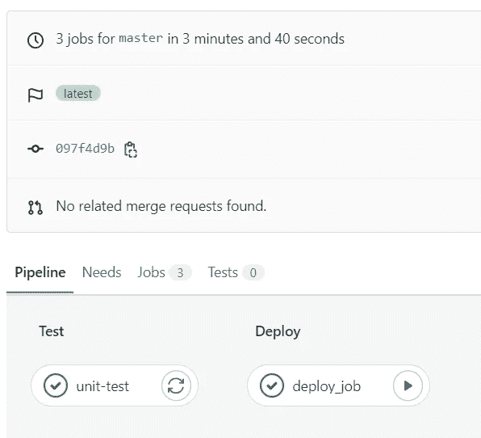

# 使用 Heroku 和 GitLab CI/CD 将您的个人项目部署到云

> 原文：<https://medium.com/javarevisited/deploy-your-personal-project-to-cloud-for-free-with-heroku-and-gitlab-ci-cd-a2f676e02d3?source=collection_archive---------2----------------------->

[](https://www.java67.com/2022/06/cloud-computing-interview-questions.html)

使用 Heroku 将您的项目部署到云中。(照片由 [Unsplash](https://unsplash.com?utm_source=medium&utm_medium=referral) 上的 [engin akyurt](https://unsplash.com/@enginakyurt?utm_source=medium&utm_medium=referral) 拍摄)

如果你有那个*一百万美元的想法*，并且你现在正在寻找一种方法来部署你的个人电脑应用程序，这篇文章可能会派上用场！

另一方面，如果你是一名初级开发人员，试图通过一些个人项目来丰富你的简历，并在此过程中提高你的开发技能，这也是适合你的地方:)

在本文中，**我们将学习如何使用 Heroku** 的免费托管解决方案将应用程序部署到云中。

之后，**我们将创建一个小的** [**CI/CD 管道**](/javarevisited/7-best-courses-to-learn-jenkins-and-ci-cd-for-devops-engineers-and-software-developers-df2de8fe38f3) 并配置部署阶段。

## 1.概观

对于下面的步骤，我们将配置一个 [Spring Boot](/javarevisited/10-best-java-microservices-courses-with-spring-boot-and-spring-cloud-6d04556bdfed) 应用程序的部署。为此，我们将使用 Heroku Maven 插件，并在 GitLab 中创建一个小管道。

不过，你可以通读这篇文章，并根据你的技术栈调整大部分步骤。

让我们直接开始吧！

## 2.创建 Heroku 项目

首先，我们需要一个 Heroku 项目。要创建它，只需注册或登录 [Heroku](https://dashboard.heroku.com/apps) 并转到 *New > Create new app。*

[](https://javarevisited.blogspot.com/2020/05/top-20-spring-boot-interview-questions-answers.html)

前往新建>创建新应用程序

之后，输入你的应用程序的名称，并选择一个地区。然后，点击*创建应用程序。*

[](https://www.java67.com/2012/08/spring-interview-questions-answers.html)

就这样，你的 Heroku 项目创建完成了！

## 3.设置 Heroku Maven 插件

如果我们转到 Heroku 的*部署*选项卡，我们已经可以看到三个简单且记录良好的应用部署选项。

[](https://javarevisited.blogspot.com/2019/03/top-5-course-to-learn-apache-maven-for.html)

尽管如此，我们还是使用 Heroku [**Maven 插件**](https://javarevisited.blogspot.com/2016/08/top-10-maven-plugins-every-java-developer-know.html) **来代替。这将允许我们从 CI/CD 管道触发部署。**

## 3.1 pom.xml

首先，让我们将插件添加到我们的 *pom.xml* 文件中:

## 3.2 系统属性

正如你所注意到的，我们正试图在这个项目中使用 java 17。默认情况下，Heroku 会尝试使用 [java 8](https://www.java67.com/2018/08/top-10-free-java-courses-for-beginners-experienced-developers.html) 。

因此，如果你想使用较新版本的 java，你需要添加一个具有以下属性的***system . properties***文件:

```
java.runtime.version=17.0.3
```

你可以阅读 Heroku 的文档来查看你的配置到底支持哪些 java 版本。

## 3.3 Procfile

此外，Heroku 将需要另一个配置文件来了解如何启动应用程序。

我们必须添加一个名为**Procfile**的文件(没有扩展名)。在里面，我们可以根据需要添加 [JVM 参数](https://www.java67.com/2016/08/10-jvm-options-for-java-production-application.html)。例如，我使用的 *Procfile* 有以下内容:

```
web: java $JAVA_OPTS -Dserver.port=$PORT -jar target/*.jar
```

要阅读更多关于 *Procfile* 的内容，请查阅 [Heroku 的官方指南](https://devcenter.heroku.com/articles/procfile)。

## 4.从本地机器部署到 Heroku

首先，你需要找到你的 Heroku API 密匙。为此，在 Heroku 平台上进入[你的个人资料](https://dashboard.heroku.com/account)，然后向下滚动到 *API 键:*


现在我们都准备好了。要从本地机器部署应用程序，我们需要运行:

```
$ HEROKU_API_KEY="xxx-xxx-xxxx" mvn heroku:deploy
```

恭喜你！您刚刚第一次部署了您的应用。

您可以在终端中看到部署日志。此外，您可以访问 Heroku 仪表盘，查看最新活动，您会发现更多日志:

[](https://javarevisited.blogspot.com/2021/03/best-courses-to-learn-gitlab-cicd-for-devops.html)

## 5.创建 GitLab CI/CD 管道

让我们从在 [GitLab](/javarevisited/7-best-courses-to-learn-gitlab-for-developers-and-devops-engineers-10d4de4ae206) 中添加 *Heroku API 键*作为 CI/CD 管道的变量开始。

要做到这一点，从你的库开始，进入*设置> CI/CD >变量，*点击*添加变量*按钮，将你的 API 密匙粘贴到表单中。

[](https://medium.com/javarevisited/top-10-free-courses-to-learn-jenkins-docker-and-kubernetes-for-devops-in-2020-best-of-lot-62a0541ffeb3)

最后，让我们为部署创建管道阶段。

因为我们使用的是 GitLab，所以这将通过**来完成。gitlab-cy.yml** 文件:

之后，转到 *CI/CD > Pipelines* 并点击最新创建的管道。您应该已经看到了 yml 文件中指定的*测试*和*部署*阶段。如果测试通过，您现在就可以从 GitLab 手动触发部署了。

[](https://javarevisited.blogspot.com/2020/06/top-5-courses-to-learn-kubernetes-for-devops-and-certification.html)

## 6.结论

在本文中，我们学习了如何使用 Heroku 和 Heroku maven 插件将 Maven 应用程序部署到云中。

因为我们使用 maven 进行部署，所以将流程转移到 GitLab CI/CD 管道非常容易。

这种设置非常适合小型个人项目和概念验证应用。

此外，这个实践练习可以成为初级开发人员习惯使用 GitLab 的 CI/CD 管道的一个很好的切入点。