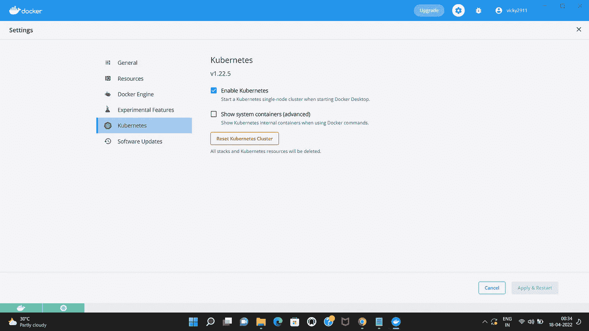
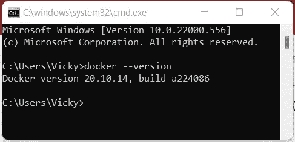
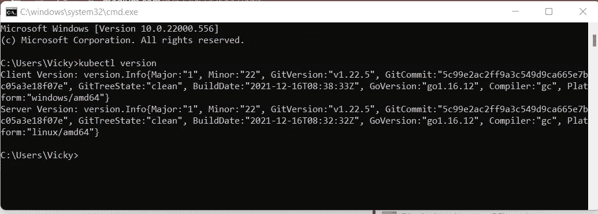
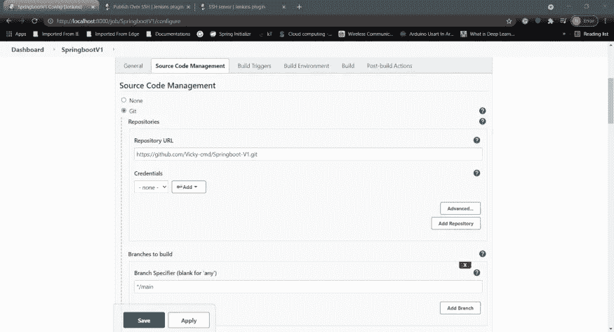
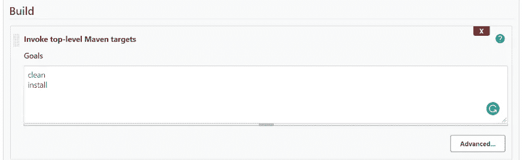
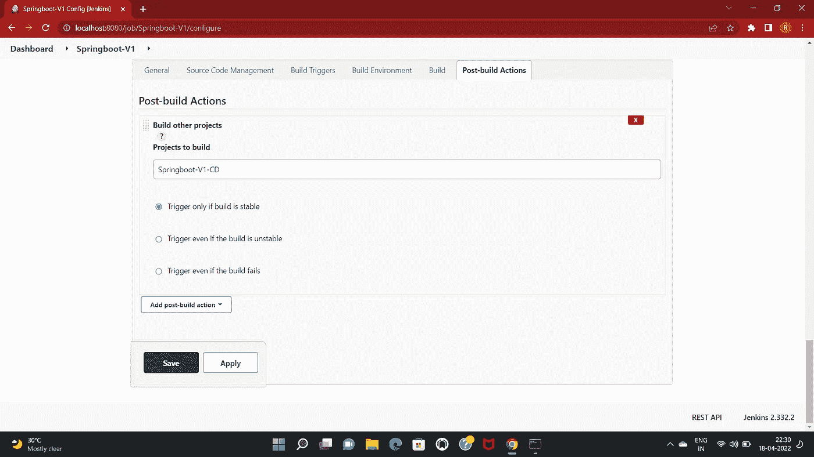

# 使用 Jenkins 在 Kubernetes 上部署 Spring Boot 应用程序

> 原文：<https://medium.com/javarevisited/deploying-a-spring-boot-application-on-kubernetes-using-jenkins-672961425a42?source=collection_archive---------0----------------------->

# 什么是 Kubernetes？

Kubernetes，俗称 **K8s** 是一个开源容器编排系统，由 Google 开发，用于软件应用程序的自动化部署、扩展和管理。它用于部署使用 [Docker](/javarevisited/5-best-docker-courses-for-java-and-spring-boot-developers-bbf01c5e6542) 、containerd 和 CRI-O 容器化工具创建的容器化映像。

[Kubernetes](/javarevisited/10-best-kubernetes-courses-for-developers-and-devops-engineers-94c35cd3a2fd) 帮助控制云应用/微服务的资源分配和流量。

## **特性**

*   **零停机时间的自动推出/回滚**:它可用于在零停机时间内部署对应用程序的更改。实例的健康状况被持续监控，以确保部署的所有实例不会同时被终止。因此，版本中的变化被连续地部署在实例上，以便一段时间后所有实例都是指定的版本。
*   **可扩展性**:支持使用 ReplicaSets 和 Horizontal Pod Autoscaler (hpa)基于 CPU 利用率扩展部署。
*   **活跃度和就绪度探测器**:支持使用活跃度和就绪度探测器进行容错，并在崩溃时自动重启。
*   [**负载均衡**](https://javarevisited.blogspot.com/2022/02/top-5-courses-to-learn-nginx-in-depth.html) **:** 它可以用于在使用服务的应用程序的多个实例之间实现负载均衡。

# 介绍

在本文中，我分享了我使用 [Jenkins](/javarevisited/7-best-courses-to-learn-jenkins-and-ci-cd-for-devops-engineers-and-software-developers-df2de8fe38f3) 在 Kubernetes 中部署 Spring Boot 应用程序的方法。这是通过使用两个不同的 Jenkins 项目实现的——一个用于创建映像，另一个用于部署映像的一个版本。目前，docker 守护进程运行在同一台机器上，可以使用相同的脚本进行部署。如果 docker 守护进程在远程机器上运行，那么可以使用 [Jenkins](/javarevisited/top-10-free-courses-to-learn-jenkins-docker-and-kubernetes-for-devops-in-2020-best-of-lot-62a0541ffeb3) 中的 SSH 插件在远程机器上运行脚本。

[](https://javarevisited.blogspot.com/2018/09/top-5-jenkins-courses-for-java-and-DevOps-Programmers.html#axzz7Byop1XFr)

# 设置所需的服务

## 库伯内特斯

在你的本地电脑上运行 Kubernetes 节点有很多不同的方法，比如使用 [**minikube**](https://minikube.sigs.k8s.io/docs/start/) ， [**Docker Desktop**](https://www.docker.com/products/docker-desktop/) 等等。这里，我已经使用 Docker Desktop 在我的本地系统中设置了一个节点。

Docker 桌面可以从这里安装到 windows:[https://docs.docker.com/desktop/windows/install/](https://docs.docker.com/desktop/windows/install/)。要运行 docker 桌面，还必须安装最新版本的 WSL 2。可以从微软的[官方网站](https://docs.microsoft.com/en-us/windows/wsl/install-manual#step-4---download-the-linux-kernel-update-package)安装。

一旦 Docker 桌面被设置并运行，它就可以用来运行 [Kubernetes](/javarevisited/7-free-online-courses-to-learn-kubernetes-in-2020-3b8a68ec7abc) 节点，也可以从设置中运行。

[](https://javarevisited.blogspot.com/2019/05/top-5-courses-to-learn-docker-and-kubernetes-for-devops.html)

一旦它们都设置好了，您应该能够在命令提示符下看到它们的版本。

[](https://www.java67.com/2021/04/top-5-courses-to-learn-docker-for-java.html)

检查 Docker 版本的命令

[](https://www.java67.com/2020/07/top-5-courses-to-learn-linux-in-depth.html)

检查 Kubernetes 版本的命令

## 詹金斯和吉特回购

要设置 Jenkins 和其他服务，可以参考我之前的文章 [**使用 Jenkins CICD**](/javarevisited/deploying-a-springboot-application-in-docker-using-jenkins-cicd-2489bfe752c3) 在 Docker 中部署 Springboot 应用程序。

# 詹金斯·CICD 工作

## 持续集成项目

1.  创建新的 Jenkins 自由式项目

**名称**:跳羚-V1

**项目类型**:自由式项目

在项目配置中，给出的 Git URL 以及身份验证，如果在源代码管理选项下的话。

[](https://javarevisited.blogspot.com/2018/02/top-5-spring-microservices-courses-with-spring-boot-and-spring-cloud.html)

现在，构建过程包括两个阶段。它们是:

1.首先，选择**调用顶级 Maven 目标**选项。将 ***清洗*** 和 ***安装*** 目标作为输入给出。

[](https://javarevisited.blogspot.com/2019/03/top-5-course-to-learn-apache-maven-for.html)

为构建设置 maven 生命周期

2.接下来，选择**执行窗口批处理命令**选项。这用于执行批处理文件，该文件将:

*   获取当前提交 id 并将其存储在 **version.txt** 中。
*   将构建(war)文件复制到一个公共文件夹中。
*   因为 docker 实例运行在同一台机器上，所以新版本的映像构建在同一个脚本中，并被推送到 docker registry。

使用的批处理脚本是:

现在，Post Script 动作用于触发 CD 构建，以便新实例可以部署在 [docker](/javarevisited/top-15-online-courses-to-learn-docker-kubernetes-and-aws-for-fullstack-developers-and-devops-d8cc4f16e773) 中。



为 CD 项目设置自动触发器

## 持续部署项目

1.  创建新的 Jenkins 自由式项目

**名字**:跳羚-V1-CD

**项目类型**:自由式项目

这是一个参数化的项目，接受版本作为输入。此版本用于确定要部署的 docker 映像的版本，默认情况下配置为“最新”。

它运行一个批处理脚本来部署具有指定映像版本的服务。

1.  首先，它检查“springboot-v1”是否已经部署在 Kubernetes 集群中。
2.  如果是，那么它更新部署的映像版本，或者如果部署了最新版本，则重新启动部署。由于 ***imagePullPolicy*** 在部署配置中一如既往地进行配置，因此这将自动从 docker 注册表中提取新的映像。
3.  否则，它使用存储的 [YAML 配置](https://javarevisited.blogspot.com/2021/11/top-5-courses-to-learn-yaml-in-2022.html)创建新的部署和服务，并基于输入参数更新镜像版本。

## 部署的 YAML 配置

## 使用的 Dockerfile 文件

```
FROM adoptopenjdk/openjdk11:jre-11.0.6_10-alpine    
EXPOSE 8080:8081 
RUN addgroup -S spring && adduser -S spring -G spring 
USER spring:spring  
COPY SpringbootV1-0.0.1-SNAPSHOT.war SpringbootV1-0.0.1-SNAPSHOT.war 
ENTRYPOINT ["java","-jar","/SpringbootV1-0.0.1-SNAPSHOT.war"]
```

# 检查服务的部署

*   **ku bectl get deployments-o wide**

显示在 Kubernetes 集群中创建的部署列表。

[](https://www.java67.com/2019/03/5-free-devops-courses-to-learn-jenkins.html)

kubectl get 部署的输出-o 范围

*   **kubectl 获取豆荚**

这将显示为给定服务运行的窗格列表。为该服务部署的每个 pod 都有一个唯一的名称，使用该名称可以对其进行识别。


kubectl get pods 的输出

*   **kubectl 获取 svc -o wide**

这将显示为部署创建的服务列表及其类型(负载平衡器、节点端口等)。


kubectl get svc -o wide 的输出

*   **kubectl 获取 hpa**

这将显示已配置的水平窗格自动缩放列表。这可用于根据收到的请求/CPU 利用率自动扩展单元。


通过传递选择器参数( *app=infotrends* )作为输入，可以进一步过滤所有命令，以获得属于特定应用程序的窗格(*ku bectl get pods—selector = app = info trends*)


kubectl get pods 的输出—选择器=app=infotrends

使用此服务，我们现在可以使用 8081 端口访问应用程序。该服务将在三个 pod 之间对请求进行负载平衡。

